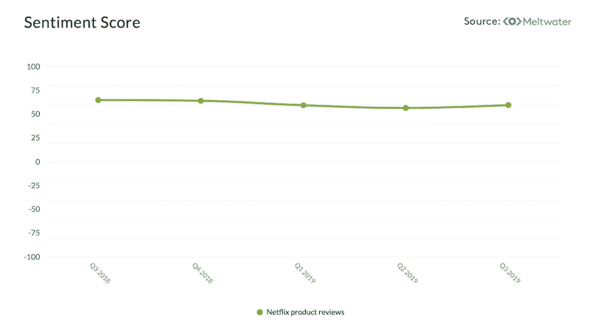
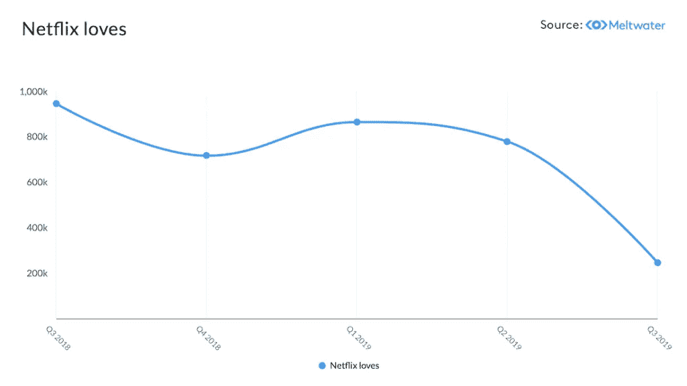
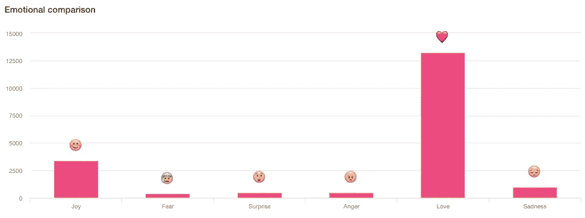
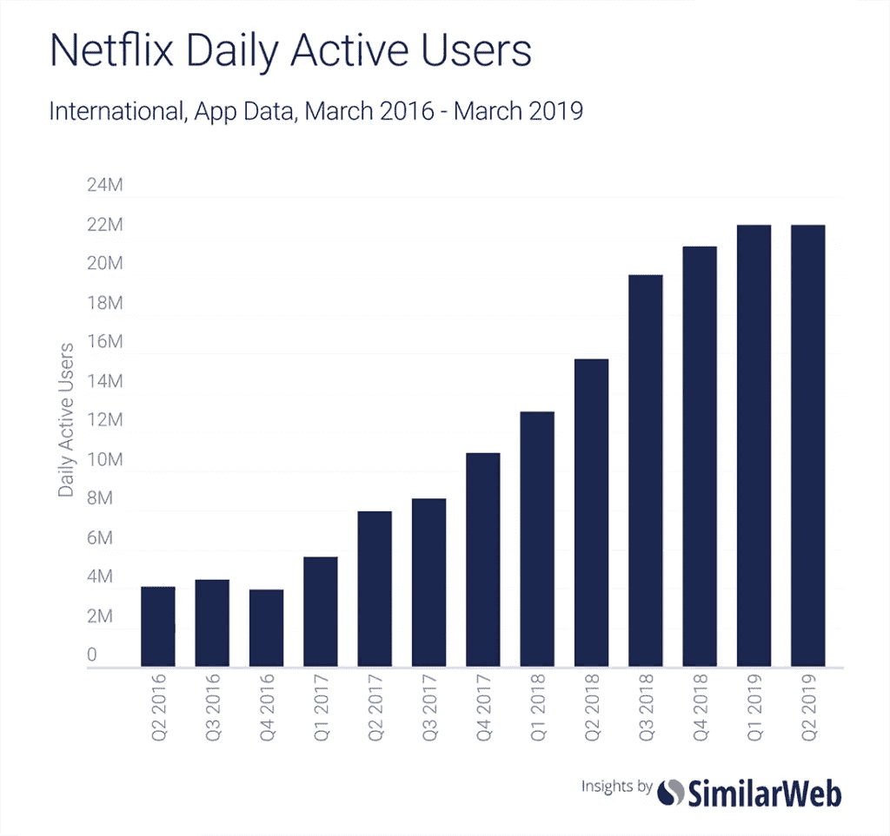

# 网飞深潜:投资者如何预测股价惊喜

> 原文：<https://medium.datadriveninvestor.com/netflix-deep-dive-how-investors-could-have-predicted-the-share-price-surprise-786390373760?source=collection_archive---------4----------------------->

对网飞来说，这是一个艰难的夏天。

上个月，这家流媒体巨头报告称，近十年来首次失去了美国用户，全球客户增长约为其预测的一半，这让其股东感到震惊。

接下来的一周，网飞的市值缩水了 240 亿美元。哎哟。

 [## 算法交易的机器学习|数据驱动的投资者

### 当你的一个朋友在脸书上传你的新海滩照，平台建议给你的脸加上标签，这是…

www.datadriveninvestor.com](https://www.datadriveninvestor.com/2019/01/30/machine-learning-for-stock-market-investing/) 

网飞有一个著名的守口如瓶的文化，不知何故，他们设法把坏消息藏到最后一刻。

但是有一小群人，主要聚集在纽约和伦敦，他们对用户的下降一点也不感到惊讶。我们这些处理[替代数据](https://outsideinsight.com/alternative-data/)的人——根据外部指标在公司变动发生之前预测它们的业务——看到了这一天的到来。

在网飞宣布之前的几个月，许多微妙的[信号](https://fairhair.ai/solutions/signals)已经开始出现在整个网络上。综合起来，他们描绘了一幅即将暴跌的股票图景。

这里有四种数据类型可以被投资者用作领先指标。

# 1.产品评论数据

首先，对网飞的产品评论逐渐变得越来越负面。

根据 Meltwater(支持 16 种语言)的情感分析，用户满意度呈下降趋势。例如，今年早些时候，网飞的负面评价比上一季度增加了 7.4%。

# 2.社交媒体情绪

如果你知道要寻找什么，社交媒体上的迹象也是不祥之兆。

去年，Meltwater 在全球范围内通过脸书、Twitter、Instagram、YouTube、评论网站、论坛和文章评论收集了大约 1 亿条提到网飞的社交帖子。但是真正有趣的帖子是在情感光谱的更强烈的一端。

对网飞(或下图中的“网飞之恋”)赞不绝口的人数在去年年底急剧下降，并在第四季度和今年年初继续停滞不前。

正如你将在下图中看到的(衡量过去几周对网飞的情绪反应)，人们仍然对该公司保持着压倒性的积极态度，但遗憾的是，对市场而言，这还不够。除非网飞能够找到一种方法来重振其用户群，否则该公司将很难继续发布其投资者已经习以为常的增长数据。

# 3.新闻媒体

在新闻媒体中也可以找到线索。

Meltwater 在去年发现了大约 300 万篇提到网飞的全球文章，从公共关系的角度来看，这似乎是一个健康的数字。然而，为了预测性地使用新闻数据，重要的是要看*新闻在说什么*以及*它是否重要*。

300 万篇文章是一个很大的数据量，这就是人工智能发挥作用的地方。使用其机器学习[信号](https://fairhair.ai/solutions/signals)工具，Meltwater 能够识别对网飞的用户数量实际上可能很重要的新闻故事。

以这个不幸的情况为例:

在网飞公司公布收益的一个月前，反堕胎人士决定推动“大规模逃离”网飞，因为他们不喜欢该公司表示将离开佐治亚州，以回应该州严厉的新堕胎禁令。

一群愤怒的反堕胎人士发誓要把网飞赶出这个行业，这在该公司已经处于敏感时期的情况下肯定于事无补。

这个新闻故事没有成为全球头条新闻(事实上，它在美国国家新闻中几乎没有被提及)，因此如果没有正确的技术将其标记为潜在问题，它很容易被忽略。

反堕胎组织 Live Action 发表了一份未经证实但有趣的声明[声称](https://www.churchmilitant.com/news/article/netflixs-abortion-hardline-coincides-with-companys-recent-wall-street-drops)抵制活动导致了 126，000 名美国用户流失，这使得 Neflix 的季度声明变成了一场灾难。不管这是不是真的，在早期阶段发现这种类型的运动既是网飞的公关陷阱，也是外部观察人士日益增长的趋势的可能指标。

# 4.应用下载

当然，融水并不是唯一看到网飞表现不佳的人。替代数据行业充斥着这个故事。

在网飞发布声明之前，SimilarWeb 写了一篇很棒的博客，指出使用该公司 Android 应用的人数几乎没有增长。

SimilarWeb 的投资者解决方案业务经理埃德·拉威利(Ed Lavery)解释道:“我们发现，网飞国际的订户数量与他们应用的日活跃用户数量之间存在很强的相关性。尽管网飞用户可能会使用电视来观看节目，但我们相信，许多用户会下载该应用程序，偶尔也会登录，这使得该数据更具预测性。”

因此，安卓应用用户持平的事实表明，网飞最重要的指标——新用户——也可能低于预期。

# 用数据支撑直觉

许多人发现网飞故事最令人惊讶的是，事实上有多少人对此感到惊讶！

SimilarWeb 在网飞投下重磅炸弹的前几天发布了它的担忧，任何使用融水平台进行监测的人都会看到网飞到处都有令人担忧的趋势。

然而，大多数投资者没有注意到警告信号。

数据经纪公司 Eagle Alpha 的数据采购与合作主管休·奥康纳(Hugh O'Connor)指出，“整个行业对替代数据的需求持续上升。Eagle Alpha 越来越多地接受全权基本面客户的请求，这些客户希望对小型集中型公司投资组合的关键股票驱动因素获得新的或差异化的见解。

非金融类:休现在开始看到投资者对这类数据感兴趣，过去他们在选择投资哪些公司时主要依赖“直觉”。

但显然这种分析要成为主流还有很长的路要走。

与此同时，那些接受数据驱动决策的人——或者至少那些花时间确保自己的直觉得到外部数据支持的人——比那些不接受数据驱动决策的人有明显的优势。

仔细想想，一点也不奇怪。