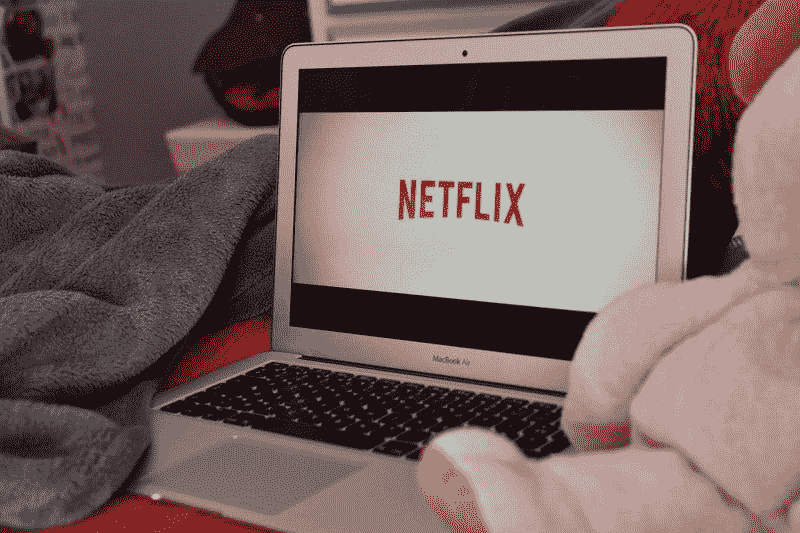
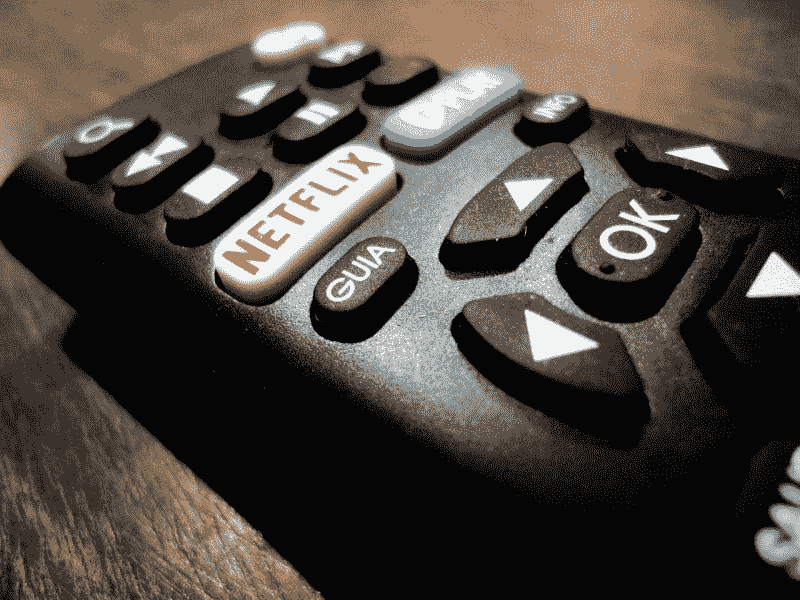

# 网飞失去用户是赔钱吗？—市场疯人院

> 原文：<https://medium.datadriveninvestor.com/netflix-lost-subscribers-is-it-losing-money-market-mad-house-421573cef142?source=collection_archive---------16----------------------->

网飞在 2019 年第二季度失去了用户，尽管其平台一直在扩张。事实上，网飞报道了其历史上第一次流媒体视频用户的流失。

具体来说，**网飞(纳斯达克股票代码:NFLX)** 在其平台全球增长 270 万用户的同时，在美国损失了 13 万用户， *TechCrunch* [估计](https://techcrunch.com/2019/07/17/netflix-reports-first-net-subscriber-loss-in-the-u-s-misses-global-subscriber-growth-predictions/)。网飞在美国的损失的罪魁祸首可能是 10.99 美元到 12.99 美元的订阅费用上涨。

 [## 苹果会成为新的网飞吗？数据驱动的投资者

### 有可能。然而，该公司肯定会与大公司竞争。许多人不得不看到这一天的到来…

www.datadriveninvestor.com](https://www.datadriveninvestor.com/2019/02/15/will-apple-be-the-new-netflix/) 

据 Statista [计算](https://www.statista.com/statistics/250934/quarterly-number-of-netflix-streaming-subscribers-worldwide/)，网飞的覆盖面仍然很大，其平台覆盖全球超过 1.51 亿人。此外，网飞在美国仍有 6010 万用户和 656 万免费试用用户。

# 网飞仍然是美国最大的电视网

因此，网飞仍然是美国最大的电视网络。相比之下，美国最受欢迎的广播电视网**哥伦比亚广播公司(NYSE: CBS)** 在 2019 年 7 月 18 日拥有 298 万观众，*截止日期* [估计](https://deadline.com/2019/05/tv-ratings-2018-2019-season-totals-viewers-demo-cbs-nbc-1202620062/)。

此外，CBS 整个 2018-2019 电视季的观众人数为 890 万。值得注意的是，我估计 2018-2019 年美国所有五个广播网络的观众总数为 2840 万。因此，网飞的 6010 万美国用户是所有广播电视网总和的两倍多。

具体来说，美国有五个广播电视网，福克斯、ABC、NBC、CBS 和 CW。尼尔森媒体研究公司估计，CBS 的观众人数为 890 万，Fox 的观众人数为 540 万，ABC 的观众人数为 560 万，NBC 的观众人数为 720 万，观看 CW 的人数为 130 万。

因此，流媒体视频已经取代广播电视成为美国最受欢迎的非互动娱乐形式。美国仍然是一个电视迷的国度，但是美国人更喜欢看流媒体节目。

# 竞争正在扼杀网飞吗？

可以预见的是，网飞正面临着大量的流动资金竞争。例如，迪士尼+将展示迪士尼即将推出的一系列电影，*数字趋势* [报道](https://www.digitaltrends.com/movies/disney-plus-streaming-service-news/)。

据推测，候选名单将包括历史上票房最高的电影《复仇者联盟 4：终局之战》。截至 2019 年 7 月 21 日，地球上最强大的英雄的最新冒险收入为 27.9 亿美元，*娱乐周刊* [计算](https://ew.com/movies/2019/07/22/james-cameron-avengers-endgame-avatar/)。

数字趋势声称，其他迪士尼+产品将包括 400 到 500 部电影和 7000 集电视节目。更重要的是，有大批狂热的迪斯尼、漫威和《星球大战》迷愿意为所有这些视频付费。

有趣的是，从传说中的迪斯尼拱顶；除了种族主义的*南方之歌*，将通过 Disney+获得，**华特·迪士尼公司(NYSE: DIS)** CEO Bob Iger 承诺。此外，所有 21 世纪的财产[迪士尼现在拥有](https://marketmadhouse.com/21st-century-fox-adds-value-to-disney/)，像*辛普森一家*和*吸血鬼猎人巴菲*可能会出现在迪士尼+。事实上，迪士尼推文 Disney+将提供《辛普森一家》的全部 30 季。

毫不奇怪，迪士尼为迪士尼+计划了几场星球大战和漫威秀。迪士尼+上也会有至少一部皮克斯系列和一些国家地理纪录片。

# 迪士尼+对网飞是个威胁吗？

迪士尼+的出现说明网飞太成功了。鲍勃·伊格尔害怕网飞，所以迪士尼正在开发自己的分销渠道，以阻止网飞建立流媒体视频垄断。

网飞应该担心迪士尼+,因为摩根士丹利分析师 Benjamin Swinburne 估计，到 2024 年，这项服务在全球可能会有超过 1.3 亿用户。相比之下，Swinburne 估计 Disney+到 2020 年底将只有 1300 万订户， *Variety* [报道](https://variety.com/2019/digital/news/disney-plus-subscriber-projections-2024-1203242072/)。然而，史文朋认为，到 2020 年底，迪士尼在 Hulu、Disney+和 ESPN Plus 上的用户总数可能达到 5000 万。

具体来说，市场现实主义者[估计](https://articles2.marketrealist.com/2019/06/hulus-subscriber-base-rises-to-28-million-how-netflix-compares/)Hulu 在 2019 年第一季度在美国拥有 2680 万付费用户和 2800 万美国订户。此外，Hulu 声称在 2019 年第一季度增加了 380 万美国用户。

# 迪士尼和 Hulu 如何威胁网飞

Hulu 押注于音频，与 Spotify(T2)、Spotify(纽约证券交易所代码:SPOT)和 Spotify(T5)联合订阅 9.99 美元，低于网飞。值得注意的是，Hulu 在 2 月份将其月订阅费降至每月 5.99 美元。

迪斯尼目前拥有 Hulu 大约 60%的股份，因为它收购了 Fox，美国电话电报公司决定出售这项服务的 9.5%，芝加哥论坛报 [报道](https://www.chicagotribune.com/business/ct-biz-hulu-comcast-disney-20190416-story.html)。此外，有人猜测康卡斯特将把 Hulu 40%的股份出售给迪士尼，让该公司成为流媒体之王。

迪士尼已经对网飞构成了巨大威胁，因为它能赚更多的钱。例如，迪士尼报告 2019 年 3 月 30 日的毛利为 65.46 亿美元，净收入为 54.52 亿美元。此外，迪士尼报告截至 2019 年 3 月 30 日的季度融资现金流为 131.07 亿美元，运营现金流为 38.8 亿美元，自由现金流为 26.85 亿美元。

# 网飞赚钱了吗？

网飞终于从它的平台上赚到了一些钱。具体而言，网飞报告称，截至 2019 年 3 月 31 日，季度毛利为 16.5 亿美元，收入为 45.21 亿美元。

此外，网飞当天的营业收入为 4.5908 亿美元，净收入为 3.4405 亿美元。有趣的是，在截至 3 月份的季度中，网飞的收入以 22.16%的速度增长。

然而，网飞仍在消耗大量现金。例如，2019 年 3 月 30 日，网飞报告的经营现金流为负-3.79 亿美元，自由现金流为负-4.4935 亿美元。因此，网飞需要花费大量的现金来赚取少量的美元。尽管网飞有 2297 万美元的融资现金流。

令人印象深刻的是，网飞在 2019 年 3 月 30 日积累了 33.49 亿美元的现金和等价物。因此，网飞保留了其平台的大量现金，但迪士尼也可以。

# 网飞仍然是一项糟糕的投资

有一点仍然很清楚，**网飞(纳斯达克代码:NFLX)** 仍然是一个糟糕的投资。2019 年 7 月 24 日，市场先生对该股的定价过高，不支付股息，为 317.94 美元。

与此同时，**华特·迪士尼公司(纽约证券交易所代码:DIS)** 在同一天的交易价格为每股 141.30 美元。此外，迪士尼当天提供的股息收益率为 1.25%，年化派息为 1.76 美元，派息率为 25.4%。

他们计划迪士尼在 2019 年 7 月 25 日支付 88₵股息。该股息由 4₵在 2019 年增长，于 2018 年 7 月 26 日从 84₵上升。目前，迪士尼每年支付两次股息，而不是每季度一次。Dividend.com 将两年的股息增长归功于迪士尼。

总之，我认为迪士尼是流媒体视频的合理投资，价格合理，有股息，迪士尼的流媒体视频资产增长可能快于网飞。

*原载于 2019 年 7 月 24 日*[*【https://marketmadhouse.com】*](https://marketmadhouse.com/netflix-lost-subscribers-is-it-losing-money/)*。*