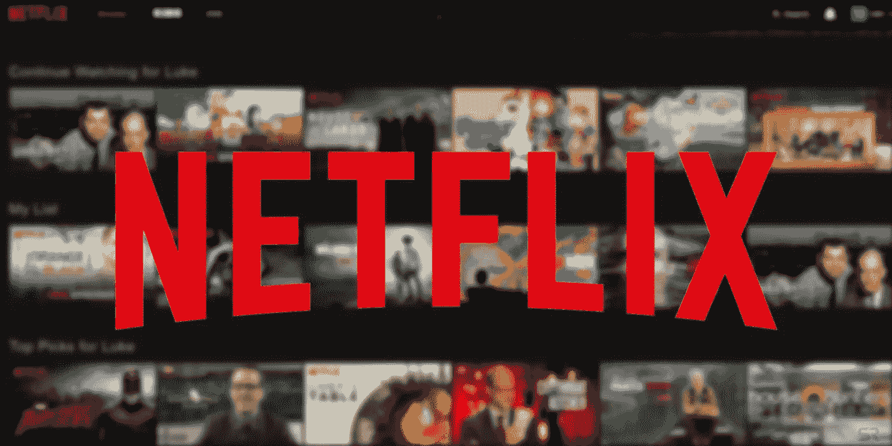

# 网飞绕过苹果税取消 iOS 订阅

> 原文：<https://medium.datadriveninvestor.com/netflix-pulls-subscriptions-from-ios-bypassing-apple-tax-5b253b8337f1?source=collection_archive---------14----------------------->

Image Credit: Knau

2018 年初，网飞取消了通过 Google Play 商店订阅他们服务的选项，以绕过谷歌从订阅中获得的份额。这个决定让许多人认为，同样的命运将等待他们的 iOS 应用程序，事实上，随着 2018 年的结束，通过苹果应用商店订阅网飞的选择也结束了。

> “我们不再支持 iTunes 作为新会员的支付方式，”网飞发言人告诉 VentureBeat。

此前，许多开发者对苹果和谷歌在应用内购买中所占的比例表示不满。两家公司过去都抽取 30%的份额，但最近几年这一比例降至 15%。尽管如此，开发商和这两家科技巨头之间的关系仍然非常紧张。

网飞不是第一家这样做的公司，它只是众多公司之一。Spotify 取消了在 iOS 上应用内订阅的选项。亚马逊通过其网站的 Prime Video 限制电影和电视节目的租赁；通过他们的 Kindle 应用程序也无法购买 Kindle 图书。Epic Games 特意选择在 Android 上发布《堡垒之夜》,而不是在 Google Play 商店发布，以避免谷歌削减游戏内购买。

那么像苹果和谷歌这样的公司从这些订阅中获利多少呢？2018 年，iOS 上的网飞每天的总收入约为 240 万美元，苹果的分成约为该数字的 70 万美元。

根据 Sensor Tower 的数据，迄今为止，网飞已经产生了 15 亿美元的应用内订阅，这意味着苹果轻松获得了 4.5 亿美元以上的收入。这些公司选择不那么用户友好的选项并不完全令人惊讶，这也让你想知道票房排行榜上的其他应用程序是否会考虑跃升。

**演职员表:** [TechCrunch](https://techcrunch.com/2018/12/31/netflix-stops-paying-the-apple-tax-on-its-853m-in-annual-ios-revenue/) ， [VentureBeat](https://venturebeat.com/2018/12/28/netflix-permanently-pulls-itunes-billing-for-new-users/)