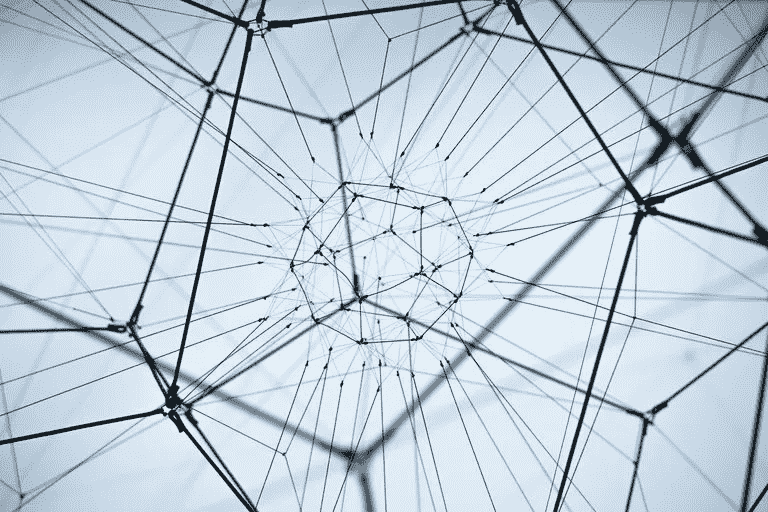

# 社交网络已经死亡——社交资本才是你应该做的

> 原文：<https://medium.datadriveninvestor.com/networking-is-dead-and-social-capital-is-what-you-should-do-b83e9c5465fa?source=collection_archive---------16----------------------->

Photo by William Bout on Unsplash (as cited on Lifewire)

引用莱恩关于媒介的文章(题为'[如何消化超出你“水平”的书籍并增加你的智力](https://medium.com/@RyanHoliday/how-to-digest-books-above-your-level-and-increase-your-intelligence-a11bd134da13))，**“要做伟大的事情，你必须*阅读来领导。”***

> 阅读引领意味着促使自己阅读“高于”自己水平的书籍。你知道那些需要你停下来思考的书，那些用不常用的词迫使你在谷歌上找到它的书，那些模糊不清的书。是的。那些书会迫使你进步。

我会用这个前提来指出为什么网络已死。

# 网络的固有问题…

社交者——从事社交活动的人——通常是那些尽可能多地与人建立联系的人，唯一的目的是……是的，如果不是的话，还有什么:利润。

> *Scott Gerber (* [*引自美国消费者新闻与商业频道，2018*](https://www.cnbc.com/2018/03/28/why-networking-is-dead-and-what-you-should-do-to-boost-your-career.html) *)认为，“网络人是非常短视的思考者，非常以交易为导向。他们利用关系来谋取私利或个人策略。”*

从定义上来说，社交者是指那些只在对自己有利的情况下才进行社交的人。因此，这并不符合“给对方带来更多价值”的理念很明显，这确实会产生一种“渴望得到某样东西”的想法，而这种想法通常会被人们拒绝。

“目光短浅，非常注重交易”和不真实同样重要。社交者接近你的原因是他们认为你对他们有价值。尽可能地，这是为了他们的收益，他们的利益。

还记得基本前提吗？读书就是领导——读超出你水平的书。因此，与他人建立关系意味着与他们建立联系——这迫使你以自己的方式真诚地去更好地理解他们。

# 真诚

建立重要的商业关系需要一个基本要素:信任。你为什么把钱存在银行里？你为什么投资某家公司或某个资产类别？为什么把一些工作给一些人，为什么给他们？简单。你有你的信任——信任是一个人必须证明自己可以赢得的东西——它不是一个社交者可以赢得的东西。

> Gerber 写道，“我不知道有谁喜欢和网络联系。你会立刻觉得自己需要洗个澡，因为有人试图告诉你他们试图向你推销的东西，递给你一张名片，并越过你的肩膀看着他们应该见的下一个人。”

Gerber 认为，在现状下，一个人应该努力成为超级连接器——从根本上认识到社会资本是必不可少的，它是一种人们真正需要的货币。超级连接器是那些考虑长远并努力与他人建立持久价值的人。因此，他们好奇，有同理心，对人有一个普遍的爱的概念。

成为一个超级连接器也意味着对自己能做和不能做的事情有自知之明，并表达出来。

# 那么，什么是社会资本呢？

福山(Kasali，2015 年引用)将社会资本定义为“一个基于参与、信任、接受、宽容和积极价值观的有效运作的社会群体，它导致每个成员和群体本身的逐步改善。”

好吧，让我们简单点。

> *你还记得你在 Instagram Story 上问一些问题，然后你的粉丝给你答案的时候吗？*
> 
> *你还记得那次你试图在 LinkedIn 上找工作，有人给你介绍了一些猎头吗？*
> 
> 你还记得当你谈论你的想法时，突然你的朋友说，“嘿，我认识一个可以帮助你的人！”
> 
> *或者，你认识那个只知道每个问题的“那个家伙”吗？*

如果你的答案是“是”，那么瞧！你有社会资本！如果不是，那么你应该重新评估你的朋友。(我是认真的！！)

现在，让我们揭穿社会资本的要素。

1.  社会参与——团队中的每一个人都必须积极地说出他们的想法、观点和一切可以改善整个团队的事情。
2.  信任——每个人都应该值得信任。因此，需要不断对成员进行重新评估。它确保每个人都有责任心并不断进步。
3.  互惠——自我利益和集体利益的平衡。请记住，**社会资本是基于长期价值创造的，因此需要自我&集体利益的平衡**。
4.  接受和多样性——所有成员都应该能够容忍团队内部的差异。事实上，与众不同意味着每个人都应该能够利用他们的差异。
5.  效能感和合作感——每个成员都应该更加欣赏彼此。

# 简化了的

1.  网络已死。这是一种从他人身上榨取价值的行为，一种非常具有交易性的交易，具有短期利益。仅此而已。这就是为什么它不会工作。每个人都应该努力成为一个连接者——理解社会资本的人是必要的。
2.  接近某人，为了连接器，与 networker 截然相反。连接器是相信长期价值创造的人，因此他们建立的每一个连接都是真实可信的——这是一种提供“价值创造”的行为，可以转化为各方的双赢。
3.  通过真诚和符合长期价值创造，连接者能够建立一个社会资本——一个有效运作的群体，其中每个人的利益都基于改善。因此，每个成员都值得信任并积极参与是很自然的。

参考

1.  [https://www . CNBC . com/2018/03/28/why-networking-is-dead-and-what-you-should-do-boost-your-career . html](https://www.cnbc.com/2018/03/28/why-networking-is-dead-and-what-you-should-do-to-boost-your-career.html)
2.  [https://medium . com/@ RyanHoliday/how-to-digest-above-the-level-and-increase-your-intelligence-a11bd 134 da 13](https://medium.com/@RyanHoliday/how-to-digest-books-above-your-level-and-increase-your-intelligence-a11bd134da13)
3.  哈萨利河(2015 年)。*更换领导非 finito* 。雅加达:米赞。