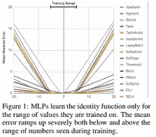
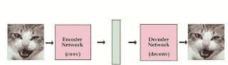
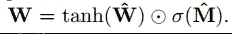
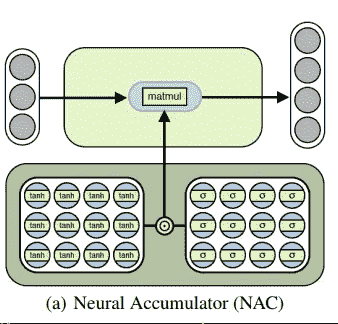
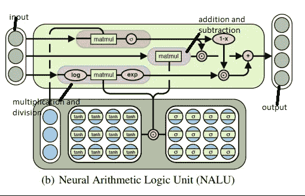
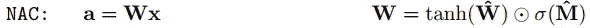
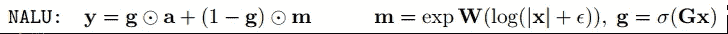
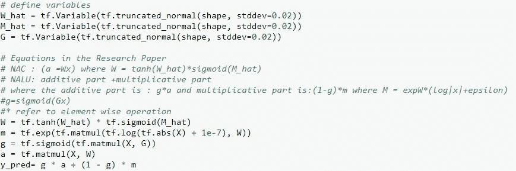
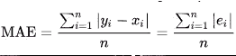
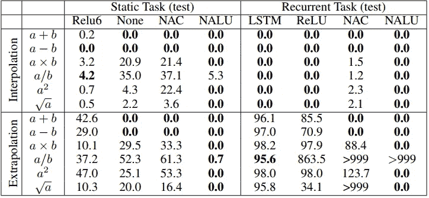

# 神经算术和逻辑单元

> 原文：<https://medium.datadriveninvestor.com/neural-arithematic-and-logical-unit-303367281c5d?source=collection_archive---------0----------------------->

近年来，基于神经网络的学习系统受到了广泛关注。这种关注的原因是，这些系统越来越擅长许多任务，在某些方面甚至比人类更好。系统学习事物的这种能力是由于学习从输入到输出的映射的能力。这些专家系统不需要用显式关系硬编码。然而，他们学到了在各种各样的用例中有用的一般属性和特性。然而，可以看出，一旦神经网络遇到超出其训练范围的“数值”,它们的表现就不那么好了。数字数据的范围指的是训练网络的数据点的范围(所有数据图像、声音、表格或语言都是计算机的数字数据)。用简单的语言来说，一个被训练来区分猫和狗的神经网络不会擅长区分一头牛。原因是电视网从未见过奶牛的形象。
这是神经网络的一个缺点，它们无法对遇到的数值数据的训练范围之外的数据进行泛化。换句话说，神经网络不能外推。
这种推断的失败表明，网络的习得行为是一种记忆工作，而不是一般的抽象。作者 Andrew Trask 和其他人在他们的论文《神经算术逻辑单元》中提出了一种鼓励系统数值外推的新架构。在这种架构中，作者提出使用简单的算术运算符，如由学习门控制的“加法”或“乘法”等，添加线性激活。在他们的实验中，作者发现网络在训练网络的数值范围内(内插)和外(外插)的泛化能力都大大提高了。

从左图中可以明显看出，大多数非线性函数学习它们被训练的值。当我们超出训练范围时，由均方误差(MSE)测量的误差上升。

在他们的训练设置中，作者使用自动编码器将标量值作为输入，例如数字 3，在其隐藏层内对值进行编码，然后将输入值重构为最后一个隐藏层的线性组合，以得到数字 3。

An Autoencoder

**"Autoencoder** 是一种人工神经网络，用于以无人监管的方式学习高效的数据编码。**自动编码器**的目的是学习一组数据的表示(编码)，通常是为了降维”。维基百科。

在他们的实验中，论文的作者在-5 到+5 的数字范围内训练了一个自动编码器，然后试图重建-20 到+20 的数字，这些数字超出了训练数据的范围。大多数非线性函数无法表示超出其训练范围的数字*。“故障的严重程度与激活函数的非线性程度成正比。”*

**神经累加器和神经算术逻辑单元。**

神经累加器是线性层的特例，其变换矩阵为 W ={-1，0，1}，这意味着输出只是输入向量的加法或减法，而不是非线性变换。这使得输出成为输入行的加法和减法，而不是非线性函数中的任意缩放。但是我们知道，反向传播算法只能在连续值而不是离散值的情况下工作。所以我们需要修正 W = {-1，0，1}的值，使其变得连续可微。

Here W and M are the weight matrices with kaiming normalization with stable values at {-1,0,1}

神经累加器(NAC)对输入向量进行线性变换，如下图所示:

There is no bais term or non-linearity applied to the output gate.

NAC 是其输入的线性变换。该变换是其 tanh(W)和 sigmoid(M)的元素式乘积。输出是输入的线性组合。NAC 擅长简单的算术运算，如加法和减法。然而，如果我们想实现更复杂的运算，如幂或指数运算，则需要相应地改变架构，以获得神经算术逻辑单元。

> **数学上的线性组合**是指将每一项乘以一个常数(标量)，然后将结果相加，由一组项构成的表达式。任何形式为 C =aX+bY 的表达式都是线性组合表达式，其中 a 和 b 是称为线性权重的标量常数。

神经算术逻辑单元(NALU)能够学习复杂的数学函数，如乘法和幂。NALU 是对 NAC 的扩展，有助于端到端的学习。NALU 架构如下所示:

NALU 有两个单元 NAC 单元，它们与用于加法或减法(较小的紫色方框)以及乘法和除法(较大的紫色方框)的权重捆绑在一起。)由一个门控制着这个橙色的盒子。

较小的单元根据以下公式计算累积向量:NAC

较大的单元在对数空间内计算乘法和除法，公式如下:

where the epsilon prevents a log 0 case.

这两个单元模块和门一起允许它计算加、乘、减、除和幂运算，这些运算可以外推网络在训练期间看到的数字。

我们可以在 tensorflow 中实现相同的功能，如下所示:

该论文使用由以下公式给出的平均绝对误差来计算误差:

Mean Absolute Error

**平均绝对误差(MAE)** 是两个连续变量之间差异的度量。

论文给出的实验结果如下:

最后，该论文提出了深度神经网络中线性激活的新背景。这种连接将提高性能，减少爆炸和消失梯度，并促进更好的学习偏差。