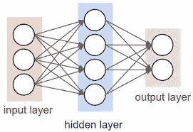
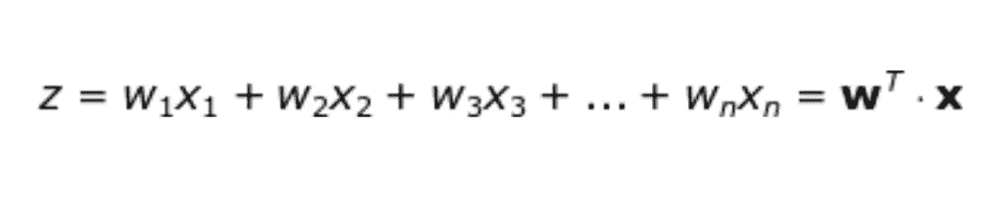
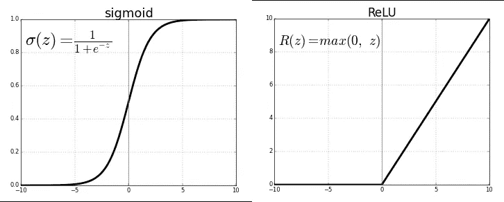
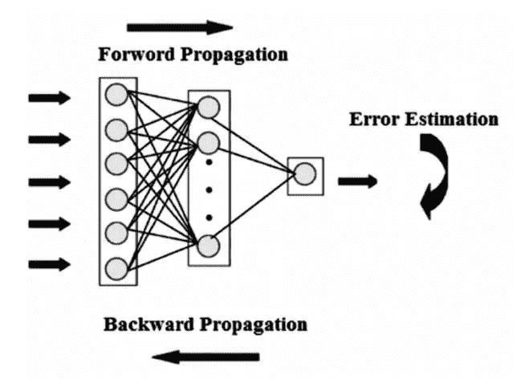

# 神经网络:需要知道

> 原文：<https://medium.datadriveninvestor.com/neural-network-488b1df4b812?source=collection_archive---------24----------------------->

*   神经网络提供了一个'好'

    参数化的非线性函数类来学习

    非线性分类器。
*   非线性函数是通过求和与 sigmoids 的组合
    T5 构建的。
*   对分类和回归都有用。
*   每个神经元都通过连接链与其他神经元相连。每个连接链路与一个权重相关联，该权重具有关于输入信号的信息。
*   这是神经元解决特定问题最有用的信息，因为权重通常会激发或抑制正在传递的信号。

## 神经网络形成的步骤:

1.挑选网络架构(用随机权重初始化)
2。做一个正向传递(Forward propagation)
3。计算总误差(我们需要最小化这个误差)
4。反向传播误差并更新权重(反向传播)5。重复过程(2-4 ),直到误差最小。

## 神经网络背后的数学:

## 使用不同的激活功能:

> 激活函数是神经网络的关键元素之一。如果没有它们，我们的神经网络将变成线性函数的组合，因此它本身将只是一个线性函数。
> 
> 以下是神经网络中使用的主要激活函数:

1.  Sigmoid 成本函数:主要用于输出层。
2.  直线单位函数:主要用于隐藏层和输入层。

## 使用的不同技术:

*   反向传播
*   正向传播
*   梯度下降
*   权重的调整