# 神经网络:跑前检查

> 原文：<https://medium.datadriveninvestor.com/neural-network-check-before-you-run-25443f700abb?source=collection_archive---------12----------------------->

你的神经网络没有给你预期的精度和性能？由于许多神经网络是隐藏在大量数学背后的黑箱，调试神经网络并不简单。在本文中，我将向您提供几项检查，您可以运行这些检查来查看如果您在真实世界的数据上对其进行训练，您的网络是否运行良好。

我正在重用我在之前的一篇文章中提出的代码。虽然这篇文章并不完全是续篇，但是您可能希望查看上一篇文章，以便更好地理解为什么我以某种方式对网络的某些部分进行编码。我首先为 MNIST 数据集建立了一个良好的网络，然后我故意犯错误来比较和展示我建议你在自己的网络中检查的几点。

 [## 人工智能预测能力的神话|数据驱动的投资者

### AI(人工智能)最有前途的优势之一似乎是它预测未来的能力…

www.datadriveninvestor.com](https://www.datadriveninvestor.com/2019/03/01/the-myth-of-ais-predictive-power/) 

我们笔记本的前五个单元初始化一些变量并获取数据。我将变量ε初始化为一个很小的数。这个变量的灵感来自于浏览 TensorFlow Keras 的源代码进行渐变裁剪。

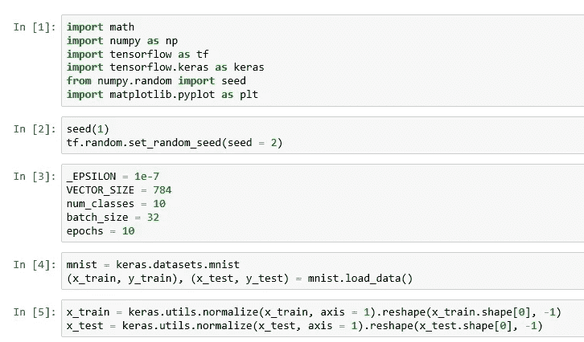

Initialize and fetch data

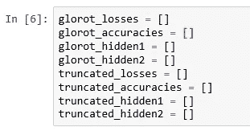

Variables for results

这里我们将试图找出网络的隐藏节点在激活函数被应用后输出的值。我们正在创建一组变量来保存隐藏节点的输出、准确性和网络从一个时期到另一个时期的损耗值。

我们将使用 Glorot 初始化器来初始化我们的网络权重。接下来我运行一个单元来表明，如果你使用特定的公式来计算上限和下限，TensorFlow Glorot 一致初始值与随机一致初始值是相同的。由于这只是一个演示，我们将创建一个 3 x 3 形状的小矩阵，您可以将它想象为神经网络的一个虚拟层的权重。

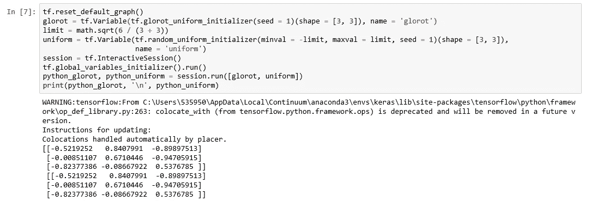

Glorot uniform initializer

然后我们为 MNIST 建立一个有两个隐藏层的网络。权重使用与 Glorot 公式相同的随机统一初始化器进行初始化，因此我们可以认为这与 Glorot 初始化相同。这是我的一个“好”网络的例子。

Network with Glorot initialization

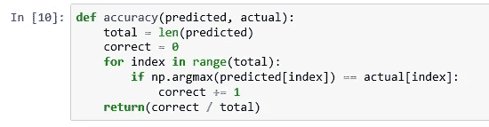

Accuracy

接下来，编写代码来计算网络的精度。

然后我们训练网络。请注意，在运行 TensorFlow 会话时，除了损失值和预测值之外，我们还记录了隐藏层的值。

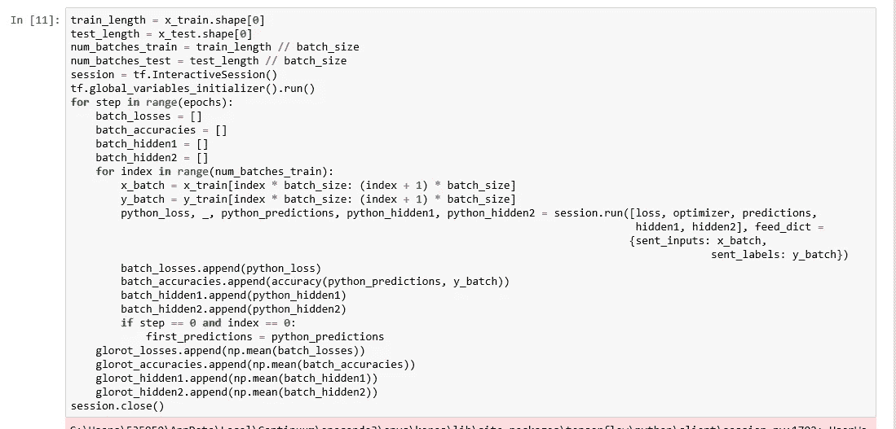

Train the network

教科书上说预测值不应太小或太大，而且由于我们在输出图层中使用 softmax 进行预测，预测值不应接近零或一。请注意，在前面的屏幕截图中，对于第一个时期和第一批，我们已经保存了预测值。如果初始化正确，矩阵乘法和激活函数的结果不会给出很高或很低的值。对于随后的批次和时期，权重和偏差将由于训练而被修改。因此，当我们检查第一个时期的第一批预测值时，实质上我们是在检查正确的初始化。在 softmax 中，当输出接近 0 或 1 时，梯度变得非常低/高，因此训练变得不可靠。这里我们把接近 0 定义为小于 _ε，接近 1 定义为大于 1 减 _ε。

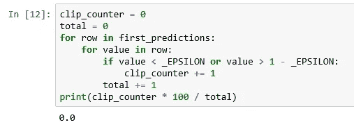

Checking for small and large values

现在，我们将对一个“坏”网络重复该实验，在该实验中，我们故意将权重初始化为一个高值，这是一个标准偏差为 0.5 的截断正态初始化，对于 784 或 128 这样大小的权重来说，这是相当高的。

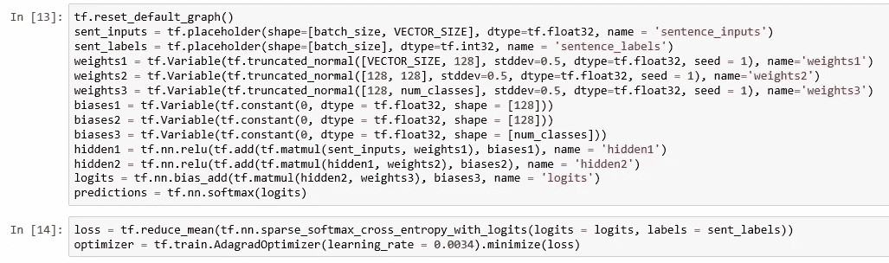

The next network

跑这个网络和之前的网络差不多。

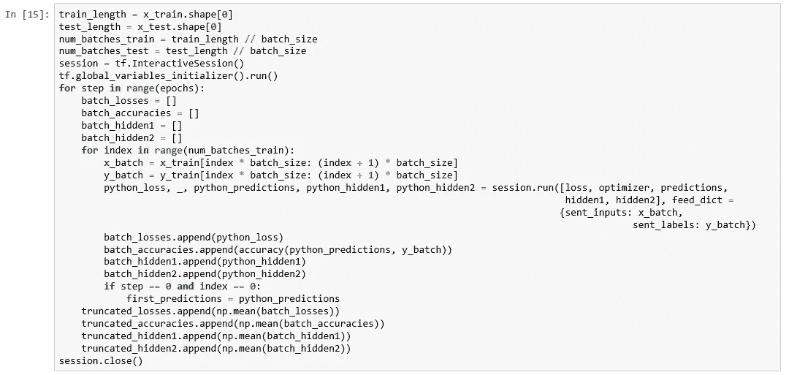

Running the network

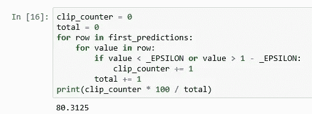

Checking for very small and very large values

请注意，该网络在第一次预测中有 80%的值非常小或非常大，而之前的网络为 0%。这不是一个好兆头。

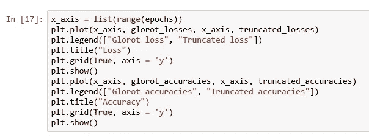

Plot loss and accuracy

现在编写代码来绘制损失和准确性。

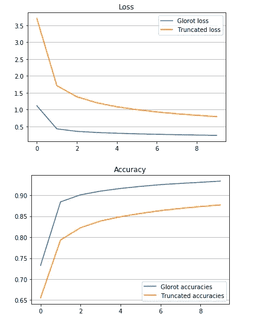

Loss and accuracy plot

请注意，Glorot 初始化——“好”网络的损耗较低，标准偏差为 0.5 的截断正态初始化——“坏”网络的损耗较高。同样，与“坏”网络相比，“好”网络的准确性看起来更好。

我们现在将绘制我们收集的隐藏节点的值。请注意，对于“良好”网络，隐藏节点输出轻松地低于 1(且高于 0)。对于“坏”网络，第一隐藏节点小于 1，而第二隐藏节点大于 1。这是不可取的，因为你可以看到培训试图降低这些价值。相比之下，训练是试图增加“好”网络中隐藏节点的值。你需要小心隐藏层的 relu 激活功能。虽然我们现在使用 relu 是有原因的，但与 softmax 不同，它不会将隐藏节点的输出带回 0 到 1 的范围。

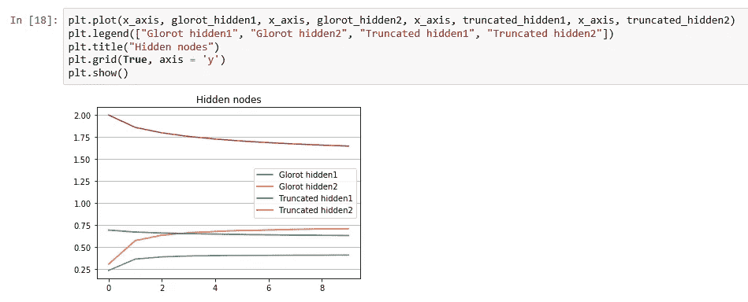

Hidden nodes

当你有更多的隐藏层时，这种效果会更加突出。我们现在将在三个隐藏层上重复这些实验。你将需要更多的变量，因为你将有更多的隐藏层。

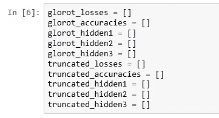

Initialize variables

接下来，我们将构建“好”网络。

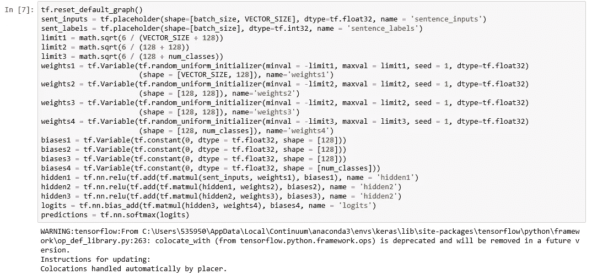

Build the network

然后，我们添加了损耗、优化和精度计算

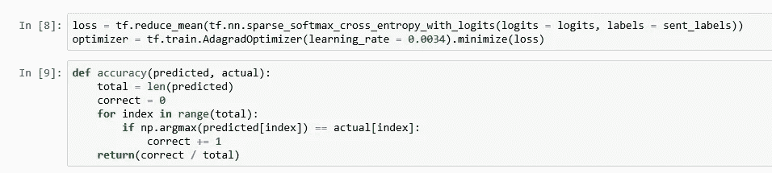

Complete the network

让我们现在运行这个网络。

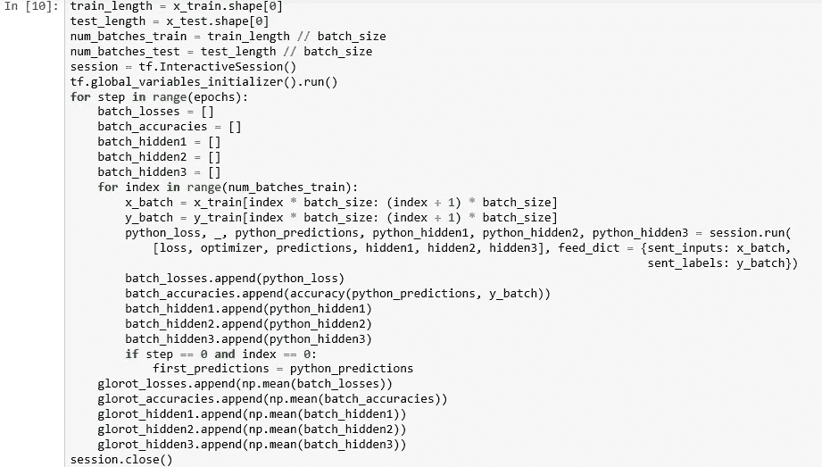

Run the network

检查极值并构建下一个网络。

Next network

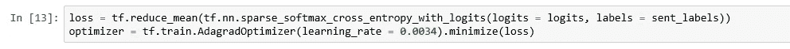

Loss and optimizer

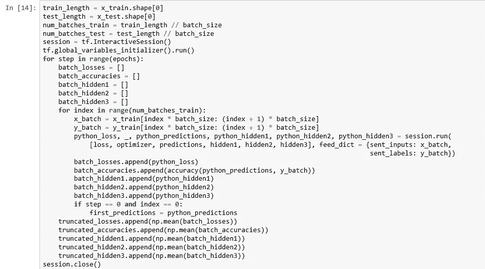

Run the network

请注意，99%的预测值现在非常小或很大，这又不是一个好兆头。

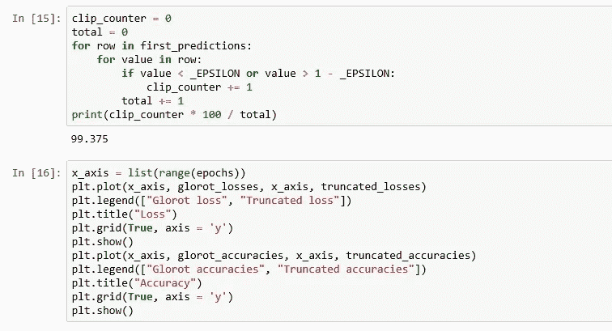

Plot loss and accuracy

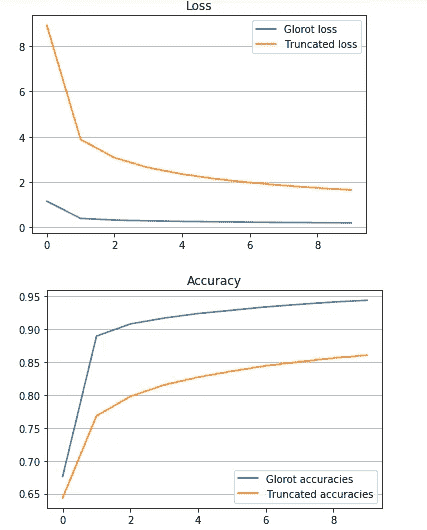

Loss and Accuracy

对于“好的”网络，所有三个隐藏节点都以小的值开始，并且随着时期增加，但是保持在 1 以下。“坏”网络的所有隐藏节点从较高的值开始，并随着训练而减少。第一个隐藏节点低于 1，但后续的节点越来越高。

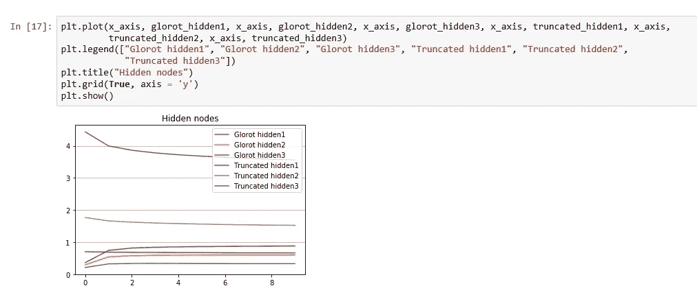

Hidden nodes

当隐藏层越多时，这种效果就越明显。现在让我们看看当我们有四个隐藏层时会发生什么。

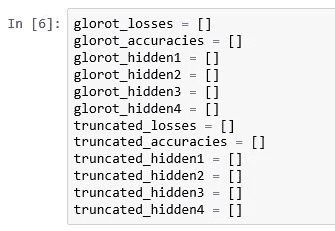

Initialize variables

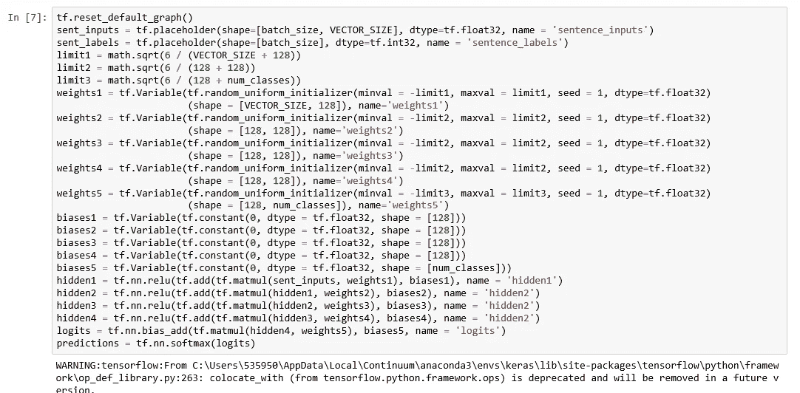

Build the network

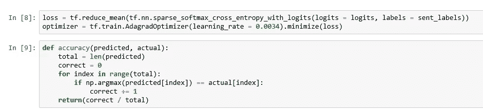

Loss, optimizer and accuracy

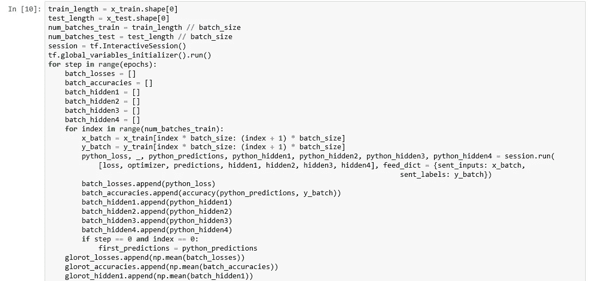

Run the network

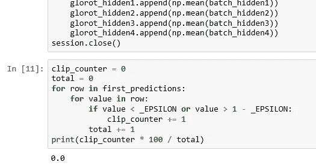

High and low values

让我们现在建立“坏”网络。

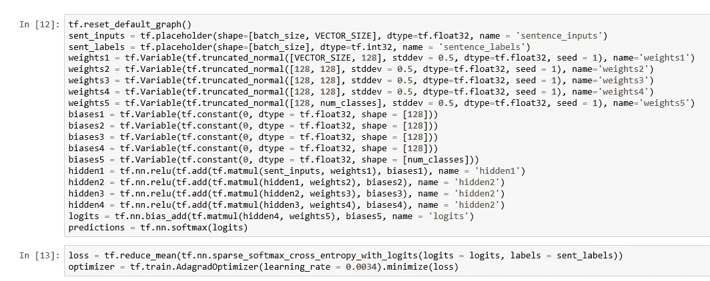

Build the network

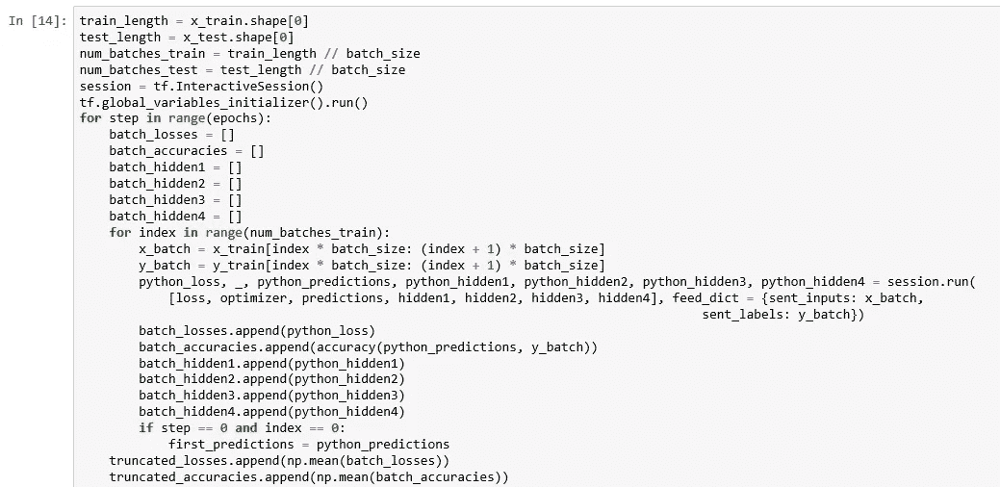

Run the network

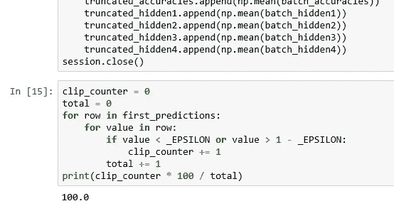

Large and small values

请注意，现在第一次预测中 100%的值都太大或太小。

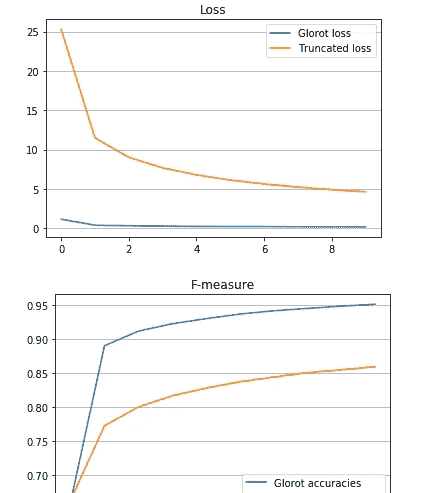

Loss and accuracy

请注意,“好”网络的四个隐藏节点保持在舒适的低值，但是“坏”网络的隐藏节点看起来正在“逃跑”,最后的隐藏节点达到非常高的值。这是不可取的。

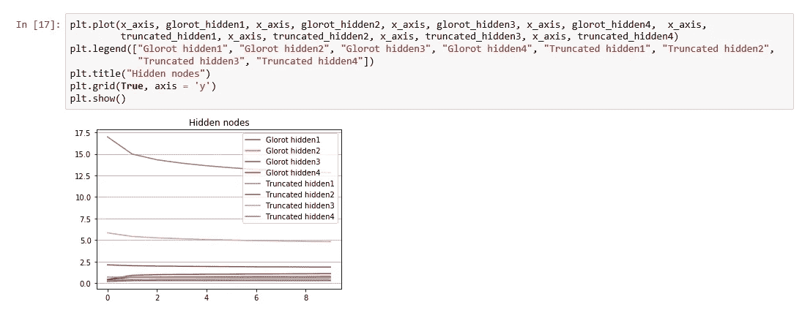

Hidden nodes

总而言之，在生产中训练神经网络之前，请检查以下几件事情:

1.  检查第一个历元的第一批中的输出值(预测)。应该有几个高/低值。
2.  检查隐藏节点的输出值。他们应该尽可能保持在 1 以下。后面的层“逃离”到非常高的值是有麻烦的迹象。

请注意，这些检查是必要的，但可能还不够。我见过一些网络通过了上述两项检查，但在训练指标上仍然表现不佳。您可能需要更深入地挖掘，找出可能的问题。