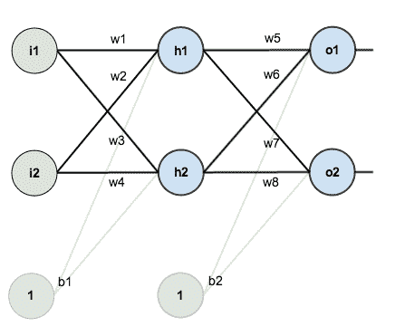

# 神经网络从无到有。

> 原文：<https://medium.datadriveninvestor.com/neural-network-from-scratch-9a6c49fdd357?source=collection_archive---------6----------------------->

这时候你应该听说过机器学习，这是硅谷最热门的趋势之一。机器学习是通过使用数据和算法使机器学习的过程。

***简介:***
深度学习是 ML 的一个类别，如果我们有海量的数据和高处理系统，它会表现得很好。DL 是借助神经网络实现的。神经网络的灵感来自我们大脑中的神经元，其核心功能类似于神经元。它获取输入，进行一些计算，然后转发输出。

***感知器:***
在基层，一个网络有一个感知器。
感知器是一个神经元的数学模型，它对给定数据进行一定权重的数学运算，产生结果。结果被提供给激活函数，该函数将输出归一化到实际输出值所在的特定范围。

***感知器工作示例:*** 跟我想一想，如果有一个(x，y)坐标形式的输入。让我们保持这个坐标的类标签为+1 如果 x > y 和-1 如果 x < y。

超级电容如何找到这个坐标的标签？
首先，输入是 x & y，输出是符号+或-。权重被随机分配给每个输入 x & y，然后权重乘以其各自的输入并相加。这个和被提供给找到这个结果的符号的激活函数。如果感知器找到正确的符号，那么就不会改变权重，或者对权重进行一些调整，以使其找到正确的输出。

调整的部分真的很酷。这是通过梯度下降算法完成的，该算法优化权重以预测正确的输出。
该算法的工作细节将在本文稍后解释，对于我们的示例，我们通过以下方式改变权重-
首先，我们找到误差，即目标结果和预测结果之间的差值。然后将该误差值加到权重上以获得新的权重。这个过程重复进行，直到正确的重量可以找到实际输出。

上面是一个单一感知器的例子，当这个单一感知器连接到其他感知器以形成一个层，当感知器的层彼此连接时，它形成一个神经网络。

*关于神经网络，有两件重要的事情你应该知道:*
**偏差值:**
偏差值只是一个随机数，它被加到相乘后的输入和权重的总和上。您可以将 bias 视为一个阈值，通过它可以激活相乘的和。此外，当所有输入都为零时，相乘后的和将得出为零的结果，因此会添加一个偏差值。

**激活函数:**
该函数的主要作用是对加权和进行归一化处理。在上面的例子中，它将加权和结果归一化为+或-，这是期望的结果。sigmoid 函数通常在开始时用作激活函数，它将结果归一化到 0 和 1 之间。简单来说，激活函数把结果的格式变成输出的格式。

*一个神经网络主要的两个功能是:* **前馈:**
这是比较容易的部分，给层间的每一个连接分配随机的权重和偏置。但是我们可以对此进行更深入的研究，输入层中感知机的数量是基于输入的维数而形成的。输出层也是如此，输出的维数等于输出层中感知器的数目。输入和输出之间可以有任意数量的隐藏层。每层中的每个感知器都与下一层中的所有感知器相连，并具有与之相关联的随机权重。此外，偏差被添加到每个感知器。

*计算:*
每个感知器执行以下操作:
将前一层的输入计算为输入和权重的加权和，然后使用 sigmoid 函数对其进行归一化，并将其传输到下一层。

**反向传播:**
这是最难的部分，如果你能掌握它，那么你就能在深度学习中掌握任何东西。这里的工作是使成本最小，这是预测的输出和正确的输出之间的差异。成本函数(即误差平方和)用于计算成本，我们可以通过对其进行偏导数来最小化成本。

怎么了？

这其中的训练部分基本上是找到可以最小化成本的优化权重和偏差。为了找到优化的权重和偏差，我们必须找到成本函数相对于权重和偏差的偏导数。这本质上是函数的梯度，如果我们用权重和偏差减去这个值，我们可以找到优化的权重。

我只是大致解释了它的工作原理。

这不是什么复杂的解释。如果您将我们的成本函数映射为图形，优化的权重将位于其局部最小值，为了找到该局部最小值，我们必须沿着斜率递减的一侧行进。偏导数给出了梯度，也就是图形的斜率。然后，如果我们在斜坡的相反一侧(即负梯度)移动，我们可以达到最小值。所以我们把负梯度加到权重和偏差上。这是通过学习率值逐步完成的。学习率决定了我们在斜坡的另一边要走多少步。它乘以偏导数。
重复上述过程，直到重量和偏差可以优化到最大值。

我知道这对你来说很难理解，所以我把我用来学习它的所有资源都包括进来了。有兴趣的话，按顺序看。建议观众了解一些线性代数和微积分的基础知识。

**对于线性代数与微积分:**[https://www.youtube.com/watch?v=kjBOesZCoqc&list = plzhqobowtqdpd 3 mizm 2 xvfitgf 8 he _ ab](https://www.youtube.com/watch?v=kjBOesZCoqc&list=PLZHQObOWTQDPD3MizzM2xVFitgF8hE_ab)

[https://www.youtube.com/watch?v=WUvTyaaNkzM&list = plzhqobowt qdmsr 9k-rj 53 dwvrmyo 3t 5 yr](https://www.youtube.com/watch?v=WUvTyaaNkzM&list=PLZHQObOWTQDMsr9K-rj53DwVRMYO3t5Yr)

**关于神经网络的更多内容:**
[https://www.youtube.com/watch?v=aircAruvnKk&list = plzhqobowtqdnu 6 r 1 _ 67000 dx _ ZCJB-3pi](https://www.youtube.com/watch?v=aircAruvnKk&list=PLZHQObOWTQDNU6R1_67000Dx_ZCJB-3pi)

[https://www.youtube.com/watch?v=szXbuO3bVRk](https://www.youtube.com/watch?v=szXbuO3bVRk)

[https://www.youtube.com/watch?v=jc2IthslyzM&t = 548s](https://www.youtube.com/watch?v=jc2IthslyzM&t=548s)

