# 简化的神经网络

> 原文：<https://medium.datadriveninvestor.com/neural-network-simplified-c28b6614add4?source=collection_archive---------3----------------------->

在这篇文章中，我们将了解神经网络的基础知识。

***博客的先决条件是对机器学习有基本的了解，如果你尝试过一些机器学习算法就好了***

*首先简单介绍一下人工神经网络也叫 ANN。*

许多机器学习算法的灵感来自大自然，最大的灵感来自我们的大脑，我们如何思考、学习和决策。

理解当我们触摸热的东西时，我们身体中的神经元如何向大脑传递信号是很有趣的。大脑随后产生冲动，从热区撤出。我们根据经验进行了培训。基于我们的经验，我们开始做出更好的决定。

使用相同的类比，当我们向神经网络发送输入(接触热物质)时，然后基于学习(以前的经验)我们产生输出(从热区撤出)。将来当我们得到类似的信号(接触热表面)时，我们可以预测输出(从热区撤出)。

*假设我们有温度、风速、能见度、湿度等输入来预测我们将会遇到什么样的天气——下雨、多云还是晴天。*

这可以表示为如下所示。

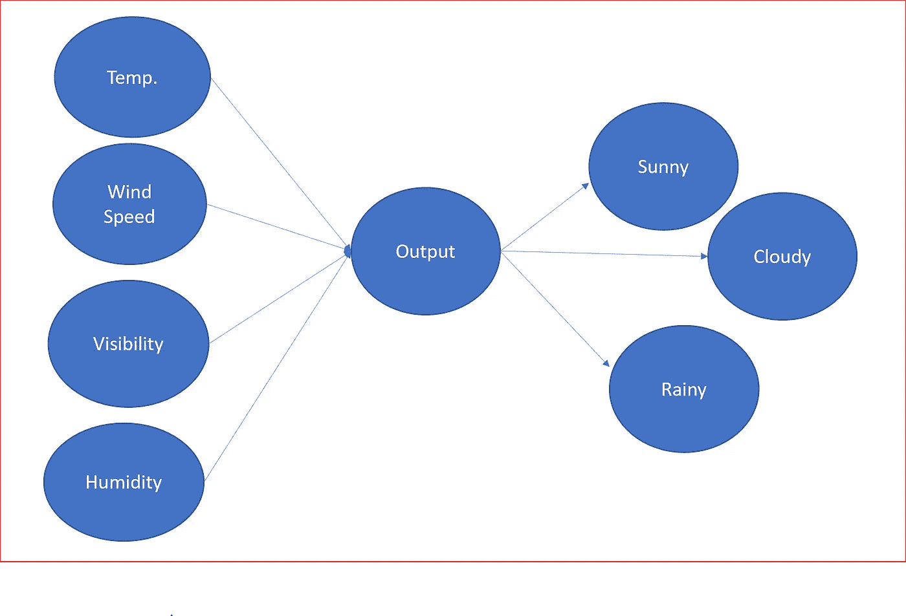

*让我们用神经网络来表示这一点，并了解神经网络的组件。*

神经网络接收输入，通过使用激活函数改变状态来转换输入信号，以产生输出。

输出将基于接收的输入、由权重表示的信号强度以及应用于输入参数和权重的激活而改变。

神经网络非常类似于我们神经系统中的神经元。

Image source : wikipedia

x1，x2，…xn 是树突的输入信号，在神经元的轴突末梢会有状态变化产生输出 y1，y2，…yn。

以预测天气为例，温度、风速、能见度和湿度是输入参数。这些输入然后由神经元通过使用激活函数对输入应用权重来处理，以产生输出。这里的预测输出是天气类型——晴天、雨天或阴天。

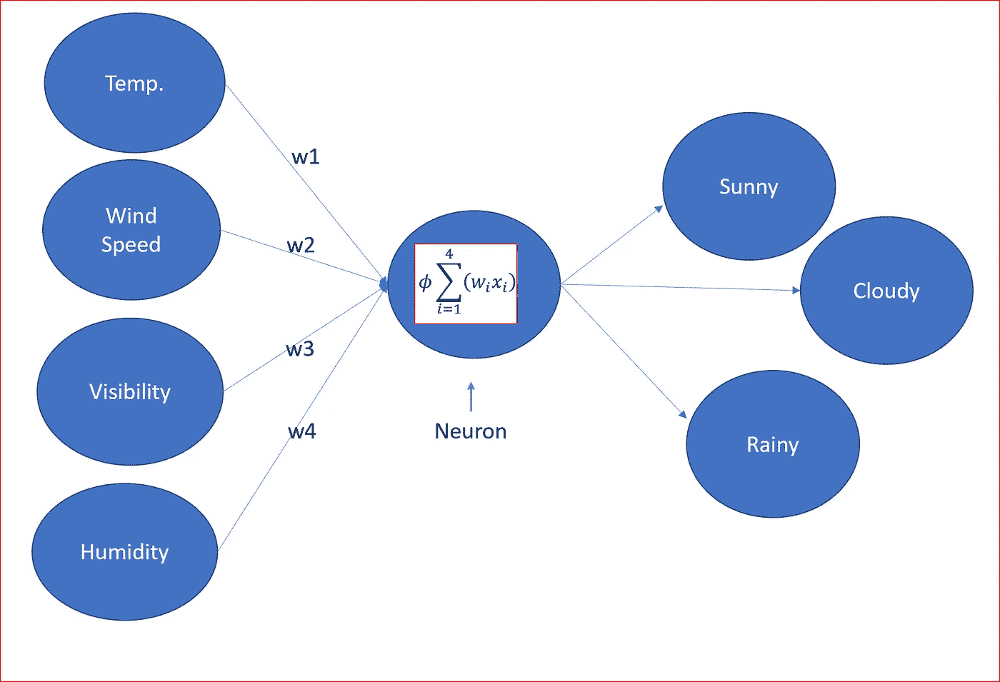

w1, w2, w3 and w4 are the weights applied to the neurons and ɸ is the activation function.

*那么，神经网络有哪些组成部分*

神经网络将拥有

*   **输入层**，其中**偏置单元**为 1。它也被称为截距。
*   **一个或多个隐藏层**，每个隐藏层将有一个偏置单元
*   **输出层**
*   **与每个连接相关的权重**
*   **激活功能**，将节点的输入信号转换为输出信号

输入层、隐藏层和输出层通常被称为密集层

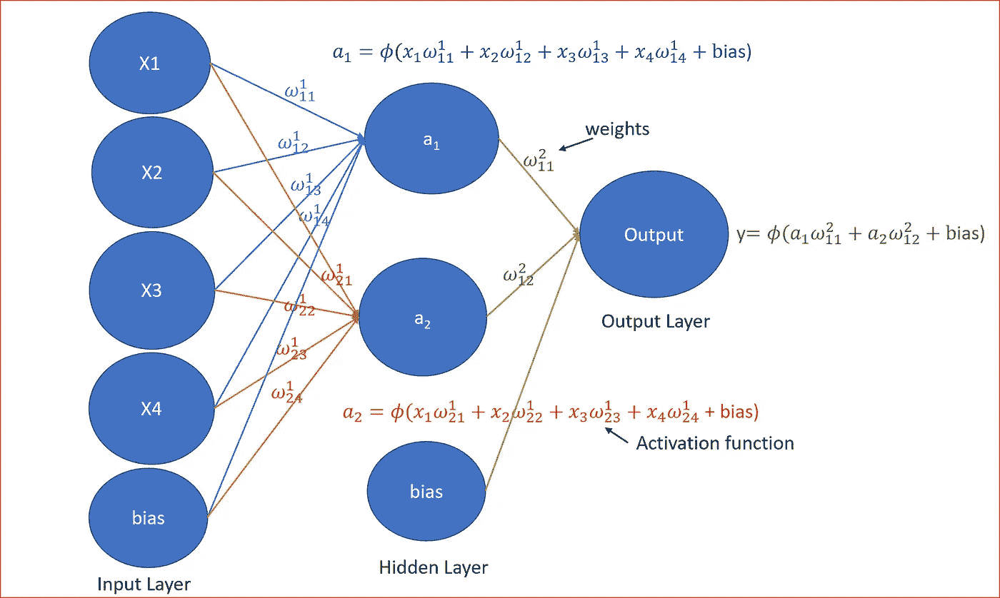

Neural network with input, hidden and output layers along with activation unit

*这些权重是干什么用的，激活函数是什么，这些复杂的方程是什么？*

*让我们把事情简单化*

权重是神经网络学习的方式。我们调整权重来确定信号的强度。

权重帮助我们得出不同的输出。

例如，要预测晴天，温度可能介于宜人到炎热之间，晴天的能见度非常好，因此温度和能见度的权重会更高。

湿度不能太高，否则会是潮湿的一天，所以湿度的权重可能会更小或者可能是负值。

风速可能与晴天没有任何关系，它的强度将为 0 或很小。

我们随机初始化权重(w ),将它们与输入(x)相乘，并添加偏置项(b ),因此对于隐藏层，一个简洁的版本是计算 z，然后应用激活 function(ɸ).

我们称之为**正向传播。**一个简洁的通用方程可以表示如下，其中 *l* 是层数。对于输入层 *l* =1。

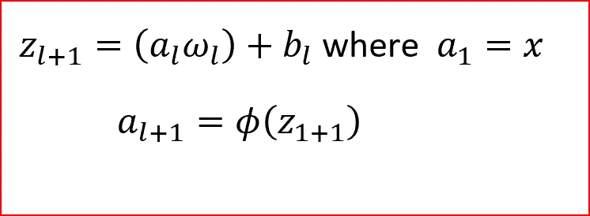

Compact equation for forward propagation

*说到激活函数，我们先来了解一下它们是用来做什么的？*

激活函数有助于决定我们是否需要激发一个神经元，如果我们需要激发一个神经元，那么信号的强度会是多少。

激活功能是神经元通过神经网络处理和传递信息的机制。

为了更好地理解不同的激活功能，请阅读我的博客[这里](https://medium.com/@arshren/neural-networks-activation-functions-e371202b56ff)

*让我们用一个预测天气的样本数据来理解神经网络*

**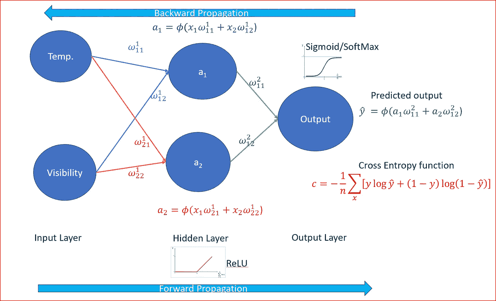**

**Full neural network**

**我们的温度是华氏温度，能见度是英里。**

**让我们取一个温度为 50 华氏度，能见度为 0.01 英里的单一数据。**

****步骤** **1** :我们**随机初始化** **权重**为接近零但不等于零的值。**

****第二步:**接下来，我们用温度和可见度的输入节点来获取单个数据点，然后**在神经网络中移动。****

****第三步:**从左到右应用**正向传播**将权重乘以输入值，然后使用 ReLU 作为激活函数。我们知道 ReLU 是隐藏层最好的激活函数。**

****步骤 4:** 我们现在预测输出，**将预测输出与实际输出值**进行比较。因为这是一个分类问题，我们使用**交叉熵函数****

**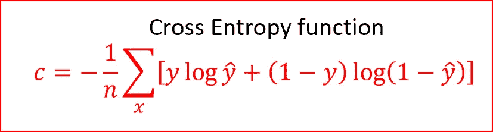**

**n is total number of data points in the dataset, summing over all the inputs in the training set, y is the actual output and y ̂ (y-hat)is the predicted output**

**交叉熵是一个非负的代价函数，范围在 0 和 1 之间**

**在我们的例子中，实际输出不是晴天，所以 y 的值将是 0。如果 y-hat 为 1，那么让我们替换成本函数中的值，看看我们会得到什么**

**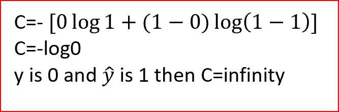**

**predicted output is different than actual output**

**类似地，当实际产量和预测产量相同时，我们得到成本 c=0。**

**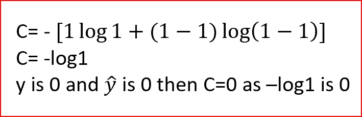**

**predicted output is same as actual output**

**我们可以看到，对于交叉熵函数，当预测输出与实际输出匹配时，成本为零。当预测产量与实际产量不匹配时，成本是无穷大。**

****第五步:**我们从右到左做**反向传播**和**调整权重。根据权重对** **误差**的影响程度来调整权重。学习率决定了我们更新权重的程度。**

***这么多行话反向传播，学习率。我们会用简单的术语解释一切。***

## **反向传播**

**把反向传播想象成一种反馈机制，我们有时会从父母、导师、同事那里得到。反馈帮助我们成为更好的人。**

**反向传播是一种快速学习算法。它**告诉我们当我们改变权重和偏差时，成本函数将如何变化。**从而改变神经网络的行为。**

**而不涉及反向传播的详细数学。在反向传播中，我们为每个训练示例计算成本相对于权重的偏导数和成本相对于偏差的偏导数。对所有训练示例的偏导数求平均值。**

**对于我们的单个数据点，我们确定每个权重和偏差造成的误差量。基于权重如何引起误差，我们同时调整所有权重。**

**可以使用**批量梯度下降(GD)** 为所有训练数据更新一次权重，或者使用**随机梯度下降(SGD)为每个训练样本更新一次权重。****

**我们使用 GD 或 SGD 对不同的权重重复步骤 1 到步骤 5。**

**随着权重的调整，某些节点将基于激活函数被打开或关闭。**

**在我们的天气示例中，温度可能与预测多云的相关性较小，因为夏天的温度可能为 70+,但仍然多云；或者在寒冷的冬天，温度可能为 30 华氏度或更低，但仍然多云。在这种情况下，激活函数可以决定关闭负责温度的隐藏节点，只打开可见性节点，以预测输出不是晴天，如下所示**

**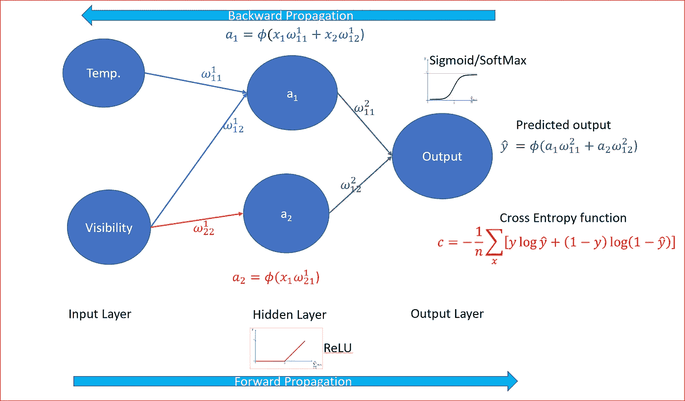**

**weight for temperature is turned off for the second node for not sunny weather prediction**

**关于[梯度下降的更多信息](https://medium.com/@arshren/gradient-descent-5a13f385d403)**

**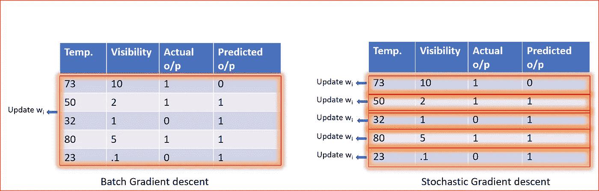**

**Batch GD updates weight after each epoch. SGD updates weights for each training example**

****时期**是当完整的数据集被用于一次学习时，一次正向传播和一次反向传播用于所有的训练样本。**

**我们重复向前和向后传播多个时期，直到我们收敛到全局最小值。**

## **什么是学习率？**

**学习率控制我们应该相对于损失梯度调整多少权重。**

**学习率的值越低，收敛到全局最小值的速度越慢。**

**学习率的较高值将不允许梯度下降收敛**

**学习率是随机初始化的。**

****

***如何确定隐藏层数和每个隐藏层的节点数？***

**随着我们增加隐藏层的数量和隐藏层中神经元或节点的数量，我们增加了神经网络的容量。神经元可以协作表达不同的功能。这通常会导致过度拟合，我们必须小心过度拟合和不足拟合。**

**神经网络中的最佳隐藏层数基于杰夫·希顿建议的下表**

**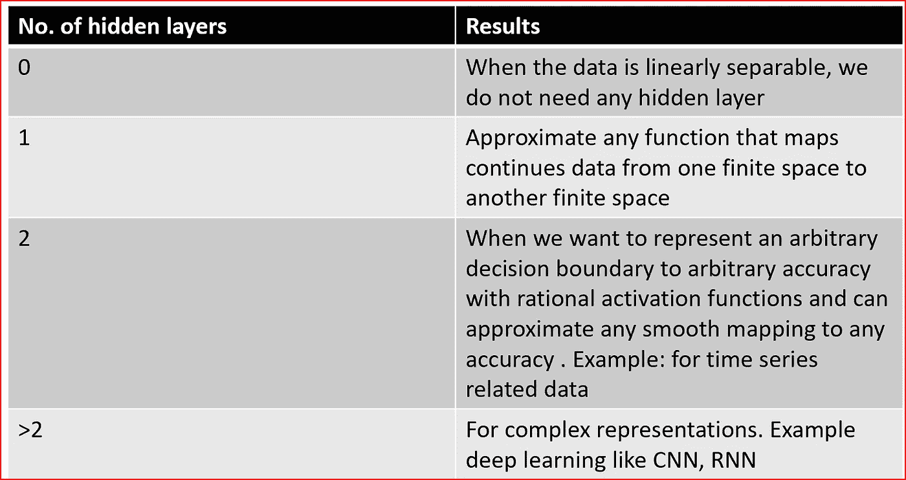**

**Source: [www.heatonresearch.com](http://www.heatonresearch.com)**

**对于隐藏层中的**最佳神经元数量，我们可以遵循以下任何一种方法****

*   **输入和输出层中神经元数量的平均值。**
*   **介于输入层的大小和输出层的大小之间。**
*   **输入层大小的 2/3，加上输出层的大小。**
*   **小于输入层大小的两倍。**

**这是一种以简单的方式解释人工神经网络的努力，而不是陷入复杂的数学。**

## **灵感和参考:**

 **[## 隐藏层的数量

### 这是一个转贴/更新以前的内容，讨论了如何选择隐藏层的数量和结构…

www.heatonresearch.com](https://www.heatonresearch.com/2017/06/01/hidden-layers.html)** ** [## 神经网络和深度学习

### 当高尔夫球员第一次学习打高尔夫球时，他们通常花大部分时间来发展基本挥杆。只有…

neuralnetworksanddeeplearning.com](http://neuralnetworksanddeeplearning.com/chap3.html)  [## 无监督特征学习和深度学习教程

### 为了描述神经网络，我们将从描述最简单的可能的神经网络开始，它包括一个…

ufldl.stanford.edu](http://ufldl.stanford.edu/tutorial/supervised/MultiLayerNeuralNetworks/) 

## 阅读它，分享它，如果它能帮助你获得更好的理解，请鼓掌。**