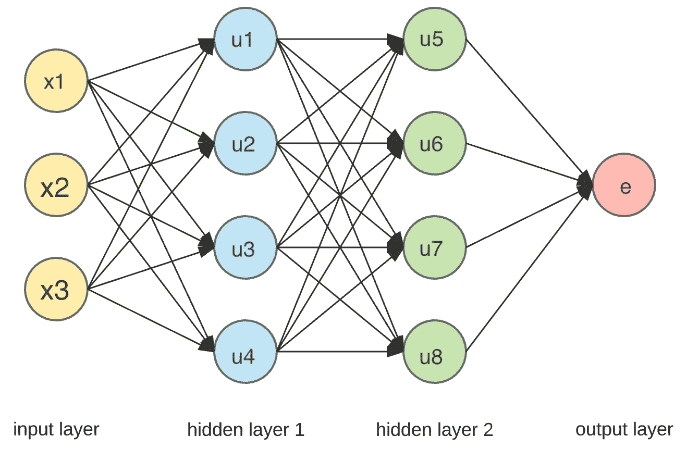
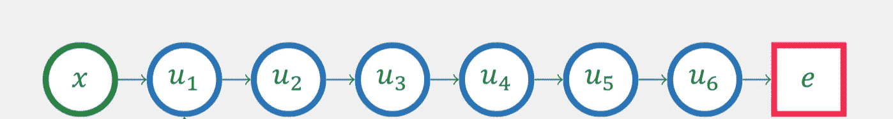

# 神经网络

> 原文：<https://medium.datadriveninvestor.com/neural-networks-152336f224bc?source=collection_archive---------17----------------------->

Photo by [Jon Moore](https://unsplash.com/photos/tIgJR__pjZw?utm_source=unsplash&utm_medium=referral&utm_content=creditCopyText) on [Unsplash](https://unsplash.com/search/photos/neural?utm_source=unsplash&utm_medium=referral&utm_content=creditCopyText)

逻辑回归是神经网络的构建模块。它采用其输入的线性组合，然后应用非线性 function􏰊，称为激活函数。这正是一个*神经元*单元所做的。

我们可以有许多这样的单元，每个单元都有自己的激活功能。结合多个单元，我们得到一个**前馈神经网络**。

因此，前馈神经网络有一个输入层，一个隐藏层和一个输出层。如果有两个或两个以上的隐含层，它就是一个**深**前馈神经网络。我们在网络中走得越深，功能就越先进。因此，即使更深层次的网络更难训练，它们也更强大。

前馈神经网络评估来自给定输入特征和权重的正向输出，即评估所有隐藏单元并最终产生输出。

查看这个[网站](http://playground.tensorflow.org/)来玩玩神经网络吧！

Figure 1: Deep Feedforward Neural Network

神经元的**激活在数学上不过是其输入的函数。输入层之后的层中的每个神经元的激活是基于前一层中所有激活加上一些附加偏置的加权和。偏差在加权和的阈值设定中是有用的。**

> 假设，
> 
> w0 + w1*x1 + w2+x2 + … + wn*xn -10
> 
> 这表明只有当加权和大于 10 时才激活神经元

在其核心，神经网络计算输入*的函数 ***f*** 和权重 ***w*** 以给出输出*。*该输出通过损失函数 ***e*** 与观察结果 ***y*** 进行比较。*

*这是一个**前馈**神经网络，因为在每次正向传递之后，我们使用先前的单元评估下一层的单元，并最终以损失结束。*

*为了优化权重 ***w*** *，*我们使用梯度下降。所以我们只要知道梯度 ***de/dw*** 就可以训练任何神经网络。*

*使用**反向传播**技术计算该梯度，该技术使用**链式法则**进行计算。*

*回到*图 1* ，梯度计算如下:*

## ***注意**——一个特定的层只不过是前一层的函数。*

*所以， *e* 是 *u5* 、 *u6* 、 *u7* 和 *u8* 的函数。知道了 e，我们就可以计算出 *de/du5* 、 *de/du6* 、 *de/du7* 和 *de/du8* 。*

**u5* 、 *u6* 、 *u7* 和 *u8* 是 *u1* 、 *u2* 、 *u3* 和 *u4* 的功能。*

**德/杜 1* = ( *德/杜 5* ) * ( *杜 5/杜 1* ) **+** ( *德/杜 6* ) * ( *杜 6/杜 1* ) **+** ( *德/杜 7* ) * ( *杜 7/杜 1*)**+**。*****

*同样，我们可以计算 de/du2、de/du3 和 de/du4。诀窍是沿着所有可能的箭头向后，从损失函数 e 到特定单元。*

*反向传播使得训练深度神经网络成为可能。*

**

*在更深层次的神经网络中，有一个消失梯度的问题。*

*de/du1 =(de/du6)*(du6/du5)*(du5/du4)*(du4/du3)*(du3/du2)*(du2/du1)*

*当其中一个导数非常接近零时，就会发生这种情况，那么产生的梯度也将接近于零。*

*敬请关注更多内容！*