# 神经网络——一种直觉

> 原文：<https://medium.datadriveninvestor.com/neural-networks-an-intuition-640821d5bd83?source=collection_archive---------2----------------------->

人类一直对大自然着迷。鸟类的飞行使我们发明了飞机；鲨鱼皮启发我们制造速度更快的泳衣和许多其他从大自然中汲取灵感的机器。今天我们处于制造智能机器的时代，没有比大脑更好的灵感了。人类因进化而特别幸运，拥有能够完成最复杂任务的大脑。

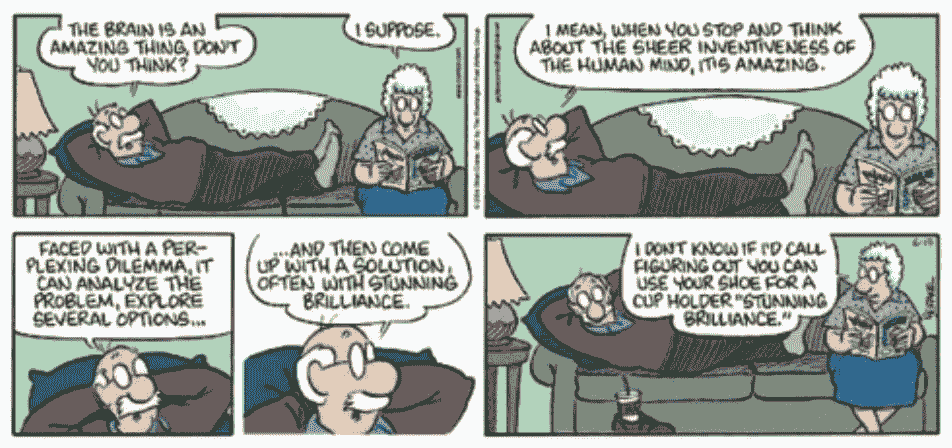

Source: [https://me.me/](https://me.me/i/the-brain-an-i-suppose-amazing-thing-dont-you-think-15472608)

自 1940 年初以来，科学家们一直试图建立数学模型和算法，模拟大脑内部进行的计算。当然，我们离实现大脑的壮举还很遥远，但我们正在接近它。

为了制造智能机器，已经提出了几种简化的学习模型，其中最流行的是人工神经网络或 ANN 或简单的神经网络。神经网络是当今机器学习和人工智能领域中使用的最强大的算法之一。顾名思义，它从我们大脑中的神经元及其连接方式中获取灵感。让我们快速窥视一下我们的大脑。

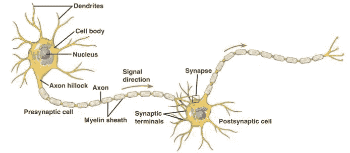

Source: [http://biomedicalengineering.yolasite.com/neurons.php](http://biomedicalengineering.yolasite.com/neurons.php)

如上图所示，神经元在我们的大脑内部是相互连接的。这张图片显示只有 2 个神经元相互连接。事实上，成千上万的神经元通过树突连接到单个神经元的细胞体，平均而言，单个神经元连接到 10，000 个其他神经元。让我们简化这张图片，制作一个人工神经网络模型。

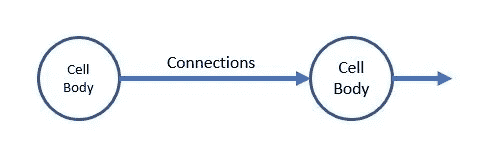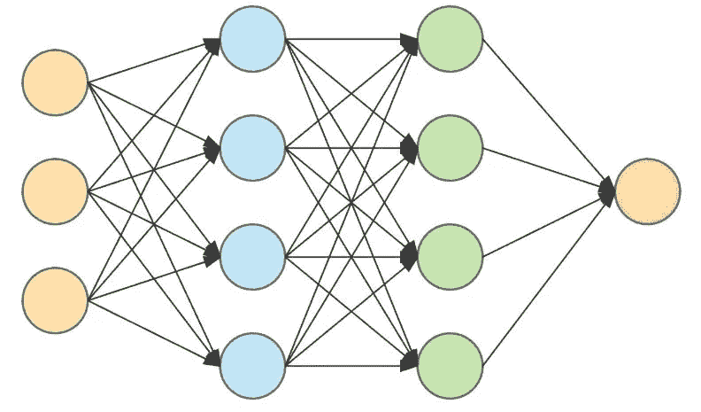

A multi-layer neural network

现在，假设细胞体将只保存一个数字，连接箭头描述了数据流的方向以及每个神经元如何与其他神经元强有力地连接。不要担心*强烈的*在这里意味着什么，我们一会儿就会看到。我们从生物学中获得了一些关于神经元及其连通性的灵感。让我们看看这是如何帮助我们的大脑完成一些任务的。

## 感知器

Source: [https://www.javascripttuts.com](https://www.javascripttuts.com)

嗯，那是威震天。

感知器是 Frank Rosenblatt 在 1957 年发明的一种机器学习算法。感知器是一个线性分类器，你可以在这里 阅读什么是线性分类器和一个分类算法[。让我们看一个非常小的分类例子。让我们试着建造一台机器来识别一个物体是否是板球。](https://medium.com/x8-the-ai-community/practical-aspects-logistic-regression-in-layman-terms-73fbcae58625)

让我们任意选择这个球的一些性质。

1.  它是红色的，我们将称这个球的属性为 **R**
2.  它是球形的，我们将这个球的属性称为 **S**

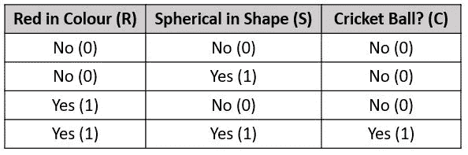

根据任意选择的属性，也称为**特征，**我们将物体分类为板球或其他。上表告诉我们，如果一个球是红色的球形，它是板球，在所有其他情况下，它不是。让我们看看如何用神经网络做到这一点。

为了构建我们能够识别板球的超微型*大脑*，我们将采用一个神经元，它只是将输入相加并输出总和——

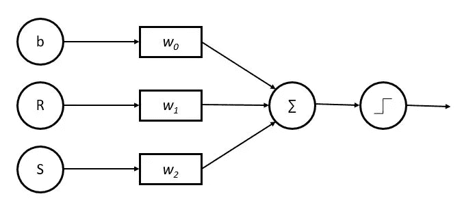

分解上图； *b、R* *和* *S* 是输入神经元或简单地说是网络的输入， *w0、w1 和 w2* 是与中间神经元连接的**强度**，中间神经元汇总了对它的输入。 *b* 这里有一个常数，叫做*偏差。*最后一步，即最右边的神经元，是一个名为**激活函数**的函数，如果输入为正，则输出 1，如果输入为负，则输出 0。数学上看起来像是—

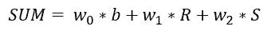

如果这个和> 0，输出= 1 或*是*和< 0，输出= 0 或*否*

让我们看看这是如何帮助我们对板球进行分类的。我们为我们的连接强度 *w* 和常数*b*选择一些任意的数字。我们如何得出这些值，这是通过*训练*学习这些权重的*的一部分。神经网络是本系列第 2 部分的主题。现在让我们假设我们从某个地方得到了这些数字—*

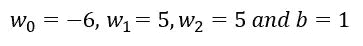

让我们适应这些价值观

情况 1:当物体既不是球体(S=0)也不是红色(R=0)时

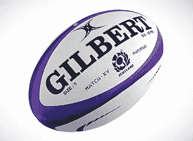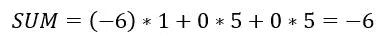

我们的感知机说这不是板球。

情况 2:当对象是球体(S=1)但不是红色(R=0)时

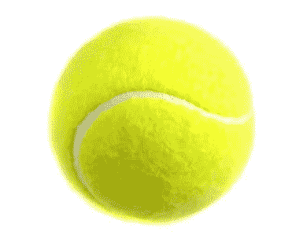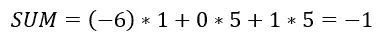

总和<0 which means the output is 0 or No, not a cricket ball

Case:3 When the object is not a sphere (S=0) but red (R=1)

The SUM<0 which means the output is 0 or No, not a cricket ball

Case 4: When the object is a sphere (S=1) and red (R=1)

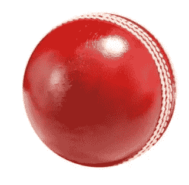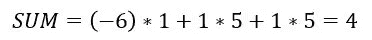

The SUM> 0 表示输出为 1。瞧啊。我们的感知机说这是一个板球。

这是神经网络背后最基本的想法。我们以特定的方式连接许多这样的感知器，我们得到的是一个神经网络。我把这个想法简化了一点，但它仍然抓住了感知器的本质。

## 多层感知器

我们采用感知器的想法，将它们堆叠在一起，创建这些神经元的*层*，这被称为**多层感知器** (MLP)或**神经网络**。

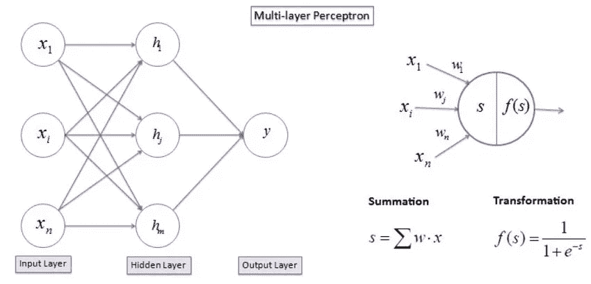

在我们的简化感知器模型中，我们只是对输出使用了阶跃函数。在实践中，使用了许多不同的变换或**激活函数**。

我们手动而随意地选择了我们的特征，红色和球形，但是对于许多其他复杂的任务来说，选择这样的特征并不总是可行的。MLP 在某种程度上解决了这个问题。MLP 的输入可以仅仅是图像的像素值，然后隐藏层组合并转换这些像素值以在隐藏层中创建特征。本质上，一层感知器转换数据，并将其发送到下一层。

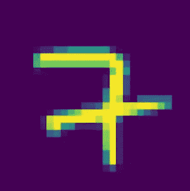

A 28 pixel x 28 pixel image of a handwritten digit

假设我们的 MLP 正试图通过观察与上图相似的手写数字图像来识别一个数字。使用 MLP，我们可以直接将该图像作为其像素值传递给输入层，而无需从中提取任何特征。隐藏层然后*组合和转换*这些像素来创建一些特征。作为训练过程的一部分，隐藏层中的每个神经元都试图*学习*一些特征。例如，隐藏层中的 1 号神经元可能学习对图像中的水平边缘做出响应，2 号神经元可能对图像中的垂直边缘做出响应，等等。现在，如果输入图像同时具有水平边缘和垂直边缘，隐藏层中的神经元 1 和 2 会做出响应，输出神经元现在会结合这两个特征，并且可能会说它是 7，因为 7 大致具有垂直边缘和水平边缘。

当然，MLPs 并不总是学习那些必然有意义的特征，但是它本质上是输入数据的转换。例如，MLP 将手写数字图像作为输入，在隐藏层有 16 个神经元，它学习如下特征

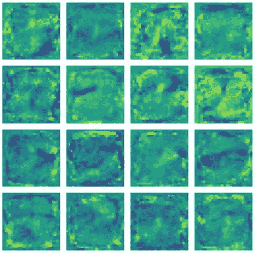

Each square represents the learned features by a neuron in the hidden layer

正如你可以清楚地看到模式或多或少是随机的，没有意义。MLP 的推理过程和转换在这个令人敬畏的 YouTube 系列中得到最好的解释，作者是 3Blue1Brown — [**什么是神经网络**](https://www.youtube.com/watch?v=aircAruvnKk) 。我强烈建议你去这个频道，观看视频，获得关于神经网络的直觉。一个可视化神经网络所做的一些事情的好工具是[**tensor flow Playground**](https://playground.tensorflow.org)**，如果你有一些线性代数的背景，这个[博客](http://colah.github.io/)中的可视化效果很好。**

## **神经网络的今天和明天**

**那么，除了识别板球或手写数字之外，神经网络还能执行什么任务呢？今天，神经网络被部署用于广泛的任务。**图像识别、语音识别、自然语言处理、** [**时间序列数据**](https://medium.com/x8-the-ai-community/time-series-what-is-all-the-hype-about-e1ffd8957f1a) 以及许多许多其他应用。图像分类是一个特定的领域，其中神经网络已经成为事实上的算法。神经网络在准确识别图像方面已经超过了人类。当然，有很多复杂的技术和数学来建立这样的高保真神经网络。**

**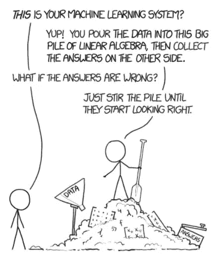**

**Source: xkcd.com**

**神经网络无处不在。公司部署它们来给你推荐你可能喜欢在 YouTube 上观看的视频，当你与 Siri、Google Now 或 Alexa 说话时识别你的声音和命令。神经网络现在正在生成自己的绘画和音乐作品。尽管如此，仍有许多挑战。神经网络可能是巨大的，有数百层，每层有数百个神经元，这使得计算对当前的硬件技术来说是一个巨大的挑战。训练神经网络是另一个巨大的挑战。几个图形处理器一起用来训练这些神经网络，需要几个小时到几天。**

**但在我们寻求制造具有像人脑一样复杂的智能和能力的机器的过程中，它们是现在和未来。我们离制造一个有朝一日可以“下载”你的所有意识来制造你自己的机器副本的人造大脑还很远。但是现在这只是科幻小说！**

****

**Source: xkcd.com**

**神经网络是一个庞大的主题，这篇文章背后的想法是引发足够的好奇心，给你一个小小的动力去探索这个主题。所以，去点击文章中的 YouTube 和 TensorFlow 链接，享受学习的乐趣吧！。**

**期待这个系列的第二部分，如何训练你的 D̶r̶a̶g̶o̶n 神经网络。**

**X8 的目标是为人工智能组织和建立一个社区，这个社区不仅是开源的，而且关注它的伦理和政治方面。更多这种简化的人工智能概念将随之而来。如果你喜欢这个或有一些反馈或后续问题，请在下面鼓掌和评论。**

***感谢阅读！***