# 神经网络及其数学简化:视觉理解

> 原文：<https://medium.datadriveninvestor.com/neural-networks-and-its-maths-simplified-visual-understanding-a66909a0710b?source=collection_archive---------4----------------------->

# 机器学习的最大任务之一是分类。我们需要创建一个边界来分隔两种(或多种)类别。例如，我们想要构建一个分类器，它可以声明这 20 个人会违约，而其余的不会。因此，在数学上，我们试图想象/识别 n 维空间(特征空间)中可以将一个类别(违约者)与另一个类别(非违约者)分开的边界

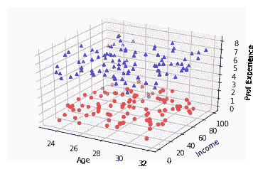

图中的每个点代表一个人(实例/行)。每个点/人/实例具有三个特征(收入、年龄和职业经历(以年计))，因此特征空间是三维空间(X，Y，Z)。颜色是默认的标志。蓝点(人)是非犯规者，而红点(人)是犯规者。

我们的目的是想象/识别出能够区分各个阶层的界限(蓝色和红色，表示违约者和非违约者)。这里我们可以很容易地想象出一个简单的平面，可以把类分开。这意味着它需要一个简单的平面(数学上，该平面是 aX+bY+cZ +d = 0，其中系数 a，b，c，d 要被找出)。

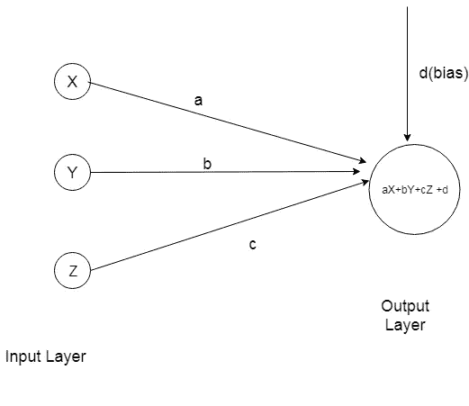

换句话说，通过使用这个边界/分类器，我们可以预测任何新点(X，Y，Z)的类别。逻辑是 aX+bY+cZ +d >0 是一个类(这里是蓝色类)否则是另一个类(这里是红色类)的点

> 在现实生活中，总是存在非线性，在 X，Y，Z 的极端值处弯曲。例如，违约概率随收入 70 万到 100 万的人而变化，但随收入 320 万到 350 万的人而变化不大。它是非线性的。

(10 万卢比)

因此，为了引入非线性，我们引入激活函数(sigmoid，双曲正切)

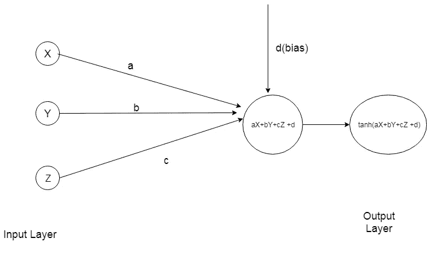

为了简单起见，我们试图根据二维特征空间(X 和 Y)来预测类别(Z)。如上所述，现实生活中的边界通常是非线性的。为此我们需要激活功能。

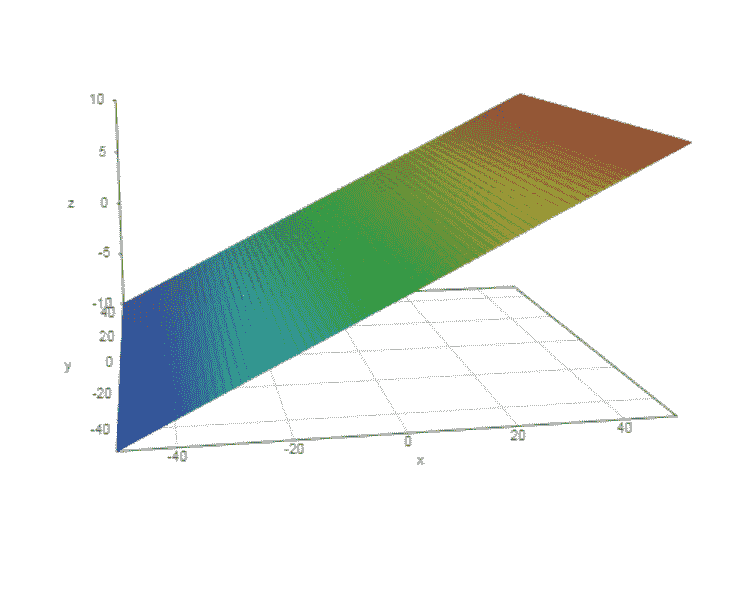

A plane: Z: 0.2X + 0Y

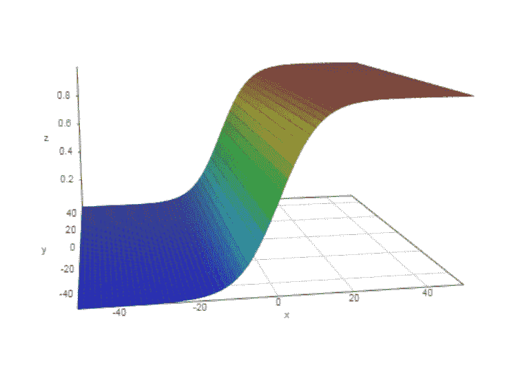

Sigmoid(Z): 1/(1+exp(-(0.2X+0Y)))

sigmoid 函数可以将任何值更改为 0 到 1 之间的值，而双曲正切函数可以将值更改为-1 到 1 之间的值。Relu、leakyRelu、elu 是激活功能的高级版本。

因此，边界从平面变为非线性平面，以分隔不同的类别

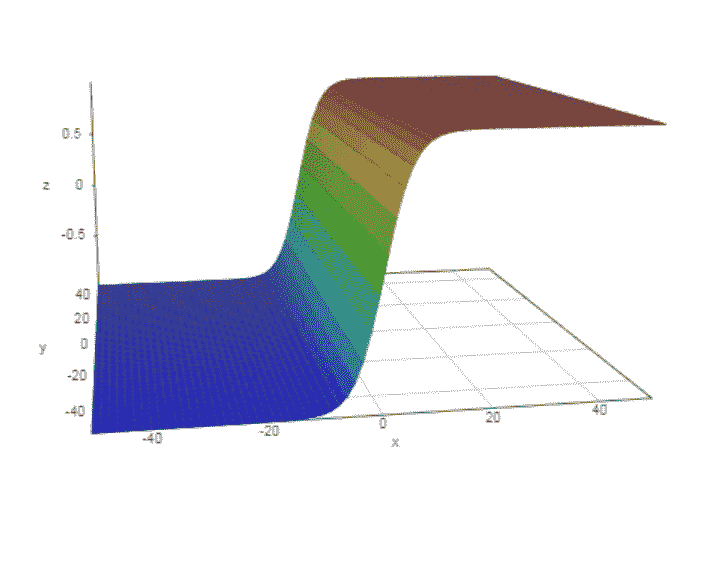

tanh(Z): tanh(0.2X+0Y)

恭喜你！你已经理解了激活函数、非线性和边界的重要性/相关性。

现在让我们进入另一个理解层面。

在下一节中，我们可以看到中间层的重要性，特别是当我们需要复杂的边界来分隔类时

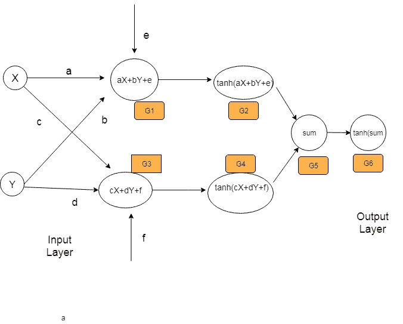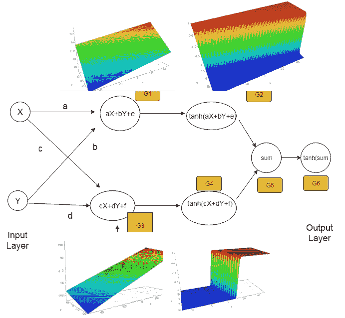

Extending our previous ideas, let us create mathematical understanding of a bit more advanced neural networks.

在这里，我们可以看到每个层/步骤中的值是如何变化的。我们只需要一个函数逼近能够区分类别的边界。函数逼近通常是非线性函数(即线性函数和非线性(激活)函数)的组合

X 和 Y 的线性函数在接下来的层中产生。基于系数、a、b、c 和 d(最初的初始值，以及调谐后的最佳值)和偏置值，如图所示制作不同的函数/图，然后激活函数挤压该值/图。最初，我们不知道系数的正确/最佳值，因此最终函数可以逼近分离类的边界。这就是为什么我们需要反向传播来调整系数/权重，以获得系数/权重的最佳值。

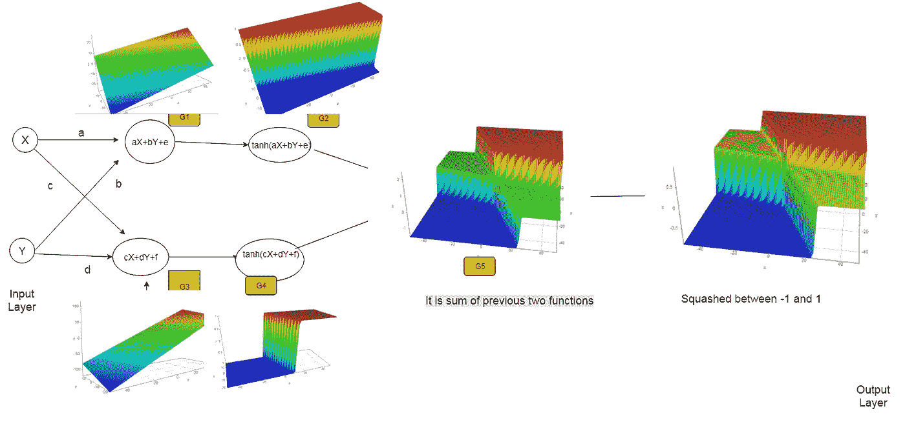

希望你喜欢对神经网络的视觉理解

**引人深思:**

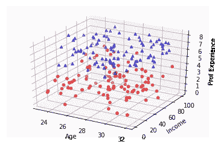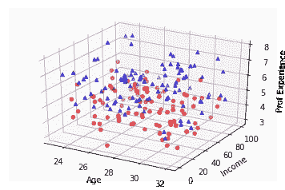

想象一下，这些类型的图可能需要非常非线性和复杂的边界。你可以想象为什么我们需要更多的层和激活函数来创建边界。

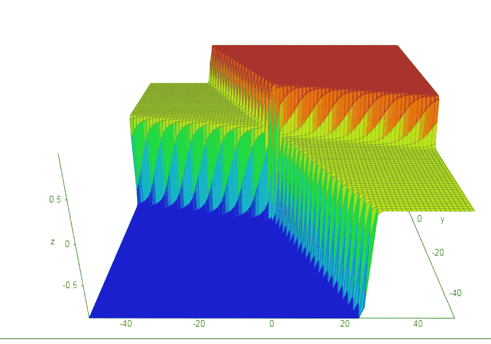