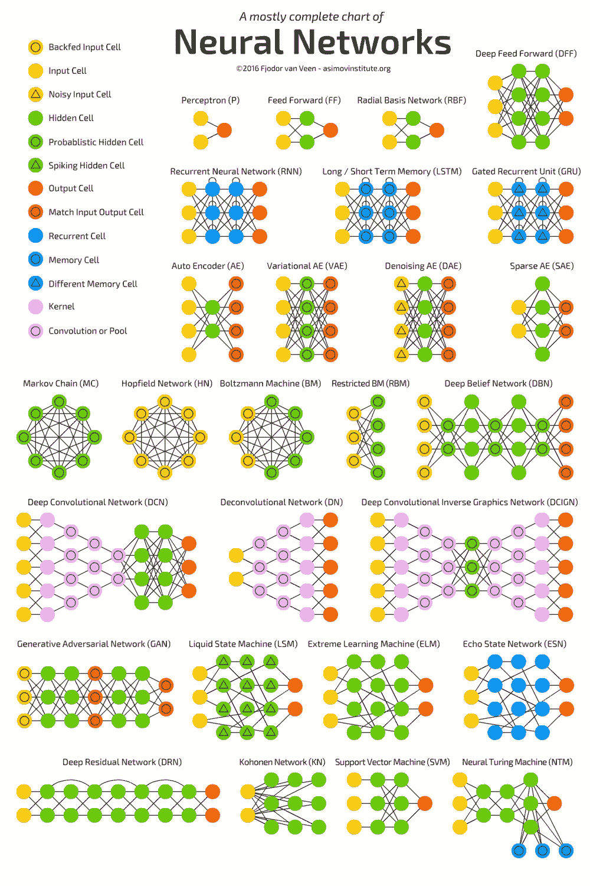

# 神经网络

> 原文：<https://medium.datadriveninvestor.com/neural-networks-c9993b3922a5?source=collection_archive---------13----------------------->

[INTERNITY](http://www.internity.in)

神经网络是一种机器学习模型，其工作方式与人脑的工作方式相同。这创造了一个人工神经网络，通过算法工作，并允许计算机通过合并新数据进行学习。人工神经网络是一组相互连接的节点，类似于大脑中的神经元。

[Digital Trends](http://www.digitaltrends.com)

神经网络由神经元层组成，也称为计算单元。它们也在不同的层中互连。这些神经元正在转换数据，直到接收到输出。Neuron 将初始值乘以分配给它们的一些权重，与其他值相加，通过神经元偏差调整结果数，最后，通过一些激活函数对输出进行归一化。

神经网络的一个非常重要的特征/功能是 ***迭代学习过程。*** 在这种情况下，各行不会同时单独呈现给网络，每次都会调整与每个输入值相关的权重。在学习过程中，网络通过调整权重来训练自己，以预测输入数据点的正确类别。

一旦我们设计好了网络，现在就该进行培训了。为了启动这个过程，随机选择一些权重值，然后我们从训练部分开始。

神经网络有很多种类型，下面是 [*Fjodor 范维恩*](https://www.asimovinstitute.org/author/fjodorvanveen/) 设计的非常精美的小抄，用于基本了解。

我们将一个接一个地理解它们中的一些，并将在以后的文章中涉及其他的。

1.  ***感知器*** :最简单的网络形式，对输入求和，对其应用激活函数，并将其进一步传递到输出层。
2.  ***【FF】***:这里所有的节点都是全连接的，没有任何反馈回路参与其中。在输入层和输出层之间存在一层。
3.  ***【RBF】***:这是一种前馈网络。他们使用*径向基函数*作为他们的激活函数，而不是逻辑函数。RBF 激活函数非常适合函数逼近，对于连续值也比逻辑函数有优势。
4.  ***深度前馈*** :它们也是前馈网络的一种形式，只是多了一个隐含层。在训练传统的 FF 时，我们将少量的误差传递给前一层。现在，这导致培训时间呈指数级增长，并使 DFF 的实际实施变得相当困难。
5.  ***【RNN】***【递归神经网络】 :这些网络引入了不同类型的细胞——递归细胞。当来自过去迭代的决策能够影响当前的决策时，使用这些类型的网络。比如一个词，只能从前一个词的影响来分析。通过一次一步地处理真实数据序列并预测接下来会发生什么，这些网络也可以被训练用于序列生成。如果我们假设预测是概率性的，那么可以通过从序列输出中迭代采样并在下一步将其用作输入样本，从训练的网络中生成序列。
6.  ***自动编码器*** :这种网络背后的主要思想是没有随机初始化的权重，而是用无监督学习算法预先训练每一层可以产生更好的权重。可用于**数据去噪**和**数据可视化的降维。**

**神经网络在工业中的应用**:

*   神经网络用于现实世界的商业问题，如数据验证、风险管理和销售预测。
*   营销部门可以利用这些信息进行市场细分，确定产品的目标和定位。无监督的神经网络可用于根据客户特征的相似性对客户进行细分。可以训练受监督的神经网络来学习客户细分之间的界限。
*   神经网络有很大的能力，它们可以很容易地同时考虑多个变量。预测销售，预测利润，这些都是它可以发挥巨大作用的场景。

就这样，我们将在不同的帖子中看到其他主题，直到那时*快乐编码！！！*