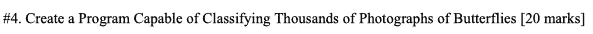
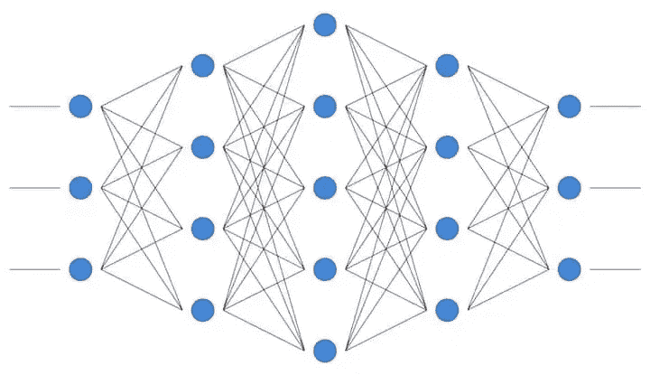
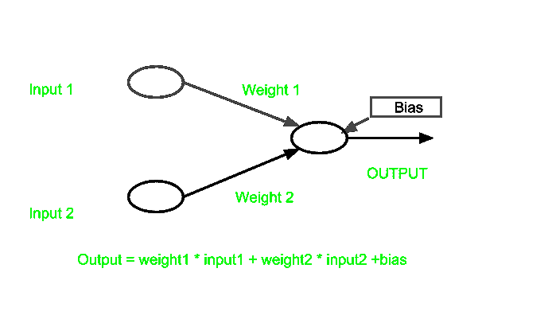
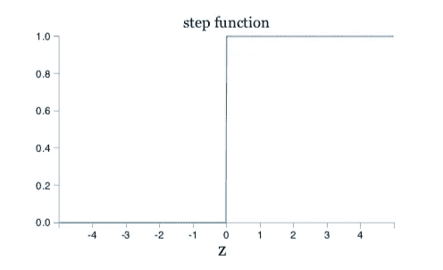
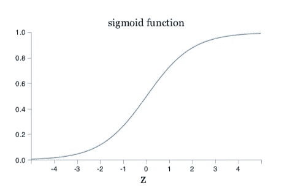
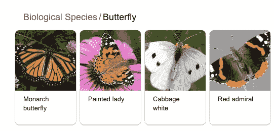

# 去神秘化的神经网络

> 原文：<https://medium.datadriveninvestor.com/neural-networks-demystified-34bee0c45fb7?source=collection_archive---------4----------------------->

## 计算机现在正在模拟大脑如何工作——如何工作？

# 介绍

假设你正在参加一门计算机科学课程的考试。你很快就要申请大学，因此你决心在所有的功课上取得优异的成绩。你完全精通三种编程语言，并且知道所有的课程材料，所以你非常确定你会做得很好。

Exams — Often a Tale of Dread and Procrastination

你已经解决了一半的编码问题，然后你读到:

**^@%！？？？？*整个测试满分为 40 分，其中一半的分数来自这个超越困难的问题。我的意思是，你怎么能在几个小时内做出能整理成千上万张图片的东西呢？

这就是机器学习发挥作用的地方，这是一项新兴技术，能够完成像识别蝴蝶这样的任务。事实上，方式更多，像甚至*检测癌症*或*驾驶汽车*。

呃，好吗？那么这些是如何工作的，或者说，有什么意义吗？

 [## 人工智能与创造力:梦想成真|数据驱动的投资者

### 人工智能总是让我着迷。不仅作为一套有用的工具，不断发展，而且作为一个…

www.datadriveninvestor.com](https://www.datadriveninvestor.com/2019/01/28/ai-creativity-deep-dream-comes-true/) 

# 背景

嗯，**机器学习的基础**，人工智能的一个子集，是神经网络。顾名思义，它们从人类大脑的运作方式中获取灵感。

A Model of a Neural Network

**人工神经元模拟真实神经元**，整个网络能够通过处理输入数据**做出预测**和**得出结论**。今天，我将讨论前馈神经网络——输入和输出严格向右移动。这一点会更有意义。

# 神经元

神经元是神经网络的基本构件。想想有机体的细胞或物质的原子。它们是您的模型所必需的。它们**通过计算输入产生代表预测/决策**的值。

# 投入、权重和偏差

在讨论神经元的类型之前，先讨论伴随它们的重要概念是很重要的。**输入、权重和偏差使得一组神经元成为实际的网络**。它们都是一个神经元进行计算，然后输出一些东西所必需的。

**输入(x)**

输入仅仅是输入神经元的**数据点。因为神经网络的核心是数学模型，所以输入由数值表示。例如，灰度蝴蝶照片的像素值。**

**重量(w)**

然后，重量开始起作用。本质上，它们表示输入的**重要性，并将输入乘以一个选择的数字。当输入神经元的数据点非常重要时，它们在某种意义上权重很大(高权重值)。**

**阈值和偏差(b)**

到目前为止，我们已经有了输入到神经元的数据和权重，也就是我们将前者乘以的值。但是，还有一点需要学习。假设我们使用感知器神经元(稍后会详细介绍)，我们的神经元看起来就像这样。

> 如果 wx < threshold
> 
> Output 1 if wx ≥ threshold

The **阈值**指的是**我们的加权输入等于或大于感知器输出 1** 所需的数字，则输出 0。为了澄清，感知机在对预测有信心时输出 1，在没有信心时输出 0。

如果我们正在观看一场足球比赛，我们的输入可以是用户有多喜欢 1-5 的球队。这似乎是他们是否应该观看的一个明显的指标，所以我们给它一个 2 的高权重。如果他们最喜欢的球队在比赛，感知器应该只输出“1”，也就是你应该看的。照此，门槛是 6(需要喜欢团队> 3)。这看起来像这样:

> 如果 2x < 6
> 
> Output 1 if 2x ≥ 6

However, this inequality can be simplified. Introducing biases! By moving thresholds to the other side and switching them to positive/negative (rule of simplifying equations) values, we now have a value called bias. This can be shortly explained as**表示超过零的容易程度的值，则输出 0。**偏差调整输入的加权和作为附加参数。

因此，在我们的示例中，我们现在有:

> 如果 2x — 6 < 0
> 
> Output 1 if 2x — 6 ≥ 0

With our weight being 2 and the bias -6\. And as you may see, the inputs, weights and biases can be modelled with the equation **wx + b.** 则输出 0 这与**线性方程**的形式相同！

一旦你得到一个以上的输入，你也会得到一个新的权重。神经网络中经常使用多个输入。

The output of a neural network before it’s been activated… keep reading!

# 激活功能

然而，神经元的输出可能比 1 或 0 更复杂。当应用**激活**时会发生这种情况。激活会改变神经元的输出。

我们将探讨两种常见类型的激活函数，每一种都有自己的神经元类型。

# 感知器

一种过时但重要的神经元类型是感知器。如上所述，在对输入的数据进行加权和计算后，它能够产生 0 或 1 值。

这里使用的功能是**步进功能**。曲率很小，如果应用权重和偏移后的 x 值小于 0，如图表所示，输出将为 0。然而，如果偏移和权重后的 x 值为 0 或以上，您可以看到输出将为 1。为了简单起见，我们认为 x = 0 为 1。

# 乙状结肠神经元

乙状结肠神经元的工作方式略有不同，并提供 0 和 1 之间的值。

顾名思义，使用的函数是 **sigmoid 函数**(不过，也叫逻辑回归函数)。如照片所示，图形比阶跃函数平滑得多**。这就是我们如何得到介于 0 和 1 之间的值。**

使用乙状结肠神经元是因为**我们可以获得比 0 或 1** 更多的描述性输出。感知器天生是苛刻的——不管你有多接近，你都可能得到一个 0 输出，因为加权输入比 0 小 0.00002。因为在这个二进制系统中，一切都被 0 和 1 严格约束，非常接近的方程会与非常不接近的方程捆绑在一起，因为它们所有的感知器都会产生 0。 **Sigmoid 为我们提供了更高的准确性**，因此我们可以从数字输出中看出加权输入是否接近(0.213、0.967 等。).

# 基础建筑

神经网络的结构非常简单。它们由三种不同类型的层组成— **输入、隐藏和输出**。

## 输入层

输入层是指照片中最左边的一列或一组神经元(圆圈)。它们是第一层，因为**数据首先从这里**开始。这是因为数据是“输入”，输入层负责把它反馈给第一个隐层的其他神经元。

## 隐藏层

这就把我们带到了下一种类型——隐藏层。隐藏层听起来很神秘，但实际上只是输入层和输出层之间的层。它们不接受最初输入的数据/产生最终的输出。

## 输出图层

最后是输出层。在这里，神经网络的官方输出被发布，它们的数值代表了一些东西。**这些输出都存储在神经元**中。

通常情况下，**输出层**中的每个神经元被用作一个单独的组件，**代表某种东西**。

所以回到问题 20，如果你用感知器对蝴蝶进行分类，每个输出神经元将对应于网络的置信度，即初始照片是某个物种。比如说君主，画女，白菜白，红海军上将。如果神经网络说“我们认为这张图片是一只帝王蝶”，那么帝王蝶的输出神经元的值是 1，而其他物种的值是 0。

Species found through a quick google search.. I’m no expert!

这将是一个前馈神经网络-照片最初被输入到左边的输入层，然后右边的输出层产生最终值。

# 要点

*   神经网络模拟大脑
*   神经网络由相连的神经元组成
*   所有的神经元都有输入和偏差，这些输入都有权重
*   乙状结肠神经元和感知器是神经元的例子
*   三层:内部、隐藏、外部

现在，神经网络还有更多的内容——这只是一个概述。损失、梯度下降和应用等概念将在接下来的几周内发布到我的 medium 帐户，所以请随时关注并与我联系！