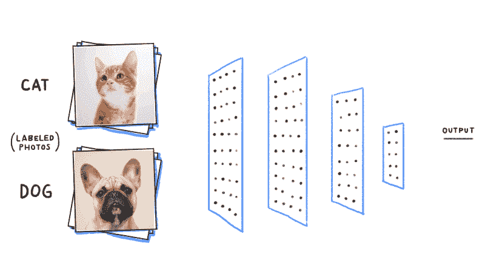
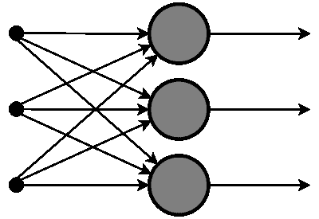
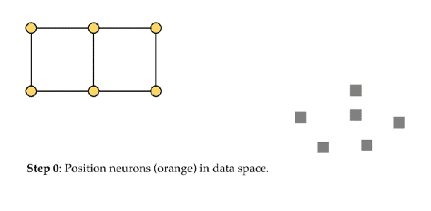
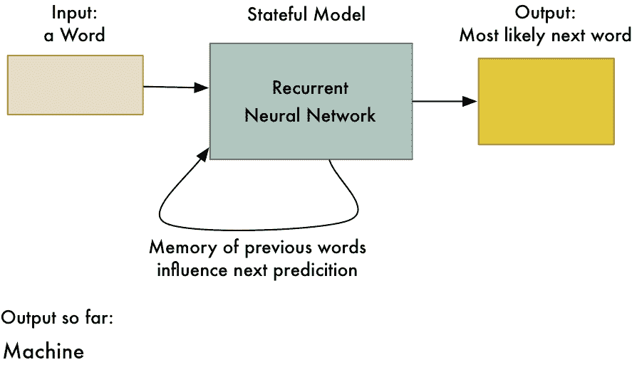
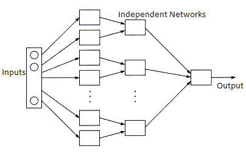

# 神经网络解释

> 原文：<https://medium.datadriveninvestor.com/neural-networks-explained-6e21c70d7818?source=collection_archive---------2----------------------->

神经网络是一种计算机程序，其操作类似于人脑。神经网络的目标是执行我们大脑可以执行的认知功能，如解决问题和可教性。

第一个神经网络是由伊利诺伊大学的神经生理学家沃伦·麦卡洛克和芝加哥大学的数学家沃尔特·皮茨在 1943 年开发的。然而，他们没有真正测试第一个网络，因为他们的技术足够先进，有能力运行它。因此，1954 年，麻省理工学院的贝尔蒙特·法利和韦斯利·克拉克教授成功地运行了第一个简单的神经网络。

神经网络的主要吸引力在于它们能够模仿大脑的模式识别技能。在神经网络的个人和商业应用中，它们被用于各种各样的事情，如它们被用于预测投资决策的结果，它们可以发现手写的模式，它们甚至可以扫描陆地区域的异常，这使得它能够指出地雷或炸弹等事情。

## 神经网络如何运作

想象一个神经网络作为一个黑匣子，它接受输入，如自动驾驶汽车的人口普查，并将它们处理成多个输出之一，如汽车的控制。神经网络本身有许多称为神经元的小单元，这些神经元被分成几层。层是通过神经元相互连接的神经元列。

每个神经元通过称为加权连接的连接器连接到另一层的神经元。加权连接用附加在其上的实数值进行调整。一个神经元取一个连接的神经元(在它们的层中)的值，并将其与它们的连接的权重相乘。所有连接的神经元的总和就是神经元的偏差值。然后，偏差值通过激活函数[(f)x]进行数学转换，并将其分配给相邻层中连接的神经元。这是通过整个网络传播的。

从本质上说，网络就像一个过滤器，通过所有的可能性，所以，计算机可以得出正确的答案。这实际上是网络所做的全部工作，真正的挑战是找到正确的权重(神经元值)以计算正确的结果。找到正确的权重是通过机器学习来完成的，这就是为什么神经网络与人工智能的进展如此交织在一起。

Activation Function (non-simplified [(f)x]) — Sigmoid

也有网络出错，输出错误答案的时候。网络总是能够是正确的，因为它寻找特定的特征以便输出答案。

如果一个物体看起来与另一个物体相似，网络可能会“混淆”,输出错误的答案。为了防止这种情况发生，我们可以首先给网络配备某种反馈机制，称为反向传播算法。这使得网络能够通过网络重新调整连接。使用这种算法，网络能够回过头来“再次检查”它们的网络，以确保所有的偏差都是正确的，所有的连接都被适当地加权，或者程序员是否已经正确地对机器学习应用进行了编程。

第二，我们可以使神经网络成为递归神经网络，包括在两个方向以及层内和层间进行的信号。递归神经网络(RNNs)通常被设计为识别数据序列特征，并使用模式来预测下一个可能的场景。

## 神经网络是如何训练的

在训练神经网络时，人们使用机器学习保护伞下的监督学习。基本上，每个训练示例都包含输入数据和期望输出的值。一旦网络能够在其他测试案例上表现得足够好，它就可以应用于任何新的训练示例。监督学习是指当有全套训练数据时。

例如，不列颠哥伦比亚大学的研究人员利用太平洋的温度和压力数据训练了一个前馈神经网络，以预测未来的水下火山爆发，因为北美西海岸与“火环”和海啸等任何异常大浪接壤。他们在北美做了同样的事情，但是，能够预测未来的全球天气模式，以应对气候变化。

然而，有一些神经网络是使用无监督学习来训练的。网络被提供输入数据，并被赋予发现模式的目标，而不被告知具体要寻找什么。这种类型的神经网络可以用于数据挖掘。

有趣的事实:当你随机尝试挖掘不同的加密货币时，你可以使用在区块链使用无监督学习训练的神经网络！

## 神经网络的类型

*   **前馈神经网络**:这是最简单的神经网络之一，其中数据或输入仅在一个方向上传播。数据通过输入节点，在输出节点上输出。没有反向传播算法，因此，如果神经网络输出“错误”的答案，它就没有办法自我纠正。

Feedforward Neural Network

*   **径向基函数神经网络:**径向基函数考虑的是一个点相对于中心的距离。RBF 函数有两层，第一层在内层将特征与径向基函数相结合，然后在下一个函数中计算相同的输出时考虑这些特征的输出。

Radial Basis Function Neural Network

*   **Kohonen 自组织神经网络**:koho nen 映射的目的是将任意维度的向量输入到由神经元组成的离散映射中。需要对地图进行训练，以创建自己的训练数据组织。它包括一维或二维。训练时，贴图位置保持不变，但权重会因值而异。该点和神经元之间的距离通过欧几里德距离计算，距离最小的神经元获胜。

Kohonen Self Organizing Neural Network

*   **递归神经网络(RNN):** RNNs 的工作原理是保存一层的输出，并将其反馈给输入，以帮助预测该层的结果。这种神经网络使用反向传播来双重检查其工作，以确保其输出在 99.9%的时间内是正确的。

Recurrent Neural Network

*   **卷积神经网络(CNN)**:CNN 类似于前馈神经网络，其中神经元具有能够学习的权重和偏差。人们经常使用这个，它将信号和图像处理与 OpenCV(计算机视觉)结合起来。

下面是一个 ConvNet 的表示，在这个网络中，输入特征像一个过滤器一样被成批获取。这将有助于网络记忆部分图像，并可以计算操作。这些计算涉及图像从 RGB 或 HSI 标度到灰度的转换。一旦我们有了这一点，像素值的变化将有助于检测边缘和图像可以分类到不同的类别。

ConvNet — Convolutional Neural Network

*   **模块化神经网络(MNN):** MNNs 是不同网络的集合，这些网络独立工作，同时对输出做出贡献。每个网络都有一组输入，与构建和执行子任务的其他网络相比，这些输入是唯一的。MNNs 的优点是它们将计算过程分解成更小的过程，这使得计算函数更容易和更快。

Modular Neural Network

## 结论

神经网络处于认知计算的前沿。这就像说有一天电脑会比我们的大脑更强大！神经网络主要用于单独的人工智能，或者与另一种新兴技术(如区块链)结合使用。然而，深度学习系统是不同的，因为它们基于多层神经网络和能力，如 Siri(苹果的移动助手)的语音识别能力。结合指数级增长的计算能力和海量的大数据，深度学习神经网络影响了人和机器之间的工作分配。

## 关键要点

*   神经网络是模拟大脑功能的计算机程序。在未来，神经网络能够解决人类无法解决的大问题。
*   神经网络就像过滤器，使用具有实值加权连接的神经元，在连接在一起的层中产生确定的输出。
*   计算机并不总是正确的，因此，反向传播算法允许它再次检查网络，以确保输出绝对正确。
*   神经网络有成千上万的应用，但核心在于其背后的编程。
*   有 6 种主要类型的神经网络，每种都有其特定的功能。

## **感谢阅读！如果你喜欢，请给它一个掌声！祝您愉快！**