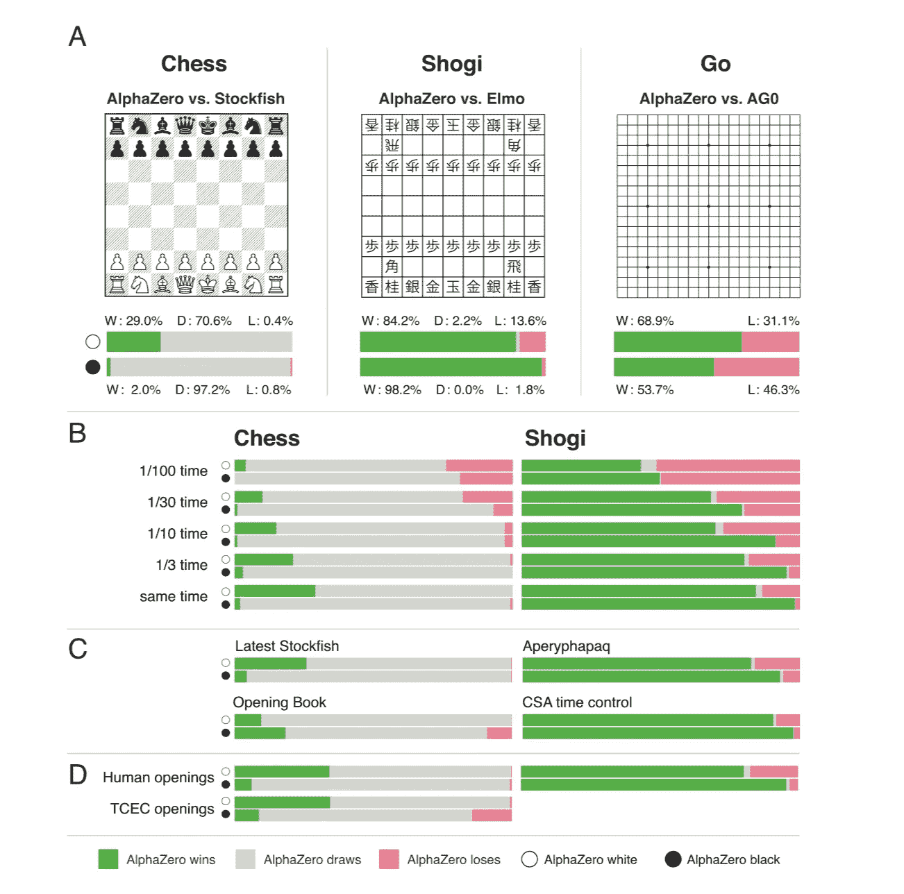

# 神经网络:世界末日(几乎)到了

> 原文：<https://medium.datadriveninvestor.com/neural-networks-the-apocalypse-is-almost-here-c7f8b1776f41?source=collection_archive---------17----------------------->

## AlphaZero 已经成为游戏人工智能的终极之王。由 [DeepMind](https://deepmind.com/) (又名谷歌)开发的算法，在所有方面击败了所有人。

**注:本帖首发于** [**我的简讯**](https://buttondown.email/afontcu) **。提前一周订阅接收我的帖子，直接发送到你的收件箱**🚀

上个月， [**发表了一篇详细的论文**](https://deepmind.com/documents/260/alphazero_preprint.pdf) ，里面有它与 [Stockfish](https://en.wikipedia.org/wiki/Stockfish_(chess)) 对弈的详细信息，Stockfish 是目前为止最受欢迎和最强大的国际象棋工程师。

# 神魂颠倒

关于 AlphaGo，有两件事让我大吃一惊。

是的，它在国际象棋方面比其他任何人工智能都要好几个数量级。我们都认为人类不再是象棋机器的对手，但这台机器在人类中也是独一无二的。

首先，它使用相同的算法在国际象棋、松木和围棋上击败所有人。

Beating. Everyone. At everything. No matter what.

是的，你没看错。它在三个祖传游戏中打败了人类和机器。

然而，最令人难以置信的是，工程师们是如何在不同的游戏中实现如此完美和差异化的。这真让我大吃一惊。

# 没有人教 AlphaGo 下棋

没有人教 AlphaGo 如何下棋。工程师只教他基本规则:棋子如何移动，最终目标是什么(将死对面的国王)。

国际象棋是一种非常复杂的游戏。动作很简单，但是从那以后，一切都变得复杂了。

关于象棋比赛有一些共同的知识。例如:每个棋子都有一个理论值(棋子=1，主教/骑士=3，车=5，皇后=9)。也知道一些结构或策略是*通常好的想法*:在单个文件中加倍兵是坏的，保持象对是好的，在打开的文件中有车(没有兵的文件)是优势，等等。还有一大堆关于开局理论的书,当前的人工智能从第一步开始就用它们来设定比赛的基调。

**这是提炼出来的人类知识。**几千年前开始的知识。大师们用来在大约 7 小时的游戏中击败对方的知识，其中小细节和细微差别决定了多年准备后的结果。

但是 AlphaGo，仿佛是北方之王(*剧透？*)、**一无所知**。

AlphaGo 是一个[深度神经网络](https://skymind.ai/wiki/neural-network)，它通过与自己对弈来学习象棋**。没有人工输入。没有公开的理论。没有相对价值。没有好的或坏的卒结构。**

# AlphaGo 烂透了。大概一两场比赛

它的第一场比赛很可笑。随机移动。但最终，非黑即白赢得了比赛。如果一方赢了，它一定有更好的动作，对吗？AlphaGo 一路走来学到了一些东西，和自己的精炼版对弈。

AlphaGo 的目标在人工智能中也很明显。我们习惯于评估表示白棋和黑棋位置“价值”差异的棋位。一个+1.4 的位置意味着白棋上升了 1.4 个棋子。评估中的 A -12.0 表示黑色等于 12 个棋子的价值。

AlphaGo 根本不在乎相对价值。它只是计算胜利(+1)或失败(-1)的可能性。同样，没有理论，也没有预先定义的知识。让机器去做它的事情。

所以，他们让它自己玩，然后一次又一次。经过 300，000 次迭代，AlphaGo 已经在击败 Stockfish。400，000 次迭代之后， **Alphago 在每一场比赛中都击败了 stock fish**。一些[问题被提出](https://chess24.com/en/read/news/alphazero-really-is-that-good)关于他们游戏的方法和条件，但是我们不在这里讨论这个。

一个神经网络，经过几个小时的训练后，能够击败所有以前依赖人类知识的人工智能。让我再说一遍。AlphaGo 训练了**个小时**。人类下棋已经有几个世纪了。

我喜欢象棋和书呆子的东西，所以这真的是我的果酱。棋远(？)从[被解决](https://en.wikipedia.org/wiki/Solving_chess)但是想想神经网络在这么短的时间内能达到什么样的效果就令人恐惧。

我的意思是，这是国际象棋，一个无辜的游戏。但是当这些工具被用来探索更有争议的话题时会发生什么呢？

谁来决定一个输出是好是坏？当没有人——我重复一遍，没有人——能够完全理解决策的含义，而一台机器已经学会了做出决策的方法，在这种情况下,“好”或“错”意味着什么？

直到现在，引擎都在模仿人类。现在，计算机开始学习，所以**它们不再受人类智力**的限制。他们会战胜他们的创造者。

尽管如此，我们仍然控制着局面:我们可以设定他们的界限，决定在哪里运用他们的力量。但仅此而已。

这是一个非常令人不安的想法。

额外的球:如果你碰巧有一个网飞账户，可以看看 AlphaGo 和世界围棋冠军之间的比赛纪录片。太迷人了。

**注:本帖首发于** [**我的快讯**](https://buttondown.email/afontcu) **。提前一周订阅接收我的帖子，直接发送到你的收件箱**🚀