# 注意神经翻译模型

> 原文：<https://medium.datadriveninvestor.com/neural-translation-model-95277838d17d?source=collection_archive---------1----------------------->

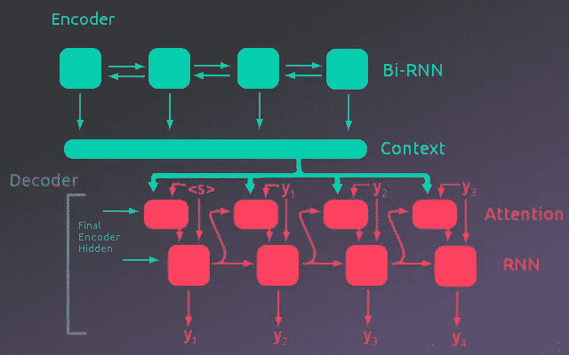

在这篇文章中，我将详细介绍如何构建和训练一个神经翻译模型。这个模型将被用来把法语翻译成英语。这篇文章将集中在概念上的解释，而详细的项目代码可以在相关的 Jupyter 笔记本中找到。这个笔记本可以在[这里](https://nbviewer.jupyter.org/github/macbrennan90/translation-model/blob/master/translation-model.ipynb)查看或者从项目 Github 库[这里](https://github.com/macbrennan90/translation-model)克隆。这篇文章将分为两部分:

1.  对模型的概念性理解
2.  模型表现的简要总结

这个项目紧紧跟随 [PyTorch 序列到序列教程](https://pytorch.org/tutorials/intermediate/seq2seq_translation_tutorial.html)，同时试图更深入地研究模型实现和解释。感谢[肖恩·罗伯逊](https://github.com/spro/practical-pytorch)和 [PyTorch](https://pytorch.org/tutorials/) 提供了这么棒的教程。

# 了解模型

我们试图建立一个翻译模型。在这项任务中取得成功的一个模型是编码器-解码器网络。在高层次上，该模型接受一个序列，并将该序列的信息编码成一个中间表示。这个中间表示被解码器解码成模型已经被训练的任何目标语言。在这个项目中，输入序列是法语句子，模型被训练输出这些句子的英语翻译。

在我们深入编码器和解码器如何工作的细节之前，我们需要了解我们的数据将如何被表示到模型中。在不知道模型如何工作的情况下，我们可以做出合理的假设，如果我们给模型一个法语句子，它应该能够给我们提供相应的英语句子。所以输入一个单词序列应该输出另一个单词序列。然而，模型只是对输入执行各种计算的参数的集合。模型不知道单词是什么。类似于字母与数字之间的 ASCII 映射，我们的单词也需要用数字来表示。为此，数据集中的每个唯一单词都需要一个唯一的索引。模型将被赋予一系列的索引，而不是一系列的单词。

这对于一个句子来说非常有效，但是我们如何通过模型多个句子来加快训练过程呢？句子并不都一样长。此外，如何为模型组织这些数字序列？答案是输入序列将被表示为具有维数(批量大小 x 最大序列长度)的 2D 张量(矩阵)。这允许我们输入一批句子，并且长度小于数据集中最长句子的句子可以使用预定的“填充索引”来填充。下图对此进行了说明。

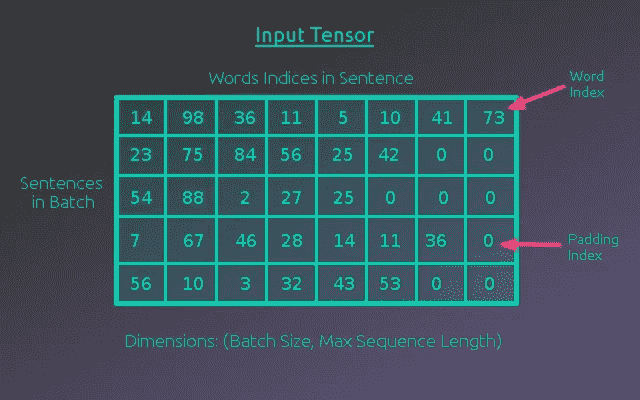

# 编码器

## 单词嵌入

输入张量允许我们将几个句子作为一系列索引输入到模型中。这是朝着正确方向迈出的一步，但这些指数不包含任何信息。它们只是代表单词的占位符。由索引 54 表示的单词不一定与由索引 55 表示的单词相关。在计算中使用这些指数没有意义。这些指数需要用某种其他格式来表示，以便模型计算出有意义的东西。

做到这一点的一种方法是对单词进行“一次热编码”，这意味着每个单词都由一个零向量来表示，除了与该单词相关联的索引处的 1。这个向量中的每个索引将与词汇表中的一个唯一的单词相关联。这是可行的，但是它仍然缺乏任何关于单词之间关系的信息。更好的表示单词的方法是使用单词嵌入。

单词嵌入将每个单词表示为一个 N 维向量。这样，相似的单词将具有相似的单词嵌入，并且将在 N 维空间中彼此靠近。为了确定单词嵌入的良好值，在一些语言任务上训练具有随机单词嵌入的模型。幸运的是，其他研究人员已经完成了这项工作，并且这些单词嵌入已经可以使用了。在这个项目中，使用了来自 FastText 的 300 维单词嵌入。

索引现在可以由与每个单词相关联的单词嵌入来代替。这一步包括在编码器的计算中，给出了表示单词嵌入的输入张量的第三维。下图显示了这种嵌入张量。

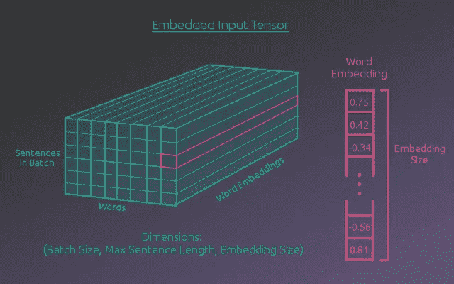

随着输入句子被表示为单词嵌入序列并被组织成张量，它准备好被馈入编码器的递归层。

## 编码器架构

如上所述，嵌入步骤被并入编码器计算中。这是通过嵌入层完成的。下图显示了完整的编码器架构。

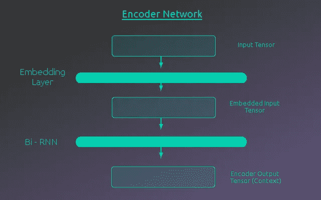

如上所示，一旦输入张量通过嵌入层，嵌入的输入张量被传递到双向 RNN 层。简单的编码器-解码器网络只对编码器使用前向 RNN。然而，这要求在序列开始处的项目被编码，而没有关于序列中后面包含什么的任何信息。双向 RNN 通过在序列中向前和向后步进来避免这种情况。当 RNN 在序列中后退时，它已经看到了完整的序列。

采用嵌入的输入张量，RNN 遍历序列(句子)中的每个序列项(单词)。在每次迭代中，输出长度等于编码器隐藏大小的编码向量。对于该序列项目，这是针对批次中的每个实例并行完成的。尽管所有 RNN 步骤都作为一个最终张量输出，但将每一步的输出视为一个矩阵(批量大小 X 编码器向量大小)是有用的。

在序列的每一步，RNN 的隐藏状态都被传递到 RNN 的下一次迭代中，该迭代接受下一个序列项。该迭代还为批中的每个示例输出一个编码向量。这个“矩阵”在序列中的每一步被输出，并且当 RNN 在序列中向后步进时，输出矩阵被连接到来自沿着编码向量维度的前向通道的相同序列步的矩阵。这个过程如下图所示。在这个项目中，RNN 单元使用了两层，中间有一个分离层。此外，还比较了两种不同类型的 RNN 氏症，LSTM(长短期记忆)和 GRU(门控循环单元)结构。

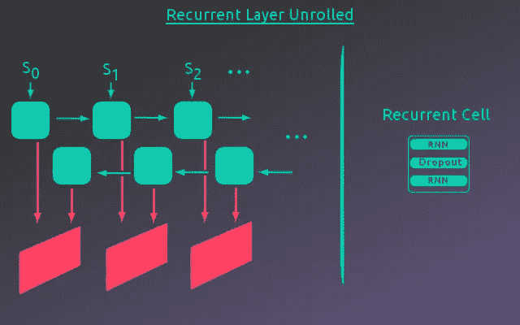

RNN 层的最终输出是一个张量，其中每个递归步骤的“矩阵”输出在序列维度中堆叠。下图详细展示了这个张量。

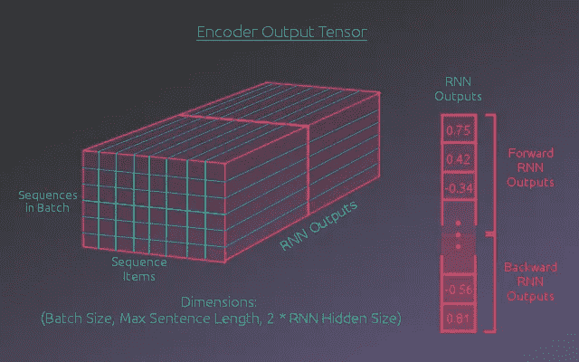

# 解码器

对于简单的编码器-解码器网络，编码器的最终隐藏状态被传递给另一个 RNN(解码器)。这个 RNN 的每个输出都是输出序列中的一个字，它作为输入被送到 RNN 的下一步。然而，这种架构要求将整个输入序列编码到编码器的最终隐藏状态中。通过使用注意力模型，解码器在输入序列的每一步都获得最终的隐藏状态以及编码器输出。然后，解码器可以对编码器输出的值进行加权，这些值对于解码器输出序列中每次迭代的计算都很重要。

最终，解码器的递归层将把注意力模块加权的编码器输出以及来自递归单元的前一步骤的预测字索引作为输入。下图说明了这一过程，其中“上下文”代表编码器输出张量。(注意，为了简化附图，两个模型中的嵌入层都没有包括在图示中。)


现在让我们仔细看看注意力模块是如何对编码器输出进行加权的。

## 注意力

回头参考编码器输出张量，序列维度中的每一项都保存来自 RNN 输出的向量。在输入句子中，该向量与该序列步骤中的单词相关联。对于一批中的每个示例，注意力模块对序列维度上的这些向量进行加权求和。对于每个示例，这会产生一个矢量，表示计算当前输出序列步长所需的相关信息。

为了使这个解释更具体一点，让我们考虑一个例子。如果输入句子的第一个单词是给定输出单词的最重要的信息，那么与第一个单词相关联的权重将是 1，而所有其他权重将是 0。这将具有这样的效果，即加权向量将等于与来自输入句子的第一个单词相关联的向量。

该模型需要学习如何确定这些权重，因此使用完全连接的层来计算它们。序列中每个单词需要一个权重，因此节点的数量将等于最大序列长度。权重总和也应该为 1，因此完全连接的层将使用 softmax 激活函数。为了确定这些权重，注意力模块将把解码器的先前隐藏状态和来自先前解码器输出步骤的预测字的字嵌入的连接作为输入。下图说明了这一过程。

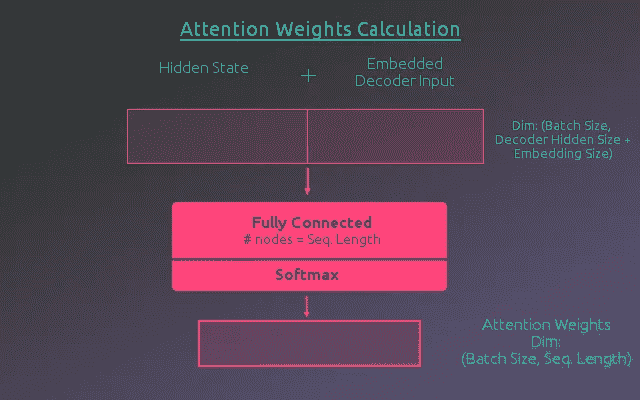

一旦计算了权重，权重和编码器输出的矩阵乘法，通过批量示例，将给出整个序列的编码向量的加权和。通过批量示例，表示编码器输出的矩阵可以被认为是取编码器输出张量的水平切片。通过手动写出这个乘法，可以看到每个序列权重乘以相关的编码向量，然后在整个序列上求和，产生一个向量。下图举例说明了这种计算。实际计算将批次中的每个示例进行堆叠，以形成具有维度的矩阵(批次大小 x 2 *编码器隐藏大小)。这产生加权编码器输出。

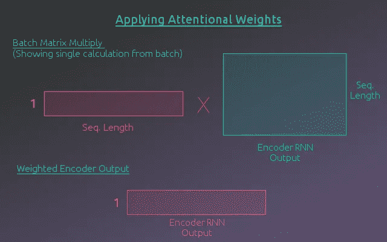

## 递归计算

现在，编码器输出已经被注意模块加权，它准备好被传递到解码器的 RNN 层。RNN 还将接收由解码器的前一步骤预测的单词的单词嵌入。不是将这两个矩阵的连接直接输入到 RNN，而是首先通过一个具有 ReLU 激活的完全连接的层。该层的输出将成为 RNN 的输入。

来自 RNN 的输出将通过具有 log softmax 激活函数的全连接层，其中节点的数量等于输出语言 vocab 中的字数。这表示对输出序列中下一个单词的预测。这个字连同 RNN 的隐藏状态一起被传递到注意力模块和 RNN 的下一步，在那里计算下一个序列项。下图说明了这一过程。重复这一过程，直到输出完整个输出序列。

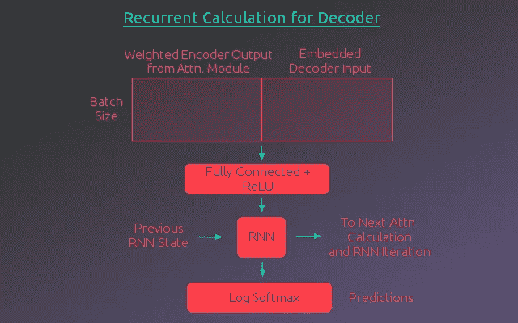

# 训练模型

最初，该模型不太擅长预测输出序列。它需要训练。为此，计算损失，并且误差通过模型反向传播以更新模型参数。对于该模型，通过取输出预测和目标翻译单词之间的负对数似然损失，对序列求和并对批求平均来计算损失。对整个数据集和数据集的尽可能多的时期重复该过程，以获得期望的结果。

然而，训练语言模型稍微复杂一些。因为解码器依赖于先前序列项的预测来预测后面的项，所以序列中早期的错误会打乱整个翻译。这使得模型很难学习。解决这个问题的方法是一种叫做教师强迫的技术。其思想是，对于某些批次(通常是一半时间，随机选择)，不将解码器的前一个预测传递给下一个序列步骤，而是使用前一个目标。当使用示教强制时，解码器在每一步的计算都使用正确的前一个字。这种技术使得模型的训练更加容易。

# 模型性能

构建和训练这个模型的细节可以在相关的 Jupyter 笔记本中找到，该笔记本在帖子的开头有链接。本节将简要总结该模型的表现。

# 数据集

两个数据集用于测试模型。最初使用的数据集相对简单。它的词汇规模较小，句子结构似乎缺乏多样性。然而，它确实具有在测试模型时训练相对较快的优势。在这个数据集上训练之后，使用第二个更多样化的数据集。虽然这个数据集使用了较短的句子，但它的词汇规模要大得多，句子结构也要宽得多。

**简单数据集**
例数:137861

独特的法语单词数:356
独特的英语单词数:228

最长的法语句子:23 个单词
最长的英语句子:17 个单词

示例:

```
French Sentence: paris est jamais agréable en décembre , et il est relaxant au mois d' août . 
English Sentence: paris is never nice during december , and it is relaxing in august . French Sentence: elle déteste les pommes , les citrons verts et les citrons . 
English Sentence: she dislikes apples , limes , and lemons . French Sentence: la france est généralement calme en février , mais il est généralement chaud en avril . 
English Sentence: france is usually quiet during february , but it is usually hot in april . French Sentence: la souris était mon animal préféré moins . 
English Sentence: the mouse was my least favorite animal . French Sentence: paris est parfois clémentes en septembre , et il gèle habituellement en août . 
English Sentence: paris is sometimes mild during september , and it is usually freezing in august .
```

**更多样的数据集**
例数:139692

独特法语单词数:25809
独特英语单词数:12603

最长的法语句子:10 个单词
最长的英语句子:10 个单词

示例:

```
French Sentence: je vais laver les plats 
English Sentence: ill wash dishes French Sentence: les nouvelles les rendirent heureux 
English Sentence: the news made them happy French Sentence: globalement la conférence internationale fut un succès 
English Sentence: all in all the international conference was a success French Sentence: comment marche cet appareil photo 
English Sentence: how do you use this camera French Sentence: cest ton jour de chance 
English Sentence: this is your lucky day
```

# 损失图

建立了两个版本的模型，一个使用 LSTM 单元用于 RNN，另一个使用 GRU 单元用于 RNN。这两个版本的模型是在两个数据集上训练的。他们的损失图如下所示。

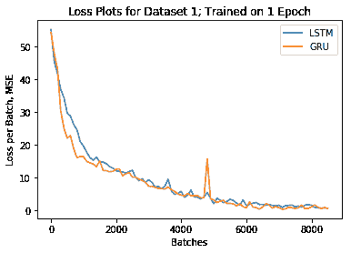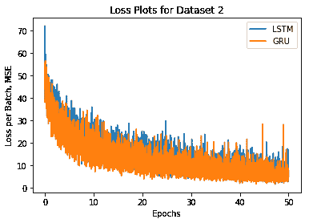

# 示例翻译和可视化注意力

**示例翻译:简单数据集**

在数据集上训练模型一个时期后，两个版本都非常准确地产生了正确的翻译。然而，这些模型似乎没有利用注意力来翻译这些序列。以下是输出序列中每个项目的注意力权重的 3 个翻译和可视化示例。看下面的例子，注意力权重不一定是随机的，但是注意力并不在人们所期望的单词上。

示例 1

```
Input Sentence: californie est sec en janvier , mais il est généralement occupé en mars . </s> Target Sentence: california is dry during january , but it is usually busy in march .</s> LSTM model output: california is dry during january , but it is usually busy in march . </s> GRU model output: california is dry during january , but it is usually busy in march . </s>
```

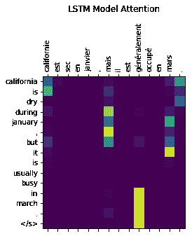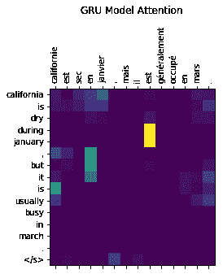

示例 2

```
Input Sentence: new jersey est généralement chaud en juin , et il est parfois merveilleux en hiver . </s> Target Sentence: new jersey is usually hot during june , and it is sometimes wonderful in winter .</s> LSTM model output: new jersey is usually warm during june , and it is sometimes wonderful in winter . </s> GRU model output: new jersey is usually hot during june , and it is sometimes wonderful in winter . </s>
```

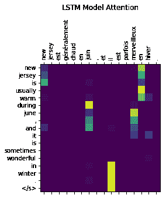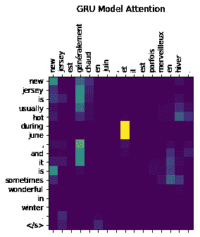

示例 3

```
Input Sentence: <unk> les fraises , les mangues et le pamplemousse . </s> Target Sentence: i like strawberries , mangoes , and grapefruit .</s> LSTM model output: i like strawberries , mangoes , and grapefruit . </s> GRU model output: i like strawberries , mangoes , and grapefruit . </s>
```

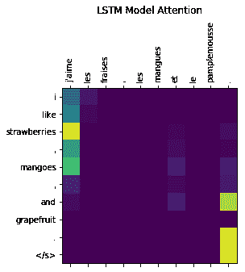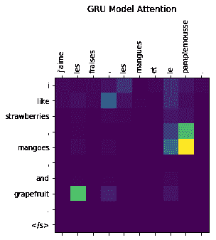

**示例翻译:更加多样化的数据集**

这些模型还能够正确翻译来自更多样化数据的句子。然而，训练时间要长得多，需要 50 个时期的数据才能得到合理的结果。下面可以看到几个例子。GRU 模型的注意力权重开始证明该模型正在使用注意力机制。然而，LSTM 模型似乎仍然没有学会或利用注意力。这可能是由于 LSTM 对保持长期依赖性的单元状态的访问。注意力计算可能没有为模型提供足够有用的信息来优先学习用于注意力计算的更好的参数。

示例 1

```
Input Sentence: jai perdu mon intérêt pour le golf </s> Target Sentence: ive lost interest in golf</s> LSTM model output: i lost my interest golf </s> GRU model output: ive lost interest in golf </s>
```

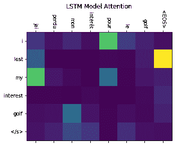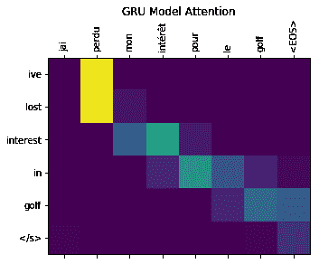

示例 2

```
Input Sentence: le livre était meilleur que le film </s> Target Sentence: the book was better than the movie</s> LSTM model output: the book was better than the movie </s> GRU model output: the book was better than the movie </s>
```

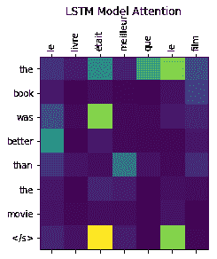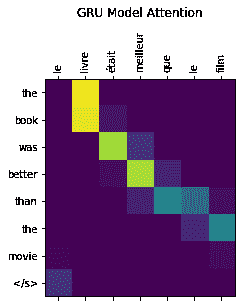

示例 3

```
Input Sentence: quel genre de trucs <unk> le weekend </s> Target Sentence: what sort of things do you do on weekends</s> LSTM model output: what sort of things do you do on weekends </s> GRU model output: what sort of stuff do you do on weekends </s>
```

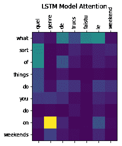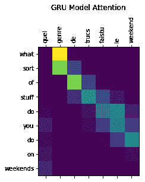

# 摘要

这个模型架构能够成功地翻译两个测试数据集。GRU 模型表明，注意力计算允许该模型关注编码序列的不同部分。然而，目前还不清楚为什么 LSTM 模型似乎要么没有利用注意力信息，要么以不同于 GRU 模型的方式使用信息。如果有更多的时间，研究为什么会观察到这种效应会很有趣。如果使用具有更长序列的数据集，这种影响还会存在吗？将该模型与没有注意力的简单编码器-解码器网络进行比较，并且观察在什么情况下注意力模型会优于简单模型(如果有的话)也是有趣的。

所选择的架构也与本项目遵循的 Pytorch 教程中的模型略有不同。这个项目使用的模型允许对示例进行批处理，而原始教程中的模型是为了一次处理一个序列而构建的。因此，原始模型不必处理填充输出。人们可能会认为批处理将通过并行化训练周期来改进训练时间。然而，声称原始模型在 CPU 上的训练时间约为 40 分钟，而这个项目中使用的模型在 GPU 上的训练时间接近 12 小时，以获得良好的翻译。

有几个改进可能会解决这种差异。首先，PyTorch 有一个处理填充序列的内置函数，这样循环单元格就看不到填充的项目。这可能会提高模型的学习能力。其次，第二个数据集没有被标记化。标点符号刚刚被删除，这可能导致一些单词在转换为索引时无法识别。这将意味着它们被未知的标记替换，使得模型更难识别句子的内容。尽管还有改进的空间，但总的来说，该项目是成功的，因为该模型能够成功地将法语翻译成英语。

*原载于*[*macbrennan 90 . github . io*](https://macbrennan90.github.io/neural-translation-model.html)*。*

[](http://eepurl.com/dw5NFP)