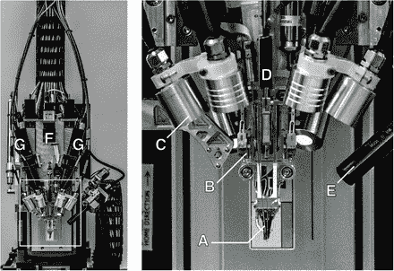
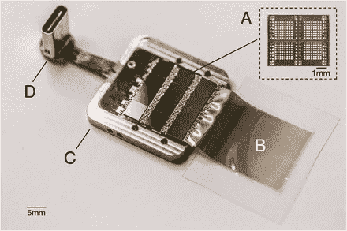
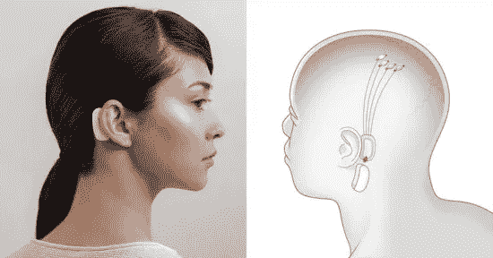
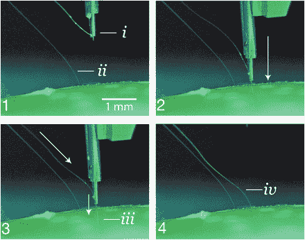

# Neuralink:通过人工智能增强人类智能

> 原文：<https://medium.datadriveninvestor.com/neuralink-enhancing-human-intelligence-through-ai-b6b46d2ed67b?source=collection_archive---------10----------------------->

人机交互一直是热门话题，具体来说是在[人工智能](http://bit.ly/AndroidMLCourses)问世之后。至少可以说，这种互动的社会影响是巨大的。人工智能经常从生物神经架构中获得灵感，足以完成大量任务，现在它也能够超越生物神经元[**【1】**](https://www.washingtonpost.com/business/economy/ais-ability-to-read-hailed-as-historical-milestone-but-computers-arent-quite-there/2018/01/16/04638f2e-faf6-11e7-a46b-a3614530bd87_story.html?noredirect=on&utm_term=.01481b9b6e72)。

已经有许多尝试[【2】](https://en.wikipedia.org/wiki/Brain%E2%80%93computer_interface)通过[脑机接口](http://bit.ly/AndroidMLCourses)或 BMIs[【3】](https://www.nature.com/subjects/brain-machine-interface)利用人工智能来增强人类的能力。从历史上看，将 BMI 集成到人类颅骨中是一个相当具有侵入性的过程。正常的程序通常需要一个完整的手术，颅骨被切开，电极插入脑组织，然后缝合在一起。这种手术不仅在本质上是侵入性的和复杂的，而且存在感染的风险，或者对于接受手术的人来说可能是中风的催化剂[【4】](https://www.bioedge.org/bioethics/elon-musk-and-his-neurotech-start-up-are-trialling-brain-decoding-implants/13147)。

 [## 模式和机器人:复杂的现实|数据驱动的投资者

### 哈耶克的名著《复杂现象理论》(哈耶克，1964)深入探讨了复杂性的话题，并断言…

www.datadriveninvestor.com](https://www.datadriveninvestor.com/2019/03/04/patterns-and-robotics-a-complex-reality/) 

## Neuralink 如此特别的原因:

Neuralink 研究了所有这些局限性，并根据其创始人和所有者 Elon Musk 的愿景，提出了一种解决方案，与现有技术相比，这种解决方案相对来说是非侵入性的，在程序上也更安全。为了更好地理解这一点，我们需要了解这个设置到底是如何工作的。这个想法背后的主要驱动力是植入大脑的电极的能力，以捕捉该区域神经元的活动，愿景是无线连接到一个小型设备，该设备足够小，可以放在耳朵后面，但又足够强大，可以捕捉和处理传入的数据。无线连接是通过大脑内部的微小植入物实现的。探针的注射器可以在下图中看到:

[https://www.biorxiv.org/content/biorxiv/early/2019/07/18/703801/F3.medium.gif](https://www.biorxiv.org/content/biorxiv/early/2019/07/18/703801/F3.medium.gif)
Robotic electrode inserter

下面的第二张图展示了用于制作全套设备的电子芯片组的大小，该设备带有 USB 连接，用于电源和数据传输等。将 [Neuralink](http://bit.ly/AndroidMLCourses) 与现有框架区分开来的另一个重要因素是用于捕捉神经元活动的电极数量。不足为奇的是，更多的电极在捕捉活动方面要好得多，因为它们能够覆盖更多数量的神经元。

The chipset for the wireless implant set
Source:[5]

## 离创造控制器官又近了一步？

与其他 BMI 相比，Neuralink 的愿景中一个有趣的方面是，Neuralink 设想了一个双向框架，据此我们不仅可以通过设备接收和解释[大脑模拟](http://bit.ly/AndroidMLCourses)，而且我们还可以通过反馈或外部环境的额外输入的形式实际模拟神经元，这可能是一种我们可以通过思考向机器传递命令的设置， 然后，机器可以给我们反馈，告诉我们它应该执行的任务的性质或状态。 一个简单的例子是一个断肢病人，他能够通过思考执行一项任务(比如拿一杯水)来连接到机器人手臂上，然后传感器可以从机器人手上的压力检测器发送反馈，控制器能够据此调整压力。

想象一下，仅仅通过思考或者在谷歌上搜索，仅仅通过思考，就能够计算出一个巨大的数字。这将提高知识吸收的速度，从而将人类带入一个新时代。我可以想象有一天我们能够仅仅通过思想就能相互发送即时消息。虽然这项令人惊叹的技术会拉近人们的距离，但它也会引发对黑客和隐私的担忧。反响可能从简单的隐私侵犯到大脑影响(早期精神控制)。

Neuralink device design.

## 程序

使其真正有效的程序是，根据我们上面的讨论，我们可以将[电极相对较少侵入地移植到大脑](http://bit.ly/AndroidMLCourses)中，从而降低由更多侵入性植入物引起的并发症的可能性。Neuralink 的插入器和针头采用了最先进的设计。考虑到人们对它的预期精度，它的庞大规模可能会令人困惑。下图展示了将电极线植入颅骨状结构的步骤的大小和逐步演示:

The injection process for the electrodes in steps
Source: [6]

## 摘要

总而言之，这个概念在今天来说是非常年轻的，它的可能性和最初的结果似乎非常有希望。如果我们能够做一些类似的事情，这将是一代人中的一次技术事件，我们将首次能够见证人机界面结合的非凡能力。这种协同作用实际上可以真正塑造未来，人类和机器的协同作用将增强我们的能力，模糊人工智能和自然智能之间的界限。

**参考文献:**

**1。**[https://www . Washington post . com/business/economy/ais-ability-to-read-has-as-historical-milestone-but-computers-arent-quit-there/2018/01/16/04638 f2e-fa F6-11e 7-a46b-a 3614530 BD 87 _ story . html？no redirect = on&UTM _ term = . 01481 B9 B6 e 72](https://www.washingtonpost.com/business/economy/ais-ability-to-read-hailed-as-historical-milestone-but-computers-arent-quite-there/2018/01/16/04638f2e-faf6-11e7-a46b-a3614530bd87_story.html?noredirect=on&utm_term=.01481b9b6e72)

2.[https://en . Wikipedia . org/wiki/Brain % E2 % 80% 93 computer _ interface](https://en.wikipedia.org/wiki/Brain%E2%80%93computer_interface)

3.[https://www.nature.com/subjects/brain-machine-interface](https://www.nature.com/subjects/brain-machine-interface)

4.[https://www . bio edge . org/bio ethics/elon-musk-and-his-neurotech-start-up-are-trilling-brain-decoding-implants/13147](https://www.bioedge.org/bioethics/elon-musk-and-his-neurotech-start-up-are-trialling-brain-decoding-implants/13147)

5.[https://www . bior XIV . org/content/bior XIV/early/2019/07/18/703801/F5 . medium . gif](https://www.biorxiv.org/content/biorxiv/early/2019/07/18/703801/F5.medium.gif)

6.[https://www . bior XIV . org/content/bior XIV/early/2019/07/18/703801/F4 . large . jpg？宽度=800 &高度=600 &传送带=1](https://www.biorxiv.org/content/biorxiv/early/2019/07/18/703801/F4.large.jpg?width=800&height=600&carousel=1)

7.[https://www . bior XIV . org/content/bior XIV/early/2019/07/18/703801/F3 . medium . gif](https://www.biorxiv.org/content/biorxiv/early/2019/07/18/703801/F3.medium.gif)