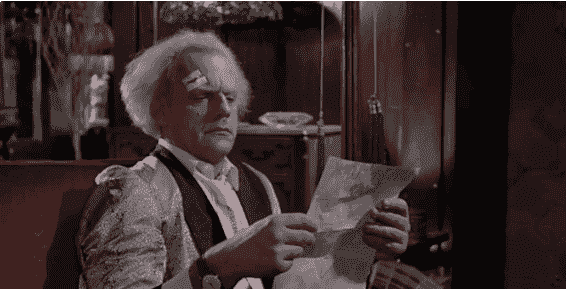
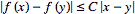
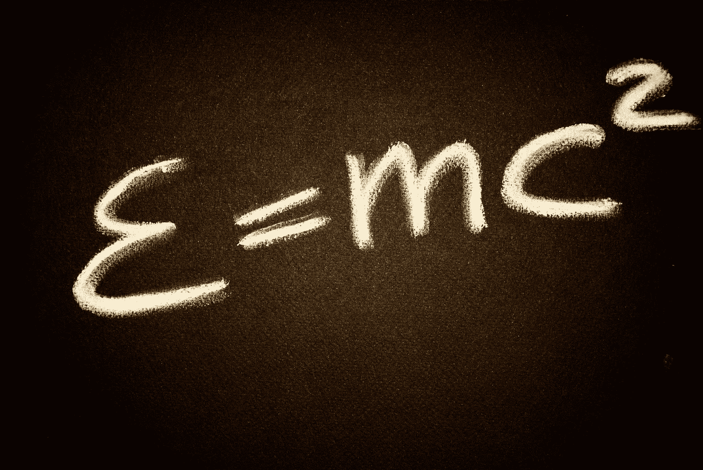
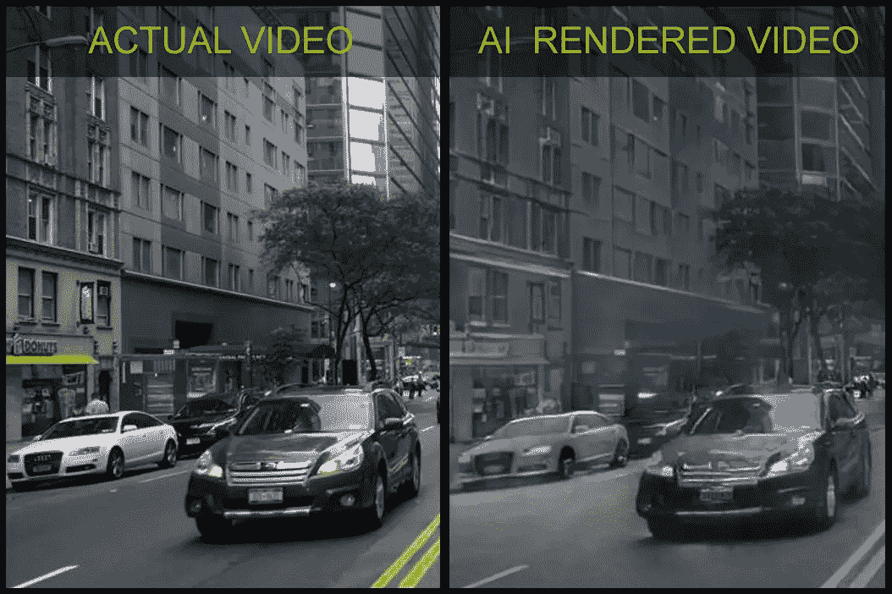

# NeurIPS Mad AI 科学家大会

> 原文：<https://medium.datadriveninvestor.com/neurips-mad-ai-scientists-convention-cd2ccb30b72f?source=collection_archive---------17----------------------->

在这篇文章中，我们将探索并了解一些令人惊叹的人工智能实验，如谷歌，英伟达和其他公司正在做的实验。我给你带来了在这个著名的会议上发表的最好和最酷的论文。

[There is an AI convention?](https://i.gifer.com/WZKo.gif)

NeurIPS 2018 于上周在蒙特利尔举行，这是第 32 届神经信息处理系统年度[会议](https://nips.cc/Conferences/2018)，这是今年迄今为止最大的机器学习会议。这是一个为期一周的会议，包括邀请演讲、演示和介绍一些最新的机器学习研究。

我渴望有一天能参加这样一个有声望的活动——这是一个挤满了书呆子的房子，他们是来自行业领先的**科技巨头**的最优秀和最聪明的人。

Capital **G** (代表 **Google** )在 **NeurIPS** 18 上的表现相当强劲，超过 400 名谷歌员工在那里通过演讲、海报、研讨会、比赛和教程为更广泛的学术研究社区做出贡献并向其学习——这是对人工智能社区的一个重大声明，因为**谷歌**处于机器学习的最前沿，并积极探索横跨理论和应用的该领域的几乎所有方面。

尽管谷歌的参与度更高，但另一方面，微软也不遗余力地投资，成为了此次活动的第二大赞助商。

科技巨头在**人工智能** (AI)上下了很大的赌注，并探索它在现实世界的应用，这在某种程度上对我来说是好事，因为它正在加速创新和发展。这项技术日益能够解决越来越多的现实问题。

现在最吸引人的是…

# 一些亮点

我首先要热烈鼓掌的是《时间的考验》的获奖论文，该论文被授予 [***大规模学习的权衡***](https://leon.bottou.org/publications/pdf/nips-2007.pdf) ，这是一篇 NIPS 2007 年的论文，作者是美国 NEC 实验室和谷歌苏黎世的研究人员。该论文开发了一个理论框架，考虑了近似优化对学习算法的影响。

今年简直太棒了，或者我应该说论文泛滥，提交审查的论文达到惊人的 4854 篇。保持他们去年的传统，根据这个[消息来源](https://github.com/lixin4ever/Conference-Acceptance-Rate)，去年提交的论文只有 20.8%被接受。今年大会共收到 1011 篇论文，分为 30 篇口头论文、168 篇专题论文和 813 篇海报。

# 最佳论文

***非妄想的 Q 学习和价值迭代*** 作者:泰勒·卢戴尔·舒尔曼斯·克雷格·鲍蒂利尔

> 根据这个[来源](https://en.wikipedia.org/wiki/Q-learning) *，****Q*-learning**是[机器学习](https://en.wikipedia.org/wiki/Machine_learning)中使用的一种[强化学习](https://en.wikipedia.org/wiki/Reinforcement_learning)技术。Q-learning 的目标是学习一个策略，它告诉代理在什么情况下采取什么行动。它不需要环境的模型，可以处理随机转移和奖励的问题，不需要适应。

以简单和抽象的方式，作者在 **Q-learning** 和其他形式的函数逼近动态规划中确定了一个基本的误差源。他们注意到基于 Q 的学习系统中的一些病理行为高估/低估、不稳定甚至发散。当近似架构限制了可表达的贪婪策略的类别时，一个妄想性偏见出现了。Q-更新对于可表达的策略类做出全局不协调的动作选择，可能导致不一致甚至冲突的 Q 值估计，从而导致病态行为。

为了解决这个问题，他们引入了一个新的概念**策略一致性**，并定义了一个**本地备份过程**，通过使用信息集来确保全局一致性，这些信息集记录了与备份 Q 值一致的策略约束。他们证明，使用这种备份的基于模型和无模型算法都消除了错觉偏差。

尽管存在这些挑战，Q-learning 仍然是应用强化学习(RL)的主力。

*(更多信息你可以在这里找到全文* [***论文***](https://papers.nips.cc/paper/8200-non-delusional-q-learning-and-value-iteration) *)*

***网络中非光滑分布优化的最优算法***
作者:Kevin Scaman Francis Bach Sebastien bu beck Laurent massouliéYin Tat Lee

以简单和抽象的方式，作者考虑使用计算单元网络的非光滑**凸函数**的分布式优化。

> 根据这个[来源](https://en.wikipedia.org/wiki/Convex_function)，**凸函数**在数学的很多领域都扮演着重要的角色。它们在研究[优化](https://en.wikipedia.org/wiki/Optimization)问题时特别重要，因为它们有许多方便的特性。例如，开集上的(严格)凸函数只有一个最小值。

他们主要在两个正则性假设下研究这个问题:(1)全局目标函数的 **Lipschitz** 连续性，和(2)局部个体函数的 **Lipschitz** 连续性。在局部正则性假设下，我们给出了称为多步原始对偶(MSPD)的第一个最优一阶分散算法及其相应的最优收敛速度。在全局正则性假设下，他们提供了一种简单而有效的算法，称为分布式随机平滑(DRS ),基于目标函数的局部平滑，并表明 DRS 在最优收敛速度的 d ^1/4 乘法因子内。

> 据本[网站](http://mathworld.wolfram.com/LipschitzFunction.html)介绍，一个函数 f 称为**李普希兹函数** if for all **x** 和 **y** ，其中 ***C*** 是一个独立于 **x** 和 **y** 的常数。

***分布式优化在机器学习中有许多应用，例如当数据集很大并且使用计算单元的集群来实现训练时。***

*(更多信息你可以在这里找到全文***)**

****通过样本压缩方案学习高斯混合的近乎严格的样本复杂度界限***
作者:Hassan Ashtiani Shai Ben-David Nick Harvey Christopher Liaw Abbas Mehrabian Yaniv Plan*

**

*本文的作者证明了θe(KD/ε)样本是学习ℝᵈk 高斯混合样本的充要条件，在总变差距离上达到误差ε。这改进了这个问题的已知上界和下界。*

> *根据 [Scikit-learn](https://scikit-learn.org/stable/modules/mixture.html) 的网站(Python ML library)**高斯混合模型**是一种概率模型，它假设所有的数据点都是从具有未知参数的有限数量的高斯分布的混合物中生成的。人们可以将混合模型视为推广 k-means 聚类，以纳入关于数据的协方差结构以及潜在高斯中心的信息。*

*使用基于压缩概念的分布学习的新技术示出了上限。允许这种压缩方案的任何类别的分布也可以通过几个样本来学习。此外，如果一类分布具有这样的压缩方案，那么这些分布的乘积类和混合类也是如此。*

***根据观测数据估计分布是统计学中的一项基本任务，已经研究了一个多世纪。这项任务经常出现在应用机器学习中，并且通常假设该分布可以使用高斯混合近似建模。***

**(更多信息你可以在这里找到全文***)***

*****神经常微分方程***
作者:田陈琪**

****

**这篇论文非常有趣，作者介绍了一类新的深度神经网络模型。**

**有意思，但是你怎么问呢？**

**他们使用神经网络参数化隐藏状态的导数，而不是指定隐藏层的离散序列。使用**黑盒微分方程**解算器计算网络的输出。这些连续深度模型具有恒定的内存成本，使它们的评估策略适应每个输入，并且可以明确地用数值精度换取速度。**

**他们在**连续深度残差网络**和**连续时间潜变量模型**中证明了这些性质。作者还构建了连续规范化流，这是一个可以通过最大似然进行训练的生成模型，无需对数据维度进行划分或排序。**

> **一个 [**残余神经网络**](https://en.wikipedia.org/wiki/Residual_neural_network) 是一种人工神经网络，它建立在从大脑皮层中的锥体细胞已知的结构上。残余神经网络通过利用跳过连接或捷径跳过某些层来做到这一点。**
> 
> **[**时间潜伏**](http://www.gatsby.ucl.ac.uk/teaching/courses/ml1-2014/lect4-slides.pdf) 变量模型用于对图像序列、股票价格、录音或音乐等时间序列数据进行建模**

**对于训练，作者展示了如何通过任何 ODE 求解器进行可伸缩的反向传播，而无需访问其内部操作。这允许在更大的模型中对 ode 进行端到端的训练**

**使用 ODE 求解器定义和评估模型有几个好处:**

*   **记忆效率**
*   **适应性计算**
*   **参数效率**
*   **可扩展和可逆的规范化流程**
*   **连续时间序列模型**

***(更多信息你可以在这里找到全文***)****

# **最酷的纸**

**上面这篇论文赢得了会议的头名，但对我个人来说，头名和最酷的论文是下面这篇:**

*****视频转视频***
作者:Nvidia**

****

**image from the Nvidia research website**

**好吧，这篇论文是我心中的第一篇，作者研究视频到视频合成的问题，其目标是学习从输入源视频(例如，语义分割遮罩序列)到精确描述源视频内容的输出照片级真实感视频的映射函数。**

**视频到视频合成方法是在生成对抗学习框架下进行的。通过精心设计的生成器和鉴别器，再加上一个时空对抗目标，我们在一组不同的输入格式(包括分段遮罩、草图和姿态)上实现了高分辨率、照片般逼真、时间上连贯的视频结果。**

**对我们的视觉世界的动态进行建模和再造的能力对于构建智能代理是必不可少的。除了纯粹的科学兴趣，学习综合连续的视觉体验在计算机视觉、机器人学和计算机图形学中有广泛的应用。**

**想象一下由人工智能生成并模仿真实世界的整个游戏世界，这项技术在游戏行业和特别是 Q-learning 技术中有着未来，因为代理可以用更少的真实数据进行训练，而不需要创建整个环境。**

***(更多信息你可以在这里找到全文***)****

# **最后一点**

**感谢您的阅读。如果你有任何其他我可能没有想到的很酷的论文，请在下面的评论区分享你的想法和评论，或者发推特给我[https://twitter.com/CanumaGdt](https://twitter.com/CanumaGdt)。**

**如果你喜欢并认同这篇文章，请给我**点掌声**👏👏 👏(+50)和**分享给你的朋友**。**

**如果你想和我一起探索数据丛林，请跟我来。:D**