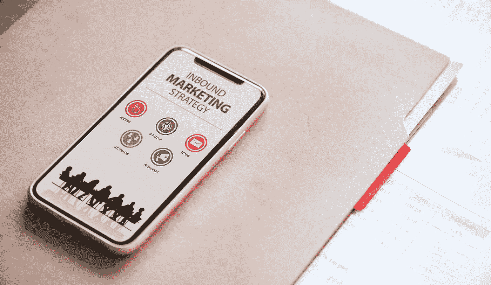

# 神经营销和广告的未来

> 原文：<https://medium.datadriveninvestor.com/neuro-marketing-and-the-future-of-advertising-a396e9c5cb22?source=collection_archive---------12----------------------->

“white iPhone X” by [rawpixel](https://unsplash.com/@rawpixel?utm_source=medium&utm_medium=referral) on [Unsplash](https://unsplash.com?utm_source=medium&utm_medium=referral)

当今世界在科技上比过去任何时候都要先进得多。因此，营销技术也变得越来越先进也就不足为奇了。​

神经营销可能是当今最前沿、最科学严谨的营销方法。Erica Dube 描述了如下方法，

> *“利用 fMRI(功能性磁共振成像)包括在受试者对音频和视觉提示做出反应时，使用强大的磁铁来跟踪大脑的血流。这使得审查员能够进入大脑中被称为‘快乐中心’的深层部分，并让营销人员了解人们对其工作的真实反应。”(1)*

研究人员也可以使用脑电图(更好的说法是 EEG)，这是一种便宜得多的替代方法。功能性核磁共振成像通常每台机器每小时花费 1000 美元。然而，脑电图有一些缺点，最明显的是，它“不允许进入大脑深处‘快乐中心’所在的地方。”​

尽管不考虑具体的技术，神经营销研究比传统的评估顾客如何感知产品的方法有一些主要的优势。的确，它与决策方法论[移情设计](https://www.andrewsyrios.com/home/how-the-empathic-design-method-of-decision-making-works)有一些共同的特征。提出移情设计的多萝西·伦纳德和杰弗里·雷波特指出，公司用来找出顾客真正想要什么的更传统的焦点小组和调查方法有许多缺点，

> *“设计一种市场研究工具是极其困难的，这种工具既要经得起定量分析，又要足够开放，以完全捕捉客户的环境。市场研究人员不得不应对受访者试图通过提供预期答案来取悦询问者的倾向，以及他们通过不透露他们怀疑可能被认为不合适的做法来避免尴尬的倾向。设计调查、组织焦点小组和采访客户的人会不经意地——不可避免地——在提问中引入他们自己的偏见，从而进一步模糊结果。”②*

另一方面，移情设计强调，研究人员应该在顾客的“自然环境”中观察他们，以实际发现他们想要什么，为什么想要它，以及一般来说是什么让他们这样做。神经营销可以被视为这一过程的下一次演变。但是，研究人员现在不是简单地观察顾客，而是观察他们的顾客大脑内部发生了什么。

作为客户如何经常报告虚假事情(即使他们认为这是真的)的一个例子，*神经科学杂志*最近的一篇文章发现，虽然客户报告视频给了他们更高的情绪反应，但生物统计数据实际上发现音频给了他们更高的情绪反应。(3)

神经营销的一些用途非常简单。例如， *Impact* 指出，“像金宝汤、嘉宝和菲多利这样的品牌已经使用神经营销来重新设计他们的包装设计。”(4)要求顾客一次看一件产品的包装，并记录他们对包装的感受。这是结合深度访谈和功能性核磁共振扫描来观察的。

产品包装的每一部分，从它的颜色，文字大小，图像，纹理等。进行了评估。例如，Frito-Lay 发现，印有薯片图片的闪亮袋子会受到负面评价，因此他们重新设计了包装。如果说你在商学院很快就能学到什么的话，那就是在商业领域，没有什么是偶然的。

神经营销发现的其他一些广泛的结果是，简单的字体和简单的信息会鼓励行动。正如 *Brainfluence，*的作者罗杰·杜利指出的，“如果你需要说服顾客、客户或捐赠者完成某种任务，你应该用简单、易读的字体描述这项任务。”此外，已经确定人们会看广告中的一个人在凝视什么。这是引导人们关注行动号召的有效方式。

此外，免费试用和特别优惠已被证明可以建立客户或潜在客户的信任。而且，正如所料，微笑对提高品牌的认知度和建立消费者的信任大有帮助。广告中的人应该总是(或者至少几乎总是)面带微笑。这些发现也可以给广告商一个“你不应该”的清单。例如，哥伦比亚大学的一项研究表明，如果消费者有太多的选择，实际上可能会阻止消费者。这将是“保持简单”口号的另一种变体，神经营销已经证明了这一点的重要性。(6)事实上，广泛的调查结果相当多。其他发现包括，人们对损失的厌恶远远大于对收益的渴望。因此，举例来说，大多数人宁愿赌 50 美元而不是 500 美元，即使支出也分别是 50 美元和 500 美元。或者仅仅是简单的发现，比如顾客喜欢快速高效的产品。(7)正如人们所料，神经营销也存在严重的伦理问题。总的来说，市场营销经常被批评为旨在操纵而不是告知大众。人们只需看看政治广告就能证明这一点。无论你站在政治的哪个角度，都很容易看到诸如“让美国再次伟大”或“希望和改变”这样的口号在客观上并没有什么意义。但是他们显然与选民产生了强烈的情感共鸣。著名的研究人员已经注意到，人类的思维并不像计算机一样运作。甚至不是特别理性。例如，巴瑞·亚当斯总结了受人尊敬的心理学家乔纳森·海特的观点，他“……使用大象和骑手的比喻，大象体现了我们的潜意识，而骑手，我们的意识，只能以小的方式影响大象的大方向。”(8)诺贝尔经济学奖得主丹尼尔·卡内曼和阿莫斯·特沃斯基对第一类思维(自动的和本能的)和第二类思维(彻底的和理性的)进行了类似的类比。人们对 1 型思维的依赖远远多于 2 型思维。(9)​

巴瑞·亚当斯总结了这种知识是多么容易被恶意利用，

> 随着神经科学对人类大脑工作方式的确切发现——特别是我们大脑的潜意识部分是如何被我们的意识意识所不知的方式影响、操纵和强迫的——我们越来越多地看到营销行业接受这项研究，并将其用于更有效的营销和广告。
> 
> *“以‘激发’的概念为例——通过让你的客户接触特定的触发因素来影响他们的行为，这些触发因素旨在鼓励他们采取令人满意的行动。一个例子是，有多少快餐店被设计成有不舒服的座位、明亮的照明和大量的噪音，以便鼓励快餐顾客快速消费他们的食物，并为下一个顾客腾出座位。”(10)*

这只是神经营销如何被用来操纵消费者的冰山一角。神经营销的意识正在增长，人们开始意识到自己的偏见并试图抵消它们，这是一件好事。这可以减轻一些更麻烦的影响。但是，即使人们理性地了解一些事情，也不意味着他们会理性地行动。每个人都知道吸烟对你有害，但是人们仍然继续吸烟。即使是那些不会让人上瘾的东西，比如赌博，仍然有很多人会违背他们的最大利益。神经营销可以(也确实)激励人们继续以这些破坏性的方式行事。话虽如此，神经营销绝不是简单的坏。科学已经帮助营销者更好地接触他们的顾客，生产者更好地设计他们的产品来吸引顾客真正想要的东西。Dorothy Leonard 和 Jeffrey Rayport 举了一个又一个例子，说明公司如何改进他们的产品，从而改善他们的客户对移情设计的体验。神经营销的突破也应该如此。但这并不意味着神经营销提出的一些更严重的问题应该被简单地掩盖起来。不幸的是，在监管方面没有明显的解决方案。你如何规范特定的营销方式？或者监管应该只是针对特定的产品(正如监管者禁止烟草公司在电视上做广告时所做的那样)？可能需要一些这种性质的规则。也就是说，政府可能不是监管神经营销的最佳机构，因为如上所述，两党的政治家都非常有效地利用了它。

1.  艾丽卡·杜贝，“神经营销 101:什么是神经营销，公司如何使用它？”*影响*，2017 年 9 月 7 日，【https://www.impactbnd.com/blog/neuromarketing】T4
2.  Dorothy Leonard 和 Jeffrey F. Rayport，“通过移情设计激发创新”，*《哈佛商业评论》*，1997 年 11-12 月号，[https://HBR . org/1997/11/Spark-Innovation-Through-Empathic-Design](https://hbr.org/1997/11/spark-innovation-through-empathic-design)
3.  罗杰·杜利(Roger Dooley)，“研究:在音频与视频中宣布的赢家对于情感”，*神经科学杂志*，2018 年 10 月 9 日访问[https://www . neuroscemarketing . com/blog/articles/Audio-vs-Video . htm](https://www.neurosciencemarketing.com/blog/articles/audio-vs-video.htm)
4.  艾丽卡·杜贝，“神经营销 101:什么是神经营销，公司如何使用它？”*影响*2017 年 9 月 7 日[https://www.impactbnd.com/blog/neuromarketing](https://www.impactbnd.com/blog/neuromarketing)
5.  罗杰·杜利， *Brainfluence* ，第 26 章，威利，2011 年 11 月，[https://www . Amazon . com/brain fluence-说服-说服-消费者-神经营销/dp/1118113365/ref=sr_1_1？ie = UTF8&qid = 1539118758&Sr = 8-1&关键字=brainfluence](https://www.amazon.com/Brainfluence-Persuade-Convince-Consumers-Neuromarketing/dp/1118113365/ref=sr_1_1?ie=UTF8&qid=1539118758&sr=8-1&keywords=brainfluence)
6.  菲利普·马勒，“神经营销在行动中的 15 个强有力的例子”， *IMotions* ，2017 年 3 月 7 日，[https://imotions.com/blog/neuromarketing-examples/](https://imotions.com/blog/neuromarketing-examples/)
7.  [https://imotions.com/blog/neuromarketing-examples/](https://imotions.com/blog/neuromarketing-examples/)
8.  巴瑞·亚当斯，“周五评论:营销的十字路口——神经营销的伦理*，“数字的状态*”，2014 年 2 月 21 日，[https://www . stateofdigital . com/Crossroads-Ethics-of-neuro Marketing/](https://www.stateofdigital.com/crossroads-ethics-of-neuromarketing/)
9.  参见丹尼尔·卡内曼，*思考的快与慢*，法勒，斯特劳斯和吉鲁，2013 年 4 月，[https://www . Amazon . com/Thinking-Fast-Slow-Daniel-Kahneman/DP/0374533555](https://www.amazon.com/Thinking-Fast-Slow-Daniel-Kahneman/dp/0374533555)

*原载于*[*www.andrewsyrios.com*](https://www.andrewsyrios.com/home/neuro-marketing-and-the-future-of-advertising)*。*