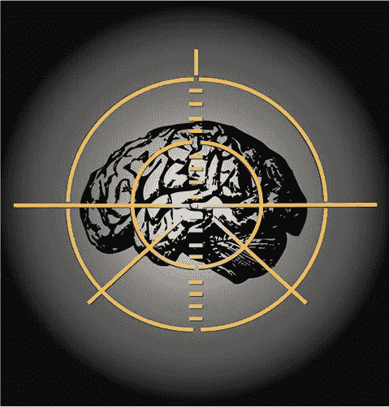
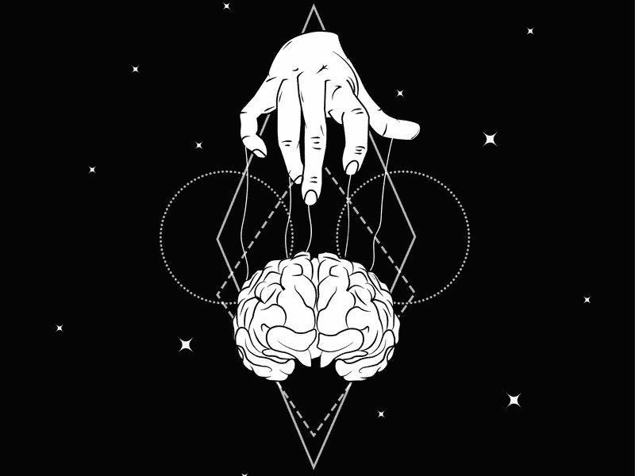
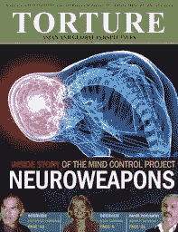
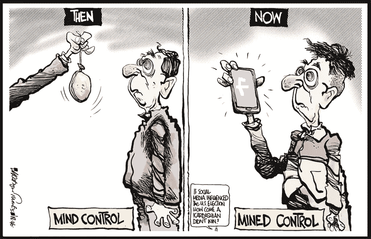
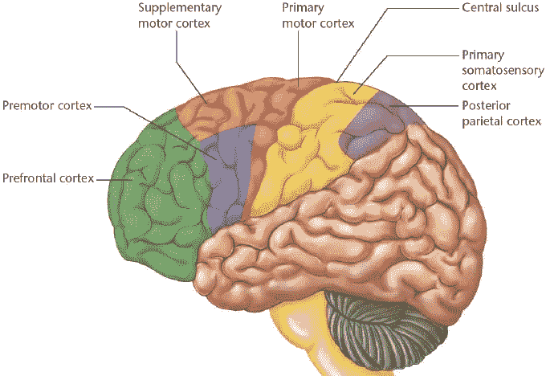

# 应用于军事工业的神经技术:存在于我们家中的隐形战争

> 原文：<https://medium.datadriveninvestor.com/neurotechnology-applied-to-the-military-industry-the-invisible-war-that-resides-in-our-homes-feec1747101e?source=collection_archive---------4----------------------->

Google images

葡萄牙语

> *“新技术本身没有善恶之分。这完全取决于人们如何选择使用它。”*

*——黄大卫*

在我们的日常生活中，经常听到或读到对人类大脑或思维的研究如何帮助识别、揭示甚至治疗疾病或精神疾病。神经科学可能是作为神经外科医生操作和治疗病人的人类知识的伟大工具而诞生的，但今天这门科学渗透了人类知识的其他层和应用。

 [## 我们为军事人工智能做好准备了吗？数据驱动的投资者

### 今天，算法可能会以迷人的形状出现，例如索菲亚，一个态度可爱、开明的机器人…

www.datadriveninvestor.com](https://www.datadriveninvestor.com/2019/02/21/are-we-ready-for-military-ai/) 

你可以发现神经科学被应用于营销(神经营销)、体育、人力资源、替代疗法、人工智能，并且像神经科学一样快速发展，与如何创造其神经技术的新的创造性形式联系在一起。

> 神经技术正在应用并深刻影响我们生活的一个市场是军事工业

在媒体上，如何制造神经安全和神经武器已经成为政府和军事机构所谓的现代战争的战略领域。

Google images

曾经权力是关于支配资源、土地、技术竞赛、经济市场，现在世界上的一些机构很清楚，权力和武装冲突的边界是关于人类的思想。掌握意识形态、文化、思想将导致对土地、资源、市场、政治和技术创新的控制。这是因为人类，他们的思想，以一种分散的方式创造了生态位并调节着这个星球上权力的每一个方面。

神经工程的进步已经产生了一代工具，如神经成像、 [EEG](https://www.brainlatam.com/products/eeg) 、[神经刺激器](https://www.brainlatam.com/products/brain-stimulation)、[神经假体装置](https://www.brainlatam.com/products/response-devices)、神经遗传学和药物，使用户能够理解、定义、预测和控制人类认知、情感和行为[1]。

军事应用的核心在于神经技术可以影响人性的想法。然而，他们被视为群体，而不是把人作为个体对待。它考虑到它们产生的文化中，群体在给定的空间、时间和/或虚拟环境中具有特征、知识水平、态度、价值观和行为，这些特征和行为表征了每个群体的生物、心理和社会维度及功能[2]。

研究员詹姆斯·乔达诺在他的演讲中非常恰当地谈到了这个主题:

神经武器或神经安全方法应该能够提供技术和工具，这些技术和工具被设计用于访问、评估和瞄准神经基底，这些神经基底可以利用和影响基本的人类认知、情感和行为，用于攻击、冲突和战争。

Google images

这些技术的例子很广泛，在一个小样本中，可以列举如何获得更好的学习和军事情报[3]，通过对士兵使用头盔作为硬件的神经刺激在战场上采取行动的新方法，以提高他们在无法入睡的策略中的注意力和警惕性[4]，使用超声波在值勤士兵中引起精神混乱和不适[5，6，7]以及引起疾病或诱发疲劳行为的神经微生物剂[8]。

从这个意义上来说，我将重点关注一系列发展，这些发展深入到我们的家庭，并正在成为一种世界范围的现象，假新闻和带有针对性情感指控的信息。你一定想知道…

> fakenews 是神经武器吗？虚拟新闻怎么能算武器？

想象你身体的每个器官都有一个基本的功能。大脑(神经系统)负责在你的全身接收、处理和发送信号。因此它是一种生物计算机，它的本质是计算，处理它的生物数据。

因此，我们可以推断，任何可以跨越人类感官的信息都能够影响神经系统，因为它是什么，重要性和功能性，信息处理。

一个无害的阅读，比如阅读“抑郁症”，或者在这种状态下观看带有人类表情的图像，会将负责这种意义的神经元招募到你的大脑网络中，但即使你没有意识到，它也会让你产生情感。这种情况的发生有很多原因，科学上称之为情感神经科学[9]。一个主要原因是细胞镜像机制，让你有同理心，理解他人是必要的，以镜像你生物学中的部分现实，到你的意识和自我[10]。

了解了这一点，让我们来看下面的场景:

想象一下，你登录 facebook 或 twitter，看到一篇简单的文章，让你惊醒或让你想起仇恨、攻击和不宽容的状态。在你的神经系统中，正在发生的事情是招募进化上古老的边缘系统，曾经被称为爬行动物的大脑。这个区域与本能和激情反应高度相关。

Google images

大脑中有一些区域，尤其是前额叶皮层，已经进化到抑制边缘过程。效用是让更多的逻辑决定从本能和激情的反应中脱颖而出。然而，在人类中也有相反的情况，这是神经营销如何影响其消费者基于情感做出决定的理论基础[11]。

当你的神经系统在一天内通过招募陈旧的仇恨、攻击和不容忍的途径(如假新闻)被喂给几次时，你的逻辑和决策能力会降低，你不仅更容易受到本能和更激情行为的影响，而且更容易接受违反逻辑的新信息[12]。

> 记住，现实[只是头脑](https://medium.com/datadriveninvestor/we-human-machines-hallucinate-our-reality-in-diluted-states-of-consciousness-90a15e94834d?source=friends_link&sk=dbd35bd809def5b8b5ba529be3db305c)的幻觉，一切都来自于它所感知和重建的。

Google images

Google images

以这样一种方式在世界各地，政治运动已经被战略性地破解。不考虑两极分化，就有可能使人类思维生态发生改变，转移位置，左变右，右变左。网飞发布了一部名为“大黑客”的纪录片，讲述了使用假新闻等信息控制许多国家选举过程的背景和冲突。

> 因此，你不需要在你的大脑中有一个工作的芯片来实现思想黑客场景，这正在许多层面的社会关系中发生，它们是已经存在了几千年的技术。

仅仅因为你走进一家商店，让销售人员探究你的动机、你的理由，并感知你的身体反应，如眼神、面部微表情和身体动作，就足以让他制定一个演讲策略或方法来改变你的思维，并通过逻辑推理或当买家被你发现有吸引力或引起某种亲近情绪时的热情来说服你购买。

Photo by Victoria Heath on Unsplash

最后，对我们的意识来说，重要的一课是，我们不仅需要培养物质方面的安全感，如在城市危险场所的手机，还需要培养精神方面的安全感，即所谓的神经安全感。在我们处理信息时，无论是产生、接收还是仅仅承认，都有必要培养一整套新的习惯和谨慎。

> “少看点新闻，多看点书……也许是时候让我们意识到，看更多关于我们周围世界的新闻并不是改善我们(或我们自己)个人或政治的方法。”

*-瑞恩假日*

随着技术的飞速发展，你需要注意改变你的传统。这些新习惯是未知的水域，前人没有探索过，需要我们注意去培养它们。请记住，这不是我们会被动得到的东西，因为它们已经控制了我们的被动，无意识的反应，当混乱来临时我们的本能。

> *“如果你想从根本上改变社会，你必须首先摧毁它。只有在你摧毁它之后，你才能根据你对新社会的愿景重塑它。”*

——*伟大的黑客，网飞*

**参考文献**

[1]神经技术进展:伦理、法律和社会问题；詹姆斯·佐丹奴，2014。

[2]神经技术、全球关系和国家安全:不断变化的环境和神经伦理需求；詹姆斯·佐丹奴，2014。

[3]《智能和训练应用中的神经系统》: Kay M. Stanney，Kelly S. Hale，Sven Fuchs，Angela(巴斯金)Carpenter 和 Chris Berka 科学、技术、伦理和政策杂志；2011.

[4]大脑边缘政策:设计着眼于战场、原则和战略的神经武器；罗伯特·麦克赖特；2015.

[5]国家安全和国防中的神经技术:实践考虑，神经伦理关注(神经技术进展)，第 1 版；2014.

[6]美国驻古巴大使馆遭声波武器袭击的疑团加深；《卫报》；2016.

[7]是对美国外交官的隐形攻击，还是其他什么奇怪的事情？；丹·赫尔利；《纽约时报》；2019.

[8]“neur int”和神经武器国家情报和国防中的神经技术；雷切尔·伍尔兹曼和詹姆斯·乔尔达诺；2011.

[9][https://en.wikipedia.org/wiki/Affective_neuroscience;](https://en.wikipedia.org/wiki/Affective_neuroscience;)acessado em 2019。

[10]情感神经科学对意识科学意味着什么；莱昂纳多·费雷拉·阿尔马达、小阿尔弗雷多·佩雷拉和克劳迪娅·卡拉拉-奥古斯汀堡；2013.

[11]神经营销作为营销工具的潜力；薇薇安·亚历山德拉·罗斯；2013.

[12]情绪和决策:多重调节神经回路；伊丽莎白·a·菲尔普斯、卡罗琳娜·m·伦佩特和彼得·索科尔-赫斯纳；神经科学年度评论；2014 年**。**

[发表在大脑支持神经科学上的博客](https://www.brainlatam.com/blog/neurotechnology-applied-to-the-military-industry-the-invisible-war-that-resides-in-our-homes-698)