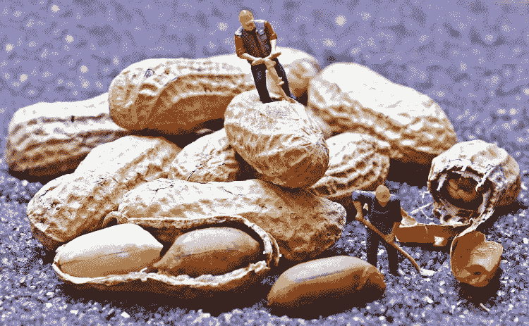
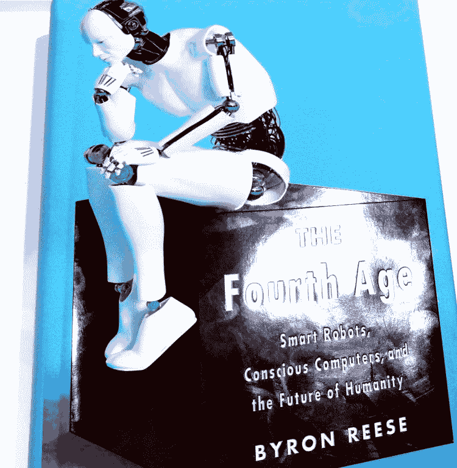
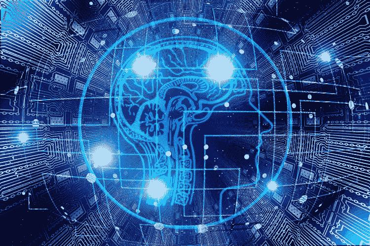
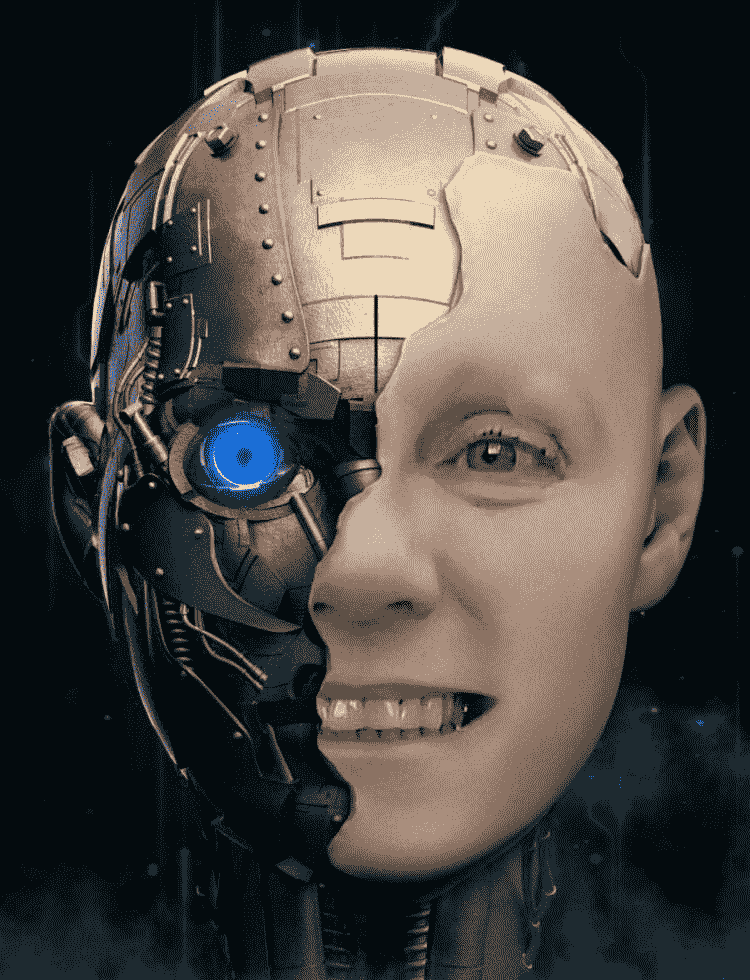
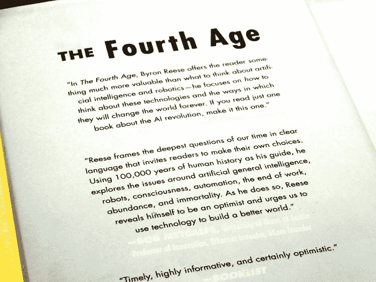
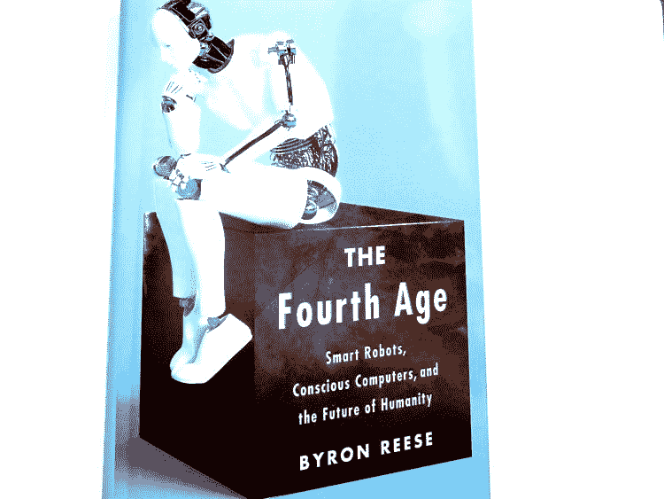

# 永不无聊的时刻:进入第四时代

> 原文：<https://medium.datadriveninvestor.com/never-a-dull-moment-entering-the-fourth-age-cc6fe2f62d07?source=collection_archive---------24----------------------->

我可能不是唯一一个注意到这些天自助服务机的增加和商店/银行/邮局人工收银台的减少，或者所有“智能”事物的普遍蔓延势头和机器人时代的到来的人。

我们都在主流媒体上听过这样或那样的关于机器人的故事——前几天有人给我看了一篇关于一个流行的 [*(我不记得它的名字了，一个看起来像真的活生生的有血有肉的人的女机器人 我认为是索菲亚)*](https://www.youtube.com/results?search_query=robot+with+passprt) 在它的“制造”地被授予了公民身份*(我假设)*——我想这意味着它可以像人类一样用护照出国旅行，然后再“回家”回到自己的祖国，有点像宠物……除了这个机器人是自主的。 想想吧…..👾

只是一个想法，人权，动物权利，计算机权利…..

[来源](https://pixabay.com/)

关于向职业运动员引入微芯片以找出有罪的药物作弊，以及使用人工智能来推进现代医疗保健，如由人脑控制的假肢，存在着争论——有用、有帮助而且是善意的！

想象一下，你可以简单地“想象”家里的灯亮着！！！！😳💡

当阅读现代科技各方面的进步时，人工智能(AI)和超人类主义等术语变得越来越常见；当然，5G 风靡一时，一切都变得“智能”、“数字”和无线。

这种聪明似乎是没有止境的。

我听说无人机很可能会取代大量人力来运送我们的网上购物*(当它们不在机场附近造成混乱时)。*显然，亚马逊已经准备好开始无人机送货，也就是“Prime Air ”,但并不是所有国家都准备好迈出这一步，并授权这种未来的方法…在授予许可和修改现有法规方面仍然存在问题。

也许我们应该回去建造带烟囱的房子，不是为了生火，而是作为无人机的投放点🏡

尽管普遍的第一印象是:更多的机器人=更少的人的工作，但有人强烈认为情况不会是这样的，我们只会发现不同的工作(或角色内的活动)取代了多余的工作。这只是一种进化。

另一方面，在某些工作不再需要人的地方，利润可能会增加并落入大老板和股东手中，很少或没有过滤下来。那么，第四时代对现有不平等的影响以及新的不平等的产生呢…..关于这一点，有很多社会学的东西值得思考！

对此的另一个观点是，不会有工作短缺，相反，是人类想有更多的钱来购买更多“想要的东西”的欲望推动了工作短缺的概念。人们可以选择靠更少的钱生存，工作更少的时间，把更多的工作留给其他人——但这将意味着牺牲他们已经习惯的标准(例如，名牌服装、旅游/度假、昂贵的汽车、外出就餐、私立学校费用等)。减少消费主义，为每个人提供更多的工作？

但是那些没有任何奢侈品，只能靠全职工作勉强度日的人呢？

[来源](https://pixabay.com/)

# 变化

世界在很短的时间内发生了迅速的变化，而且这种变化似乎会以更快的速度向前发展。

我注意到**【第四时代】**和**【第四次工业革命】**这两个词已经成为职场讨论中的热门词汇，在各种职业领域，当人们谈论职场的未来变化时也是如此。

第四时代不仅仅是工作场所，它可能会通过日常生活的各个方面影响每个人。

[来源](https://pixabay.com/)

# 深入

为了真正掌握第四时代的问题，你可能需要在一些基本问题上确立你的立场——你对世界和生活的价值观和信念。

在这本书里，里斯强调或者至少让你思考你是否看透了这个世界:

*   硬科学有色眼镜
*   二元论眼镜(物理/科学和精神现实的结合)
*   超越或结合其他镜头的精神/宗教变焦镜头。

思维和大脑似乎是两种不同的东西，但在许多方面，大脑对许多现代科学来说仍然是一个复杂的谜——那么任何机器人如何才能真正竞争呢？

灵魂呢？👀

拜伦·里斯在他的书《第四时代》中探讨了这些主题。

正如里斯正确指出的那样，我们对生命、人类和整个宇宙的感知和理解方式，很可能会影响我们对人工智能和我们今天正在经历和预期的技术快速进步的看法。

不管我们个人的观点如何，人工智能运动在当今世界是一个不断发展的现实。

[来源](https://pixabay.com/)

# 至少可以说发人深省！

这本书里肯定有一些令人瞠目结舌的陈述、事实和假设性问题——它肯定会引发一些有趣的思考和对话:

计算机能感觉到疼痛吗？它们能变得有意识吗？💻

机器人会进化到能够自我计算、独立思考、装载互联网上所有可用信息甚至更多信息的地步吗？

“AGI 可以以光速创造出更好的版本，而人类只能以生命的速度进步…… 他们将拥有超级智慧 *…。它可能远远领先于我们，就像我们领先于蚂蚁一样"* pg 184。哇！！我们在玩什么？

*“一旦机器达到能够自我进化的关键阶段，我们无法预测它们的目标是否会和我们一样”*斯蒂芬·霍金 pg。183.

世界各地的军队都在努力制造越来越好的杀手机器人，这难道不是一个可怕的想法吗？如果他们的程序出了故障，开始攻击无辜的人怎么办😬

网上有一些关于所谓人工智能机器人的故事，听起来非常牵强——即实验室中的军用机器人攻击实验室中的科学家——即使其中一个已经被拆除——机器人据称可以与卫星通信并在没有任何人类干预的情况下自我修复……这听起来不像是某种怪异地接近意识的东西吗？😯

如果人们开始对机器人产生情感依恋，而我们与人类之间的情感依恋开始减少，那会怎样？

那么，一个更超人类的人工智能路线怎么样……只要把一台计算机上传到人类的大脑中——当然，完美的和谐！！围绕这一点的争论表明，只有当计算机能够像我们思考和处理思想一样快地读取人类的思想并向大脑传递信息时，它才能发挥作用…..嗯，读心术就是读心术，读心术，更不用说尝试这样做可能会有潜在的风险，对人类物种的生物风险？

这个世界正在重新定义人类吗？里斯问了这个问题和本书中的许多其他问题——老实说，一旦你开始听到更多关于它的内容，你就会开始意识到第四时代正在走一条多么复杂的道路，而且是一条大胆而雄心勃勃的道路。

在本书中，作者提供了一个迄今为止的时代的视角——第一个时代(火和语言)，第二个时代(农业和城市)，第三个时代(文字和车轮)，随后是对手头问题的探索，第四个时代。这本书更倾向于学术教科书的倾向，对各种理论家进行的研究进行了描述——但每章的主线都很容易抓住📖

我敢肯定有无数本关于这个主题的书，我只是碰巧看到这本。

[来源](https://morguefile.com/photos)

# 乌托邦和反乌托邦合二为一？？？

像大多数事情一样，技术进步肯定有利弊——一些人认为这是更美好世界的答案，其他人(包括我自己)对这种新方式有点紧张，特别是考虑到故障甚至滥用超级技术的可能性——也许有一个中间地带……还是我们慢慢越界了？

# 牵强？

当你阅读这个主题时，你会情不自禁地觉得我们周围的世界正在迅速变成我们曾经认为仅限于科幻电影的一切📺

# 让我思考…..

当前的辩论激烈而混乱，来自截然相反的观点——在这个问题上有太多的变量需要考虑，这是一个雷区。整个运动似乎是由良好的意图铺成的，但无疑问题比答案多*(正如歌曲所唱)*并且有许多我们无法预见的，我们只能冒险并希望最好的——我感觉这就是正在发生的事情。

*原载于 2019 年 1 月 13 日*[*【cherrylsblog.com*](https://cherrylsblog.com/2019/01/13/never-a-dull-moment-entering-the-fourth-age/)*。*