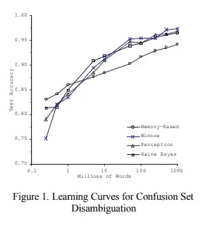

# 谷歌的 BERT 在定量交易算法中的新应用

> 原文：<https://medium.datadriveninvestor.com/new-applications-for-googles-bert-in-quantitative-trading-algorithms-63287d50903f?source=collection_archive---------1----------------------->

Though Google’s NLP models are primarily focused on improving language processing, the true capabilities of NLP AI span way beyond language.

今年，我一直在研究上下文学习 NLP A.I(在我的例子中是 Word2Vec)是否可以用来匹配股票市场中的模式。前提是这样的:既然 Word2Vec 可以通过学习哪些单词出现在哪些上下文中来理解哪些单词是相似的，那么 Word2Vec 可以通过相同的学习过程来理解股票市场中的哪些事件是相似的也是有道理的。

此时，我将“股市事件”定义为一只股票在一天内从开盘价到收盘价的%变化。随着我对结果的实验，这可能会发生变化，但我选择了这个，因为%变化捕捉了价格运动的幅度以及价格运动的方向，这两者对于定义股票市场中的事件都是至关重要的。

 [## 算法诱人的商业逻辑——数据驱动的投资者

### 某些机器行为总是让我感到惊讶。我对他们从自己的成就中学习的能力感到惊讶…

www.datadriveninvestor.com](https://www.datadriveninvestor.com/2019/03/22/the-seductive-business-logic-of-algorithms/) 

这个系统的另一个关键优势是% shifts 永远不会有同音异义的问题:真实的单词，比如' store '，可以有多个意思(“我去了商店”，“我需要存储这个项目”，“我有东西要给你”，Word2Vec 不知道这一点。相反，Word2Vec 和类似的嵌入系统将所有数据加载到单个嵌入中，并假设单词“store”在每个上下文中都具有相同的含义。对于%的价格变动，我们没有这个问题，因为+2.4%的含义是明确的。

Percent price shifts are unique in meaning, and therefore don’t have the problem of homonyms which can plague certain NLP models.

有趣的是，[谷歌人工智能的新 BERT 系统](https://ai.googleblog.com/2018/11/open-sourcing-bert-state-of-art-pre.html)，[我在几篇文章前](https://carpeventures.com/2019/01/07/oversaturation-of-trading-algorithms-to-blame-for-huge-market-rebound-bert-to-replace-word2vec-also-what-to-anticipate-going-into-2019/)提到过，我还在继续学习，它通过创建“分层”嵌入来处理同音异义词的问题。处理同音异义词是因为 BERT 使用变压器而不是递归神经网络(像 Word2Vec 中使用的 RNNs)。[变形金刚](https://arxiv.org/abs/1706.03762v5)首先像 Word2Vec 一样为句子中的每个独特单词创建嵌入。但是，相同的单词可以出现在不同的句子中(具有不同的上下文)，因此为了解决这个问题，[转换器然后为句子](https://mchromiak.github.io/articles/2017/Sep/12/Transformer-Attention-is-all-you-need/#.XE_kC1xKiUk)中的每个单词对创建嵌入，考虑这些单词在句子中彼此的接近程度。

例如，在句子“强大的尼米兹号在太平洋上燃烧，留下的只有铅和毁灭”，一个“单词对”嵌入是:(强大，太平洋)。这些单词出现在同一个句子中，因此它们是相关的，但是它们在句子中彼此不靠近(意味着低依赖系数)，因此这种“单词对”嵌入的影响相当弱。然后，这些“单词对”嵌入被分解到每个单词的主要嵌入中，因此,( mighty)的嵌入基于(mighty，Pacific)的嵌入进行调整。

这只是一个原始的例子，但它已经开始显示谷歌的 BERT 模型(以及所有使用掩蔽和变压器的 NLP 模型)如何能够为每个单词提供更深入的学习方法，这可能比顺序 Word2Vec 模型更有洞察力，该模型只从单词周围的小窗口学习，而不是它们出现的整个句子。

考虑到这些类型的模型有多新，BERT 和 NLP 转换器中仍有许多问题需要解决，但已经有人声称 BERT 为 NLP 的未来铺平了道路，因为它的多功能性，以及它如何通过掩蔽和转换器从较小的数据集提取更多信息。这里有一篇非常棒的文章，它更详细地介绍了 BERT 的一些技术组件，如果你有任何可能有帮助的类似文章，请发给我。

***排序问题(及解答)***

所以，回到我的主要观点，一旦我在股票价格数据上训练了我的 Word2Vec 模型，我就有了一个嵌入的数据集。出于训练目的，这个数据集是静态的，因为我们不必为我们拥有的历史股票数据不断更新嵌入，因为这些数字不会改变。另一个好处是，股票市场每天都会产生新的数据，我们可以定期考虑这些新数据，以更新我们的嵌入数据集。随着时间的推移，我们的神经网络应该变得更有经验和洞察力。

在神经网络中，更多的数据并不总是等于更好的结果，但 Banko 和 Brill 的[微软研究论文](https://www.aclweb.org/anthology/P01-1005)显示了各种 NLP 模型的学习曲线几乎与训练集大小成正比。

Larger training set leads to better accuracy across most NLP neural network models.

从神经学的角度来看，这也是有道理的，因为一个人的词汇量与他们接触的新词汇成比例增加(不过不要跑题)。

一旦我有了这个嵌入数据集，我就可以开始使用实时数据在我的数据集中搜索匹配。首先，有一个排序的问题:我们是否试图在 3 天内找到匹配？超过 1 天？超过 10 天？如果我们要寻找一只股票价格的相似%变化，如果我们发现两个单日变化在上下文上彼此相似，这可能不够显著，因为这是一个太小的时间窗口，无法从中推断出一个模式。同时，如果我们只寻找彼此匹配的 15 个连续嵌入的字符串(在这种情况下，这意味着 15 天，因为每个嵌入代表一天的%移位)，匹配将更有意义，但我们也可能永远不会找到两个彼此匹配的 15 天周期。这段时间太长了。

理想情况下，我们希望循环所有可能的可能性，这样我们就不会错过任何重要的模式。我在之前的一篇文章中提到了这个排序问题，现在这个排序问题有三个明确的解决方案:

1.  **遵循 Shazam 使用的指纹概念:**一旦找到两个匹配的嵌入(称之为 Q 和 D)，检查它们的邻居是否也匹配。也就是说，比较 Q+1 与 D+1、Q+2 与 D+2、Q+3 与 D+3、…、Q+n 与 D+n，其中“n”是您正在查看的最大窗口大小(注意:我们也希望比较 Q-1 与 D-1、Q-2 与 D-2、…)。这样，我们可以衡量我们正在观察的实时数据和历史股票价格嵌入之间的匹配程度，因为超过 4 天的匹配比超过 2 天的匹配更加重要和独特。匹配的程度将会影响到我们的置信度，我们的算法用它来决定我们是否找到了一个 alpha(盈利机会)。我正在努力将这个系统实现到我的算法中，因为它是最灵活的，因为你可以很容易地改变你的参数(n ),并且在进行过程中你不会对嵌入做任何改变。此外，我所有的股票价格变动都是按日期相互关联的，所以很容易访问 previous_embedding 和 next_embedding。
2.  **创建不同类别的嵌入:**创建不同类别的嵌入，代表不同的时间段。因此，您将有 1 天嵌入、2 天嵌入、3 天嵌入、4 天嵌入等等。这很容易做到，因为不是将一天内的价格变动视为一个单词，而是将 n 天内的一系列价格变动视为一个单词。您仍然可以比较这些嵌入来寻找匹配，但是您将有更多的数据要搜索。使用这种方法，我们也不必担心测序，因为所有潜在的序列都包括在内。我们可以使用通用语句编码器将价格变动序列(“语句”)转换为单个输入，甚至是 BERT 的语句嵌入功能来实现这一点。这是一个非常有趣的潜在方法，我会考虑实现它，主要是因为您可以从相同数量的数据中生成 10 倍以上的嵌入。这种方法的一个问题是，当一个 2 天的嵌入和一个 5 天的嵌入匹配时会发生什么，我马上就能看到这个问题。这是什么意思？这实质上意味着 2 天内的某个股价变化序列类似于 5 天内的某个股价变化序列。这当然很有趣，但我不知道如何看待这些信息(如果这些序列*占据不同的时间窗，它们真的*相似吗？).为了避免不必要的复杂化，我将在我的算法的第一次试验中避免这种方法，但它仍然绝对值得研究。
3.  **BERT Next _ Sentence predictor:**我在以前的博客文章中已经粗略地讨论过这个问题，但是 BERT 模型提供了一个函数，它将两个句子作为输入，然后决定第二个句子是否可以在逻辑上跟随第一个句子。这反过来处理排序问题，将实时数据作为输入，循环遍历可能的结果，以计算出哪一个最有可能发生。

这是我确定的解决测序问题的三个方案，我相信还有其他的解决方案，所以我将在接下来的几周继续研究这个问题。与此同时，我认为解决方案 1 是最可行的。

解决方案 3，包括使用谷歌的 BERT，看起来绝对是最有潜力的。我相信，随着 NLP 神经网络模型变得越来越复杂，无论是通过变压器还是其他学习方法，它们的应用将越来越广泛。交易算法只是这个发现和应用过程的第一步。

*你可以在这里阅读更多我在《原创交易策略》中对 NLP 的研究:*[*https://carpeventures.com。*](https://carpeventures.com/)