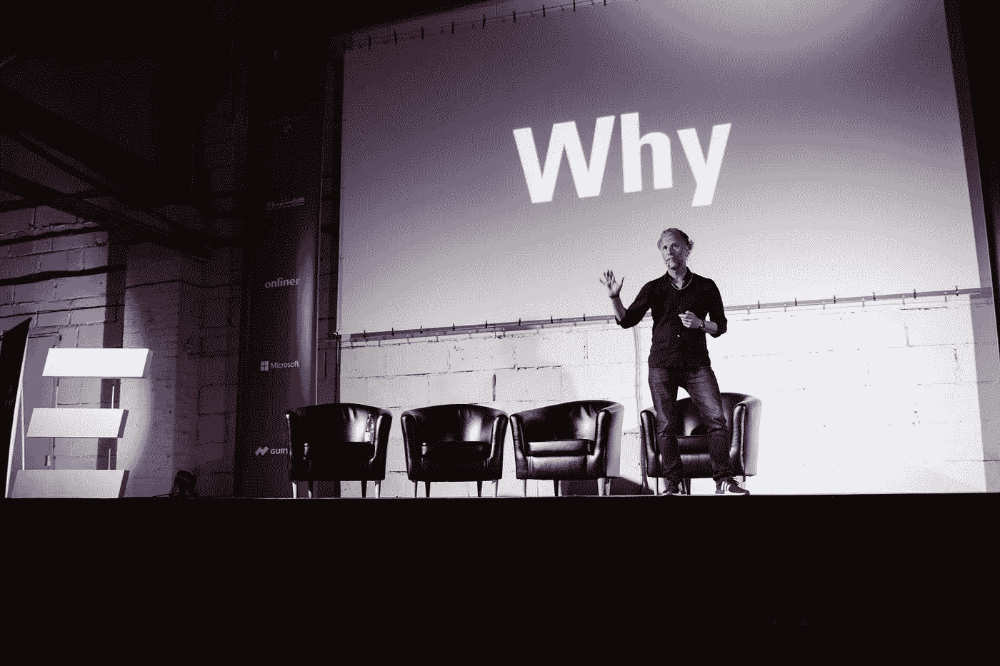
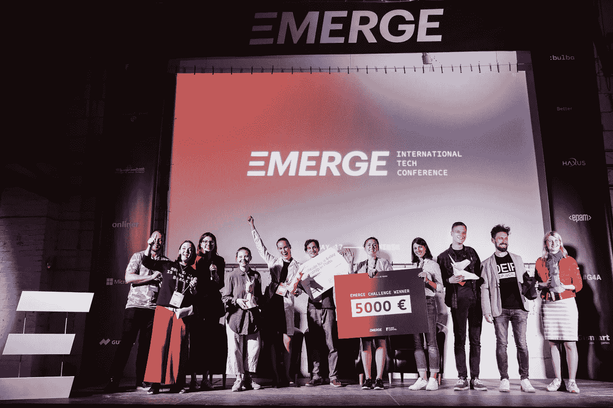
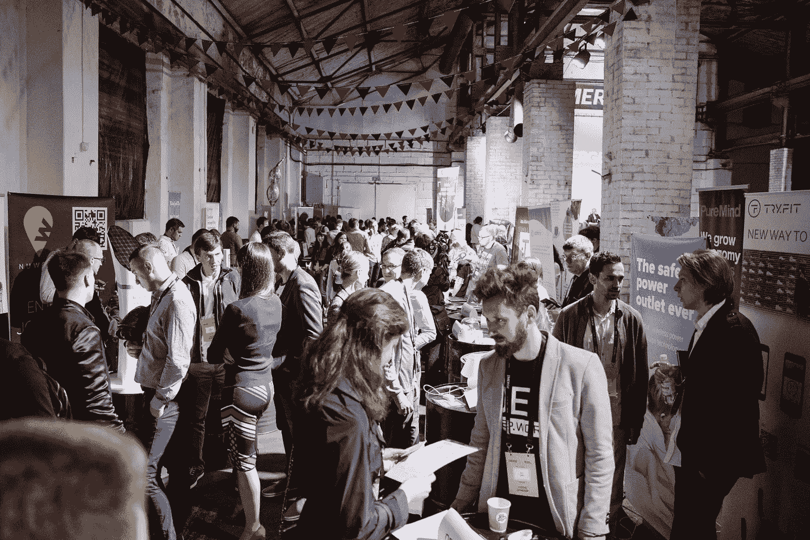
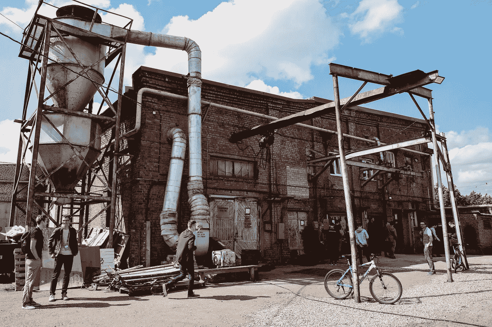

# 新东方是新的黑色:对投资者有什么好处？

> 原文：<https://medium.datadriveninvestor.com/new-east-is-the-new-black-whats-in-it-for-investors-13db43d9d798?source=collection_archive---------1----------------------->

创业与社区经理 KSENIYA SIDAROVICH，EMERGE

[EMERGE Conference](http://www.emergeconf.io) ，6 月 4-5 日在白俄罗斯明斯克举行，聚焦新东方。正如英国媒体《卡尔弗特日报》的朋友所说:新东方包括东欧、巴尔干和中亚。

你可以为新东方的科技人才感到兴奋，你可以质疑这个地区，但你不能忽视这里正在发生的事情。到底是什么？它正在出现！

 [## 投资算法快速指南-数据驱动投资者

### 让我们想象一下 30 年前的股票市场:让我们想象一下现在:像现在的许多其他领域一样，投资市场已经…

www.datadriveninvestor.com](https://www.datadriveninvestor.com/2019/01/31/a-quick-guide-to-investment-algorithms/) 

**为什么是新东方？为什么是白俄罗斯？**

大佬们看准了这一点，于是在 2016 年，脸书收购了白俄罗斯的视频过滤应用 **MSQRD、**。谷歌没有等太久，在 2017 年收购了白俄罗斯公司 **AIMatter** ，这是一个基于神经网络的平台，可以在移动设备上快速检测和处理图像。**同样来自白俄罗斯的 Maps.me** 成为俄罗斯科技巨头 Mail.ru 的一部分，这种具有导航功能的离线地图在没有互联网的情况下，不断拯救世界各地游客的生命。

成功的科技故事的根源可以追溯到白俄罗斯传奇的科技品牌，这些品牌现在全球闻名。你很可能听说过 **EPAM、坦克世界、Viber、Maps.me** 以及众多年轻公司，它们的成功让白俄罗斯成为一个科技人才济济的国家。

**白俄罗斯还有什么特别之处？**

2017 年 12 月，白俄罗斯政府通过了加密货币法，使最初的硬币发行和加密货币交易合法化，令国际观众兴奋不已。这包括他们在白俄罗斯交易所兑换传统货币，而所有贸易在未来五年内都将免税。

因此，白俄罗斯在新东方地区铺设了它的独角兽之路，并为新的科技明星闪耀奠定了基础。

对于白俄罗斯的科技公司来说，2018 年的确是特殊的一年。在产品搜索的 22 个类别的 12，000 种产品中，来自白俄罗斯的 3 家初创公司在各自的类别中排名第一，并获得了金猫奖。

**one sol**成为年度最佳 AI &机器学习产品。它的交互式地图允许探索和比较欧洲和美国的田地和农作物。此外，它仅仅着眼于艺术！

**Wannaby** 获得年度 AR 产品类第一名。该应用程序将购物提升到了一个新的水平，允许在购买前试穿鞋子、珠宝和服装。

**RocketBody** 被评为年度最佳健康&健身产品。该团队已经向市场推出了一款获奖的个人人工智能训练应用程序。

同年，来自白俄罗斯的 **FLO** 应用成为全球下载量最大的健康应用。

新东方的成功故事超越了白俄罗斯的边界，因为当地的独角兽正在该地区的许多国家兴起。我们指的是乌克兰和它举世闻名的 T4。Y-combinator 支持来自乌克兰的 PetCube，而 BetterMe 成为美国市场上增长最快的健康健身应用。亚美尼亚人创造了手机上排名第一的图片编辑器和图片拼贴制作工具 PicsArt。匈牙利是 Prezi 和 Turbine AI 的祖国，他们利用人工智能对抗癌症。著名的 Revolut 公司由来自俄罗斯和乌克兰的英国企业家 Nikolay Storonsky 和 Vlad Yatsenko 创建。这家成立三年的公司从金丝雀码头 39 级技术加速器的 6 名员工开始，在英国和其他国家拥有超过 450 万客户，截至 2019 年 3 月的估值为 17 亿美元。

我们已经浏览了新东方国家的创业故事，并在这里展示了一些令人兴奋的故事。

**保加利亚及其本土独角兽**

《彭博》、《福布斯》、《怪异》以及其他媒体都想出了新的标题来描述保加利亚初创公司 **Dronamics** 的成功。该团队正在开发一种用于货运的汽车扣押无人机，预计很快将取代传统的送货和邮政服务。兄弟——创新者康斯坦丁(Konstantin)和斯维伦·兰格洛夫(Svilen Rangelov)获得先锋奖，而康斯坦丁也闯入福布斯 2017 年欧洲排名 30 位 30 岁以下。

另一家保加利亚科技创业公司 **EnhanceCV** 帮助求职者进入当今最受欢迎的公司。由于 EnhanceCV，超过 50 万名候选人受到了关注，并被特斯拉、谷歌、脸书、Spotify、Intercom 等科技巨头聘用。

与此同时，他们来自保加利亚创业生态系统的同事帮助 500 家财富公司走向精益。由 Dimitar Karaivanav 领导的 Kanbanize 是一个帮助公司实践看板的软件管理工具。它已经得到了全球 30 多个国家的认可。这家初创公司得到了保加利亚种子风险基金 Eleven Ventures 的支持，被评为该地区最成功的初创公司之一。

多亏了同样来自保加利亚的 OfficeRD，coworkings 可以让他们的成员坐在驾驶座上，让他们相互交流。男人在有史以来最好的合作管理工具的名单中！

摩尔多瓦发生了什么？

另外 30 个 30 岁以下的团队也在我们的名单上——摩尔多瓦的 **Planable** 创始人。对于协作创建社交媒体活动的团队来说，这是一个救命的工具。这些人得到了众多公司的信任，其中包括大众汽车、维珍移动、宝马、Costa Coffee、Mini、天合联盟航空联盟……待续。

摩尔多瓦初创公司 **XOR** 凭借其人工智能招聘技术被预测将改变人力资源行业。XOR 是一个企业 SaaS 平台，吸引了来自 500 多个来源的人才，提供 24/7 支持，拥有 103 种语言，并通过 AI 聊天机器人提供即时响应。预计该工具可以将招聘成本降低 50%,并将招聘与职位匹配的员工的速度提高 33%。该产品被宜家、麦当劳、喜力等选用。

**盐边**是另一个来自新东方的鼓舞人心的例子。该公司由摩尔多瓦团队创建，在多伦多、伦敦和基希讷乌设有办事处。该团队声称截至 2018 年春天，已经处理了超过 100 万笔交易，并筹集了超过 300 万美元的资金。Salt Edge 与全球 3100 多家银行合作，每天有超过 250 000 名最终用户。该服务通过提供数据丰富、财务健康检查和收款人验证来增加价值。

未被发现的波斯尼亚

Shahriyar Mohammadi 是一名 25 岁以上的伊朗人，10 岁时移居波斯尼亚和黑塞哥维那(波黑)，成为波黑迄今为止最耀眼的初创公司之一的创始人。 **Goody** 是公司以有趣和互动的方式推广产品的平台，客户不仅可以看到相关产品，还可以赢得奖品。

来自波斯尼亚的 Erna Sosevic 曾经辞去了她在咨询公司的工作，去联系该国的当地公司。波斯尼亚当地市场相对较小，只有 350 万人，Erna 发现人们对当地公司提供的交易缺乏了解。为了改变这种情况，她推出了 Bizbook 商业平台。现在很容易获得当地公司的报价，这有助于增加销售和加强波黑的经济。

**俄罗斯**

在众多来自俄罗斯的初创企业中找出 2-3 家是一个相当大的挑战，所以这里有一些努力工作的人才。Sarafan Technology 成立于 2016 年，筹集了 130 万美元，得到了 Admitad Invest 和前投资者 Sergey Dashkov 以及 Untitled Ventures 的支持，他们将于 2019 年 6 月 4 日至 5 日在明斯克出现。 **Sarafan 技术**是一种在照片中进行服装识别的人工智能技术。使用人工智能技术的服装单元已经成为创业界的热门话题，Sarafan 技术团队花了一些时间才在市场上找到出路。伙计们开始允许顾客给想要的衣服拍照，这样应用程序就可以建议在哪里购买想要的衣服。现在，购物直接发生在合作伙伴的网站上。Sarafan Technology widget 允许在用户点击图像中的“购买这个外观”按钮时购买类似于图像中显示的商品。这是一个双赢的局面:顾客有一个天价购物，而媒体从网上商店的每一个新线索中获得报酬。

飞行自行车已经到来。2017 年，在斯科尔科沃创新中心成长的俄罗斯初创公司推出了第一辆飞行自行车。2019 年，迪拜警方购买了这辆自行车，用于在繁忙地区的街道上巡逻。 **Hoverbike S3** 最高时速可达 96 公里，无需充电即可飞行约 20-30 分钟。它可以高达 30 米，尽管 5-15 米应该足以执行建议的任务。Hoversurf 的首席设计师 Denis Saitgareev 表示，来自日本的本田和雅马哈已经对 Hoverbike 的大规模生产表现出了兴趣。该团队正在向前看，并计划在未来制造一辆载货自行车。

另一个来自俄罗斯的金融科技故事是一家将银行引向信使的初创公司。TalkBank.io 应用大数据和人工智能技术，通过流行的聊天机器人进行所有交易。创始人承诺，他们的解决方案让客户不必下载新应用程序、去银行办公室或打电话给呼叫中心，而这些正是客户真正希望快速完成的事情，包括转账、给卡充值或获得支持。它被认为是和通过信使与朋友交谈一样容易。TalkBank.io 拥有自己的卡，允许客户从使用该公司卡进行的购物中获得高达 5%的返现。

**搬到新东方的另一边——高加索。**

**仅次于辛卡利的格鲁吉亚最大创新**

从解决他的问题开始。早在 2008 年，来自格鲁吉亚的 Tamas Georgadze 试图在边境开设银行存款。这一经历启发他推出了一个跨境存款的在线平台，这样客户就不需要处理不同国家的行政要求，克服语言障碍，甚至前往另一个国家进行身份认证。Raisin 现在是欧洲最大的存款市场，最近获得了 1 . 14 亿美元的 D 轮融资，其中包括 PayPal 和 Index Ventures 的支持。

接下来来自佐治亚州的是**货架**，TechStars 2018 毕业生和加州前沿创新奖的获奖者，是区块链技术的最佳真实使用案例。该团队还在 BlockShow 2018 上被评为最佳欧洲区块链创业公司。货架帮助汽车销售商接触到更多的买家，卖出汽车，获得更高的利润。他们通过为多个在线市场之间的同步交易创建基础设施，使之成为可能。由莎拉·安塔泽和帕维尔·克拉夫琴科开发的这项技术使卖家能够在一个地方上传车辆，但在所有互联的市场上运行和监控拍卖。

新东方真的是科技人才和突破性科技实验的新领地吗？更多的还在后面。根据谷歌为创业公司准备的“创业与投资前景”报告，中东欧地区约有 100 万名开发者，其中波兰排名第一，拥有 25.4 万名开发者，其次是罗马尼亚和捷克共和国。**白俄罗斯在中东欧国家中排名前 7 位，拥有 45，000 名开发者。**斯洛伐克和克罗地亚紧随其后，分别拥有 3.8 万和 3.4 万名开发者。该报告还指出，拥有最优秀开发人员的 20 个国家中有 6 个来自中东欧，这意味着四分之一最酷的开发人员来自中东欧。

不仅仅是 SOAD 在摇摆

而且不仅仅是 coders 代码！来自亚美尼亚的 SoloLearn 为 30 多名 mln 学习者提供了如何用 9 种语言编写代码的分步指导:HTML、CSS、JavaScript、PHP 等等。它可以在网上和任何移动设备上使用。不仅仅是一个学习平台，SoloLearn 还是最大的移动程序员社区，在这里你可以创建编程内容并与全球的同行分享。

EMERGE 是见证这些科技钻石走向星光大道的地方。