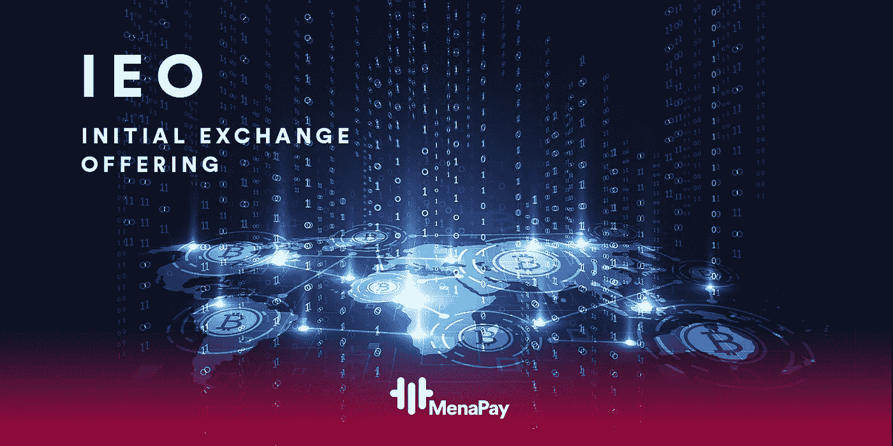

# 密码交易所的新融资模式吸引投资者

> 原文：<https://medium.datadriveninvestor.com/new-funding-model-of-crypto-exchanges-attracts-investors-a197842ab4cf?source=collection_archive---------29----------------------->

*加密交易所的新筹资模式——首次公开募股(IEO)——吸引了全球投资者的关注*

首次公开募股是公开募股类型中一种未知的大规模融资类型。自 2014 年以来，已应用不同类型的初始交换发行模型，该模型加速了新项目的实施。基于区块链的项目向投资者出售他们的数字硬币，以 IEO 模式为他们的项目融资。

IEO 和加密货币交易所不仅出售新代币(数字货币)，还在出售结束后立即在交易所列出代币。最重要的是，它在交易所出售的代币的积极营销中起着至关重要的作用。因此，通过 IEO，交易所和项目共同努力实现更高的效率，并在新项目和投资者之间充当中介。

对于这些项目来说，依靠交易所的专业知识来确保企业家和投资者之间的交易过程对双方都更安全，会有更大的好处。虽然大多数软件开发人员在区块链工作，但他们不是股票经纪人。对 IEO 来说，在几个交易所上市的总部位于区块链的项目在一个更公平的系统上运作，该系统可以支持该领域的新项目，并且比 ICO 等以前的融资模式更透明。在采用区块链技术的系统中，任何操作都不能被退回、修改或取消。
代币将能够接触到更广泛的受众，因为它们有比那些自己进行 ICO 的公司更多样的销售场所。另一方面，客户将能够从他们使用的交易所获得可靠的代币期权。

**投资 IEO 的基本步骤**

**公开发行研究**

随着新项目的出现，区块链技术在日常生活中的应用越来越多。IEO 是与区块链技术爱好者开发的项目的第一阶段之一，对于处于投资阶段的项目具有重要意义。IEO 是让这一过程在安全的环境中进行的最佳途径之一。虽然项目很少使用这种方法，但我们可以通过检查网站和社交媒体渠道来评估参与式项目如何传递到 IEO，从而了解项目如何获得资金。通过阅读他们的白皮书可以理解路线图。

**在交易所注册**

根据围绕哪些交易所进行 IEO 而进行的研究，有必要考虑应该接受哪种加密货币。虽然比特币和以太坊等货币是最广泛接受的加密密码，但一些互换可以使用 IEOs 来推广其本地卡。

之后，可以在交易所完成注册过程。在注册过程中，KYC /反洗钱验证对于安全非常重要，可能需要几个小时甚至几天的时间。因此，你需要确保它不是在最后一分钟完成的。

**等待 IEO 开始**

采取这些步骤后，加密货币就可以在交易所购买了。当购买过程完成时，将快速提供作为令牌的到用户钱包的转账。

尽管 IEO 是一种新方法，但随着时间的推移，加密货币和交易所将继续增长，这无疑会使其对更广泛的市场更具吸引力。

[ExMarkets](https://exmarkets.com/trade/eth-btc) 和 [MenaPa](https://www.menapay.io/) y 宣布他们将于 2019 年 3 月 15 日举办 IEO

基于区块链的新一代支付平台 MenaPay 宣布，将与 ExMarkets 一起执行 IEO。2019 年 3 月 15 日，MenaPay 的代币 MPAY 销售将在 ExMarkets 上提供。在 IEO，代币价格为 0.165 美元，接受多种存款方式，如以太坊、比特币、莱特币、比特币现金甚至菲亚特。MenaPay 总经理托尔加·奥多格鲁表示:“我们计划在 2 月底之前与 20 个交易平台签约，6 月初，MenaPay 代币可以在交易所与其他货币兑换。MenaPay 总经理托尔加·奥多格鲁补充道:“我们的目标是在 2 月底与 200 个交易平台达成交易，6 月初 MenaPay 代币可以在 IEO 进行交易。我相信交易所的 IEO 将随着时间的推移继续增长，并将在 2019 年成为加密货币和交易所的广阔市场。"

[*关于 MenaPay*](https://azadnewsme.com/new-funding-model-crypto-exchanges-attracts-investors/)

*MenaPay 是中东和非洲首个基于区块链技术的支付系统。MenaPay 通过加密的区块链网络进行支付，而不是传统的支付方式。它为每个用户和日常生活的每个方面提供了一个安全透明的支付网络。*

*MENA pay 项目于 2017 年 11 月启动，旨在为该地区 18 个国家的 4.2 亿人提供高级支付服务。MenaPay 将把总收入的 75%分配给 MenaPay 代币所有者。这为加密外汇行业设定了一个新标准，远远超出了用户和投资者可获得的正常激励水平。*