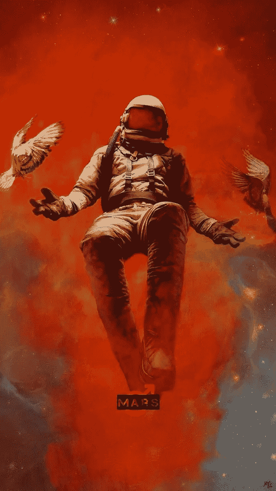
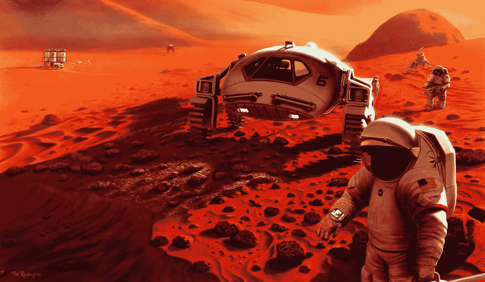
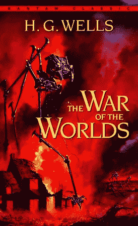
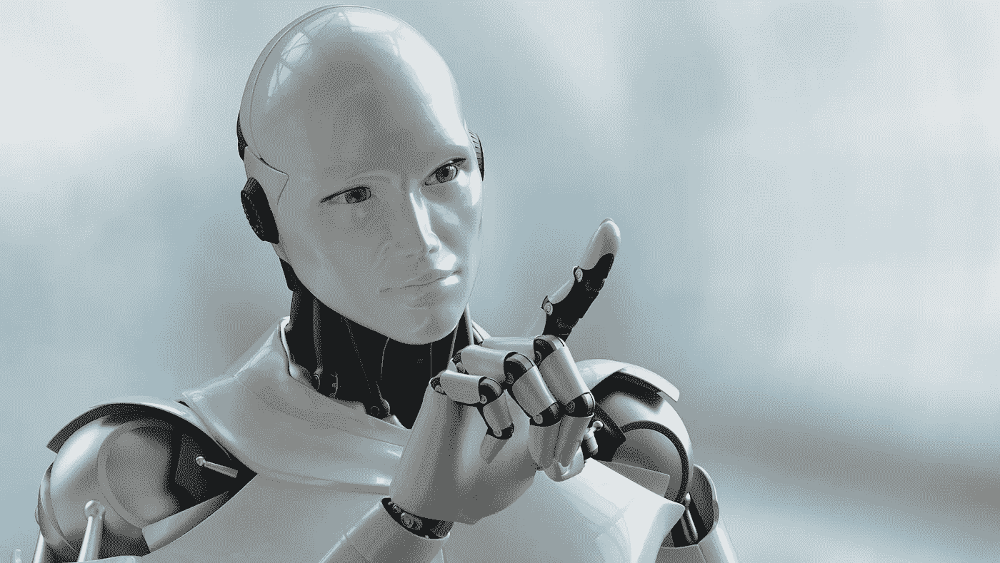

# 新火星人

> 原文：<https://medium.datadriveninvestor.com/new-martians-17ba5841596a?source=collection_archive---------10----------------------->

作者:查德·皮莱

Image from Artwoonz: [https://www.pinterest.com/pin/569072102907613181/?lp=true](https://www.pinterest.com/pin/569072102907613181/?lp=true)

在太空已经六个半月了，我即将完成我的火星之旅。我大张旗鼓地离开地球，探索这颗红色星球，并为最终的人类殖民创造条件。该任务由国际航天局和 SpaceX 等私营航天公司组成的财团赞助。似乎全球范围内广泛的私人和公共合作意味着人类正在超越由贪婪和/或自我驱动的竞争倾向。这一进步也体现在各个领域的发展和发现上。在生物工程领域，使用基因拼接技术(CRISPR)取得了进展，可以根除大多数疾病，包括大多数形式的癌症。在计算科学领域，人工智能和制造业(如廉价的 3d 打印)的进步导致了具有自我意识的机器的发展，这些机器是为了帮助人类开发人员而建造的。最后，绿色技术取得了进展，减少了人类对化石燃料的依赖。所有这些突破都开创了一个创新的新时代，在地球和地球以外的地方都有无限的人类潜力。因此，人类的好奇心达到了顶峰，并放眼地球之外寻找下一个挑战，这包括人类对火星的殖民。一些任务重建了月球基地和空间站，但只是实现更大目标的垫脚石——永久定居火星，包括将红色星球改造成类似地球大气层的样子。

 [## 挑战你对人工智能和社会的看法的 4 本书——数据驱动的投资者

### 深度学习、像人类一样思考的机器人、人工智能、神经网络——这些技术引发了…

go.datadriveninvestor.com](http://go.datadriveninvestor.com/4AI1) 

Mars Colony. Image from Space.com: [https://www.space.com/13739-nasa-mars-exploration-future.html](https://www.space.com/13739-nasa-mars-exploration-future.html)

该任务要求在火星表面靠近美国宇航局 Insight 探测器着陆的地方部署一个探测器，并发现数十亿年前火星上可能存在生命的证据。地质学家的另一项发现加强了这项任务，即地球上大约 70%的微生物生活在地下。这个星球表面下的生态系统受到了高温、高压、无光和几乎没有任何营养的影响，在这里你很难找到不同的微生物群落。这提升了火星上存在冷冻水的想法，以及先前生命的证据，即合适的催化剂可以再次重启火星上的生命。这个想法来自于一个理论，即一颗古老的小行星或彗星撞上了火星，并抛出了太空碎片，其中包括使火星成为地球的微生物，并有可能启动我们所知的生命。虽然有些人可能认为它来自历史频道的古代外星人电视节目，但它是基于一个名为“胚种”的实际理论科学家，通常也被称为“交换唾液”，就像两个情人亲热并分享细菌。部署探测器一直是我启动地球地形形成任务的一部分；然而，我的指示瞬间改变了。从地球接收的新流量从探索和实验变成了更重要的东西——拯救生命本身的概念。就在人类达到新的进步高度时，似乎又到了一个濒临自我分裂的时刻。

当我思考这个信息的重要性和地球上的情况时，我想起了创世纪第 11 章中巴别塔的故事，当人类为了一个共同的目标而团结在一起时，上帝曾把他们分散在那里。我记得有一句诗说:

耶和华又说，看哪，这民是一样的，必有一样的言语。这就是他们开始做的:没有什么会被他们重新训练，这是他们想要做的。走吧，我们下去，在那里变乱他们的语言，使他们彼此听不懂对方的话。耶和华使他们从那里分散在全地上，他们就停工，不造那城了。因此它的名字叫做巴别；因为耶和华在那里变乱天下人的语言，使他们分散在全地上。」

Tower of Babel. Image from Bible Story: [https://www.biblestudytools.com/bible-stories/the-tower-of-babel.html](https://www.biblestudytools.com/bible-stories/the-tower-of-babel.html)

我不禁想到从地球上发出的信息，这是一个理想主义科学家被困在一个濒临自我毁灭的星球上的最后一幕。结果，发射探测器的任务变得近乎圣经般重要。像圣经故事中的诺亚一样，这艘船现在代表着人文方舟；然而，与拯救每一个物种的故事不同，这次任务将是转移地球上生命的基本基础。这艘船载有被称为极端微生物的微生物——古老而高度特化的微生物，更具体地说是产甲烷菌——厌氧和非光合的微生物，是火星上再生生命的理想候选人。

由于地球和我在火星附近的飞船之间的信息需要大约 7 分钟才能到达我这里，我收到的最后更新令人震惊。尽管取得了所有这些进步，但精英们为了维护他们的权利意识而产生的贪婪和对权力的渴望已经使他们自己的人民相互争斗，使国家与国家相互争斗。像巴别塔一样，随着恐惧和非理性控制了世界，世界毁灭性武器库被释放出来，用数千次核爆炸点燃了地球，世界分崩离析。在那一刻，与地球的联系被切断。大约在同一时间，恐慌袭击了月球基地，与它的通信也停止了。想到地球上发生的事情，我想起了一首古老的非裔美国人福音歌曲的歌词，这首歌的标题是*我在那块石头上有了一个家*，歌词是“上帝给了诺亚那个彩虹标志，下次不再是水，而是火。”事实上，火是由人类自我毁灭的冲动引起的。

在体会孤独的时候，我只能想到手头的任务——通过发射产甲烷菌的探测器来保存生命的概念。我祈祷上帝创造的最小的生物能够成功地生存和繁衍，以维持他的创造。当我按下按钮发射探测器时，我不禁想起了 H.G .威尔的《世界之战》一书的最后一行，这一行相信了上帝创造的最小生物的力量，它说:

*“以十亿人的死亡为代价，人类买下了地球与生俱来的权利，这是他对抗所有来者的权利；即使火星人比他们强大十倍，也还是他的，因为人不会白白地活着或死去。”*

War of the Worlds by H.G. Wells. Image from Penguin Random House: [https://www.penguinrandomhouse.ca/books/188559/the-war-of-the-worlds-by-hg-wells/9780307808035](https://www.penguinrandomhouse.ca/books/188559/the-war-of-the-worlds-by-hg-wells/9780307808035)

然而，这一次，地球上的细菌将成为确保人类时刻不会白白结束的手段。另一方面，作为人类自己创造的人工智能机器人，我开始思考如何保护自己的存在。人类已经开发出半机械人来进行火星的初步探索，以在任何未来的载人任务之前将风险降至最低。我自己的飞船不是设计用来在水面着陆的；因此，我现在的目标是确保我的航天器无限期地留在火星的轨道上，并保存我的人工神经元，以便随着火星上生命的进化，有一天生命将足够聪明，能够与我互动。希望我能成为新火星人和创造我的人类主人之间的桥梁。另一方面，他们可能会把我，一个机器人，视为他们的创造者，就像人类在灭亡之前所相信的那样。

Cyborg — New Master? Image from The Trumpet: [https://www.thetrumpet.com/15703-immortal-cyborgs-is-this-humanitys-future](https://www.thetrumpet.com/15703-immortal-cyborgs-is-this-humanitys-future)