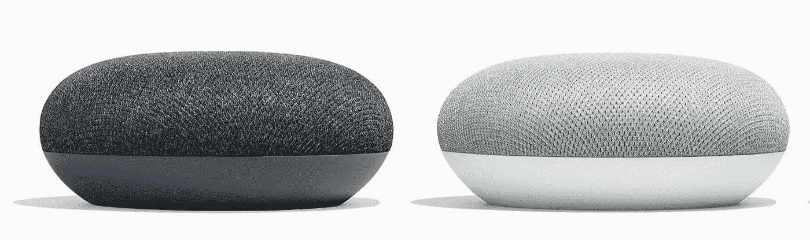
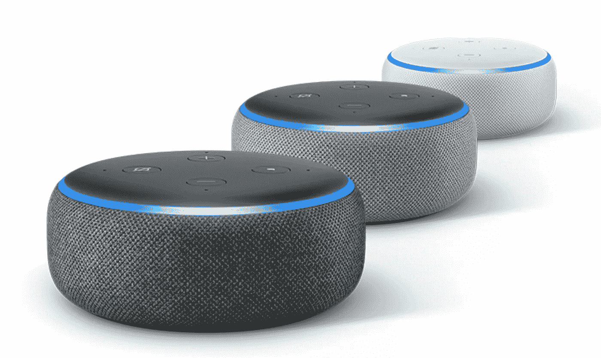

# 智能音箱大战中的新动作

> 原文：<https://medium.datadriveninvestor.com/new-movements-in-the-war-of-the-smart-speaker-2cdbf8359181?source=collection_archive---------35----------------------->

The Google Home Mini

随着亚马逊 Echo 系列新产品在美国商店的出现，谷歌终于在西班牙激活了期待已久的例行程序。

真的套路，这几乎是唯一让 Alexa 成为远优于 Google Home 的产品的东西，但随着多个命令到达 Google Home 设备，力量的平衡发生了变化。

亚马逊控制软件对于你配备 Alexa 的设备的一个巨大优势是，只需一个命令，扬声器就可以同时执行几个命令。例如，我有一个命令，在我睡觉时关掉客厅的两盏灯，打开卧室的灯，这样当我起床时，我发现灯亮着。

The new Echo Dot 3rd Gen.

用我的 Google Home Mini 做这种类型的多种动作是不可能的，所以我把它变成了一个测试和我的购物清单的设备。顺便说一下，我不能用 Alexa 制作我的购物清单，因为 iOS 或 Android 上没有针对西班牙市场的官方应用程序，所以当我在超市时，制作一个我无法从手机上查看的清单几乎没有用。

今天早上，不可思议的是，日常事务已经可以在家里进行了。一段时间以来，我不仅能够克隆我常用的 Alexa 例程，而且我还用其他可用的操作来改进它，例如除了开灯和关灯之外，现在 Google Home 让我预测明天的时间，它告诉我日历中有什么，还可以打开手机充电器，它会在凌晨 3:30 自动关闭。

亚马逊继续信守承诺，在今年年底之前将让 Alexa 讲西班牙语，但有可能到那时已经没有人卖 Echo 扬声器了。

在亚马逊本周展示的创新中，有一款低音炮(Echo Sub)，一款名为 Echo Auto 的汽车的 Echo，以及一款新版本的 Echo Dot(第三代)，确实非常不错，这些创新甚至还没有在美国销售，谁知道我们什么时候能在欧洲看到它们。

说到承诺，我们仍然在等待 Sonos One 与 Google Home 兼容，圣巴巴拉公司表示这将在今年年底前实现。

我仍然认为亚马逊有一个非常好的成品，比谷歌 Home 好得多，我们只需要记住谷歌忽视的数百个投诉，即谷歌 Home 扬声器无法通过蓝牙保持稳定的连接，Alexa 管理起来没有问题。然而，亚马逊正在将战争集中在改善硬件上，而不是像谷歌那样尽可能地扩大业务。用户将不得不选择他们更喜欢哪个生态系统，亚马逊还是谷歌，每个购买谷歌 Home 产品的人将不再把 Alexa 放在他们的家中。当亚马逊照顾其北美亲爱的用户时，谷歌为世界其他地区分发谷歌家庭迷你。