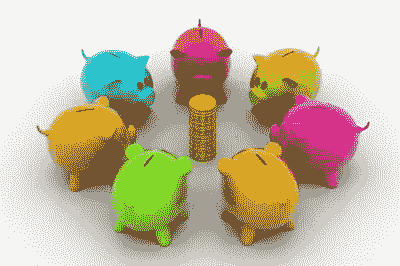

# 符号化经济的新机遇

> 原文：<https://medium.datadriveninvestor.com/new-opportunities-in-tokenized-economy-1c73e8480113?source=collection_archive---------7----------------------->

*Image courtesy of cuteimage at FreeDigitalPhotos.net*

大多数人仍然有这样的印象，即在加密/区块链中，只能通过 ICO 或货币价格投机来赚钱。我经常读到这样的观点:在加密领域没有更多的机会了。我完全不同意！

*今天，与维塔利克·布特林开始鼓吹智能合约的时候相比，更多的人知道加密货币和令牌化经济。*

> *如今向市场或投资者展示一个新想法应该比过去容易得多，因为有更多的人至少对区块链感到失望，如果他们不购买硬币或代币的话。*

然后我得到**你必须第一个面对世界**。我们不受古埃及人、古希腊人或古罗马人的统治——事实上，我们只能在关于他们的书籍中读到，或者看一部关于他们的纪录片或电影。即使它们在我们现有的国家存在之前(或者甚至在计划之中)就已经上市了。

**如今的定位比一年前容易多了。**coinmarketcap.com 上市的加密货币超过 2000 种，向潜在投资者解释你是谁、你想做什么以及你的服务或产品与竞争对手的服务有何不同要容易得多。

> *世界上有数百万家餐厅，我没有听说任何新开一家餐厅的人会担心自己的餐厅不是城里的第一家。*

**在熊市中，投资者寻求长期稳定。**长期稳定性意味着强劲的现金流、低杠杆和低管理费用，并且大部分费用应该是可变的。

# 巨大的机会(几十年的工作)

—几乎所有的企业都在等待转变为象征性经济。

例如:

1.翻译服务是由赏金计划引入令牌化经济的，并且可以在赏金计划之外进一步发展

2.如果你有自己的 youtube 频道，你可以推广可以用代币支付的服务，并赚取代币。

3.你可以准备内容或成为社交网络的社区经理，并获得代币报酬

4.教育:你可以帮助教育人们关于区块链和代币化经济，同时广告加密业务和赚取代币。

> Smart City AG 将向为智能城市社区开发和实施令牌化服务的初创企业投资价值 1000 万欧元的令牌。因此，如果你有一个团队，并且你愿意工作，我们将为你的项目提供基础设施和初始资金，这将有利于智能城市社区。