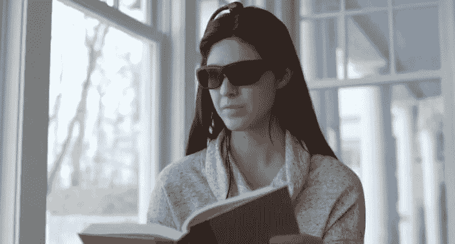

# 新的智能眼镜将使人不会从工作中分心

> 原文：<https://medium.datadriveninvestor.com/new-smart-glasses-will-make-a-person-not-distract-from-work-b446a8647519?source=collection_archive---------1----------------------->

Source — Narbis

我们都很清楚教育或实践的原则，根据这一原则，好的行为会得到奖励，相反，坏的行为会受到惩罚。更多的时候，这种方法被称为胡萝卜加大棒的方法。虽然积极和消极强化在工作过程的组织中主要以经济惩罚和激励的形式出现，但 Narbis 的专家认为还有另一种方法。出于这些目的，他们生产智能眼镜，使人不会从工作中分心。此外，该设备的工作令人兴奋。

让你不分心的眼镜是新东西！

 [## 2019 年即将改变世界的技术|数据驱动的投资者

### 很难想象一项技术会像去年的区块链一样受到如此多的关注，但是……

www.datadriveninvestor.com](https://www.datadriveninvestor.com/2019/01/17/the-technologies-poised-to-change-the-world-in-2019/) 

# 智能眼镜有什么能力？

Narbis 制造的新型智能眼镜旨在确保人们尽可能专注于工作过程。如果发生这种情况，他们通过使晶状体变暗来防止注意力分散。否则，如果一个人集中注意力，镜片保持透明。为了达到这种效果，智能眼镜使用了三个传感器。其中一个位于每只耳朵后面，另一个位于头顶。这些传感器监控大脑活动，并根据获得的数据得出一个人此刻是否分心的结论。

该应用程序有效——这要归功于一种基于美国宇航局在神经接口领域开发的算法。据公司代表称，眼镜是“为儿童和成人简单的家庭使用而设计的”它们可以用来在阅读或学习等课程中提供“关于分心的即时反馈”。此外，该小工具可以用作工作流程的一部分，将员工的注意力集中在具体任务的执行上。

智能手机上的一个独特的应用程序还可以显示绩效并跟踪工作进度。与此同时，Narbis 专家建议每周使用眼镜两到三次，每次 30 分钟，以提高注意力和专注力，并“学会不分心”。Narbis 还强调了一个事实，即新的智能眼镜不是一种医疗设备，所以你不应该用它来纠正与注意力分散有关的病理。智能眼镜可在 Narbis.com 官方网站预购[。一台设备售价 690 美元，但如果你很快决定预购这台设备，你将获得 100 美元的折扣。你想要这样的智能眼镜吗？](https://narbis.com/)

事实上，这个小工具看起来相当令人印象深刻，但它提出了几个问题。例如，它的工作精度如何。事实上，即使当我们从事任何活动时，我们的大脑也远非总是“冲锋在前”。例如，人们很早就知道，大脑的不同区域负责阅读文本和创建文本。因此，在这些过程中，大脑的活动将是不寻常的。如果是这样，Narbis 设备在工作中是否会有某种“漂移”，允许大脑的表现出现偏差？该设备将如何针对特定的人进行配置和校准？我们只有在小工具发布后才能了解到这一点。

嗯，总的来说，还不完全清楚这种读取大脑活动的技术是如何工作的。与此同时，创造者本身并没有透露细节，所以还不清楚这个小玩意最终会有什么结果。