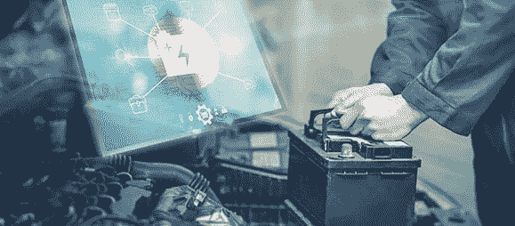

# 关注铅酸电池市场的新研究|最新发展

> 原文：<https://medium.datadriveninvestor.com/new-study-focusing-on-lead-acid-battery-market-recent-development-38778a6bac57?source=collection_archive---------8----------------------->

全球[铅酸电池市场](https://www.marketsandmarkets.com/Market-Reports/lead-acid-battery-market-161171997.html)预计到 2024 年将从 2019 年的 416 亿美元达到 525 亿美元，在预测期内 CAGR 为 4.7%。这种增长可归因于多种因素，如将可再生能源整合到主电网的需求，以及蓬勃发展的数据产业有望在全球范围内安装多个数据中心，这预计将利用铅酸电池作为备用电源。

*浏览 150 页的 70 个市场数据表和 50 个图表，深入了解*“**铅酸电池市场，按技术(碱性、高级铅酸)、类型(固定式、动力)、建造方法(淹没式、VRLA)、最终用户(公用事业、交通、工业、商业&住宅)和地区—2024 年全球预测**”

 [## 在自动驾驶汽车发生事故的情况下，谁应该承担法律责任？数据驱动的投资者

### 我仍然认为自动驾驶汽车是一种奢侈品，而不是必需品…

www.datadriveninvestor.com](https://www.datadriveninvestor.com/2018/11/02/who-is-legally-accountable-in-the-case-of-an-autonomous-vehicle-accident/) 

**点击此处查看详细目录**

 [## 铅酸电池市场

### 150 页报告]预计到 2024 年，全球铅酸电池市场将达到 525 亿美元，据估计…

www.marketsandmarkets.com](https://www.marketsandmarkets.com/Market-Reports/lead-acid-battery-market-161171997.html) 

**在预测期内，按建筑方法计算，VRLA 市场预计将成为最大的铅酸电池市场**

预计阀控铅酸蓄电池(VRLA)将成为预测期内最大的市场。VRLA 电池包括吸水玻璃垫(AGM)和凝胶电池。这些是新技术驱动的建造方法，分别包括吸附性玻璃材料和硅胶的存在。与常规铅酸电池相比，这些方法确保了电池的寿命，并且需要更少的维护。在未来的时间里，由于它们的各种优点，这些电池可能比传统的满液式铅酸电池更受欢迎。

**在预测期内，高级铅酸电池预计将成为铅酸电池市场增长最快的技术领域**

先进的铅酸电池在阳极板上有碳涂层，这样就不需要清洗电镀层上的硫酸铅沉积物。同时，阳极电极的寿命增加，最终增加电池组的总寿命。它提供了再生制动快速充电等好处。这是高级铅酸电池的一个显著优势，因为常规铅酸电池很难完成这项任务。尽管比锂离子电池相对更重更大，但这些电池成本低廉，可在低温和冰点以下有效工作，并且不需要主动冷却。

**亚太地区将占据全球铅酸电池市场的最大份额**

在本报告中，对五个地区的铅酸电池市场进行了分析，即北美、南美、欧洲、亚太地区以及中东和非洲。由于对经济高效的能源解决方案的需求，亚太地区预计将在 2019 年主导全球铅酸电池市场。该地区的大型汽车和制造基地有望成为市场增长的关键驱动力。由于快速工业化和城市化，该地区的能源消耗不断增加，预计这将推动市场在预测期内的增长。

https://www.marketsandmarkets.com/pdfdownloadNew.asp?**下载 PDF 宣传册@** [id=161171997](https://www.marketsandmarkets.com/pdfdownloadNew.asp?id=161171997)

该报告包括铅酸电池市场中一些顶级玩家的简介，以便深入了解竞争格局。一些主要的参与者有:EnerSys(美国)、Exide Industries(印度)、GS Yuasa(中国)、Clarios(美国)、松下(日本)、魏超电力(中国)、Narada 电力(中国)、HBL 电力系统(印度)、Crown Battery(美国)、NorthStar(瑞典)、日立化学(日本)、Exide Technologies(美国)、Teledyne Technologies(美国)、East Penn(美国)、Hankook AltasBX(韩国)、HOPPECKE(德国)、C & D Technologies(美国)、Rolls Battery(加拿大)、Camel Power(马来西亚)、Amara Raja 电力系统(马来西亚)领先企业正采取各种策略来增加他们在铅酸电池市场的份额。