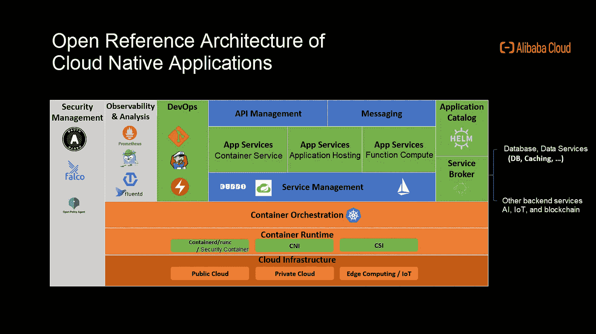
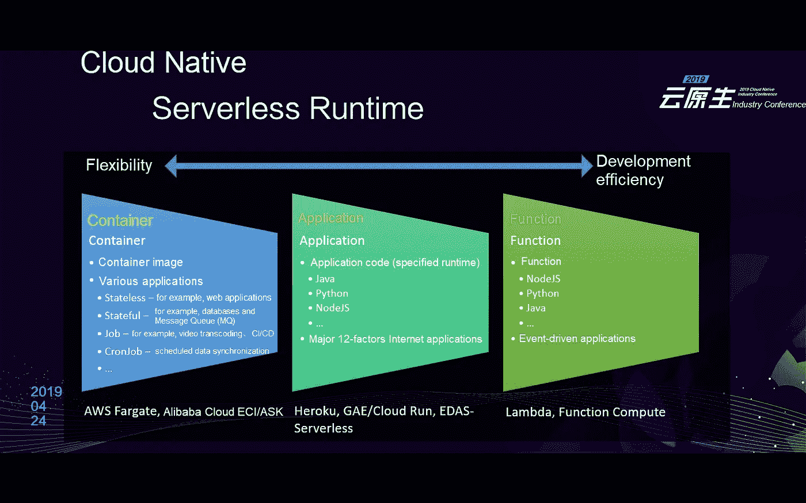
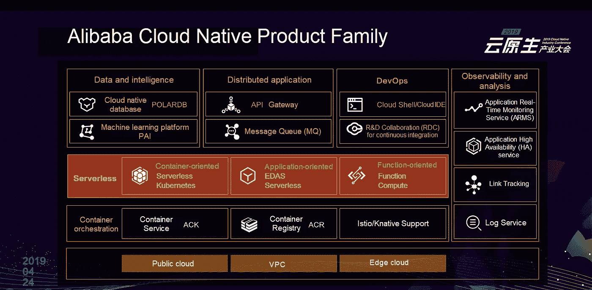

# 关于云原生的新思考:为什么到处都是容器？

> 原文：<https://medium.datadriveninvestor.com/new-thoughts-on-cloud-native-why-are-containers-everywhere-ada1b7264b64?source=collection_archive---------6----------------------->

*由穆焕*

4 月 24 日，由中国信息通信技术研究院(CAICT)主办的首届云原生产业大会在北京召开。阿里云容器服务总监李逸在“云原生数字引领未来”的演讲中表示，“云原生技术可以支持互联网应用，并对新型计算架构和智能数据应用产生深远影响。以容器、服务网格、微服务和无服务器运行时为代表，云原生技术提供了一种新的应用构建方法。”

这份文件是根据李逸的演讲写成的。

 [## 信息图:云之旅|数据驱动的投资者

### 聪明的企业领导者了解利用云的价值。随着数据存储需求的增长，他们已经…

www.datadriveninvestor.com](https://www.datadriveninvestor.com/2018/09/22/infographic-journey-to-the-clouds/) 

# 通过使用云原生技术降低系统复杂性

目前，大多数企业完全接受云计算。全云时代见证了三个重要变化:基于云的基础设施、基于互联网的核心技术以及数据驱动的智能服务。在不同的领域和行业，许多商业应用都诞生在云端，许多企业越来越类似于互联网公司。因此，技术能力被视为不可或缺的核心竞争力。在 2019 北京阿里云峰会上，阿里云智能总裁张建锋在谈到“基于互联网的核心技术”时，提到了大力投资云原生技术的意义。

为什么要拥抱云原生技术？一方面，云计算重建了整个软件生命周期，从架构设计到开发、构建、交付和运维。另一方面，企业的 IT 架构发生了显著变化，服务深深依赖于 IT 能力。这两个方面增加了复杂性和挑战性。

随着人类社会的发展，技术革命和劳动分工的变化，复杂性可以通过使用云原生技术来降低，这反映了 IT 的进步。

首先，Docker 将应用程序从运行时环境中分离出来:许多业务应用程序的负载可以容器化，容器化使应用程序变得敏捷、可移植和标准化。其次，Kubernetes 将资源编排和调度从底层基础设施中分离出来:应用程序和资源控制得到简化，容器编排提高了资源编排和调度的效率。第三，以 Istio 为代表的服务网格技术将服务实现与服务治理能力解耦。此外，阿里云为集成第三方软件提供了多样化的开发工具(如 API 和 SDK)。这为云生态系统合作伙伴带来了广泛的可能性。这种分层技术架构促进了劳动分工，并显著加快了技术和业务创新。

阿里云认为，云原生技术可以支持互联网规模的应用，加速创新，允许低成本试错，避免底层基础设施的差异和复杂性。此外，新的计算方法，如服务网格和无服务器计算，使整个 IT 架构非常灵活，以便应用程序可以更好地服务于业务目的。可以基于阿里云容器服务构建面向领域的云原生框架，例如，面向机器学习的 Kubeflow 和面向无服务器运行时的 Knative。

# 集装箱服务的新思考

集装箱到处都是。作为容器服务的提供商，我们相信容器技术将继续发展并应用于新的计算形式、新的应用程序负载和新的物理边界。以下分享相关见解和新思考。

# 1.新的计算形式:云原生无服务器运行时已经到来

云原生技术旨在让企业和开发者只关注应用开发，而不是基础设施和基本服务。类似地，无服务器计算将应用程序服务转化为资源，并允许您通过 API 从客户端调用资源。更重要的是，现收现付模式可以降低您的成本。

可以为基础设施容器、应用服务封装和事件驱动的面向功能的计算实现无服务器运行时。

云本机无服务器运行时可以多种形式实现。许多制造商设计了不同的服务解决方案。

*   面向功能的功能即服务(FaaS): AWS Lambda 和阿里云 Function Compute 支持事件驱动编程。你只需要通过函数实现来调用服务，提高了开发效率。阿里云函数 Compute 按调用次数收费。您可以根据业务流量平稳地调整计算资源。在典型情况下，成本会降低 10%到 90%。马龙技术公司在模型预测过程中通过函数计算降低了 40%的成本。
*   面向应用:比如 Google App Engine，Cloud Run(新)，阿里云 EDAS 无服务器，你只需要启用应用实现。平台支持灵活和自动化的应用运行和维护。这些服务主要是为互联网应用而设计的。与 FaaS 不同，面向应用的无服务器架构不需要对现有应用进行改造。阿里云 EDAS 无服务器为流行的开源微服务框架提供无服务器应用托管平台，支持 Spring Cloud、Apache Dubbo 和阿里云 HSF 框架。
*   面向容器:例如，由容器图像携带，AWS Fargate 和阿里云无服务器 Kubernetes 是灵活的，支持各种具有调度系统的应用程序。您不需要管理底层基础设施。2018 年 5 月，阿里云发布了面向基于容器的应用的无服务器 Kubernetes 容器服务。该服务不需要节点管理和容量规划，按应用程序所需的资源收费，并支持自动扩展。针对阿里云基础架构优化，安全高效。它大大降低了管理 Kubernetes 集群的成本。无服务器 Kubernetes 的底层构建在轻量级虚拟化弹性容器实例上，这些实例由阿里云针对容器进行了优化。无服务器 Kubernetes 为容器应用程序的执行提供了一个轻量级、高效和安全的环境。无服务器 Kubernetes 允许您部署容器应用程序，而无需修改配置。

# 2.新的应用程序加载:容器正被越来越多的应用程序使用

容器被认为不适合传统的应用。然而，它们现在已经得到了显著的改善。Windows 生态系统支持容器。Kubernetes V1.14 的大多数核心功能，如 pods、服务、应用程序编排和容器网络接口(CNIs)，现在都在 Windows 节点上得到支持。Windows 系统仍然占有 60%的市场份额。传统的基于虚拟化的应用程序，如企业资源规划(ERP)软件、基于 ASP 的应用程序和大量 Windows 数据库，都可以在不重写代码的情况下进行容器化。

基于容器技术的新架构将为应用程序产生新的商业价值。由于云原生人工智能是一个重要的应用场景，我们需要快速构建人工智能环境，并高效利用底层资源，无缝适应深度学习的全生命周期。对于 AI 工程来说，云原生系统可以在四个方面提升效率。

*   它优化了异构资源的调度。
*   它提高了弹性、效率和粒度(支持 GPU 共享)。
*   它简化了异构资源的管理，提高了可观测性和使用效率。
*   它可以迁移、组装和复制人工智能过程。

比如深度学习的分布式训练，可以通过阿里云容器服务在三个方面进行增强。资源优化:异构资源，如 CPU 和 GPU，可以集中调度。虚拟私有云(VPC)或远程直接内存访问(RDMA)用于网络加速。性能提升:采用 GPU FP64 P100，加速比提升 90%，性能相对原生 TensorFlow 提升 45%。算法优化:消息传递接口(MPI)取代 gRPC、环降、计算-通信重叠和梯度收敛。

在其他高性能计算场景中，如基因数据处理，阿里云用户可以在 5 小时内处理 100 GB 数据的 WGS。支持超过 5，000 个步骤的复杂流程，90 秒内可横向扩展 500 个节点。这样，我们可以充分利用容器的极大弹性。

# 3.新的物理边界:云-边缘-端，容器不限于 IDC

最著名的容器基础设施是互联网数据中心(IDC)。集装箱的极大弹性使 IDC 能够根据业务流量的波动调整应用程序和资源，从而确保高利用率和成本效益。

随着 5G 技术和物联网的到来，以集中方式存储和计算数据的传统云计算中心已经不能满足终端设备对时效性、容量和计算能力的需求。云计算能力向边缘和设备的延伸，以及通过一个中心的集中实施、交付、O&M 和控制，将成为云计算的一个重要趋势。基于 Kubernetes，云原生技术提供了与云中相同的功能和体验。它以云-边缘-端集成模式分发应用，支持不同系统架构和网络条件下的应用分发和生命周期管理，并优化边缘和设备的访问协议、同步机制和安全机制。

如前一节所述，应用容器化支持标准迁移，并实现敏捷灵活的云原生应用架构。通过这种方式，可以显著简化多云或混合云部署，优化成本效益，并提供更多选项。例如，满足了安全合规性要求，增强了业务灵活性，并改善了区域覆盖。

容器适用于多种基础设施，如 IDC、边缘云、多种云或混合云。这样，开发人员可以专注于应用程序本身。

# 结论

云原生技术的时代，是开发者最好的时代。

云原生技术可以支持互联网应用，并对新的计算架构和智能数据应用产生深远的影响。以容器、服务网格、微服务和无服务器运行时为代表的云原生技术提供了一种新的应用构建方法。此外，云原生技术通过在多云和混合云模式下推动无边界计算，并通过云-边缘-端的集成，正在扩展云计算的边界。

在云原生技术时代，云厂商可以发挥更大的作用，为客户创造更多的价值。

云厂商需要帮助用户充分利用云，帮助企业创造商业价值。

# 原始资料

 [## 关于云原生的新思考:为什么到处都是容器？

### 阿里巴巴容器服务 2019 年 7 月 16 日 121 By 木环 4 月 24 日，首届云原生产业大会主办…

www.alibabacloud.com](https://www.alibabacloud.com/blog/new-thoughts-on-cloud-native-why-are-containers-everywhere_595090?spm=a2c41.13198180.0.0)