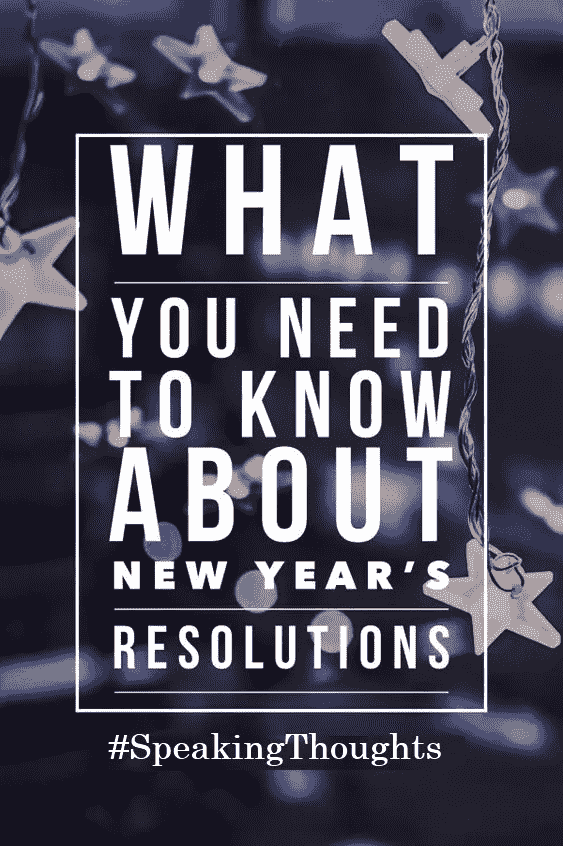

# 新年(2019)决议

> 原文：<https://medium.datadriveninvestor.com/new-year-2019-resolutions-de4c6e9845e6?source=collection_archive---------24----------------------->

新的一年不会改变任何事情，除非我们决定改变自己。

现在是新年季节。2019 年袭击了我们，像每年一样，我们都很兴奋，并对它寄予厚望。

现在是新年季节。2019 年袭击了我们，像每年一样，我们都很兴奋，并对它寄予厚望。

我相信最好回顾一下你过去的一年，了解你的优势和劣势。你得到了什么，失去了什么，去年你作为一个人到底在哪里，以及评估你的能量。你有多少技能，你从生活方式中消除了多少负面习惯，你的财务状况与前一年相比如何。基于所有这些观察，我们都应该为来年制定新年计划。

我见过人们变得兴奋，每年都立下很高的决心，却连一个星期都没有实现。

让我给你一个改变生活的公式，它将帮助你长期坚定地遵循你的决心。相信我会有帮助的。我的公式是“变得灵活，划分和承诺。”

大多数时候，我们无法遵循我们的决心，因为我们对自己期望很高，设定了很高的目标，并开始如此努力地鞭策自己。因此，我们也期待快速的结果。我们希望在几个小时或几天内看到结果，我们甚至不能等待几个星期或几个月，因为我们正在努力推动自己，试图尽快实现目标，回到我们的日常生活中。重要的是设定更轻松灵活的决心，并遵循它们。我们还应该明白，新年决心不是要实现的目标，而是一种生活方式，或者说是我们一生都应该遵循的习惯。所以，在制定任何新年计划之前，请三思。

最好将一年分成两个 6 个月的跨度或四个 3 个月的跨度，并在每个跨度内划分目标和决心。给自己设定短期目标，而不是制定艰难的决心，到头来一事无成

我的公式的另一个重要成分是承诺。我们需要明白承诺是关键。没有决心，制定任何决心都是没有意义的。因此，我们应该树立的第一个决心就是坚持我们的决心。

我的新年决心是做一个更好的自己，挑战自我，挑战极限，尝试体验生活中的新事物。在这篇文章中，我将制定一个计划，让自己变得更好

读书:对我来说，读书就是呼吸。这是我的爱好，并帮助我提高了知识，成为一个更好的人，无论是在个人生活还是职业生涯中。我会继续读下去。今年，我接受了 20 本书的挑战，这意味着一本书大约需要 3 周时间。

写作:我热爱写作，它一直贴近我的心。写作是我的爱好之一。它帮助我表达我自己和我的想法。它还帮助我思考，策划我的思维，将我的想法汇集在一段话或一篇文章中。今年我也会继续写更多的东西。因此，今年的挑战是每周写一篇文章。每周写一篇文章没什么大不了的，但是一致性很重要。如果我一周写一篇文章，那就是一个月 4 篇，一年 52 篇。

身心健康:我在 3 年前开始了我的健身之旅，我仍然致力于体育活动，如跑步或健身房。现在它已经成为我身体的要求。因此，今年我将继续我的体育活动，特别是慢跑和跑步。因此，今年的挑战是跑或慢跑 400 公里，并将我的体重控制在 70-75 公斤的阈值水平。我也会保持身材。

食物和饮料:我不知道为什么，但我一直想吃素。我不喜欢吃肉(鸡肉、牛肉、羊肉等)，但我做不到。今年我将尽量减少肉类消费，增加沙拉和蔬菜的摄入量，而不是垃圾食品和软饮料。今年的另一个挑战是增加我的用水量。建议每天服用 2- 2.5 升。但是我每天会喝 3-4 升水。一年总共有 1100 窝。

消除 3 个消极习惯，增加 3 个积极习惯:习惯是我们的倒影，所以它们定义了真实的我们。我们与之相处的人会影响我们的生活和习惯。这是几年来我一直在决心中加入的新东西。所以，让我们为今年制定一个规则 3。我将从我的生活中剔除 3 个消极的人，增加 3 个积极的人，他们会对我的生活产生更好的影响。我还会采纳 3 个积极的习惯，消除 3 个让我分心的消极习惯。

1.纪律(生活、工作)2。祈祷 3。完美主义(做高质量的工作)

旅行:今年的另一个新挑战。我是一个内向的人，和其他内向的人一样，我不喜欢旅行和结识新朋友。所以今年的挑战是旅行和参观 12 个新的地方，我以前从未去过的地方。

增加和提高技能，并创造另一个收入来源:我一直只依靠一个收入来源和同样的收入技能。我曾多次尝试创建另一个来源，如 NewsViewz、TechViews 和许多其他倡议，但我都没能继续下去。今年，我将创造和装备自己的技能，以创造新的收入来源。这将与我目前的技能和工作领域完全不同。不知道会是什么。

更专注于我的博士学位:最后一个但并非最不重要的挑战是专注于我的博士学位。无论发生什么，我每天至少会花 4-6 个小时在我的博士工作上。我会接受挑战，主动出击，尝试体验生活。站在正确的一边，而不是安全的一边。

然而，真正的挑战是坚持挑战，并在明年年底之前审查所有进展。

[#新年](https://www.facebook.com/hashtag/newyear?source=feed_text&epa=HASHTAG&__xts__%5B0%5D=68.ARAtWQ1-G3ANc2Ub0YkrOKpE0_91xed1hqbLkskkD12Bohml_oa3eeQCUH7eNBHY-L4lyxmh_mg2kkrqVlr1ejX0jtsM7U0ge1vehBDhn3qhwXkyhh_96ZqwpoDEqdF8zjYzvGoKnUx1RSQAhxOz9-7-TG8TAelJJET4imOW3vAF37ckFJRk8nnKys_aaIL1S8xYWsu2cQ6nNOEjekYT4cGMo3guxVJVj9cbjYsdr7JnQsAC3Ya-AFF8XyA6b5ve2CVkOYZwQtqAWf6fA5k_AdfSA9PCWQlqmFGrRVuEVeFSC6olHMqmKl1TGUrwJbSl4aVbxJ1VQ6X76-Gfg55gKMs&__tn__=%2ANK-R)[#新年决心](https://www.facebook.com/hashtag/newyearresolution?source=feed_text&epa=HASHTAG&__xts__%5B0%5D=68.ARAtWQ1-G3ANc2Ub0YkrOKpE0_91xed1hqbLkskkD12Bohml_oa3eeQCUH7eNBHY-L4lyxmh_mg2kkrqVlr1ejX0jtsM7U0ge1vehBDhn3qhwXkyhh_96ZqwpoDEqdF8zjYzvGoKnUx1RSQAhxOz9-7-TG8TAelJJET4imOW3vAF37ckFJRk8nnKys_aaIL1S8xYWsu2cQ6nNOEjekYT4cGMo3guxVJVj9cbjYsdr7JnQsAC3Ya-AFF8XyA6b5ve2CVkOYZwQtqAWf6fA5k_AdfSA9PCWQlqmFGrRVuEVeFSC6olHMqmKl1TGUrwJbSl4aVbxJ1VQ6X76-Gfg55gKMs&__tn__=%2ANK-R)[#新年 2019](https://www.facebook.com/hashtag/newyear2019?source=feed_text&epa=HASHTAG&__xts__%5B0%5D=68.ARAtWQ1-G3ANc2Ub0YkrOKpE0_91xed1hqbLkskkD12Bohml_oa3eeQCUH7eNBHY-L4lyxmh_mg2kkrqVlr1ejX0jtsM7U0ge1vehBDhn3qhwXkyhh_96ZqwpoDEqdF8zjYzvGoKnUx1RSQAhxOz9-7-TG8TAelJJET4imOW3vAF37ckFJRk8nnKys_aaIL1S8xYWsu2cQ6nNOEjekYT4cGMo3guxVJVj9cbjYsdr7JnQsAC3Ya-AFF8XyA6b5ve2CVkOYZwQtqAWf6fA5k_AdfSA9PCWQlqmFGrRVuEVeFSC6olHMqmKl1TGUrwJbSl4aVbxJ1VQ6X76-Gfg55gKMs&__tn__=%2ANK-R)[#阅读](https://www.facebook.com/hashtag/reading?source=feed_text&epa=HASHTAG&__xts__%5B0%5D=68.ARAtWQ1-G3ANc2Ub0YkrOKpE0_91xed1hqbLkskkD12Bohml_oa3eeQCUH7eNBHY-L4lyxmh_mg2kkrqVlr1ejX0jtsM7U0ge1vehBDhn3qhwXkyhh_96ZqwpoDEqdF8zjYzvGoKnUx1RSQAhxOz9-7-TG8TAelJJET4imOW3vAF37ckFJRk8nnKys_aaIL1S8xYWsu2cQ6nNOEjekYT4cGMo3guxVJVj9cbjYsdr7JnQsAC3Ya-AFF8XyA6b5ve2CVkOYZwQtqAWf6fA5k_AdfSA9PCWQlqmFGrRVuEVeFSC6olHMqmKl1TGUrwJbSl4aVbxJ1VQ6X76-Gfg55gKMs&__tn__=%2ANK-R)[#写作](https://www.facebook.com/hashtag/writing?source=feed_text&epa=HASHTAG&__xts__%5B0%5D=68.ARAtWQ1-G3ANc2Ub0YkrOKpE0_91xed1hqbLkskkD12Bohml_oa3eeQCUH7eNBHY-L4lyxmh_mg2kkrqVlr1ejX0jtsM7U0ge1vehBDhn3qhwXkyhh_96ZqwpoDEqdF8zjYzvGoKnUx1RSQAhxOz9-7-TG8TAelJJET4imOW3vAF37ckFJRk8nnKys_aaIL1S8xYWsu2cQ6nNOEjekYT4cGMo3guxVJVj9cbjYsdr7JnQsAC3Ya-AFF8XyA6b5ve2CVkOYZwQtqAWf6fA5k_AdfSA9PCWQlqmFGrRVuEVeFSC6olHMqmKl1TGUrwJbSl4aVbxJ1VQ6X76-Gfg55gKMs&__tn__=%2ANK-R)[#美食](https://www.facebook.com/hashtag/food?source=feed_text&epa=HASHTAG&__xts__%5B0%5D=68.ARAtWQ1-G3ANc2Ub0YkrOKpE0_91xed1hqbLkskkD12Bohml_oa3eeQCUH7eNBHY-L4lyxmh_mg2kkrqVlr1ejX0jtsM7U0ge1vehBDhn3qhwXkyhh_96ZqwpoDEqdF8zjYzvGoKnUx1RSQAhxOz9-7-TG8TAelJJET4imOW3vAF37ckFJRk8nnKys_aaIL1S8xYWsu2cQ6nNOEjekYT4cGMo3guxVJVj9cbjYsdr7JnQsAC3Ya-AFF8XyA6b5ve2CVkOYZwQtqAWf6fA5k_AdfSA9PCWQlqmFGrRVuEVeFSC6olHMqmKl1TGUrwJbSl4aVbxJ1VQ6X76-Gfg55gKMs&__tn__=%2ANK-R)[#旅行](https://www.facebook.com/hashtag/traveling?source=feed_text&epa=HASHTAG&__xts__%5B0%5D=68.ARAtWQ1-G3ANc2Ub0YkrOKpE0_91xed1hqbLkskkD12Bohml_oa3eeQCUH7eNBHY-L4lyxmh_mg2kkrqVlr1ejX0jtsM7U0ge1vehBDhn3qhwXkyhh_96ZqwpoDEqdF8zjYzvGoKnUx1RSQAhxOz9-7-TG8TAelJJET4imOW3vAF37ckFJRk8nnKys_aaIL1S8xYWsu2cQ6nNOEjekYT4cGMo3guxVJVj9cbjYsdr7JnQsAC3Ya-AFF8XyA6b5ve2CVkOYZwQtqAWf6fA5k_AdfSA9PCWQlqmFGrRVuEVeFSC6olHMqmKl1TGUrwJbSl4aVbxJ1VQ6X76-Gfg55gKMs&__tn__=%2ANK-R)

喜欢我的脸书页面:[说出想法](https://www.facebook.com/speakingthoughts.ne)