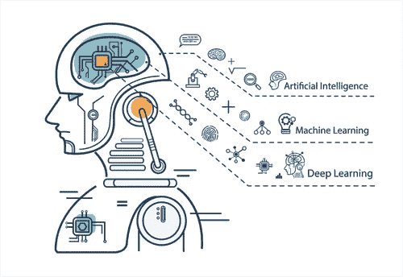

# 新年新趋势:2019 年的人工智能

> 原文：<https://medium.datadriveninvestor.com/new-year-new-trends-ai-in-2019-207af45e08e7?source=collection_archive---------11----------------------->

在这个不断发展的人工智能世界中，它继续寻找新的方法来打动我们。为了让我们的日常生活变得更加简单和复杂，公司和企业正在开发新的设备和创新来实现这一点。我们几乎在日常生活的每个领域都看到了变化，包括家庭、工作场所和交通。随着人工智能领域在这些领域不断取得进步，企业和个人必须努力利用这些创新。人工智能的这种快节奏运动不断改变着我们的工作角色，我们驾驶的方式，我们学习的方式，甚至是管理我们社会的法律。以下是我们可以期待在 2019 年看到的几个趋势。

**职场中的 AI**

毫无疑问，人工智能已经出现在我们的工作场所。如今，许多员工担心工作的自动化，担心这些工作会被所谓的“机器人”抢走。虽然自动化在许多工作领域已经变得普遍，但仍然需要人类员工来全面执行和完成组织的目标。此外，增加人机关系的协作对实现这些目标至关重要。随着新的技术进步进入与工作相关的任务，员工将经历更多的培训，以提高他们使用人工智能应用程序的能力。这种训练甚至可能是用 AI 本身来进行的！通过 AR(增强现实)和 VR(虚拟现实)，员工将学习如何正确地与 AI 合作，以便更有效地执行战略目标。

由于人工智能的进步，一个特别的领域发生了迅速的变化，那就是医疗保健。随着时间的推移，医生和其他医疗保健专业人员的职业角色只会在他们的行业中经历更多的变化。目前，考虑到该行业涉及的信息每 3-4 年翻一番，这些专业人员在处理信息方面正在经历变化。2019 年，由于基于机器学习的系统能够分析大量数据，医疗保健工作者可以期待看到数据处理方式的变化。此外，医疗保健专业的学生可以期待看到他们的教学方式发生变化，学习如何使用决策支持系统(DSS)来分配处方，而不是手动分配。此外，医疗保健行业的这些变化允许专业人员更多地关注不可替代的功能，如临床评估和患者教育，而不是自动化任务。

**AI 和交通**

当我们想到人工智能和交通时，埃隆·马斯克和特斯拉的自动驾驶汽车经常会浮现在脑海中。2019 年，我们可以期待看到几辆配备这些和其他联网驾驶辅助设备的车辆。奥迪、捷豹、沃尔沃和讴歌等汽车制造商预计将发布内置若干人工智能组件的车辆。这些驾驶员辅助设备包括自动变道、辅助转向、行人检测等。

这些车辆将主要在欧洲发布，因为许多针对分心驾驶的法律阻止了许多驾驶辅助设备在北美的实施。虽然这些驾驶辅助设备允许司机将他们的眼睛从方向盘上移开来回答短信或电话，但法律并没有改变来适应这些新的进步。我们可以期待在 2019 年内看到围绕自动驾驶和人工智能其他领域的法律发生一些变化。

**家中的 AI**

亚马逊 Alexa 和谷歌 Home 等个人助理的使用越来越多，这使得它们成为每个家庭的常见元素。用户对着这些设备播放音乐，了解天气情况，或者按照食谱进行操作。随着这些个人助理在人们家中变得越来越普遍，我们将开始看到这些设备的许多进步。正如我们已经看到的，这些个人语音助理在改进技术方面已经取得了很大进展。它们可以识别方言，甚至用户语言中的上下文。2019 年，我们可以期待的是自然语言处理(NLP)的进一步改进和对额外上下文层的支持，这将唤起设备和用户之间的更多交流，以提供更详细的搜索结果。

除了个人语音助手，我们可能会开始与家中的其他设备交谈。像电视、冰箱、甚至灯这样的物体可以开始用通信技术编程，以听取用户的提示。如果你正在创建一个购物清单，并想知道你是否需要鸡蛋，只要说“我明天有足够的鸡蛋做煎蛋卷吗？”，你的冰箱就会给出正确的答案。我们可以期待在 2019 年看到更多这种对话式人工智能。

人工智能是一个非常进步和创新的技术领域，它每分钟都在改变我们生活的许多领域。我们每天都看到不断的变化和进步，影响着我们的工作、驾驶和娱乐方式。当我们回顾过去几年时，我们可以看到人工智能的重大创新变化，这些变化可能比预期的要快。随着我们进入 2019 年，人工智能的这种快速发展将继续流行。

最初发布于 2018 年 12 月 24 日@ [aiapplied.ca](https://www.aiapplied.ca/2018/12/24/new-year-new-trends-ai-in-2019/)