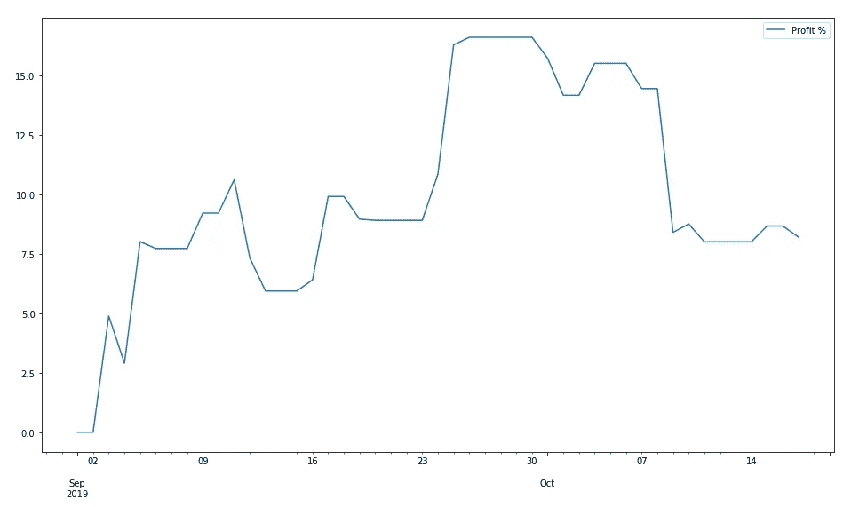
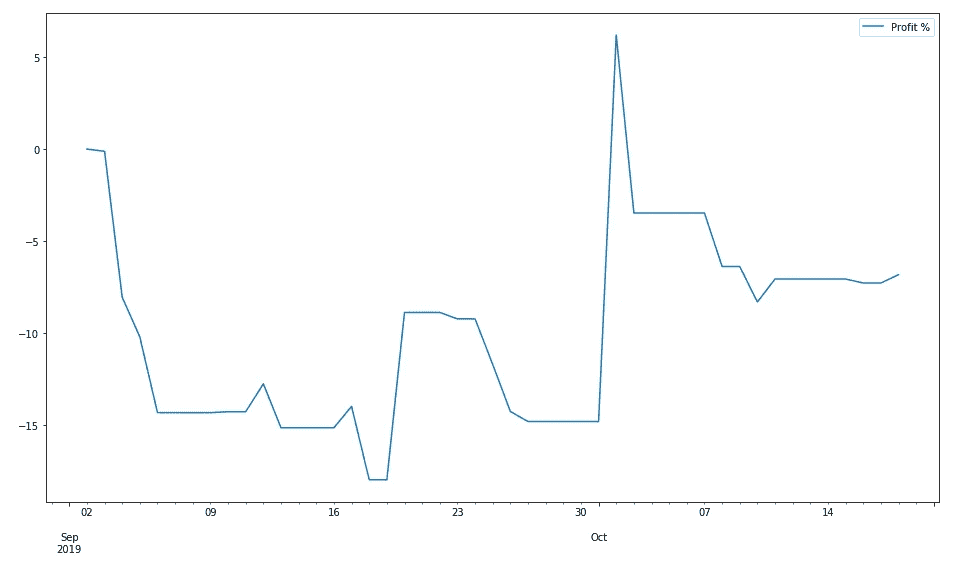

# 面向家庭用户的新闻驱动型股票交易

> 原文：<https://medium.datadriveninvestor.com/news-driven-stock-trading-for-home-users-e459142516b0?source=collection_archive---------1----------------------->

来自新闻源的信息可以用来成功预测股票价格吗？

多年来，专业交易者一直在他们的自动交易系统中成功地使用这些信息。私人用户在这里有可能成功吗？

 [## 算法交易的机器学习|数据驱动的投资者

### 当你的一个朋友在脸书上传你的新海滩照，平台建议给你的脸加上标签，这是…

www.datadriveninvestor.com](https://www.datadriveninvestor.com/2019/01/30/machine-learning-for-stock-market-investing/) 

有很多不同的方法可以从新闻数据中预测价格，比如从深度学习的[新闻标题](https://medium.com/@Currie32/predicting-the-stock-market-with-the-news-and-deep-learning-7fc8f5f639bc)中的每日股票变化，或者从文章中的[比特币价格变化](https://towardsdatascience.com/how-to-use-news-articles-to-predict-btc-price-changes-c37e305a97f)。最近几个月，我一直在使用“ [**【新闻追踪】**](https://medium.com/datadriveninvestor/newstrace-a-method-to-analyze-the-impact-of-news-articles-on-stock-prices-2e866c16a9f) ”分析方法试验策略的表现。我的 web 服务“**Pinalyze**”([www.pinalyze.com](http://www.pinalyze.com))正在为我做这项工作。

考虑到系统的买入和卖出建议，结果是以下性能:

Summed up win/loss % of daily changes

从 9 月初至今，统计新闻文章发表当天各推荐股的涨跌百分比。如果信号为正，则取%的每日变化，如果信号为负，则取符号相反的%的每日变化。这导致 7.5%范围内的良好性能。但是这种策略可行吗？

不，不是这种形式！

使用整个交易日的日变化。但只有当新闻报道出现，投资者收到信号时，才有可能采取行动。多亏了 Pinalyze，这可以在几分钟内完成，但与反应更快的专业交易系统相比，这太慢了。基于新闻信息的市场运动是可识别的，但是反应不够及时和快速。

**真讨厌！**

但是仍然有办法从新闻中获得信息。在与上面相同的场景中，我没有看新闻的发布日期，而是第二天。这一策略提供了以下性能:

Summed up win/loss % of daily changes — next day

这与新闻发布当天的业绩发展呈现出相反的景象。大约负 6%。这似乎是一个技术性的反措施，以补偿前一天的价格上涨。

这可以通过卖空股票来实现。

在这种情况下，仍然有足够的时间来执行操作(交易)。