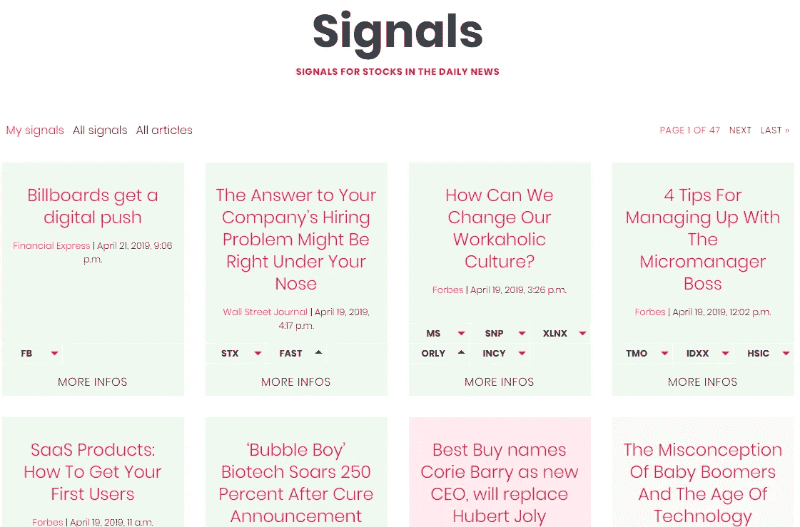
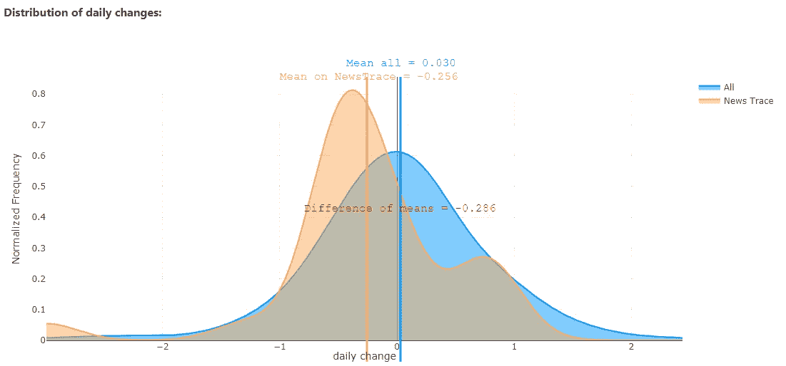
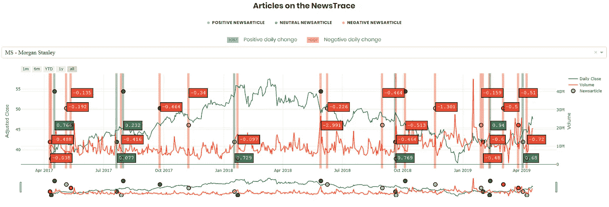

# 股票预测的新闻历史

> 原文：<https://medium.datadriveninvestor.com/news-history-for-stock-prediction-1bda5c51a0ff?source=collection_archive---------4----------------------->

在[之前的一篇](https://medium.com/datadriveninvestor/newstrace-a-method-to-analyze-the-impact-of-news-articles-on-stock-prices-2e866c16a9f)文章中，我描述了一种方法(称为“ **Newstrace** ”)，通过比较类似新闻的日子与其他日子的每日变化来分析新闻文章对股票价格的影响。主要观点是，类似的消息可能会对股票价格产生相同的影响。查看一篇新的新闻文章，你可以使用过去类似新闻的影响信息(“新闻追踪”)作为交易决策的信号。

这个方法的步骤可以用一些软件工具和 python 脚本来完成，正如我在[的文章](https://medium.com/datadriveninvestor/newstrace-a-method-to-analyze-the-impact-of-news-articles-on-stock-prices-2e866c16a9f)中所描述的。但是要分析一个文本来得出正确的结论需要大量的工作。每天都有成千上万的相关新闻。因此，我开发了一个名为“**Pinalyze**”([www.pinalyze.com](http://www.pinalyze.com))的新服务，它可以帮我完成这项工作。

 [## 机器学习对外汇交易的挑战——数据驱动的投资者

### 机器学习是人工智能的一个分支，之前占据了很多头条。人们是…

www.datadriveninvestor.com](https://www.datadriveninvestor.com/2019/02/18/the-challenge-of-forex-trading-for-machine-learning/) 

Pinalyze 阅读来自重要出版商的新闻，并在每篇文章的新闻发布后立即进行分析。在写这篇文章的时候，有 17 个不同的新闻来源，如彭博、CNN 等。都被盖住了。对几家[公司](https://www.pinalyze.com/aktien/A)(目前为 209 家)的股价进行了分析。

Pinalyze 然后从它收集的大量信息中为你选择相关信息。定义你感兴趣的股票和新闻来源，你会得到一个你可能感兴趣的带有交易信号的新闻列表。

在[注册免费计划](https://www.pinalyze.com/accounts/signup/)后，你可以定义你的兴趣档案，并查看系统最近几天发现的信号列表。

List of signals

情绪积极的文章用绿色表示，情绪消极的文章用红色表示，上面有向上或向下的小箭头，指示股票的运动方向。

如果您不想错过新的信号，您可以在配置文件设置中选中“给我发送邮件提醒”复选框，以获得一封包含信号基本信息和分析仪表板链接的电子邮件。在网站上，您可以通过单击标题或“更多信息”按钮来查看分析控制面板。在这个页面上，你必须订阅[保费计划](https://www.pinalyze.com/accounts/pay/)。

Analysis dashboard

仪表板显示了文章的第一句话，并给出了股票的概述，这些股票在过去类似的文章中有有趣的上升或下降。你可以查看这些相关文章的列表，方法是点击一个按钮，获得一个列表，其中有到原始新闻页面的链接，以及一个绿色或红色的点，指示过去文章的观点。

“分析”按钮显示信号的统计特性分析，以及在同一时间范围内，新闻跟踪上几天相对于其余几天的每日变化分布图。

Distributions of daily changes

该图比较了“新闻跟踪”(新闻与分析文章相似的日子)与其余日子的每日变化分布。

*   “新闻追踪”分布及其均值向左或向右偏移了吗？
*   这些分布是正态分布吗？
*   数据中有异常值吗？

你也可以看看被检查的时间跨度内股票价格的折线图，图中的绿色和红色柱线表示“Newstrace”文章的出版日期。这些天的价格变动用绿/红旗标记，文章的情绪用圆点标记。

Line chart of the “Newstrace”

变化直方图和箱线图可以帮助您更深入地进行统计分析，例如发现趋势、数据中的异常值或可视化分布形状。

Boxplot of the daily changes

在我的下一篇[文章](https://medium.com/@andreasstckl/a-newstrace-analysis-example-with-pinalyze-com-7272c18193f8)中，我将在一篇有信号的新闻文章中展示这些步骤。