# 2018 年比特币损失了多少钱

> 原文：<https://medium.datadriveninvestor.com/newshard-times-how-much-money-has-been-lost-in-bitcoin-in-2018-d3bc2b8bd971?source=collection_archive---------8----------------------->

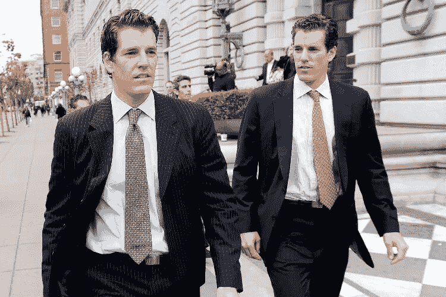

如果你在 2017 年眨了眨眼，在 2018 年底睁开眼睛，那么我们有一些重要的消息要告诉你！

*   **第一。**你不能再为你的突破性项目写白皮书了，即使你相信它会走向 ICO。一个伟大的想法，使筹集资金成为可能，没有繁文缛节和浮夸的投资，令人绝望地名誉扫地——无原则的家伙已经拿走了这个想法中可以榨取的一切，驾着雪白的游艇驶向夕阳，开着火红的法拉利或柠檬黄的兰博基尼。当然是那些幸运的人。其余的，显然，安息了。
*   **第二个。约翰·迈克菲将他自制美食的烹饪秀推迟到 2020 年。也许，他希望我们已经忘记，但我们仍然记得。**

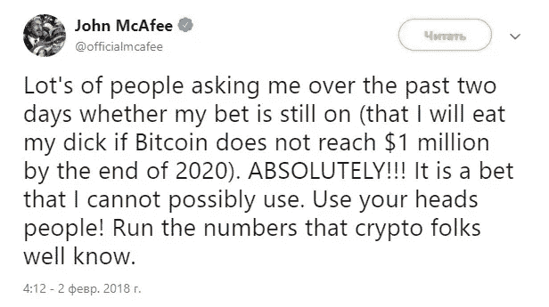

*   **第三个。**集权与分权进行了殊死的斗争，并取得了胜利。密码界期待机构投资者(ETF！)来到市场:他们会带来钱，他们会给垂死的游乐园注入生命——彩灯会被打开，旋转木马会再次转动，滑稽的小丑(见第二点)会继续他们的表演。

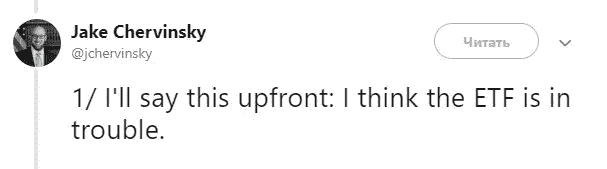

*   **第四个。**比特币现金不再是“同一个真实的比特币”，由中本聪创造。不再是了。现在市场上甚至出现了更多“非常”的比特币——比特币 SV。而为了证明这一点，在硬分叉之后，创作者们与第一个上演了一场哈希大战，动用了重炮——“攻击 51%”。虽然没有成功，但是所有的密码社区立刻相信了——是的，它们是真实的。不管它是什么，比特币 SV 在资本化方面牢牢占据了前十大加密货币的位置，承诺为矿商带来巨额资金和快速的天文数字利润。
*   **第五。**关心 2018 年你在比特币上损失了多少钱？有些人输得更多。看看这个。

# 亿万富翁失败者

**克里斯·拉森**是 Ripple 的创始人之一和前任首席执行官。2018 年 1 月，他是这个星球上最富有的五个人之一，仅 XRP 代币一项，他的财富就估计有 172 亿美元。

克里斯·拉森目前的财富估计有 21 亿美元，在福布斯排行榜上仅排在第 383 位。

2007 年，高盛的前合伙人迈克尔·诺沃格拉茨成为亿万富翁。在 2016-2017 年赚了 2.5 亿美元的加密货币。

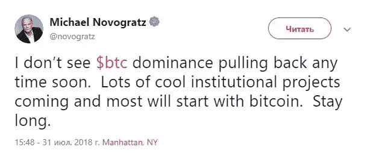

然而，在 2018 年的前 9 个月，银河数字资产(由诺沃格拉茨管理的公司)已经亏损了 1.36 亿美元。

**约瑟夫·卢宾**，以太坊联合创始人，ConsenSys 创始人，也是前高盛员工。根据福布斯的数据，2018 年初，他的财富估计为 10-50 亿美元的加密货币。

从 1 月到 12 月，以太坊的价格下降了大约 10 倍，因此，目前鲁滨的加密货币状态为 1-5 亿美元。

**维塔利科·布特林**是以太坊的另一位创始人。据信，他在年初的加密货币状态约为 4-5 亿美元。

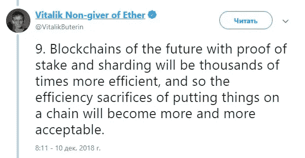

借助简单的计算，我们可以找出目前的数字:4000-5000 万美元以太坊。

**伊恩·巴里纳**是一名加密爱好者、加密博客作者、加密 youtuber 用户和加密投资者。在他的一次[广播](https://www.youtube.com/watch?v=AWWAyArwvxk&feature=youtu.be&t=11m36s)中，巴里纳从该频道的观众那里得知了最新消息——有人正在从他的钱包里提取资金。

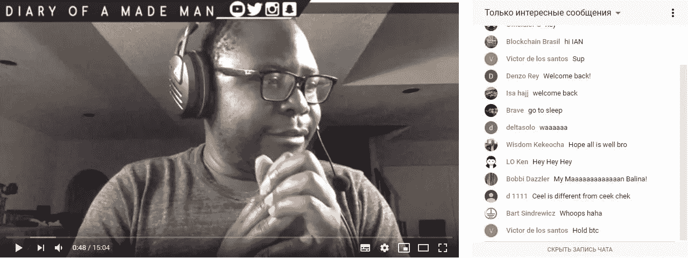

今年有多少人在比特币上输了钱——你只要猜一猜，伊恩·巴里纳也加入了他们的行列。据一名加密投资者称，他的一种加密货币中约有 200 万美元被盗。可能值得相信这个密码博主，虽然，他并不担心损失，因为这对他来说是一个很好的教训。

马克·道是一名经济学家，前国际货币基金组织雇员——他是我们不希望从比特币中获利的人。但马克赢了:他在 2017 年 12 月对 BTC 的空头头寸[在一年后被自己平仓](https://twitter.com/mark_dow/status/1075034409495982081)。道指押注比特币在经历前所未有的上涨后，价格会下跌。他是对的。

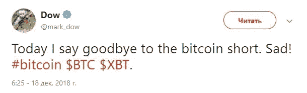

好吧，祝贺马克——至少有人在抱怨比特币损失了多少钱的同时，度过了成功的加密年！

# 媒体在谈论什么？

思想的统治者正在使局势升温:无拘无束的乐观主义者对抗即将到来的日落的阴郁使者。2018 年初，两人都蓄势待发。你能猜出谁占了上风吗？然而，让我们对第一批人表示敬意:他们坚守阵地。Властители умов гнали волну за волной: безудержные оптимисты против мрачных вестников грядущего заката.В начале 2018 года оба лагеря зарядили полные обоймы и вышли в чистое поле.Вы догадываетесь, кто из них лихим ковбойским жестом сдул дым из ствола в декабре, а кому понадобились носилки?Верно.Но отдадим должное первым — они стояли до последнего.

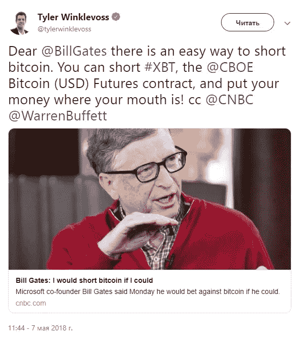

文克莱沃斯兄弟之一泰勒在受到比尔·盖茨的攻击，并发表声明表示希望与比特币一战后，[建议这位亿万富翁把钱放进嘴里。](https://twitter.com/tylerwinklevoss/status/993562310567452673)

小丑埃隆·马斯克并没有远离密码世界。一开始他想买乙醚，哪怕是骗局。

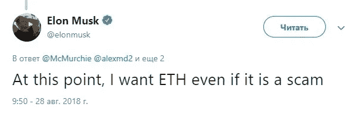

然后，埃隆想要出售比特币，这引发了他在 Twitter 上的账户被封。社交网络的管理人员不相信马斯克自己写的。

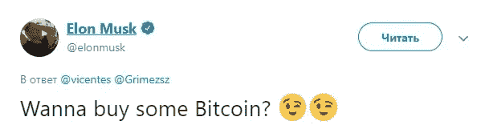

努里埃尔·鲁比尼，一位有影响力的经济学家，被称为“末日博士”——哦，是的，他“热爱”比特币，如果有机会[用棍子](http://roubinieconomics.blogspot.com/2018/11/doctor-roubini-is-not-fan-of-bitcoin-or.html)戳它，他甚至不会放过它。

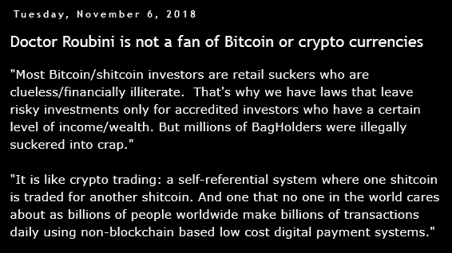

中国巨富、阿里巴巴集团创始人兼领导人马云曾多次关注区块链和加密货币。从他的[声明](https://www.bloomberg.com/news/articles/2018-06-25/jack-ma-embraces-blockchain-for-ant-but-warns-of-bitcoin-bubble)中，可以得出结论，比特币当然是泡沫，但区块链是有希望的。

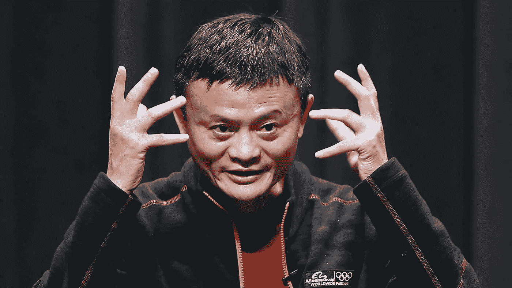

我想用一些积极的预测来完成这篇文章，给我自己和读者对未来的希望。为什么不联系以色列官员？他们肯定给我们带来了好消息！

或者不是。这个国家的前总理 Ehud Barak[相信](https://en.globes.co.il/en/article-ehud-barak-cryptocurrencies-are-a-ponzi-scheme-1001263129)区块链是好的，而比特币和其他加密货币是一个金字塔。嗯，没成功？也许值得再做一次尝试？但是现任首相怎么说呢？

本杰明·内塔尼亚胡[反映了](https://www.youtube.com/watch?v=bjDN-W5-Mmg&feature=youtu.be)这样一个事实:银行总有一天会消失，而比特币可以成为它们的替代品。也许，我们已经受够了，是时候停下来了。谢谢你，首相先生。我们也希望一切都好。不管怎样，但总会有的。

*原载于*[*bitnewstoday.com*](https://bitnewstoday.com/news/newshard-times-how-much-money-has-been-lost-in-bitcoin-in-2018/)*。*