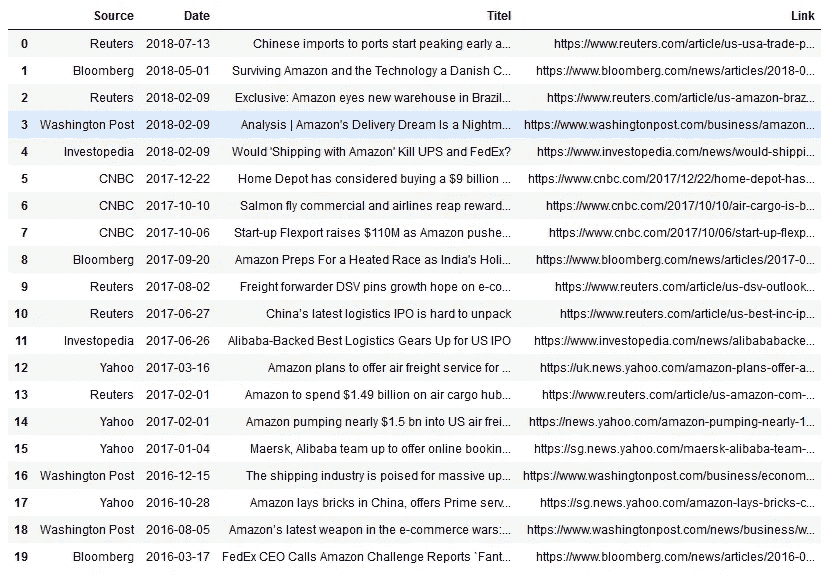
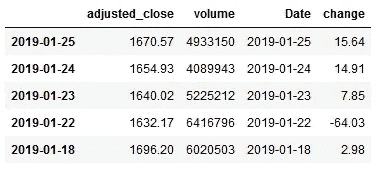
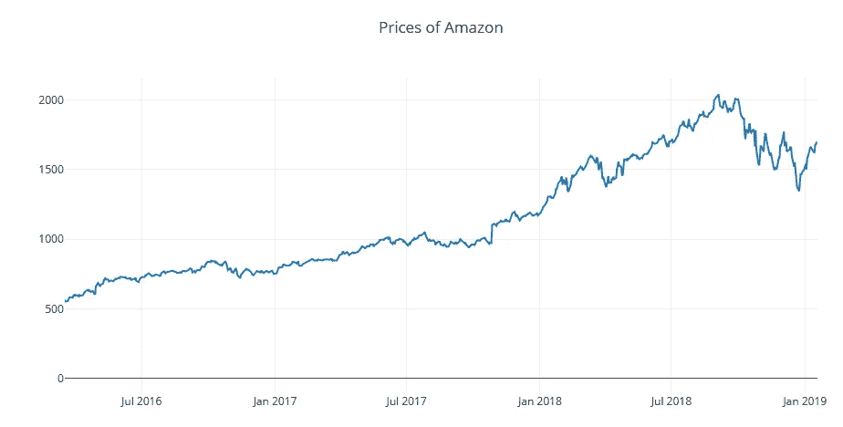
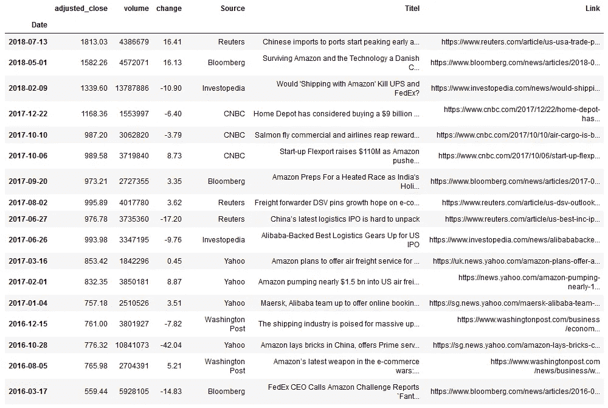
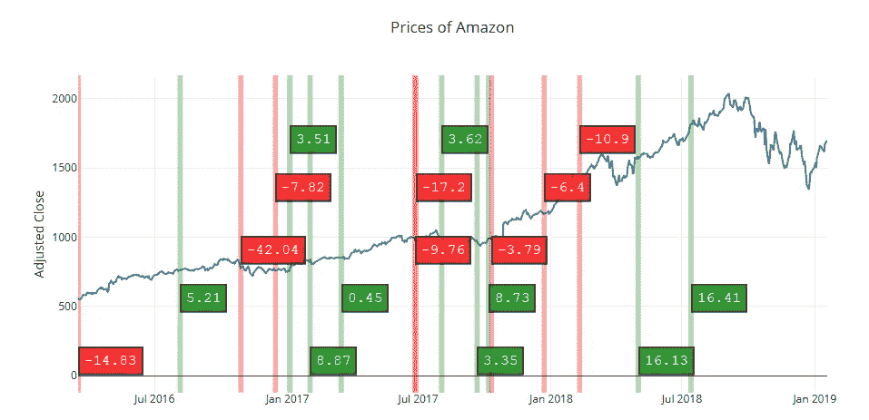
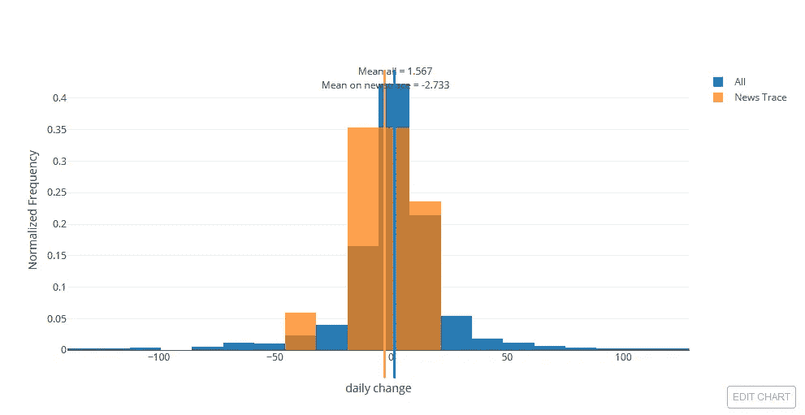
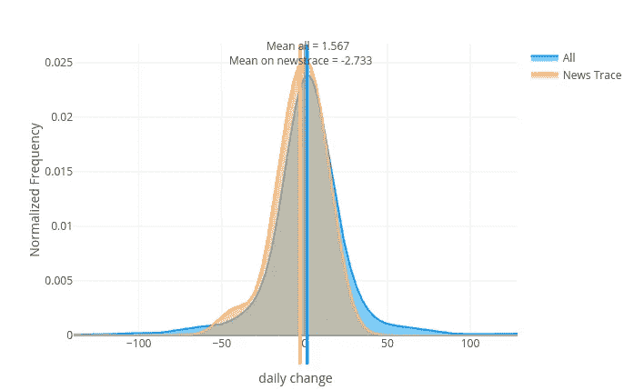

# “新闻追踪”——一种分析新闻文章对股票价格影响的方法

> 原文：<https://medium.datadriveninvestor.com/newstrace-a-method-to-analyze-the-impact-of-news-articles-on-stock-prices-2e866c16a9f?source=collection_archive---------5----------------------->

[](http://www.track.datadriveninvestor.com/1B9E)

现实世界的很多方面都被发表在网上的新闻报道所覆盖。因此，这些数据是衡量和分析真实世界对股票价格影响的宝贵资源。有许多方法和解决方案试图从这些文本文档中挤出尽可能多的信息，并将其用于洞察和预测。

在另一篇[文章](https://medium.com/@andreasstckl/news-history-for-stock-prediction-1bda5c51a0ff)中，我展示了如何使用 www.pinalyze.com[服务来完成与本文相同的方法。](http://www.pinalyze.com)

机器学习和自然语言处理的最新进展带来了许多新的可能性。他们大多使用情感分析来寻找文本中积极和消极的信号。在[https://medium . com/@ chengwei Zhang 2012/simple-stock-sense-analysis-with-news-data-in-keras-1478 b96dd 693](https://medium.com/@chengweizhang2012/simple-stock-sentiment-analysis-with-news-data-in-keras-1478b96dd693)一文中可以找到很好的介绍。

本月晚些时候，一篇有趣的帖子“利用深度学习的最新进展预测股票价格走势”([https://towardsdatascience.com/aifortrading-2edd6fac689d](https://towardsdatascience.com/aifortrading-2edd6fac689d))建立了一个股票预测模型，使用的方法包含了当今所有的流行词汇，如:

*   生成对抗网络
*   递归神经网络
*   卷积神经网络
*   贝叶斯优化
*   深度强化学习
*   堆叠自动编码器
*   和 BERT 的 NLP 等等。这形成了一个巨大的技术“黑匣子”，试图在数据中找到信号。

与此相反，我们希望开发另一种方法，它使用一些机器学习技术来指导人类获得对数据和市场的洞察力。交互式图形将有助于理解和解释数据。它包括以下步骤:

1.  我们从一篇发表的新闻文章开始，我们想分析他对股票价格的可能影响。
2.  我们正在用机器学习的方法从过去搜索类似的新闻文章，构建所谓的“Newstrace”。
3.  检查“新闻追踪”上文档的相似性
4.  获取股票数据，并在检查的时间跨度内绘制时间序列
5.  计算并绘制“新闻追踪”和其他网站上不同日期的股票价格差异
6.  调查直方图和“内核密度估计”图之间的差异
7.  计算均值差异的显著性
8.  用机器学习分析新闻文档的情感
9.  解释结果

# 从一篇新闻文章开始

为了展示这种方法，我们以一篇关于亚马逊和亚马逊股票价格(“AMZN”)的文章为例。分析的起点是 2019 年 1 月 18 日发布的新闻文章:

> **亚马逊大力进军海洋运输，让中国商品更容易到达你手中**
> 
> 记录显示，亚马逊一直在悄悄地、不为人知地加强其海运服务，在过去一年里，从中国向美国发送了近 470 万箱消费品。
> 
> 这标志着许多人认为该公司最终控制其大部分运输网络的整体战略迈出了重要一步，从卡车到飞机，现在到轮船。…

[](https://news.yahoo.com/amazon-pushing-hard-ocean-shipping-200001052.html) [## 亚马逊大力进军海洋运输，让中国商品更容易到达你的手中

### 旧金山——亚马逊一直在悄悄地、不为人知地加强其海洋运输服务，发送接近…

news.yahoo.com](https://news.yahoo.com/amazon-pushing-hard-ocean-shipping-200001052.html) 

# 查找过去类似的新闻数据

我们必须找到在过去 2 或 3 年中与给定文章最相似的新闻文章。这就定义了本文时间轴上的“新闻追踪”。“新闻追踪”是过去发布类似新闻的天数的子集。

我们可以使用不同的方法和工具找到与给定文章相似的新闻。一种是使用使用机器学习方法的软件，这些方法是根据大量新数据训练的。例如，我们可以使用谷歌浏览器的插件“新闻机器人”(【https://getnewsbot.com】T2)。


NewsBot

但是你周围有几个人可以帮你完成这个任务。

对于示例中关于 Amazon 的新闻，我们找到了 20 篇新闻帖子，并将关于它们的信息存储在一个 CSV 文件中。(可以从 https://github.com/astoeckl/newstrace 的 Github [下载)](https://github.com/astoeckl/newstrace)

该文件包含以下信息:

*   出版者
*   日期
*   标题
*   链接到文章

我们将带有“熊猫”的数据加载到一个数据帧中:



List of similar news

# 检查新闻跟踪中文档的相似性

首先，我们查看所有的文章，以检查它们是否足够相似，足以为我们的进一步分析提供有效的“新闻跟踪”。你可以通过阅读所有文章来检查一致性。为了快速检查，我们还需要一个相似性的数值度量，我们可以通过软件来计算。

你可以使用不同的解决方案。在这个例子中，我们使用“Dandelion”API 作为“语义文本分析”服务( [https://dandelion.eu)](https://dandelion.eu)) 。

我们可以用这个测试文本相似性的 API 来检查文档的成对相似性。([https://dandelion.eu/semantic-text/text-similarity-demo/](https://dandelion.eu/semantic-text/text-similarity-demo/))

注册并获得 API 令牌后，我们用新闻文章的两个 URL 调用 API 来比较它们:

Compare two documents

```
0.4211
```

我们得到这两个文档的值为 0.4211。现在，我们可以遍历“Newstrace”中的所有文档，并将它们与我们正在分析的文章进行比较，以获得相似性值:

```
[0.7653, 0.3319, 0.7373, 0.4211, 0.7717, 0.7009, 0.6418, 0.6803, 0.3319, 0.7443, 0.7509, 0.7652, 0.7881, 0.7252, 0.7472, 0.8107, 0.4211, 0.7412, 0.4211, 0.3319]
```

在这个相似性得分列表的基础上，我们希望为整个“新闻跟踪”的质量定义一个单一的数字度量。一种可能性是使用列表的平均值。其他可能是“均方根值”或列表中的最小值。

```
0.6314549999999998
```

在这个例子中我们得到了 0.631。这个数字可以用来衡量“新闻追踪”跟踪新闻文章历史的准确程度。要知道哪个数字足够高，我们必须通过手动检查新闻帖子来积累一些经验，并为更多的示例计算“新闻跟踪”的质量度量。出于本文示例的目的，相似性已经足够高了。

# 获取所需时间范围内的股票数据

在示例中，我们使用亚马逊(“AMZN”)的股票价格，并分析“Newstrace”上的运动。

我们用一个小的 Python 脚本从[www.alphavantage.co](http://www.alphavantage.co)为亚马逊(“AMZN”)下载数据。(你可以从 https://www.alphavantage.co/support/#api-key[获得一个免费的 API 密匙)](https://www.alphavantage.co/support/#api-key)

我们只是在示例中使用了成交量列并调整了收盘价，所以我们删除了其他列并将其重命名。价格被转换成数字数据。

计算每日变化，存储在“变化”栏中，并四舍五入。



# 绘制价格的时间序列

我们使用 Plotly 库(【https://plot.ly/】T4)来显示股票数据并增加交互性。使用 Plotly 的介绍可以在文章[https://towardsdatascience . com/introduction-to-interactive-time-series-visualizations-with-Plotly-in-python-d 3219 EB 7a 7 af](https://towardsdatascience.com/introduction-to-interactive-time-series-visualizations-with-plotly-in-python-d3219eb7a7af)中找到



该图显示了新闻文章时间跨度内收盘价的时间序列。

# 将新闻跟踪添加到绘图中

我们在情节中标注类似新闻文章发表的日子——所谓的“新闻追踪”。


# 在“新闻追踪”上显示每日变化

我们标注了新闻追踪日的每日变化，并将其涂成红绿色，以获得第一印象，如果有任何模式可见的话。

在绘图之前，股票价格和新闻数据的两个数据框与“日期”列上的熊猫合并，每天只存储一个条目。



在时间序列图中，我们为新闻轨迹添加形状，如上所述，但是如果当天的变化是正的或负的，则添加颜色。当天的变化量作为批注添加到形状附近。



从这张图片中，不清楚“新闻追踪”上的运动是向上还是向下更多，以及是否有一种模式。

在图中，我们还可以看到在调查的时间段内出版日期的分布。这些日期看起来像随机分布的点，几乎是均匀分布的。除了最近半年没有类似的新闻发表。

# 每日变化直方图

首先，我们将时间序列限制在观察的时间范围内。

为了分析每日变化中是否存在差异，我们绘制了“新闻跟踪”和其他日期的直方图。这两个样本的平均值也被添加到图中。



Histogram of daily changes

# 另一个可能的可视化——KDE 图

直方图可以被认为是一种方案，其中一个单元“块”堆叠在规则网格上的每个点上方。为这些区块选择网格会导致关于密度分布的基本形状的非常不同的想法。如果我们取而代之，将每个块集中在它所代表的点上，我们就可以得到密度分布的估计值。这被称为具有“礼帽”内核的内核密度估计。这个思想可以推广到其他核形状，例如，高斯核密度估计。([https://en.wikipedia.org/wiki/Kernel_density_estimation](https://en.wikipedia.org/wiki/Kernel_density_estimation)

我们在示例中使用高斯核密度估计:



KDE plot for daily changes

# 测试均值的差异

直方图和 KDE 图中的分布和平均值只显示了“新闻跟踪”和其他方面的股价运动的微小差异。我们现在想测试这些值的差值是否与零有显著差异。

首先选择“新闻追踪”上和旁边的两组日期

计算每日价格变化的两个样本的学生 T 检验统计量(【https://en.wikipedia.org/wiki/Student%27s_t-test】T2):

```
0.45727870289048655
```

这个高 p 值表明，两个样本之间的差异来自随机的假设不能被拒绝。

因此，正如直方图和密度图所示，没有**显著差异**。对新闻文章的分析没有显示出对亚马逊股票价格的影响。

在以后的文章中，我们将展示一个例子，说明“新闻追踪”对一些股票价格变动的影响。

# 新闻的情感分析

研究表明，新闻文章的情绪对股票价格有影响。因此，我们想为“新闻追踪”上的每篇文章添加额外的信息，并用这些数据开始分析。机器学习将被用于计算文本文档的情感度。

这也将在以后的文章中涉及。