# Nextcloud、OnlyOffice 以及 ECS 中带有 Docker 的 Spreed WebRTC

> 原文：<https://medium.datadriveninvestor.com/nextcloud-onlyoffice-and-spreed-webrtc-with-docker-in-your-ecs-d04587423d1f?source=collection_archive---------7----------------------->

[](http://www.track.datadriveninvestor.com/1B9E)

*By Colince Azeye，* [*阿里云科技分享*](https://www.alibabacloud.com/campaign/techshare?spm=a2c41.13057319.0.0) *作者。*[*Tech Share*](https://www.alibabacloud.com/campaign/techshare?spm=a2c41.13057319.0.0)*是阿里云的激励计划，旨在鼓励在云社区内分享技术知识和最佳实践。*

在本文中，我们将了解如何将 Nextcloud 中的 OnlyOffice 与我们的阿里云[弹性计算服务](https://www.alibabacloud.com/product/ecs?spm=a2c41.13057319.0.0) (ECS)实例中的容器集成。

但在我们开始之前，我将简要介绍一下本教程的每个组成部分。我们现在将跳过 Nextcloud 的细节，因为你可以参考这篇关于在 ECS 上安装 Nextcloud 的文章。

[](https://www.datadriveninvestor.com/2019/01/15/the-path-of-mobile-app-development-in-2019/) [## 2019 年移动应用开发之路——数据驱动投资者

### 任何在移动应用程序开发行业工作的人，无论他们是专注于在伦敦开发 iOS 应用程序还是…

www.datadriveninvestor.com](https://www.datadriveninvestor.com/2019/01/15/the-path-of-mobile-app-development-in-2019/) 

根据维基百科，Nextcloud 是一套用于创建和使用文件托管服务的客户端-服务器软件。它的功能类似于 Dropbox，尽管 Nextcloud 是免费和开源的，允许任何人在私人服务器上安装和操作它。

OnlyOffice 是一个功能丰富、全面、开放的 Office、基于云的 office 和生产力套件。该软件以前被称为 TeamLab Office，为用户提供了一个集成平台，该平台具有在线文档编辑器、CRM、文档和项目管理工具的核心元素。

Spreed 是一个免费的开源(AGPL) WebRTC 音频/视频呼叫和会议服务器，允许浏览器以对等的方式相互交谈。Spreed 让您可以使用丰富的音频、视频和文本聊天安全地进行通信，只需在浏览器中安装 Nextcloud 即可。

Docker 容器是一个标准化的单元，可以动态创建以部署特定的应用程序或环境。它在概念上类似于虚拟化技术，但最大的区别是操作系统是从容器中抽象出来的。

弹性计算服务(ECS)是一种计算服务，具有弹性处理能力，管理模式比物理服务器更简单、更高效。

# 把所有东西放在一起

现在让我们看看在我们的 ECS 上使用 Nextcloud 和 Onlyoffice 的目的是什么。想象一下，您有一个组织，需要一些工具来进行办公室协作或私人共享，同时更新所有在线资产。Nextcloud 将允许您与人联系、聊天、共享数据和协作，而只有 office 允许您在在线文档编辑器中与 Nextcloud 联系人合作，并使用 CRM 管理您的客户。Spreed 将允许您在 Nextcloud 上轻松进行电话会议。最重要的是，使用容器运行所有东西会给你在应用程序开发方面的灵活性，也让你的系统更轻便。

# 先决条件

*   您需要一个有效的阿里云帐户。如果你还没有，你可以注册一个[免费试用版](https://www.alibabacloud.com/campaign/free-trial)。
*   运行 Ubuntu 16.04 的阿里云 ECS 实例。
*   Root 访问权限或拥有 root 访问权限的用户(在 sudo 组中)。
*   有效的域名(这是可选的，但如果您想要加密您的流量，这是必需的)。

第一步:更新和升级你的系统。这两个命令将为您完成这项工作。

```
apt-get update
apt-get updgrade
```

**第二步:**安装 nginx 服务器

```
apt-get install nginx
```

检查 nginx 状态以确保正在运行。可以通过两种主要方式来检查。

*   通过使用“服务 nginx 状态”命令。

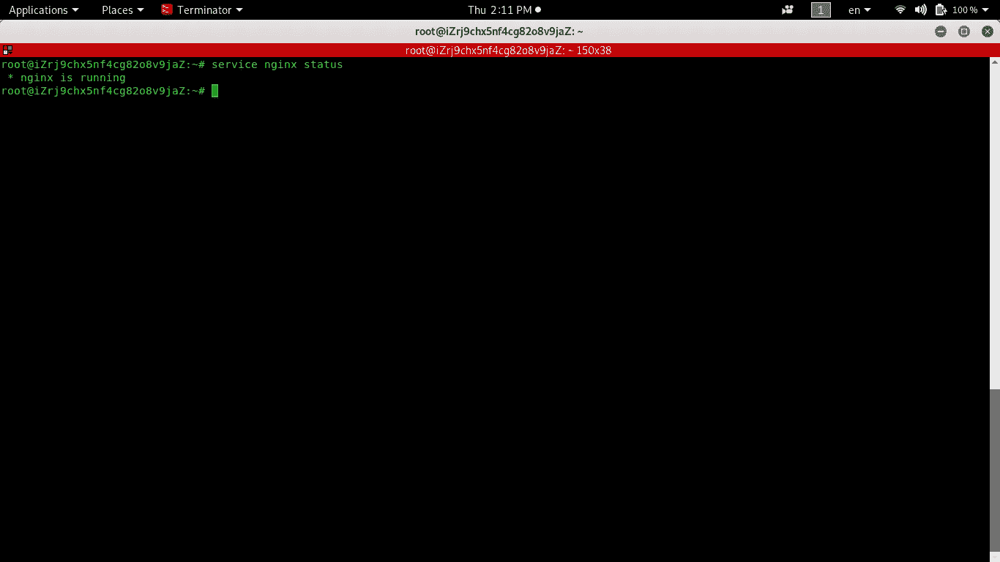

*   通过在浏览器上输入您的 ECS 实例公共 IP 地址。

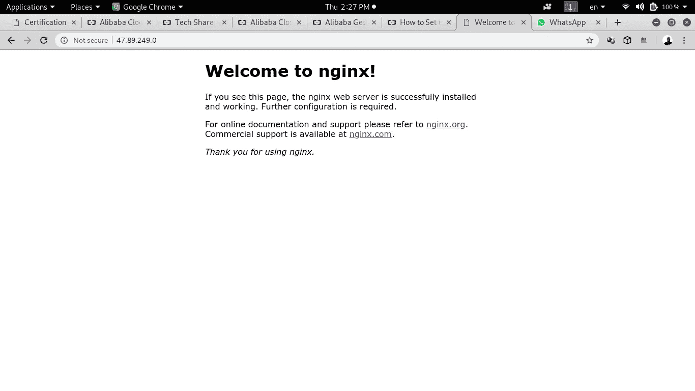

**第三步:**安装 Docker

```
apt-get install docker.io
```

您可以检查 docker 安装状态以及 docker 版本。

```
service docker status
docker -v
```

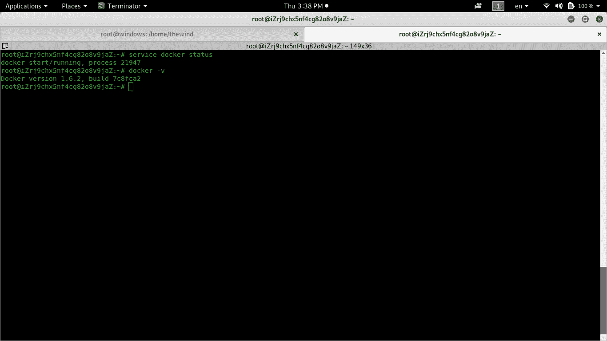

如上图所示，docker 现在运行在我的 ECS 中，版本是 1.6.2

**第四步:**安装 docker-compose:

```
sudo curl -L https://github.com/docker/compose/releases/download/1.17.1/docker-compose-`uname -s`-`uname -m` -o /usr/local/bin/docker-compose
```

它将下载 docker-compose 并将其放在 you /usr/local/bin 中。所以进入文件夹里面，把执行权交给 docker-compose。随着命令

```
chmod +x docker-compose.
```

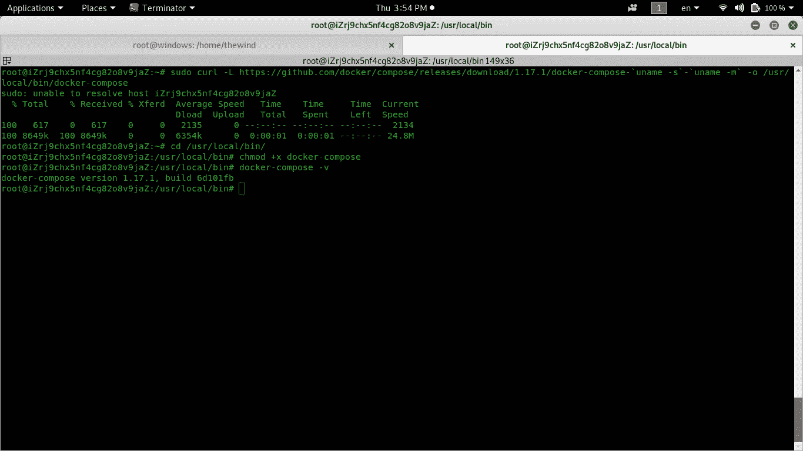

在图像中有我用来安装 docker compose 的所有步骤。我检查的最后一个命令的版本是 1.17.1。

**步骤 5:** 启用 docker 自动启动系统引导。

```
Service docer reload
```

**第六步:**克隆 githup repo 之后，进入文件夹，输入命令

```
- cd docker-onlyoffice-nextcloud
- git submodule update -remote
```

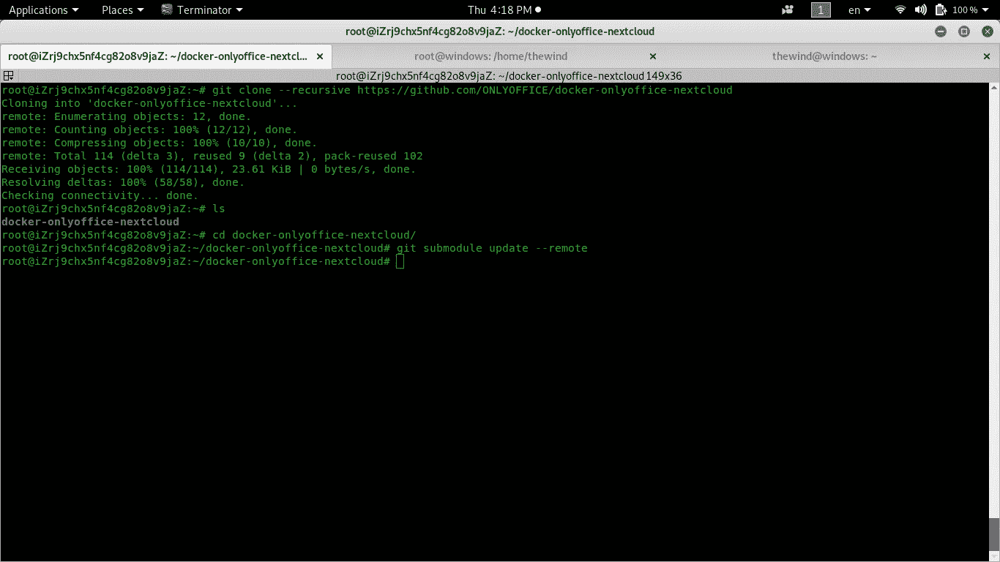

在图像内部，您可以看到所有命令和结果输入到 clone docker-only office-next cloud。

**步骤 7:** 部署 nextcloud-onlyoffice

现在输入命令:`docker-compose up -d to start container in .yml file`

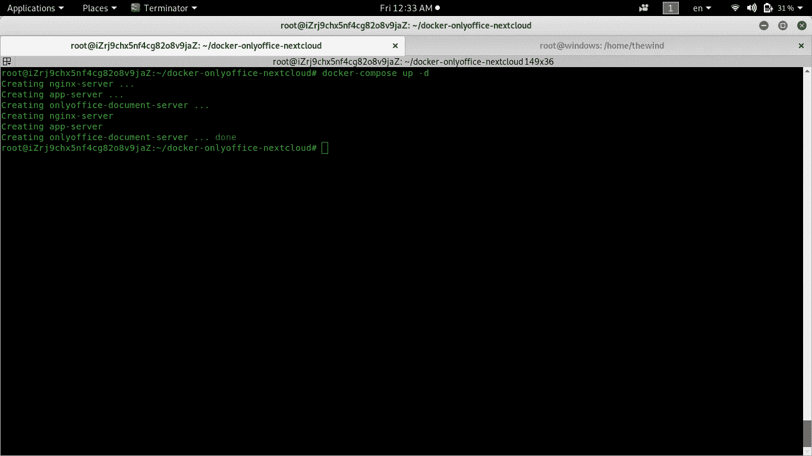

截图中可以看到 docker 容器已经成功启动。如果你在浏览器中输入你的 ip 地址，你会看到 nextcloud 界面。

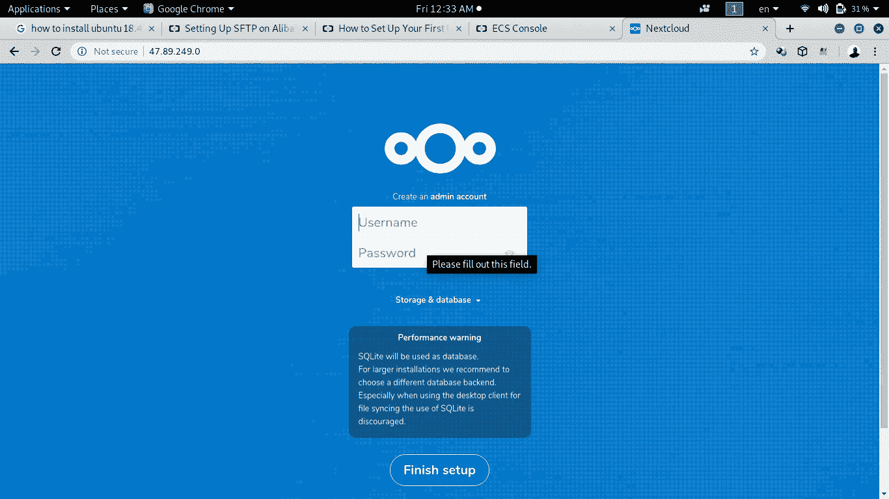

注意:如果在您完成上述所有步骤后，在输入您的公共 IP 地址时没有看到任何内容，那么很可能您的流量被阻止了。这意味着您必须允许特定端口上的流量。为此，您需要配置 ECS 的安全组和规则。

*   规则方向:输入入口
*   活动:输入允许
*   自定义端口范围:输入 80/80
*   授权对象:输入 0.0.0.0/0
*   输入描述，然后按确定

重复上述 fpr 自定义端口范围 43/43 的步骤。

您已经允许来自端口 80 和 43 的流量进入本教程，上面的配置允许您这样做。您还需要对端口 80 和 43 重复上述相同的步骤，但是将规则方向更改为 Egress。

完成后，再次访问您的 Nextcloud 服务器。

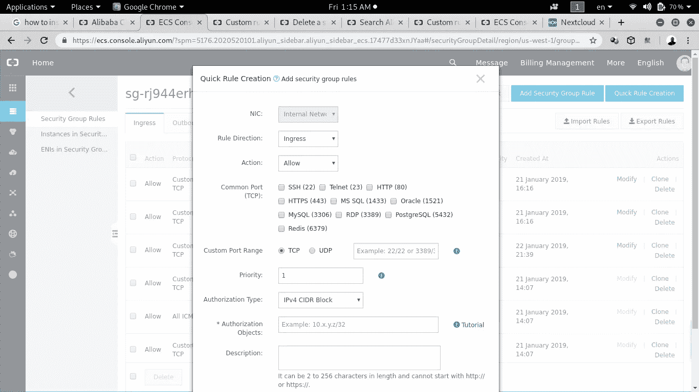

这是您必须创建规则的界面。现在让我们假设我们将使用 SQLite 作为数据库。输入您的管理员用户名和管理员密码。单击以完成设置。

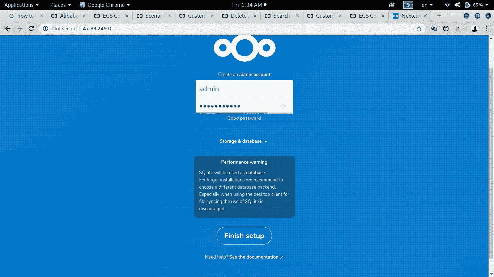

如您所见，您必须为第一个配置输入管理员凭据。几分钟后，您将被重定向到您的欢迎页面。

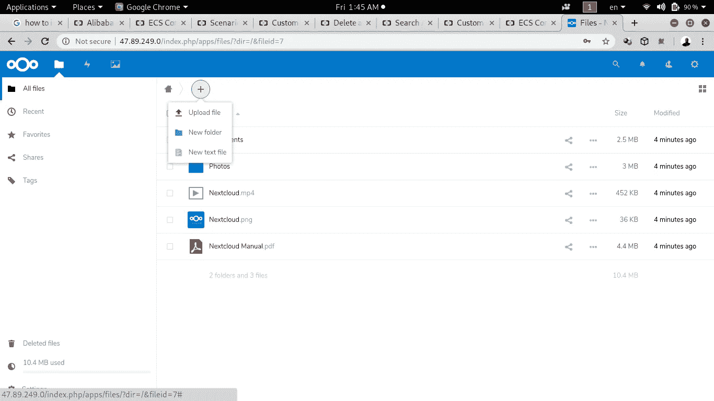

现在，我们已经在 ECS 上设置了如何使用 Nextcloud，如果您单击“add”按钮，您将不会只看到 Office。因此，要设置它，我们必须在 CLI 上，站在 docker-onlyoffice-nextcloud 文件夹中。在内部，输入命令 bash set-configuration.sh。

但在此之前，我们需要将公共 IP 地址附加到一个有效的域名，因为只有 Office 需要一个受信任的域才能工作。域名配置完成后，您应该会看到如下内容

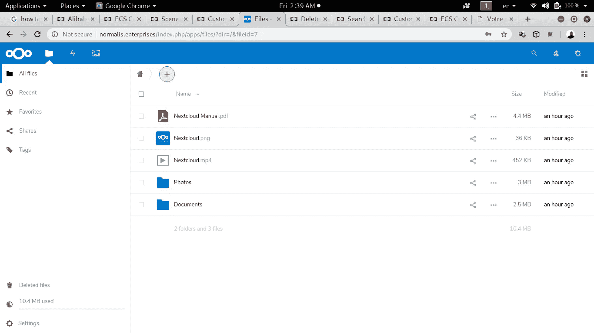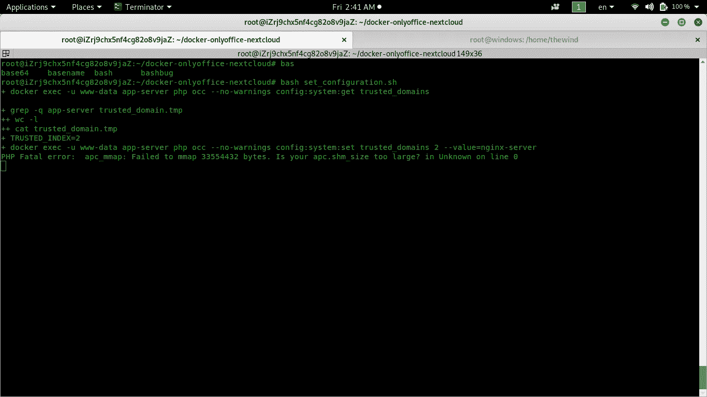

**第八步:**安装狂欢

我们需要让 Spreed WebRTC 和 Nextcloud 在同一个原点上运行。这意味着 Spreed 和 Nextcloud 可以使用相同的协议方案、相同的域和相同的端口进行访问。

访问您的 Nextcloud，在右上角找到“A”标志。点击它，然后点击应用程序。您将看到所有类别的应用程序，包括已安装的应用程序、活动的应用程序和更新。现在点击 App bundles，寻找“talk”，点击安装。

**注意:**如果您找不到 talk 应用内捆绑包，只需在上面的搜索栏中输入“talk”并点击回车即可。

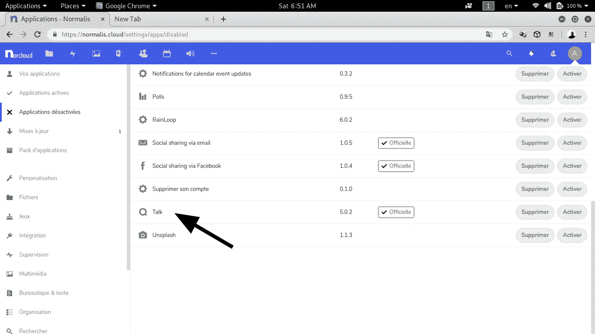

现在，如果你想和不在站台上的人说话呢？您可以使用 URL 邀请外部聊天参与者。这种聊天即使在用户离开呼叫时也保持开放，并使参与者能够容易地交换消息、链接和注释。您也可以使用密码保护您的公共群聊。

就是这样！

# 结论

到此结束，我们在阿里云 ECS 上设置了完整的集装箱化 SaaS 服务。我们希望你觉得这个教程有用！

# 原始资料

[](https://www.alibabacloud.com/blog/nextcloud-onlyoffice-and-spreed-webrtc-with-docker-in-your-ecs_594917?spm=a2c41.13057319.0.0) [## Nextcloud、OnlyOffice 以及 ECS 中带有 Docker 的 Spreed WebRTC

### Alibaba Clouder 2019 年 6 月 11 日 897 作者:Colince Azeye，阿里云技术分享作者。技术股是阿里云的…

www.alibabacloud.com](https://www.alibabacloud.com/blog/nextcloud-onlyoffice-and-spreed-webrtc-with-docker-in-your-ecs_594917?spm=a2c41.13057319.0.0)