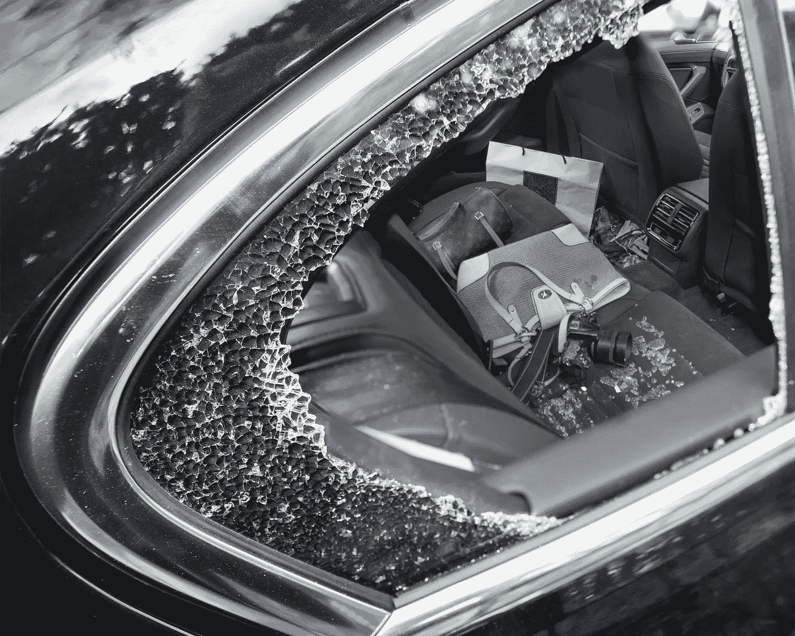
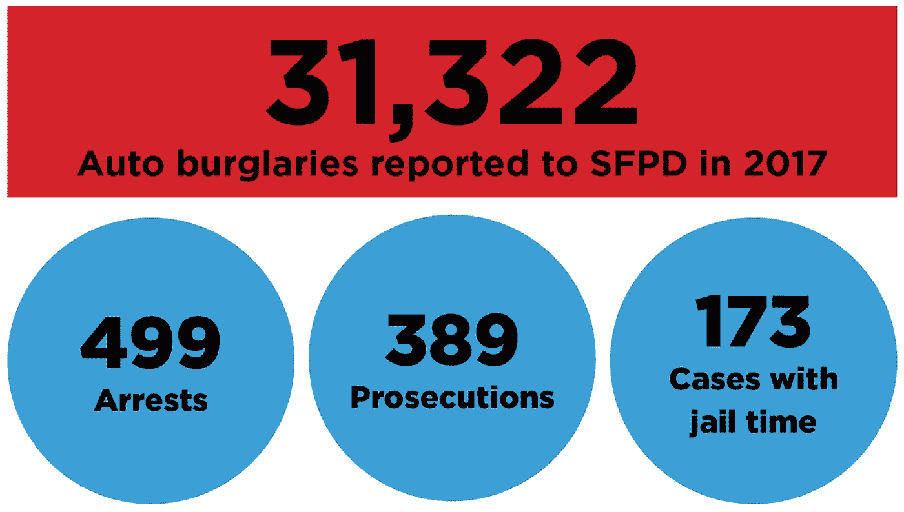
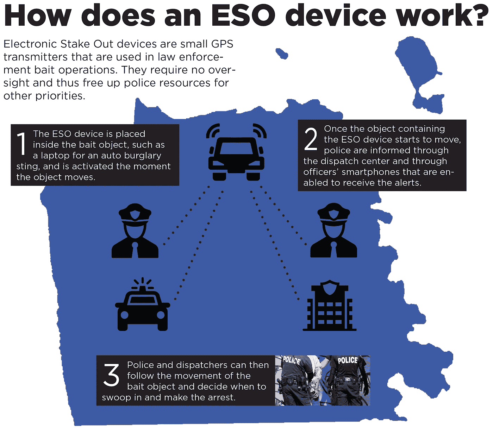

# 尼克的财产犯罪行动计划

> 原文：<https://medium.datadriveninvestor.com/nicks-action-plan-on-property-crime-4ee20145d104?source=collection_archive---------42----------------------->

## 我们必须对我们的刑事司法系统提出更多要求，从汇编和发布更好的数据到利用现代技术打击犯罪

去年，超过 31，000 起汽车盗窃案被报告给了警察局。只有 550 人被捕，一名汽车窃贼被送上法庭。因此，旧金山在 2017 年的美国主要城市中财产犯罪率最高。与洛杉矶相比，我们的人均汽车盗窃案是它的 10 倍。

作为回应，市政厅在这个问题上投入了更多的资金(旧金山每年在刑事司法上的支出已经超过 10 亿美元)，并在整个城镇张贴了智能停车标志——好像旧金山有这么多汽车盗窃案的原因是我们比其他城市的人在车里放了更多的贵重物品。

我们需要一种新的方法。

作为主管，我将确保我们的整个刑事司法系统按照国家最佳实践运行。我们的确需要增加巡逻警员的人数，但我们的警队也极需装备现代科技，以便更有效地打击罪案。我将使我们的刑事司法机构彻底透明化。在很长一段时间里，我将第一次确保市政厅以系统和数据驱动的方式，让这些官僚机构对减少我们社区的犯罪负责。

> 作为主管，我将确保我们的整个刑事司法系统按照国家最佳实践运行。

## **透明和负责任的刑事司法系统**

旧金山对财产犯罪的反应是保密的。市政厅定期发布的唯一数据是发生了多少起财产犯罪以及是否有人被捕。地区检察官办公室和高等法院没有向公众提供关于有多少人被起诉或做出了什么判决的数据。没有市政部门记录我们在康复方面有多成功。

令人难以置信的是，市政厅每年在我们的刑事司法系统上花费超过 10 亿美元，却不能回答汽车盗窃的平均刑期这个简单的问题。

这种数据的缺乏意味着我们的领导人在应对财产犯罪时依赖轶事而不是证据。被蒙在鼓里，监事会、市长和社区不可能以系统和数据驱动的方式让大官僚机构对有效预防和起诉犯罪负责。

如果我们想改变这一现实，我们需要真正的透明。如果不知道更多的量刑决定是如何做出的，仅仅说汽车窃贼应该被判更多的刑期是不够的。真正的透明度还会让我们更好地了解哪些犯罪预防项目有效，哪些监狱项目成功地改造了囚犯。在此基础上，我们可以做出更好的融资决策。

## **现代科技对抗现代罪犯**

几乎每个国家的主要警察部门都使用 GPS 诱饵装置来诱捕财产犯罪。

他们的工作方式是将一个小型廉价的 GPS 发射器放入一个经常被盗的物品中，如汽车中的笔记本电脑。当发射器移动时，警报会被发送到调度中心和官员的智能手机上，以便他们可以轻松监控设备的移动。这是 24/7 的监视，没有人干预，直到需要进行追捕的时刻。

今年早些时候，这一策略在圣何塞发挥了巨大作用。在一起汽车盗窃事件后，警方能够跟踪多个 GPS 诱饵设备到郊区的一个自助存储容器，里面有数百台被盗的笔记本电脑、相机和手机。五人被捕，检察官指控他们犯下的所有罪行。该行动还防止了可能数以千计的未来犯罪。

全国 7000 多个执法机构有一个全面的 GPS 诱饵装置计划，其中包括湾区的 30 个。然而，旧金山警察局不在其中。这些设备每台 450 美元，外加每月 18 美元的蜂窝服务费用，这使得它们成为一种经济有效、经过验证的提高打击犯罪能力的机制。

摄像机是 SFPD 应该投入更多资源的另一个领域。该部门吹嘘其使用了联合广场周围企业的 350 多个摄像头来试图识别肇事者，但它只在犯罪发生后才访问镜头。这个项目不是为了让警察能够实时观看录像而建立的，也没有计划在其他高犯罪率地区复制它。

Sacramento⁴.是在警务战略中使用实时视频的典范在不到 50 万美元的启动成本下，警察局在犯罪热点地区建立了一个复杂的摄像头网络，警官们使用它来监控事件并在事件发生时或事件发生后立即做出反应。警方认为新的摄像系统仅在第一年就帮助逮捕了 100 名重罪犯人。

> 长久以来，市政厅未能解决我们社区猖獗的财产犯罪问题。如果我们想改变这种情况，我们必须对我们的刑事司法系统进行系统升级。

作为主管，我将与社区合作，在我们犯罪率最高的地区部署这些安全摄像系统，比如伦巴第街的弯曲部分。

长久以来，市政厅未能解决我们社区猖獗的财产犯罪问题。如果我们想改变这种情况，我们必须对我们的刑事司法系统进行系统升级。作为你们的主管，我不仅要努力增加街上的警察，还要确保我们的警察队伍装备有现代技术。我将确保我们使用数据来让我们的整个刑事司法系统对提供安全的社区负责。

1.  [https://www . nickjosefowitz . com/going-deeper/let-s-end-the-auto-bureau-epidemic](https://www.nickjosefowitz.com/going-deeper/let-s-end-the-auto-burglary-epidemic)
2.  [https://www . nickjosefowitz . com/going-deeper/SF-has-30k-1 年内的汽车盗窃案和这是市政厅解决方案](https://www.nickjosefowitz.com/going-deeper/sf-has-30k-auto-burglaries-in-1-year-and-this-is-city-hall-s-solution)
3.  [https://www . nickjosefowitz . com/going-deeper/this-tiny-device-could-solve-SF-s-auto-bureau-epidemic](https://www.nickjosefowitz.com/going-deeper/this-tiny-device-could-solve-sf-s-auto-burglary-epidemic)
4.  [https://www . sac bee . com/news/investigations/the-public-eye/article 84530652 . html](https://www.sacbee.com/news/investigations/the-public-eye/article84530652.html)

*在 11 月大选之前的几个月里，我将分享关于我们在旧金山面临的最大挑战的故事和数据——从无家可归和财产犯罪到街道安全和第 2 区特定社区的优先事项。我将探索其他城市使用的策略，以及它们是否导致了任何有意义的变化。我将展示一些数据集，让人们深入了解我们的城市政府可以做哪些不同的事情。*

*由 Nick Josefowitz 支付 2018 年主管费用。财务披露可在*[*sfethics.org*](http://sfethics.org/)*查阅。*