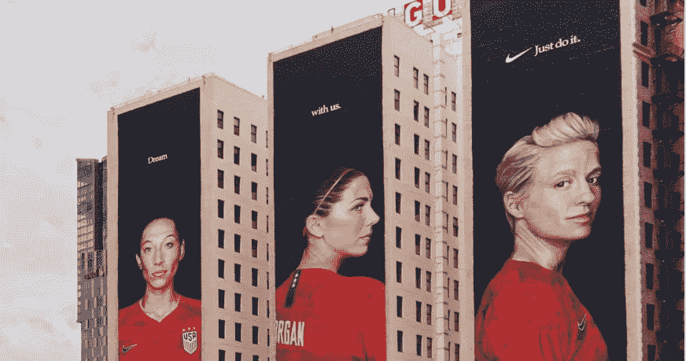

# 耐克大营销是企业生存指南

> 原文：<https://medium.datadriveninvestor.com/nike-great-marketing-is-a-guide-for-corporate-survival-b7b5185251c6?source=collection_archive---------4----------------------->

美国企业在社会伦理、社会公平和道德正义方面采取果断措施的严重失误。波音、安然、富国银行、脸书、高田公司、雷曼兄弟、巴克莱银行、大众汽车，等等。随着商业集中在美国的发展，更多的垄断企业、双头垄断企业和寡头垄断企业在他们的行业中安身立命。这些大公司变得更有利可图，对制定国家的政治和经济议程更有影响力。他们在树立道德标准和正确榜样方面的作用日益重要。作为对这些公司正在离开的道德真空的严厉批评，我很高兴为一家正在进行重大转变以帮助正确事业的公司提供一些启示，并通过这样做，为正确的原因变得越来越有利可图——耐克。

# **营销传奇**

非营销人员的快速背景。耐克一直是[的营销巨头](https://www.newitts.com/blog/history-of-nike?country=/)。他们创造了许多我们所知的体育营销，并与佳得乐(我自豪地成为团队建设历史的一部分)一起永远改变了体育的角色、科学和美学。耐克让我们梦想高性能，并试图推动我们实现它。*就这么做*。它还对街头时尚和运动时尚产生了重大影响，并将锐步远远甩在身后。耐克是像迈克尔·乔丹、拉斐尔·纳达尔和罗纳尔多这样的精英运动员的后盾，他们让我们都梦想成为他们中的一员。耐克率先创造了令人难忘的购物体验，这些体验是由非常引人注目的广告推动的。

 [## 想知道领导是谁？请他决定。数据驱动的投资者

### 一个有效的领导者能为组织提供的最有价值的东西之一是决策能力…

www.datadriveninvestor.com](https://www.datadriveninvestor.com/2019/01/25/want-to-know-who-the-leader-is-ask-him-to-decide/) 

1996 年，这家引领制造业外包创新的公司陷入了美国境外工厂雇佣童工的丑闻。随着菲尔·奈特卸任首席执行官，2000 年代是充满挑战的年代。耐克的国际扩张非常成功，但营销模式开始变得疲惫，竞争对手正在迎头赶上。为了生存，该公司不得不彻底改造自己。它完全控制了生产过程，成为这个星球上首批高度可持续发展的公司之一。我们可以看到该公司改造其产品线，引进新技术，并创造时尚。但是对于我们大多数知道耐克辉煌时期的人来说，仍然缺少一些东西——伟大的营销。

# 伟大的营销始于目标

如果你想卖给千禧一代和泽兹，你需要证明你值得拥有它。毫无疑问，耐克与凯珀尼克站在一起让我们许多人大开眼界。来自 The Root 的 Jay Connor 写道*自从耐克决定撤回其受贝琪·罗斯启发的 Air Max 1 USA 运动鞋后，共和党人已经气疯了。但事实证明，站在历史的正确一边，刚刚让这家鞋类和服装公司净赚了 30 亿美元的市值。*“那时，耐克奉行其[宗旨宣言](https://purpose.nike.com/)——“我们致力于通过体育的力量，为我们的人民、地球和社区创造一个更美好、更可持续的未来。”本月，在女足世界杯决赛结束时，耐克播出了一则[史诗广告](https://www.youtube.com/watch?v=FFC7RdYV3ys)，最后一条信息是“*这支球队赢了，所有人都赢了。”耐克再次站在 Rapinoe 和积极分子团队一边，为一个更加公平的社会而战。这仅仅是开始。在有意义的目标的力量的激励下，每个国家的耐克团队都在寻找创造更美好未来的方法——看看阿根廷八岁女孩 Cande 的案例和当地团队所做的……真正的影响。利用阿根廷国家队的顶级女运动员，他们能够创建一个女子足球联盟，从现在起让坎德和成千上万的女孩参加比赛——这是一种社会变革。耐克通过创造真正的变化和支持真正的事业走在了群雄的前面。他们可能在政治光谱的一端失去几个消费者，但赢得数百万其他人的忠诚。*

# **伟大的营销，伟大的成果**

在过去的五年里，耐克股价上涨了 126.8%，而道琼斯指数上涨了 59.8%(截至 2019 年 7 月 12 日)。
耐克在 2019 年年度企业平等指数(CEI)中获得 100 分，为该公司赢得了 LGBTQ 平等最佳工作场所的称号。这是我第 17 年获此殊荣。
在 Glassdoor，帕克首席执行官马克 G 的支持率为 91%(与苹果公司的蒂姆库克相同)，公司整体得分为 3.9 星(苹果公司得分为 4.0)。拥有并表达自己的观点既有回报又有利可图。

# 这个例子

我再次看到消费者带着自豪和敬意佩戴着 swoosh 标志，并表达了为正确的事业做出贡献的正确情感。这些都是迈向伟大营销的坚实步伐，是许多公司跨越藩篱的榜样。我们都知道“目的”是现代消费者的驱动力。在过去的十年里，大多数美国公司都在他们的营销策略中采用了这种方法。可悲的是，我们已经看到如此多的公司印出了漂亮的使命宣言，却没有达到后来做出的每一个决定。首席执行官们试图不暴露自己，即使他们必须保护他们的客户和员工，都赞成保护他们的底线，反之，他们的工作。首席营销官机会主义地试图在最后的潮流中冲浪，不顾一切地宣传品牌认知，却没有实际行动。但是消费者越来越意识到他们作为购物者的影响力。零售数据显示了可持续产品的[增长，在各个层面——环境上可行，公平，经济上可行。为了生存，公司需要把他们的口袋放在他们的嘴上。在这一点上，我需要说明一个显而易见的事实——随着越来越多的公司资金通过游说和宣传投入到正确的桶里，越来越多的政治裁决将有利于你我，以及一个可持续和公平的世界。](https://www.entrepreneur.com/article/324001)

对我们所有人来说，这项任务很简单。明智地使用我们的钱，认真地投票。我支持耐克。

【https://www.collectivebrains.org】最初发表于**。**