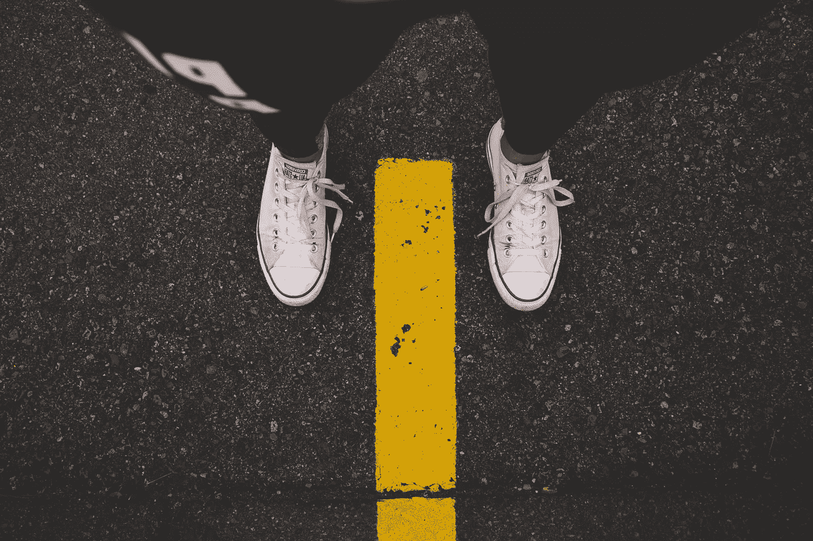
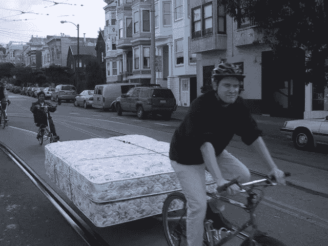

# 九年无车:高潮，低谷，以及其间的一切

> 原文：<https://medium.datadriveninvestor.com/nine-years-car-free-the-highs-the-lows-and-everything-in-between-f1ca30073219?source=collection_archive---------15----------------------->

# 对汽车文化的反叛和热爱🚴‍ 😈

The road less traveled. Photo by [Nadine Shaabana](https://unsplash.com/photos/pywan95C6lU?utm_source=unsplash&utm_medium=referral&utm_content=creditCopyText)

2009 年，我最后一次驾驶我的克莱斯勒赛百灵。我在去中途之家的路上，把它传递给一个需要它的家庭。我决定步行、骑自行车和乘公共汽车。

这样，我加入了 1100 万没有汽车的美国家庭的行列。

我的决定不是某种牺牲或财务欺诈。这是一个提高我生活质量的选择。我想得到更多的锻炼，在停车、维护和交通驾驶方面减少压力。

T2:我只是不太喜欢开车。

汽车开走后，我感到身上的负担立即减轻了。我不再担心换油和停车，也不再担心汽油是否快用完了。每次听到汽车报警器响，我都有一瞬间的恐慌，觉得可能是我的车。然后我想起我没有。

自从摆脱了我的车，我每天至少花 40 分钟步行去上班和办事，平均每天 2-3 英里。不再有疯狂的变道或道路愤怒:我在公共汽车上阅读。(不过，我确实有人行道暴怒症。如果你在我面前边走边发短信，小心…😡)

每天，我都在上下班的路上创造新的记忆。在纽约，我走过布鲁克林美丽的街头艺术，在熨斗大厦前吃冰淇淋。

在两年一度的曼哈顿-姮娥活动期间，我在联合广场观看了日落。

现在在博尔德，小鸭子们沿着博尔德溪从我身边一闪而过。我在上班的路上从白雪覆盖的山峰上汲取力量。

尽管我很想把无车作为一种乌托邦式的生活方式来推销，但它本身也带来了不便。

事实上，一路上我遇到了一些大的障碍。😝

例如，有一天，我错过了我的公共汽车站，结果只能沿着公路边走。没有路肩，所以我只能在杂草中艰难前行大约四分之一英里。

**我把这样的问题称为“爆胎时刻”**当你的轮胎被扎破或者你不得不启动电池时，它们是你在汽车里偶尔会遇到的那种不便。

从纽约搬到博尔德比我想象的更令人震惊。在纽约，没有车是正常的。我在纽约的朋友大多没有车，也不怀念车。在博尔德，人们认为汽车是必需品——尽管事实上你可以通过在我们宽阔的人行道上步行和骑自行车到达我们这个小城市的任何地方(在人行道上骑自行车是合法的，在科罗拉多州是被鼓励的)，也可以乘公共汽车去城外的任何地方。

在纽约，我很正常。在博尔德，我无意中成了某种汽车文化的叛逆者。

我在这里的第一个月，当人们开始让我短途旅行时，我很困惑。显然，我很感激，有时会接受他们的建议。牛人 ftw！

但总的来说，我不喜欢我被怜悯的想法，我私下里希望我能更快地到达目的地。我不开车，因为我喜欢它。我不指望别人会难过或帮助我。我不会主动帮助他们摆脱悲惨匆忙的生活，尽管也许我应该…🤔步行和骑自行车是一种快乐的方式。司机真的不知道他们错过了什么。

偶尔，我确实需要租交通工具。

[On The Level blog](https://onthelevelblog.wordpress.com/2008/03/13/car-free-moving-day/) moved his household by bike. He says: “Moving by bike is a form of direct action. It says to the world, ‘look what can be done without cars… [I]f it’s possible to move your stuff by bike, imagine what’s possible on a daily basis.’”

休假就是其中之一。但是即使家里有车的人也需要在飞行后租用交通工具。

对于搬运家具的工作，我可以很容易地在 [Turo](https://turo.com/) 或 uHaul 租一辆皮卡。(虽然我很想试试骑自行车拖家具(左图)……但是当我有了赛百灵的时候，无论如何我都需要这么做，所以没什么大不了的。

是的，在过去的 9 年里，有几个下雨或刮风的日子，当我看到人们开着他们漂亮温暖的车经过时，我会想，“我疯了吗？？？？?"

总而言之，汽车反叛者的生活方式很棒。我们很多人都希望能多出去走走，见见邻居，保持身材。我活在梦里，做所有这些事情的同时为我节省了[每年 67000 美元](https://newsroom.aaa.com/auto/your-driving-costs/)。你可以称之为付钱给你的健身房。

九年了，还在继续。🚴 👟 😊

吉纳在 frugalkite.com 写了关于经济独立和无车生活的博客。