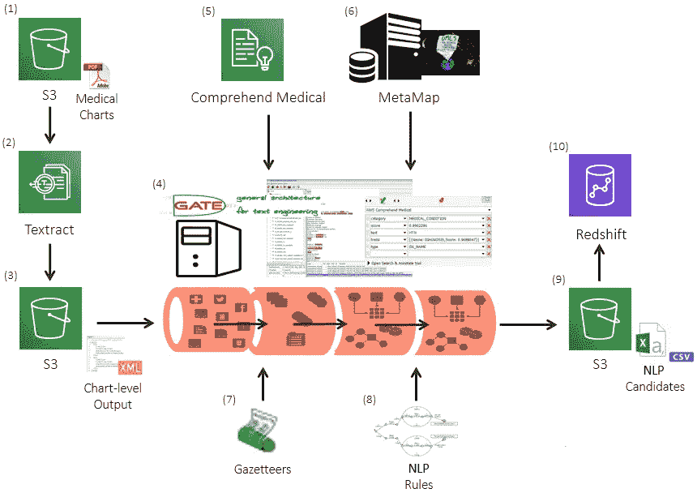
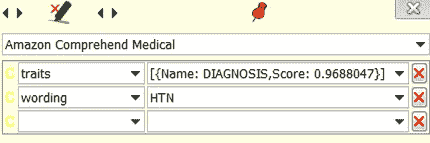
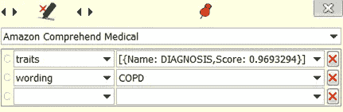
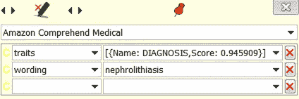
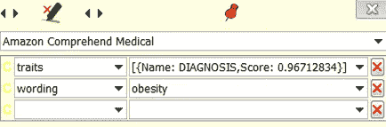
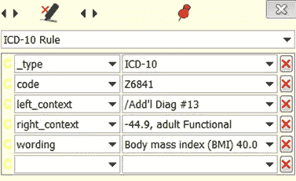

# 亚马逊理解医疗对患者病历的自然语言处理

> 原文：<https://medium.datadriveninvestor.com/nlp-on-patient-medical-records-with-amazon-textract-amazon-comprehend-medical-bf11e6198c94?source=collection_archive---------2----------------------->

*一种 OCR 到 NLP 的功能，使用开源的&基于云的工具组合从非结构化文本中提取见解。*

Photo Credit: Unknown

在短短 3 个月内，第一保健数据科学团队开发了一种强大的光学字符识别(OCR)到自然语言处理(NLP)功能，结合了开源工具和亚马逊提供的全新最先进的人工智能服务。我们正在使用[亚马逊文本摘要](https://aws.amazon.com/textract/) (OCR)和[亚马逊理解医疗](https://aws.amazon.com/comprehend/medical/) (NLP)从以前被困在患者病历中的非结构化文本中提取见解。

患者病历包含大量临床相关信息(如重要的人口统计特征、医疗状况和药物),这些信息可以显著改善护理协调活动、推动高质量的结果并确保第一保健会员获得适当的报销。第一保健已经通过这项新功能实现了巨大的商业价值，我们还处于试验阶段。在我们处理的每两张图表中，我们发现了大约一个未记录的诊断！

 [## 人工智能预测能力的神话——数据驱动的投资者

### AI(人工智能)最有前途的优势之一似乎是它预测未来的能力…

www.datadriveninvestor.com](https://www.datadriveninvestor.com/2019/03/01/the-myth-of-ais-predictive-power/) 

## 第一保健数据科学

我们是一个跨学科的团队，由痴迷于数据的数据科学家、数据分析师、统计学家、技术专家和临床专家组成！我们支持数据驱动的健康计划，该计划正在改善 140 万纽约人的生活，我们在健康的[社会决定因素](https://towardsdatascience.com/predicting-the-social-determinants-of-health-6e1fade435cc)和[全因再入院计划](https://medium.com/@hcrickey/predicting-inpatient-readmission-risk-727f304c9?sk=a127d50d3c6446c780f6f4b33522633e)方面拥有专长。

## 第一保健 OCR 到 NLP 管道混合架构

Healthfirst Hybrid OCR to NLP Pipeline Components

混合架构不仅结合了开源和基于云的工具，还拥有用不同编程语言(包括 Java 和 Python)编写的组件。这使得第一保健可以灵活地使用我们的解决方案，而不会真正爱上任何特定框架、模式或编程语言的局限性。

OCR 到 NLP 的管道从 Amazon Textract OCR wrapper (2)开始，它从亚马逊 S3 的第一保健的数据湖(1)中读入 PDF，并将每个 PDF 转换为 XML 文件，该文件存储在 Amazon S3 (3)中包含文本的单独子文件夹中。Amazon Textract OCR 包装器是用 Python 代码编写的，它运行在 Amazon EC2 实例上。Amazon Textract 是一种基于机器学习的 OCR 服务，它执行对象分析文本分类，并且它是高度可定制的。这允许用户不仅选择实体的类型(即单元块、页面、行等。)从各种不同的文本格式中提取键-值对，而且还基于定义的置信度阈值来选择那些键-值对，Amazon Textract 也为每个检测到的实体提供该置信度阈值。

接下来，每个 XML 文件由 GATE wrapper 处理(4)。GATE 包装器是用 Java 代码编写的，它也运行在 Amazon EC2 实例上。 [GATE](https://gate.ac.uk/) 是文本工程通用架构的缩写。GATE 由英国谢菲尔德大学的工程师开发，是一个用于构建 NLP 应用程序的开源框架。GATE 框架内有几个插件，包括亚马逊理解医疗(5)和[元地图](https://metamap.nlm.nih.gov/) (6):

*   Amazon understand Medical 是一种基于机器学习的 NLP 服务，可以对医疗状况和药物进行命名实体识别(等等)。更多关于亚马逊理解医疗的信息包含在下一节。
*   元地图是统一医学语言系统(UMLS)的元辞典。元映射充当不同医学知识库的集合，将语料库中找到的医学术语映射到 UMLS(即 CPT，SNOMED 等。).

数据科学团队围绕 GATE wrapper 中的这些插件开发了额外的智能，其中包括地名词典(7)——这只是字典的一个花哨词——和 NLP 规则(8)。字典将诊断文本描述映射到 ICD-10 诊断代码，NLP 规则有助于识别人口统计实体(如第一保健会员 ID、CMS 医疗保险受益人 ID 和国家提供者 ID)。

使用 GATE wrapper 完成所有处理后，我们将第一保健会员的人口统计和诊断候选人保存在一个 CSV 文件中，该文件位于单独的亚马逊 S3 子文件夹(9)中。数据科学家和数据分析师可以通过 Amazon Redshift (10)查询和分析这些文件。

现在，我们将演示几种不同的诊断命名实体识别方法。

## 亚马逊理解医疗诊断检测

让我们见证亚马逊理解医疗的力量。

回想一下，Amazon understand Medical 是一种基于机器学习的服务，因此它拥有预测语料库中的术语被识别为诊断或医疗状况(以及其他实体)的可能性的模型。与 Textract 类似，intellectual Medical 会输出一个概率置信度得分以及每个被识别的实体。

Amazon Comprehend Medical NER of Hypertension “HTN” Diagnosis

请注意，Amazon understand Medical 在诊断缩写方面做得很好。在上面的例子中，理解医疗将缩写为“HTN”的高血压作为一种诊断。因此，该模型大约 97%确信缩写为“HTN”的高血压是一种诊断。

下面的慢性阻塞性肺病也是如此。

Amazon Comprehend Medical NER of Chronic Obstructive Pulmonary Disease “COPD” Diagnosis

Amazon understand Medical 还可以检测诊断的完整文本描述，例如肾结石。见下文。

Amazon Comprehend Medical NER of Nephrolithiasis Diagnosis

和肥胖。你明白了。

Amazon Comprehend Medical NER of Obesity Diagnosis

## 基于自然语言处理规则的诊断检测

NLP Rule-based mapping of “Body mass index (BMI) 40.0” diagnosis description to ICD-10 code Z6841

将 Amazon understand Medical 流行的机器学习方法与基于规则的方法进行对比，这种方法可以检测语料库中找到的诊断文本描述的文字匹配，并将其映射到 ICD-10 代码。在上面的示例中，您可以看到文本“身体质量指数(身体质量指数)40.0”映射到 ICD-10 代码 Z6841。

NLP 规则是用日本代码写的。像对待正则表达式一样思考 JAPE NLP 规则。基于规则的方法非常适合开发 ICD-10 代码映射。Amazon understand Medical 的用户还不能使用该功能。

## 结论

第一保健的 OCR 到 NLP 管道仍处于概念验证阶段。第一保健数据科学团队与 Textract 背后的亚马逊团队分享了反馈。查看亚马逊关于 Textract 的[正式发布的新闻稿，其中提到了我们的 OCR 到 NLP 功能！](https://press.aboutamazon.com/news-releases/news-release-details/aws-announces-general-availability-amazon-textract)

我们已经证明了这项功能的价值，并对不久的将来感到非常兴奋。这项技术对医疗保健业务的影响是非常有前途的！#游戏改变者

在第一保健业务合作伙伴的支持下，我们计划利用我们强大的 OCR 到 NLP 功能，从患者病历和其他临床数据存储库中发掘出大量临床相关信息。