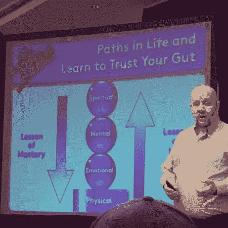
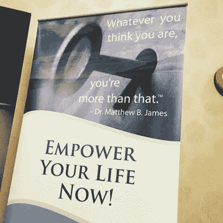
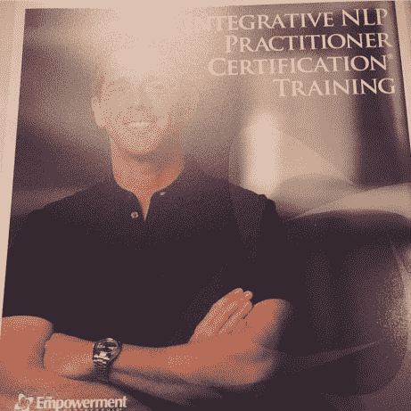

# NLP——它是什么？它能有所帮助吗？

> 原文：<https://medium.datadriveninvestor.com/nlp-what-is-it-and-can-it-help-ff3c5f9bc1c0?source=collection_archive---------8----------------------->

因此，几年来，我一直在努力参加我的几个女朋友推荐的这个 [NLP](http://www.nlp.com/what-is-nlp/) (神经语言编程)课程。我经历了一些创伤性的情绪和事件，让我开始质疑自己。我确信这没有其他人经历的那么严重(对此我非常感谢)，尽管这让我有挑战性的情绪要处理。谢天谢地，我的好朋友们一直在利用工具和技术让我回到更好的状态，并释放负面情绪，如愤怒、悲伤、恐惧、羞愧和内疚。

我不得不承认，我真的怀疑这些工具是否有用。我已经参加了[托尼·罗宾斯](https://www.tonyrobbins.com/)和【that 哈维·埃克的课程有一段时间了，当负面情绪出现时，我简直不敢相信我被带到了这个地方。当我处于如此具有挑战性的状态，感觉我没有任何选择的时候，我愿意尝试任何事情来帮助带走痛苦。

在几个月来我的女朋友们通过短信和 Facetime 会议帮助我之后，我终于能够报名参加 NLP 实践者课程。这是一个为期 4 天的强化课程(从早到晚),内容丰富，所以我希望我能够带走一些东西，让我回到一个足智多谋的状态。幸运的是，我们有可控的休息时间去吃饭和去洗手间，非常感谢！

内容很棒，有很多有用的工具和练习，还有生动的例子向我们展示了 NLP 如何应用到我们的日常生活中。我的大脑一直在想，我怎么能放手去相信这会成功呢？！我越是想我的负面想法，我就越是要去尝试。

我们以伙伴和小组的形式互相练习。我不得不承认，做这些练习时，我感到很不自在，因为我觉得我必须“知道”一切。尽管一位教练提醒我，这可能是我们第一次做这些练习，所以感到不舒服是很自然的。要消除这种不适需要练习。

所以慢慢地，我试着做了这些练习，没有想太多。我们犯了错误，摸索着前进，最终得到了我们想要的结果。

唯一的安慰是知道其他人正经历着我心中所想的事情。白天有很多问题，这让我对自己脑子里的想法感觉好多了。我也有同样的问题，但我忍住了，因为我觉得这些问题很傻。

最后，我很高兴我只是让自己通过练习，而不是过度思考这个过程。这是关于放下我的想法和期望，探索新的工具和技术。谁知道呢？如果成功了呢？如果我不试一试，我永远不会知道。

我参加培训的一个目的是学习[宽恕过程](https://www.youtube.com/watch?v=FaMcgtswmVA)。一年多来，我一直带着悲伤、愤怒和羞耻的情绪，并试图释放这些情绪。我一直在听手机和电脑上的音频。尽管在一遍又一遍地重复这个过程后(我的好朋友 V 的耐心)，我并不觉得我已经完全释放了这些压在我身上的感觉。

这些情绪会出现在我的日常生活中，我只是觉得自己无法克服我的感受。更糟糕的是，当我的朋友告诉我“克服它”，我就是做不到。我已经为我的感受感到难过了。你如何释放根深蒂固的情绪和感受，这些情绪和感受是随着时间的推移而复合的？

第二天，我们一起跳胡娜，我感觉到一股更轻的能量穿过我。在这个过程中，我感觉到自己的内心在哭泣。我感受到了更多我一直在寻找的光明，感受到了那些给我带来如此多负面感觉的事件所带来的压力在减少。

我知道这不是一个一夜之间的过程，我确实感受到了我之前感受到的悲伤和愤怒，尽管没有那么强烈。我一直在继续胡娜的放手过程，尽可能保持一致。我想我需要对那个伤害过我的人说一些我想说的话。尽管训练者告诉我如何原谅，如何在没有其他人在场的情况下说出我想说的话。

这是我需要继续努力的内在工作，感谢[赋权合作伙伴团队](http://www.nlp.com/about.php)提醒我，我每天都在变得更好！

周末最大的验证？**相信我的直觉。**

在[脸书](https://www.facebook.com/EmpowermentPartnership/)查看他们的视频和灵感，非常感谢！

*原载于 2017 年 5 月 17 日*[*lovehealthandwellness.wordpress.com*](https://lovehealthandwellness.wordpress.com/2017/05/16/nlp-what-is-it-and-can-it-help/)*。*