# 使用 LDA 的 NLP:分析安然电子邮件数据集中的主题

> 原文：<https://medium.datadriveninvestor.com/nlp-with-lda-analyzing-topics-in-the-enron-email-dataset-20326b7ae36f?source=collection_archive---------0----------------------->

[](http://www.track.datadriveninvestor.com/1B9E)

Photo by [Quintin Gellar](https://www.pexels.com/@quintingellar) on Pexels.com

安然公司倒闭已经过去 18 年了。

然而，现在流行的电子邮件数据集，由联邦能源监管委员会(FERC)公布，是一个持续给予的好东西。

它已经成为许多数据分析和机器学习探索的重要资源，特别是在自然语言处理领域。

[](https://www.datadriveninvestor.com/2019/03/03/editors-pick-5-machine-learning-books/) [## DDI 编辑推荐:5 本机器学习书籍，让你从新手变成数据驱动专家…

### 机器学习行业的蓬勃发展重新引起了人们对人工智能的兴趣

www.datadriveninvestor.com](https://www.datadriveninvestor.com/2019/03/03/editors-pick-5-machine-learning-books/) 

在今天的帖子中，我将探索这些电子邮件中讨论的关键主题，并向您展示如何在给定的语料库中做到这一点。

你对我们可能会发现什么感到好奇吗？

首先，值得注意的是，主题建模是在文本文档中寻找模式的许多技术之一。Matthew Kirschenbaum 的 [*遥读*](http://www.cs.umbc.edu/~hillol/NGDM07/abstracts/talks/MKirschenbaum.pdf) 详细论述了这一点。

根据 MALLET 库文档:

> 一个 ***主题建模*** 工具获取一个单独的文本(或语料库)并寻找单词使用的模式……对计算机来说，一个主题是以统计上有意义的方式出现的单词列表— [开始主题建模和槌棒](https://programminghistorian.org/en/lessons/topic-modeling-and-mallet) : Shawn Graham、Scott Weingart 和 Ian Milligan

# 获取和理解数据集

如果你在谷歌上搜索安然数据集，你会发现这一数据有很多来源。最上面的结果可能会把你指向这个[站点](https://www.cs.cmu.edu/~./enron/)。

你可以在这里得到实际数据[。总的来说，这是一个相当大的数据集，包含大约 50 万封标记为 150 个人的电子邮件。](https://www.cs.cmu.edu/~./enron/enron_mail_20150507.tar.gz)

下面你可以看到每个人都有一个文件夹，里面有常用的电子邮件文件夹。

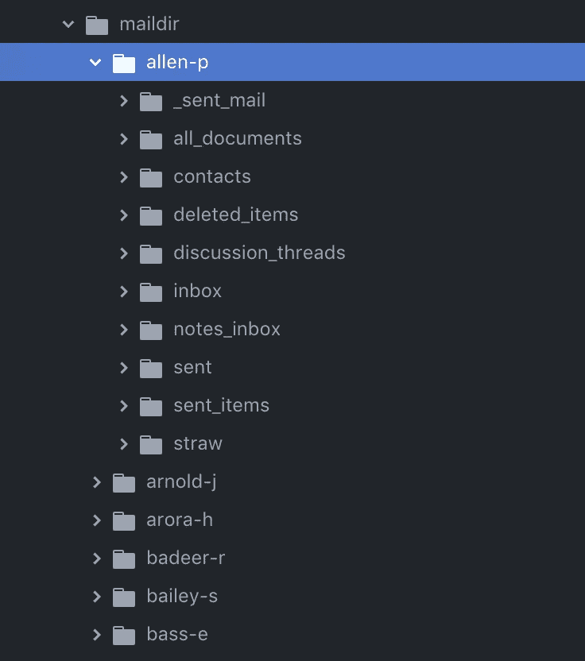

如果我们展开其中一个文件夹，我们可以看到一个电子邮件文档列表和一个选定的示例，如下所示。

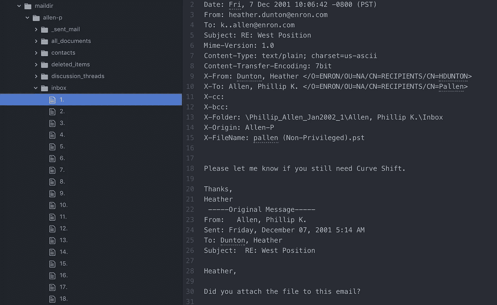

有几件事突然出现了。

首先，我们需要提前做出一些关键决定。

我们需要决定要处理的文件夹。我们还需要弄清楚如何清理电子邮件，以便专注于电子邮件的正文。

这将是一个值得做的工作，但是对于那些想跳过这一步的人来说，我们谢天谢地有了一个不同版本的数据集，已经用这种方式清理过了。

这个 [Kaggle 数据集](https://www.kaggle.com/wcukierski/enron-email-dataset/version/2#emails.csv)为我们完成了这个任务，并以 CSV 格式存储最终的集合。*你可能需要一个 Kaggle 账户来下载这个数据集。*

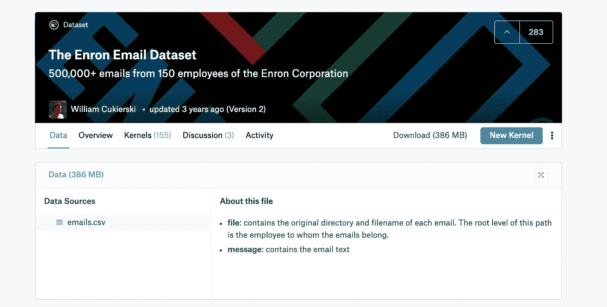

这很好，但请记住，它仍然是一个巨大的数据集，您可以考虑将该文件分割成多个较小的数据集，以管理您在内存中进行的计算量，尤其是在早期探索阶段。

安东尼·Dm 采用了这种方法。你可以查看他的[帖子](https://towardsdatascience.com/how-i-used-machine-learning-to-classify-emails-and-turn-them-into-insights-efed37c1e66)或 [GitHub](https://github.com/anthdm/ml-email-clustering) 页面，了解如何获得这个数据集的一小部分。

# 我们开始吧

我用谷歌的 Jupyter 实验室来做这个分析，你可以从界面上看到。我可能会在另一篇文章中介绍如何设置 Jupyter 实验室，但我敢打赌有一个很棒的教程[在这方面做得很好。](https://blog.kovalevskyi.com/google-compute-engine-now-has-images-with-pytorch-1-0-0-and-fastai-1-0-2-57c49efd74bb)

我们想做的第一件事是查看数据集。

[Pandas](https://pandas.pydata.org/) 是一个很好的 python 工具。我导入它并读入我的 *emails.csv* 文件。我不想要整个数据集，所以我抓取一小部分开始(前 10，000 封电子邮件)。

```
import pandas as pdemails = pd.read_csv(‘emails.csv’)
email_subset = emails[:10000]print(email_subset.shape)
print(email_subset.head())
```

我还想看到我的数据集的结构(形状)和预览(head())。这是我们看到的。

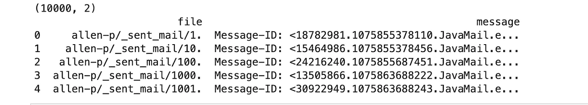

所以我们有 10，000 条记录，分为两列。第一列表示电子邮件的来源，然后是电子邮件中的实际消息。

然而，从预览中我们可以看到，消息部分需要清理。你如何做取决于你想分析什么。

安东尼·Dm 再次前来救援。如果您不打算自己尝试，他有一些很棒的帮助代码可以帮助您继续工作。

```
def parse_raw_message(raw_message):
    lines = raw_message.split('\n')
    email = {}
    message = ''
    keys_to_extract = ['from', 'to']
    for line in lines:
        if ':' not in line:
            message += line.strip()
            email['body'] = message
        else:
            pairs = line.split(':')
            key = pairs[0].lower()
            val = pairs[1].strip()
            if key in keys_to_extract:
                email[key] = val
    return email
```

您可以看到，上面的代码提取了消息的一些关键部分。对于一条消息，他从中提取出“*”、“*到*”以及电子邮件“*正文*”。*

```
def parse_into_emails(messages):
    emails = [parse_raw_message(message) for message in messages]
    return {
        'body': map_to_list(emails, 'body'),
        'to': map_to_list(emails, 'to'),
        'from_': map_to_list(emails, 'from')
    }
```

然后，他浏览所有消息，将这些消息收集到一个记录中。下面是总结这一点的 map_to_list 方法。

```
def map_to_list(emails, key):
    results = []
    for email in emails:
        if key not in email:
            results.append('')
        else:
            results.append(email[key])
    return results
```

如果我们运行我们的电子邮件集并预览结果，我们会看到它在隔离邮件正文方面做得非常好。请注意，这并不完美，因此您需要评估提取消息体的不同方式是否更适合您的需要。

```
email_df = pd.DataFrame(parse_into_emails(email_subset.message))
print(email_df.head())
```

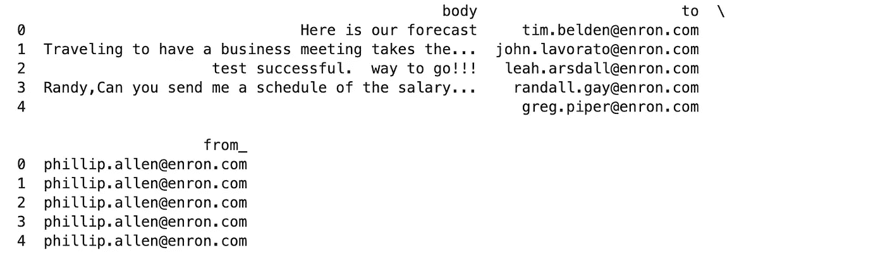

# LDA 和主题建模

有很多方法可以探究这些邮件的主题。

潜在狄利克雷分配(LDA)是实现这一点的一种方式。LDA 是一个词袋算法，它帮助我们自动发现一组文档中包含的**主题**。

为了让这一点更清楚，让我们借用这个[对 LDA](http://blog.echen.me/2011/08/22/introduction-to-latent-dirichlet-allocation/) 的介绍来制作一个例子。这里有几个句子:

*   我希望我有一辆雷克萨斯下周去比赛
*   我信赖的本田车需要换油了
*   贝基需要本田去收拾桌子
*   吉米笑着从椅子上摔了下来
*   约翰在易贝拍卖沙发和书桌

如果你被迫选择两个话题(话题 A 和话题 B ),你可以有把握地说跨句子的话题表征可以分解为:

**第一句&第二句** : 100%关于 A 题

**第四句&第五句** : 100%关于 B 题

**第三句** : 50%话题 A，50%话题 B

更进一步，所有句子在主题中的单词分布细分为

**题目 A** : 25%本田，15%雷克萨斯，15%驱动，15%换油…

**话题 B** : 30%的桌子，20%的椅子，20%的沙发……

说**题 A** 涉及*车辆*和**题 B** 涉及*家具*并不牵强。这是 LDA 能为我们做的。

> *简而言之，当分析一个语料库时，LDA 的输出是一个由* ***单词*** *和多个* ***文档*** *组成的* *主题的混合。*

# 在 *Dirichlet* 的引擎盖下——是什么让它滴答作响？

如果你更关心探索这个问题，而不是这个算法是如何工作的，你可以跳到下一节。

在这里，我想简单地谈谈是什么驱动了这个算法**，而不是深入数学**。努力解决这个问题有助于对 LDA 最适合的环境建立一些直觉。

开始了。

一个**文档**是不同**主题**的混合，而主题本身就是一个**单词**的表达式，所有单词都标记有给定的出现概率。换句话说，我们有跨所有文档的主题表示和跨所有主题的单词分布。

LDA 的核心是这个*狄利克雷分布*的概念。非常像一个*正态分布*，它是一个**概率**分布。

一个关键的区别是，在这种情况下，不是在实数空间上采样概率，而是在一个*概率单纯形*上采样——一组加起来等于 1 的数。

LDA 为单词生成的概率的有趣之处在于，一个单词可以反映在多个主题中。

有道理？

雷克萨斯可以同时出现在*豪华品牌*话题和*汽车*话题中。

不像 K-Means，属于一个类会使你失去属于另一个类的资格，LDA 更灵活。

这为 LDA 的各种应用开辟了可能性，超越了主题建模，甚至是推荐系统。您并不局限于只从一个集群进行推荐。

如果你有兴趣进一步阅读，深入研究数学和过程，请查阅这些资源。

[](https://medium.com/@lettier/how-does-lda-work-ill-explain-using-emoji-108abf40fa7d) [## 你的潜在狄利克雷分配简单指南

### 在我们开始之前，我做了一个工具(这是源代码),可以在你的浏览器中运行 LDA(非常简洁)。是…

medium.com](https://medium.com/@lettier/how-does-lda-work-ill-explain-using-emoji-108abf40fa7d) 

[http://blog . echen . me/2011/08/22/introduction-to-latent-Dirichlet-allocation/](http://blog.echen.me/2011/08/22/introduction-to-latent-dirichlet-allocation/)

[](https://www.quora.com/What-is-an-intuitive-explanation-of-the-Dirichlet-distribution) [## 狄利克雷分布的直观解释是什么？

### 回答(第 1 题，共 5 题):我喜欢在狄利克雷分布和正态分布之间做一个类比，因为大多数…

www.quora.com](https://www.quora.com/What-is-an-intuitive-explanation-of-the-Dirichlet-distribution) 

[https://medium . com/@ soorajsubrahmannian/extracting-hidden-topics-in-a-corpus-55b 2214 fc 17d](https://medium.com/@soorajsubrahmannian/extracting-hidden-topics-in-a-corpus-55b2214fc17d)

[](http://phyletica.org/dirichlet-process/) [## 适用于假人(例如像我这样的生物学家)的狄利克雷过程

### 狄利克雷过程是贝叶斯非参数统计中的一个非常有用的工具，但它的大多数处理方法在很大程度上是模糊的

phyletica.org](http://phyletica.org/dirichlet-process/) 

# 向前挤压

该任务其余部分的配套代码有几行长，一行一行地遍历是不实际的。

不过，你可以查看一下 Python [笔记本](https://github.com/shoreason/enron-topic-modeling/blob/master/enron_lda.ipynb)的这个 [GitHub repo](https://github.com/shoreason/enron-topic-modeling) 。我将重点介绍这一过程中的关键片段。

完成这项工作需要一套 NLP 库。其中包括 Gensim、Mallet、Spacy 和 NLTK。

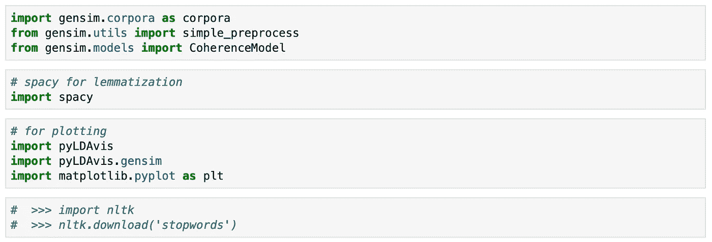

Gensim 和 Mallet 为我们提供了现成的 API，而不是从头开始编写我们自己的 LDA 算法。拥有两个库为我们提供了一种比较两种不同实现的性能的方法。

Spacy 和 NLTK 帮助我们管理语言的复杂方面，例如在我们的分析中找出文本的哪些部分构成了信号与噪声。

最后，像 Matplotlib 和 PyLDAvis 这样的库允许我们可视化分析的输出。

稍后会有更多的介绍。

# 放大:电子邮件正文及其组成部分

既然我们已经有了邮件的正文，我们的第一步就是把它们收集在一起。我们通过创建一个列表来做到这一点。

```
# Convert email body to list
data = email_df.body.values.tolist()
```

然后我们把每个句子分解成一个单词列表。正如你在下面看到的，我们可以看一下第四封邮件的正文。

```
# tokenize - break down each sentence into a list of words
def sent_to_words(sentences):
    for sentence in sentences:
        yield(gensim.utils.simple_preprocess(str(sentence), deacc=True))  # deacc=True removes punctuationsdata_words = list(sent_to_words(data))print(data_words[3])
```

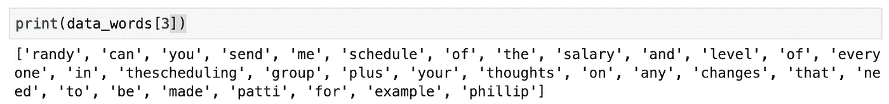

这有助于我们从分析所需的基本成分——记号开始。

# N-Grams:聚集在一起的标记

现在，我们开始着手处理基本问题。

我们的语言知识给了我们一种直觉，当两个或三个单词连续出现在一起(并排)时，所传达的意思比单个单词更丰富。

单词分组`traffic light`与单词作为`traffic`和`light`被独立检查相比，具有稍微不同的含义。

为了提取这一层次的信息，我们创建了所谓的二元模型和三元模型。前者是两个相邻单词的组合。后者是三个相邻的单词。

Gensim 为我们提供了一些很好的 API 来管理这个问题。正如您在下面看到的，我们可以检查应用二元模型和三元模型的输出。

```
from gensim.models.phrases import Phrases, Phraser# Build the bigram and trigram models
bigram = Phrases(data_words, min_count=5, threshold=100) # higher threshold fewer phrases.
trigram = Phrases(bigram[data_words], threshold=100)# Faster way to get a sentence clubbed as a trigram/bigram
bigram_mod = Phraser(bigram)
trigram_mod = Phraser(trigram)# See trigram example
print(trigram_mod[bigram_mod[data_words[200]]])
```

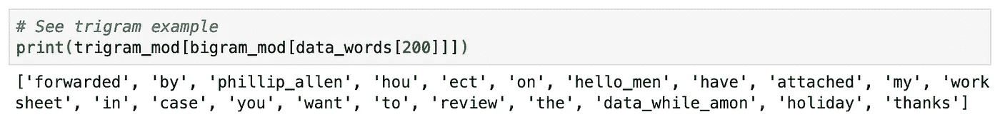

根据文档，这些 API 允许我们

> 分析一个句子，检测任何应该连接的二元[或三元]模型。

`phillip_allen`和`data_while_amon`是现在连接在一起的相邻单词。

你可以在这里以及这里阅读更多关于这个[的内容。](http://Distributed Representations of Words and Phrases and their Compositionality)

# 词汇化——找到基本单词

接下来，我们想放大来自每个单词的信号。

为了真正理解这一点，让我们考虑这三个词

*   驾驶
*   驱动
*   畜群

他们都在传达一个相似的想法，都可以归结为一个基本词，在这种情况下可能是`Drive`。这个基础词叫做`lemma`。

Spacy 为我们提供了一种方法，可以灵活地将它限制在不同的词类——名词、形容词、动词和副词。

```
def lemmatization(texts, allowed_postags=['NOUN', 'ADJ', 'VERB', 'ADV']):
    """[https://spacy.io/api/annotation](https://spacy.io/api/annotation)"""
    texts_out = []
    for sent in texts:
        doc = nlp(" ".join(sent))
        texts_out.append([token.lemma_ for token in doc if token.pos_ in allowed_postags])
    return texts_out
```

既然如此，我们不妨去掉*停用词*。

停用词是在给定语言中频繁出现的词，它们在给定文本中没有太多意义。

`is`、`the`、`that`、`which`等词语。

这不是所有 NLP 任务都应该做的事情，但我们的直觉是在这种情况下删除它们，因为它们不太可能给给定的邮件正文增加更多的意义。

记住，我们希望增强信号。

```
def remove_stopwords(texts):
    return [[word for word in simple_preprocess(str(doc)) if word not in stop_words] for doc in texts]
```

现在我们可以把这些放在一起

```
# Remove Stop Words
data_words_nostops = remove_stopwords(data_words)
# Form Bigrams
data_words_bigrams = make_bigrams(data_words_nostops)
# Do lemmatization keeping only noun, adj, vb, adv
data_lemmatized = lemmatization(data_words_bigrams, allowed_postags=['NOUN', 'ADJ', 'VERB', 'ADV'])
```

# 创建字典和语料库

我们几乎已经准备好将邮件正文传递到我们的模型中了。

首先快速回顾一下。以下是我们迄今为止所做的工作:

*   将电子邮件的正文收集到一个列表中
*   将文本标记成独立的单词
*   组二元模型和三元模型
*   使用词汇化合并相似的术语
*   删除停用词以最大限度地减少干扰

以上大多数任务都是 NLP 中非常常见的清理和处理步骤。那么，接下来呢？

我们需要记住，我们的算法的核心是基于数学计算。处理我们的文本需要我们用数字来表示记号和文本。

一种常见的管理方法是创建一个索引到单词的映射。这允许我们使用排序的查找表来将令牌映射到数字/索引。

我们可以使用 Gensim 语料库词典 API 来完成这项工作

```
# Create Dictionary
id2word = corpora.Dictionary(data_lemmatized)
```

它的输出是一个各种各样的字典。

接下来，我们需要将这个字典分解术语频率应用于所有文本，以创建一个**语料库**。

这样，当我们处理一个令牌时，我们就知道了它在文档中的权重。

当创建我们的 LDA 模型时，产生的语料库将作为输入被传入。doc2bow API 将每个文本转换成单词包格式。

现在，每当我们在文本中看到一个标记时，关于它的频率的信息就会与它配对。像`contract`这样的单词/令牌可以表示为(6，3) — >(令牌 id，令牌计数)。

```
# Create Corpus
texts = data_lemmatized# Term Document Frequency
corpus = [id2word.doc2bow(text) for text in texts]
```

记住 LDA 是基于*狄利克雷分布*的，这是一种考虑到词频的概率分布。

以这种方式表示我们的语料库为创建我们的 LDA 模型奠定了基础。

首先，GenSim 的 LDA 模型。

# 主题建模— Gensim LDA 模型

Gensim 包为我们提供了一种创建模型的方法。

你可以阅读 Gensim 的[文档](https://radimrehurek.com/gensim/models/ldamodel.html)来深入研究这个算法。在这里，我们将专注于创建模型。

我们建立这样的模型:

```
# Build LDA model
lda_model = gensim.models.ldamodel.LdaModel(corpus=corpus,
                                           id2word=id2word,
                                           num_topics=20,
                                           random_state=100,
                                           update_every=1,
                                           chunksize=100,
                                           passes=10,
                                           alpha='auto',
                                           per_word_topics=True)
```

根据文档，以下是您需要了解的内容

> **语料库** —文档向量流或形状的稀疏矩阵(数量项，数量文档)
> 
> **id2 word**–从单词 id 到单词的映射。它用于确定词汇大小，以及用于调试和主题打印。
> 
> **num_topics** —要从训练语料库中提取的请求潜在主题的数量。
> 
> **random_state** —一个 randomState 对象或者一个生成它的种子。对再现性有用。
> 
> **update_every** —每次更新迭代的文档数。设为 0 为批量学习，>设为 1 为在线迭代学习。
> 
> **chunksize** —每个训练块中使用的文档数。
> 
> **遍数** —训练期间通过语料库的遍数。
> 
> **alpha** — auto:从语料库中学习不对称先验
> 
> **per_word_topics** —如果为真，该模型还计算主题列表，按照每个单词最可能的主题的降序排序，以及它们的 phi 值乘以特征长度(即字数)

让我们看看关键字在我们生成的主题中是什么样子的。

```
print(lda_model.print_topics())
```

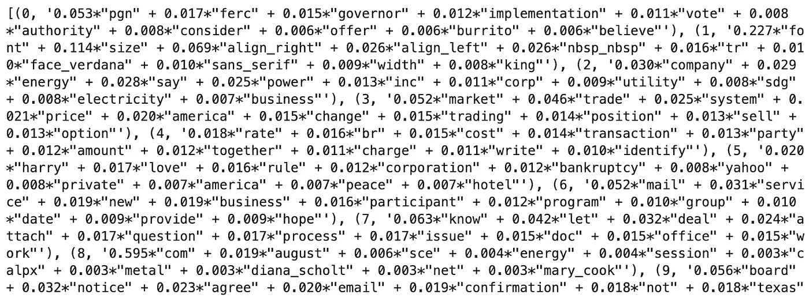

A snippet of topics with tokens

每个代币乘以的数字就是它的权重。这些值反映了标记在主题中的重要性。

你猜下面的题目是关于什么的？

`[pgn, ferc, governor, implementation, vote, authority, consider, offer, burrito, believe]`

与管理机构相关的东西。墨西哥卷饼绝对能摆脱这种感觉。

……怎样？

`[font, size, align_right, align_left, nbsp_nbsp, tr, face_verdana, sans_serif, width, king]`

超文本？

我们把输出可视化怎么样？

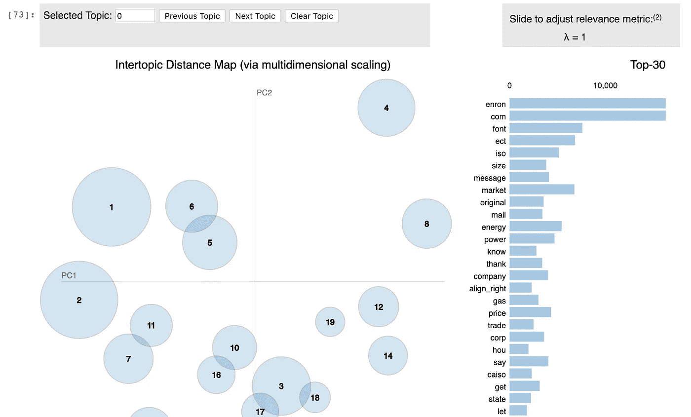

Visualizing our model using PyLDAvis

```
# Visualize the topics
pyLDAvis.enable_notebook(sort=True)
vis = pyLDAvis.gensim.prepare(lda_model, corpus, id2word)
pyLDAvis.display(vis)
```

一些观察

1.  气泡的大小告诉我们一个主题在所有文档(我们的语料库)中的主导地位

2.右边的单词是驱动该主题的关键词

3.气泡越近，主题越相似。他们离得越远，越不相似

最好是，我们希望不重叠的气泡尽可能遍布图表。

让我们来看看几个话题。

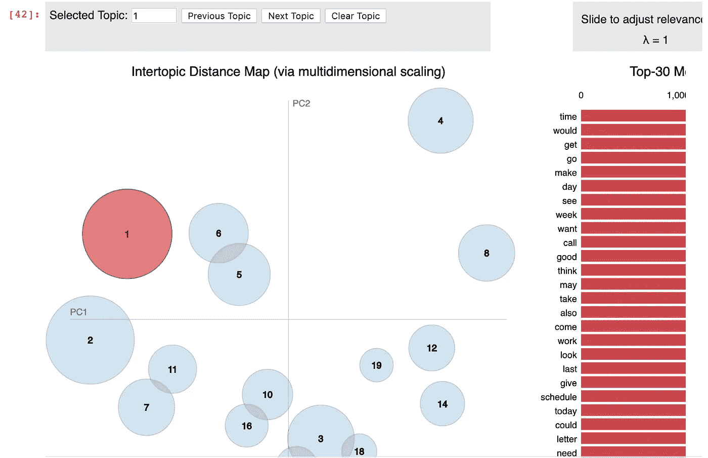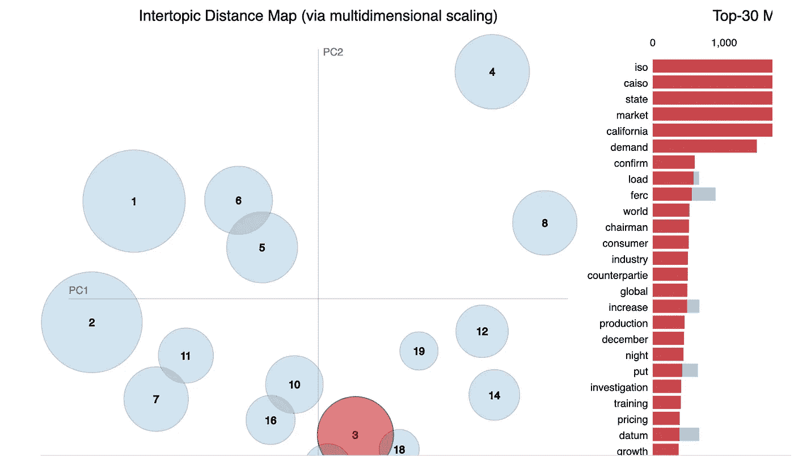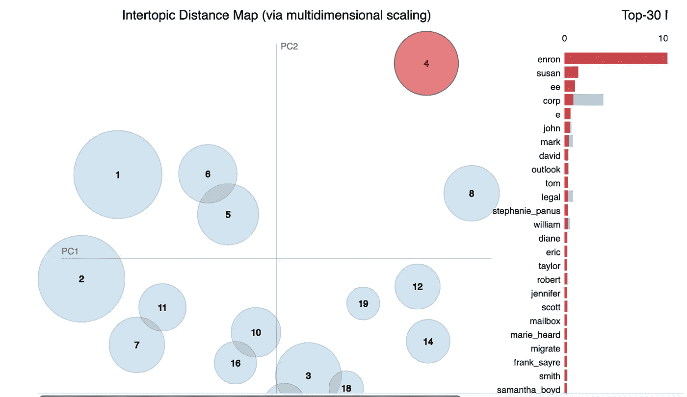

一般来说，如果每个文档有更多的单词，我们会得到更多的价值。然而，该算法乍一看似乎是在做正确的事情。

然而，如果不检查每个主题，我们如何判断这个模型做得有多好呢？

# 模型困惑和一致性

我们模型的困惑和一致性分数给了我们解决这个问题的方法。

根据[维基百科](https://en.wikipedia.org/wiki/Perplexity):

> 在信息论中，**困惑**是概率分布或概率模型预测样本的程度的度量。它可以用来比较概率模型。**低困惑度表示概率分布擅长预测样本**。

不同地说:

> 困惑试图衡量当这个模型得到一个新的数据集时会有多惊讶

因此，在比较模型时，较低的困惑分数是一个好迹象。惊喜越少越好。

我们是这样计算的。

```
# Compute Perplexity
print('\nPerplexity: ', lda_model.log_perplexity(corpus))
```

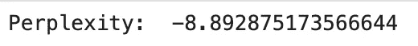

虽然我们没有什么可以与之相比，但分数看起来很低。

你会发现**连贯性分数**比**困惑分数**更能预测主题的质量。

让我们来探索一下。

```
# Compute Coherence Score
coherence_model_lda = CoherenceModel(model=lda_model, texts=data_lemmatized, dictionary=id2word, coherence='c_v')
coherence_lda = coherence_model_lda.get_coherence()
print('\nCoherence Score: ', coherence_lda)
```

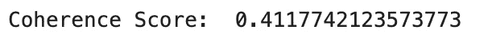

该评分试图量化每个主题中高分单词的语义相似性。高分意味着结果更容易被人类理解。

因此，自然地，更高的一致性分数意味着更好的模型。

如果你想更深入地了解连贯性分数，这篇[论文](http://svn.aksw.org/papers/2015/WSDM_Topic_Evaluation/public.pdf)做得很好。下面的链接也是一个很好的资源。

[http://qp ple . com/topic-coherence-to-evaluate-topic-models/](http://qpleple.com/topic-coherence-to-evaluate-topic-models/)

这两个分数都给了我们一种量化和比较模型质量的方法。

接下来，是基于*槌的* LDA 模型。

# 主题建模 2.0 — Mallet LDA 模型

据官槌[网站](http://mallet.cs.umass.edu/):

> MALLET 是一个基于 Java 的包，用于统计自然语言处理、文档分类、聚类、**主题建模**、信息提取以及其他对文本的机器学习应用。

在我们的具体案例中，我们将利用它的主题建模部分。

> 注意:确保验证 Java 安装在您运行它的任何环境中，尤其是在笔记本电脑中。如果您在基于 LINUX 的环境中，您可能需要运行类似“apt-get install openjdk-8-jdk”的命令

一旦[下载了](http://mallet.cs.umass.edu/download.php) Mallet，设置一个对解压文件夹路径的引用并创建模型。

一个好消息是，我们可以重用我们已经创建的语料库。

```
mallet_path = 'mallet-2.0.8/bin/mallet' 
ldamallet = gensim.models.wrappers.LdaMallet(mallet_path, corpus=corpus, num_topics=20, id2word=id2word)
```

现在，我们可以检查一些主题。

```
# Show Topics
print(ldamallet.show_topics(formatted=False))
```

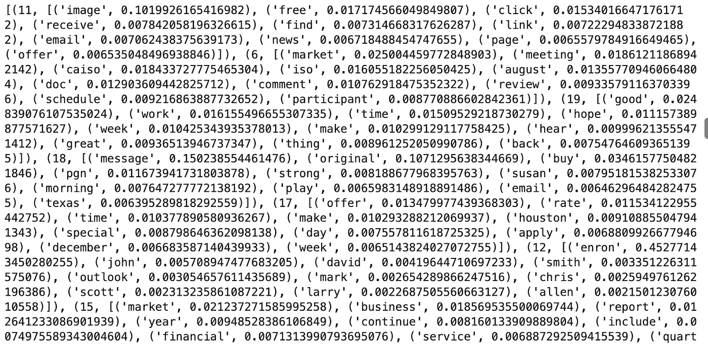

这一次，我们可以将一致性分数与之前的模型进行比较，而不是直观地检查主题。

```
# Compute Coherence Score
coherence_model_ldamallet = CoherenceModel(model=ldamallet, texts=data_lemmatized, dictionary=id2word, coherence='c_v')
coherence_ldamallet = coherence_model_ldamallet.get_coherence()
print('\nCoherence Score: ', coherence_ldamallet)
```

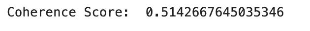

我们可以看到从 0.412 到 0.514 的一些改进，这是更好模型的证明。

你会发现许多资源强调木槌通常会给你更好的结果。这证实了这一点，所以我们将坚持使用 Mallet 生成的模型。

# 确定主题的最佳数量

这两个模型都希望您将预期主题的数量作为输入进行传递。你怎么知道这应该是什么？

在我们的案例中，我们选择了 20 个主题。但是，这是一个好的选择吗？

我们的一致性分数实际上给了我们一个很好的线索。我们希望这个分数在大多数主题中尽可能的高。

因此，我们可以浏览各种主题编号，观察这对连贯性分数有什么影响。

从两个主题开始，您可以看到我们的分数是多少。当您逐渐增加这个值时，您可以看到这会如何影响一致性值。

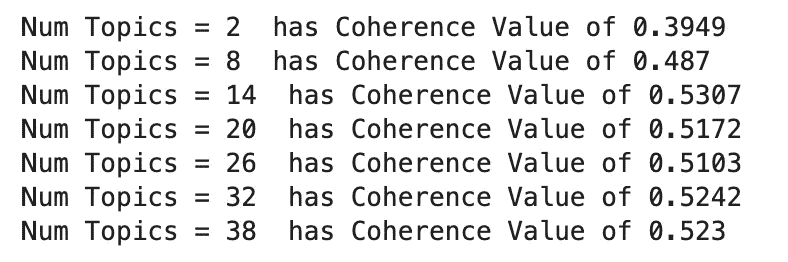

Run through different ‘number of topics’

绘制这些值，我们可以得到更清晰的视图。

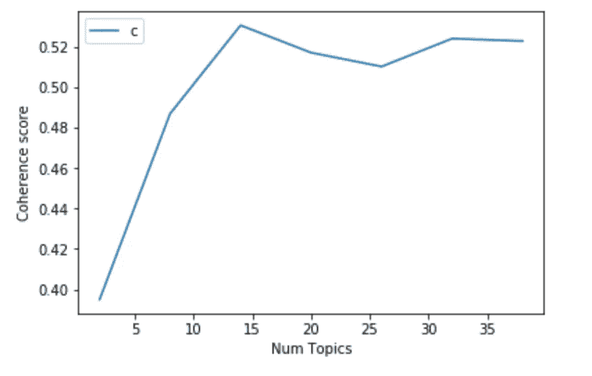

Coherence vs Number of Topics

神奇的数字似乎是在 14 个主题左右，所以我们假设这个数字是向前移动的。

下面是我们的单词主题分组现在的样子。

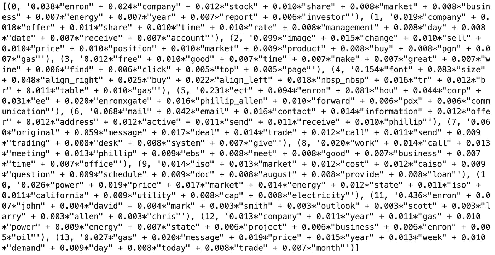

请记住，权重是令牌在该主题中重要性的指标

# 主导话题及相关关键词

我们现在可以做的一件有趣的事情是查看每份文档(电子邮件)，评估主要主题和相关关键词。

这在文本摘要或主题标注任务中可能很有用。

我们在这里使用的方法是找出哪个主题对给定文档的贡献百分比最高。

提醒:代码请参见本款蟒蛇[笔记本](https://github.com/shoreason/enron-topic-modeling/blob/master/enron_lda.ipynb)。

请注意，这个系统不够智能，无法为每个主题提供一个实际的短语。分配的只是一个主题编号/id。事实上，我们需要探索一个主题中的关键词来描述所述主题。

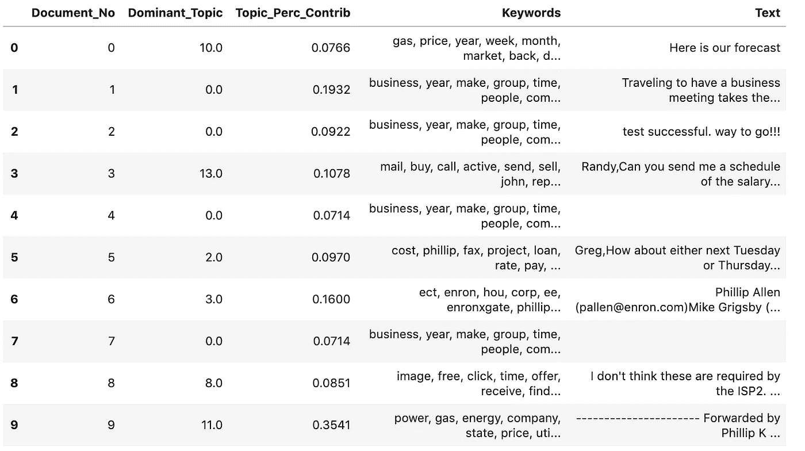

Inspecting each email_body for its dominant topic and keywords within the said topic

我们可以检查第二封电子邮件，看到主导话题的关键词。

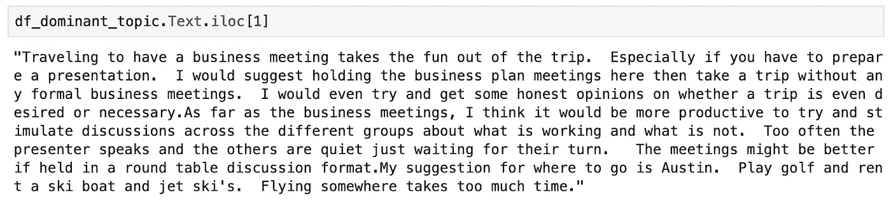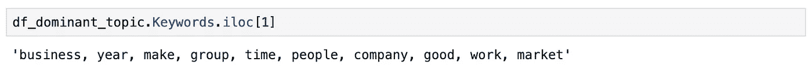

# 给定主题的最佳示例文档(电子邮件)

现在，假设我们选择一个类似`vacation`的话题，我们可能想知道哪封电子邮件与该话题最相关。

下面，我们将浏览 5 个主题，同时突出显示最能代表该主题的关键词和电子邮件。

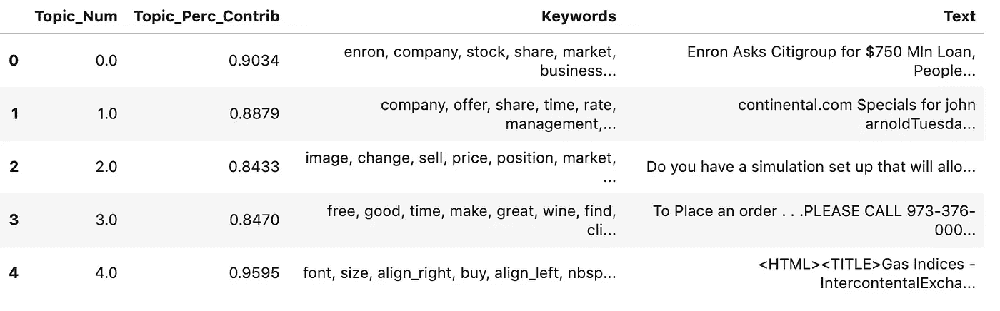

First 5 topics with Email body that best represents that topic


A snippet of email best representative of topic 0

您可以进一步尝试找出最能代表给定主题的顶级`n`文档。

# 我们学到了什么？

一个真正的科学家从不害怕检查他或她的实验结果。开始了。

我错误地认为，我们可能会看到一些指向导致公司垮台的不良做法的电子邮件。

然后我意识到我们方法中的一些缺陷。

1).为了管理一次处理的数据量，我们只需抓取前 10，000 封电子邮件。

```
email_subset = emails[:10000]
```

为了增加一点多样性，您可以切换到随机选择一个大小大致相同的样本。

```
email_subset = emails.sample(frac=0.02, random_state=1)
```

对于整个数据集的 2%，将`frac`设置为 0.02，将`random_state`设置为 1，以获得一致的结果。这将一致性分数从 0.514 提高到 0.5883。

以下是前 5 个主题的关键词:

**主题 1:**

[协议、附件、文件、草稿、评论、变更、信件、ca、能源、文件]

*猜测:* **加州能源相关合同？**

**主题 2:**

[original_message，work，call，meeting，讨论，good，给予，time，talk，meeting

*猜测:* **沟通？**

**主题 3:**

[电力、能源、州、加利福尼亚州、公用事业、价格、电力、工厂、市场、电力]

*猜想:* **卡利的能源相关业务？**

**话题四:**

[大卫、威廉、马克、斯科特、迈克尔、史蒂夫、罗伯特、保罗、克里斯、理查德]

*猜:* **邮件里的人？**

**话题五:**

[市场、发行、ferc、订单、成本、提供、费率、传输、要求、包括]

*猜测:* **法规**(FERC——代表[联邦能源监管委员会](https://www.ferc.gov/))？

2).我们方法中的另一个潜在缺陷是，我们分析中的电子邮件没有关注关键人物。更好的分析将确保他们的电子邮件在数据集中得到体现。

这突出了领域知识在这种分析中的价值。

你能想到其他的调整吗？

# 摘要

在这篇文章中，我们介绍了探索语料库中主题的一些重要方面。以下是几点建议。

*   您可以使用令人惊叹的工具来评估主题或话题的文档。LDA 就是这样一种算法。
*   根据您的起点，创建语料库需要一些清理和处理工作。移除停用词、词汇化和 N 元语法只是一些技巧。
*   为了获得模型的最佳结果，需要进行一些调整和改进。这可能需要确定正确的主题数量。它还可能要求您从包含更多单词的每个文档中获取更多数据。
*   找到正确的指标来评估您的模型。连贯性是一个很好的衡量标准，你的目标是在精炼过程中提高这个分数。

# 你的行动

现在你应该能够将这篇文章中的 LDA 知识应用到

*   确定给定语料库中的主导主题和相关关键词
*   查找符合给定主题的最佳文档示例
*   能够通过比较两个或更多语料库中的主导主题来确定它们有多相似
*   创建一个推荐系统，将相似的文章或文档按主题分组后进行推荐

感谢[机器学习和](https://www.machinelearningplus.com/)的好人们，他们的[帖子](https://www.machinelearningplus.com/nlp/topic-modeling-gensim-python/)和代码为大部分材料提供了指导。

感谢您的阅读，祝您的主题建模之旅一切顺利。

在 LinkedIn 上关注我[https://www.linkedin.com/in/shofola/](https://www.linkedin.com/in/shofola/)

最美好的祝愿！