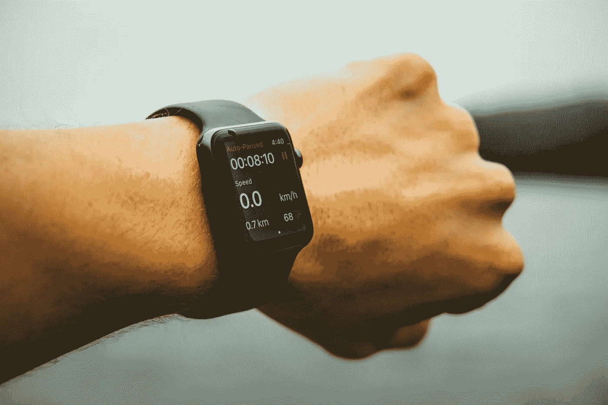

# 不，人工智能不会很快取代医生

> 原文：<https://medium.datadriveninvestor.com/no-ai-isnt-taking-the-place-of-doctors-anytime-soon-e00ee3ec446d?source=collection_archive---------17----------------------->

我真的对新苹果手表的含义感到兴奋([我在这里写了这个](https://medium.com/@DocAyomide/apple-is-quietly-revolutionising-healthcare-14130ba1e04))。但在我分享我的兴奋后不久，我医学院校友的 WhatsApp 群中有人提出了一些新的人工智能(AI)突破，并提出了一个老问题:

by [Tim Foster](https://unsplash.com/photos/Odhl-kitI2c?utm_source=unsplash&utm_medium=referral&utm_content=creditCopyText) on [Unsplash](https://unsplash.com/search/photos/apple-watch?utm_source=unsplash&utm_medium=referral&utm_content=creditCopyText)

> AI 不会很快淘汰医生吗？

这是一个很好的问题，现在比以往任何时候都好。而你如何回答，很大程度上取决于你认为是什么让医生有价值。

如果医生的价值在于他或她所知道的，那么我们最好开始准备向我们的人工智能统治者屈服。因为我们甚至无法竞争。他们不仅比我们任何一个人知道得都多，而且能够更好地组织和更快地检索。

**但我不认为我们作为医生的主要价值在于我们所知道的，我们低估了自己的价值。**

我们的主要价值在于我们能用我们所知道的去做什么。这个价值是四倍。

*   **我们翻译。**我们考虑人们抱怨的*症状*，我们对它们进行检查的*发现*，来自*实验室测试*的结果，以及来自*研究和经验*的知识。我们将所有这些整合在一起，并试图根据我们面前的独特患者来理解这些，他们对成为另一个数据点不感兴趣。解释完所有这些数据后…
*   **我们交流。**我们用简单的人对人的方式向患者解释我们的发现和了解，确保他们理解，填补他们不理解的空白，并帮助他们做出正确的选择，澄清问题和解决顾虑。
*   我们决定。在解释和沟通的整个过程中，我们都在做出决策——两者都在持续进行:总是有新的数据需要解释，新的事情需要沟通，新的问题需要解决。我们必须决定哪些数据是重要的，哪些是不重要的，交流什么，什么时候交流什么，说什么来解决哪些问题。决定，决定，决定。因为我们做了所有这些决定…
*   我们有责任。我们有足够的投资，如果事情出错，我们愿意承担风险。我们的皮肤在这场游戏中非常重要:失去执业执照是任何医生最糟糕的噩梦之一。随之而来的是名誉、职业和生计，甚至我们家庭的幸福。即使我们已经做了我们所知道的所有正确的事情，当事情仍然对我们的病人不利时，我们的情感健康也岌岌可危。

> 我们解释，我们交流，我们决定，我们负责。

从这个角度来看，计算机的价值变得更加清晰，但其局限性也是如此。在数据处理方面，计算机比我们好得多，这几乎就是“计算”的字面意思因此，它们给了*给*我们更多的数据以及*解释*它们很大的帮助。我认为这是计算对医疗保健的最大价值，绝对受欢迎。这就是为什么我对新 Apple Watch 识别心跳节奏、提供心电图读数甚至识别跌倒的能力感到兴奋。

然而，所有这些数据(至少目前来说)仍然需要人类医生的解释才最有价值。

> 计算机和 AI 在和医生互补的时候是最好的。

这种动力在代表医生价值的沟通、决策和负责的其他三个方面也很明显。人工智能在这两方面都是一个惊人的补充，但却是一个相当糟糕的替代品。考虑…

通过谷歌 Duplex 演示，我们看到了人工智能计算机能够进行通信:通过电话发出听起来很真实的订单。但是，寻求医疗保健的人们真的会相信人与人之间的交流吗？你真的想让一台没有人情味的电脑在你最脆弱、最原始的时候向你传递信息吗？

当然，计算机可以做决定，但是我们如何训练它们在我们自己还没有弄清楚的问题上做决定呢？我指的不仅仅是关于医疗保健的决定，还有关于沟通的决定。围绕这一点有很多研究可以让人工智能受益，但仍然有很多决策可以归结为只来自经验和移情的感觉和直觉。

最后——也许是最重要的——没有一个人工智能，不管它有多好，能够对任何事情负责。负责任是只有人类才能做到的事情。如果人工智能取代了医生，问责的责任就变成了任何拥有人工智能的公司的责任。

最后一点在医学中关于人工智能的对话中很少被提及，我甚至不确定它是否被考虑过。但这很重要。当你的健康受到威胁时，知道谁对你的健康负责是很重要的。在这种时候，你最不需要的就是一台没有人情味的电脑，由一家受利润驱动的冷漠公司支持，为股东工作，由某个遥远办公室的某个不知名的管理人员代表。但是，那已经发生了，不是吗？

你会注意到所有这一切的真正问题，归根结底，不是人工智能本身，而是我们是人，与他人联系对我们很重要。最重要的是，当生死攸关的事情让人性受到质疑时。只要这一点不改变，即使是终极人工智能也可能不够。

几种可疑的替代医学形式的持续存在应该能说服任何对此表示怀疑的人。通过关注人与人之间的互动，他们赢得了人们的信任，尽管他们严重缺乏任何实际证据。事实证明，与削减成本的公司通常关注的相比，信任是医疗保健中更重要的价值形式。

> 我们对赢得信任还是削减成本更感兴趣？

也就是说，在这三个价值领域的每一个领域，不难想象人工智能和计算机如何通过补充我们的沟通和决策，帮助我们更好地承担责任，来帮助医生变得更有价值。

问题是，**人工智能本身并不存在。人们设计它。**人们的设计符合他们看待事物的方式和他们想要达到的目标。问题是，他们试图实现的目标是否对我们其他人有益。

有一件事是肯定的:医学的面貌正在改变，作为一名医生意味着什么。**问题是我们——我们所有人，而不仅仅是医生——是否准备好去理解这些变化将如何影响我们，决定我们真正想要的变化，并采取行动使它们发生。**