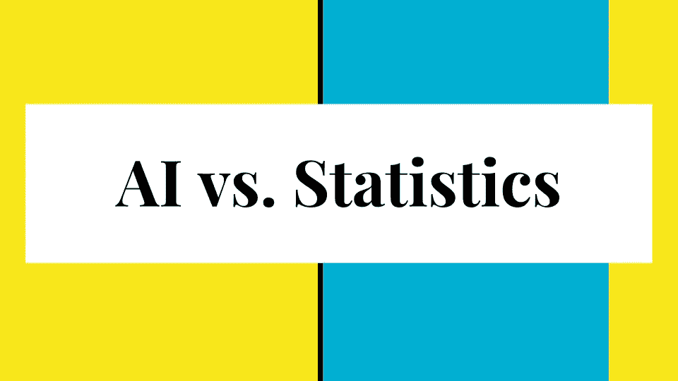

# 不，AI 不是统计。

> 原文：<https://medium.datadriveninvestor.com/no-deep-learning-is-not-statistics-c1f387db21e8?source=collection_archive---------4----------------------->

> “如果你唯一的工具是一把锤子，所有的东西看起来都像钉子”——某人

深度学习都是炒作。

不幸的是，有一些最先进的深度学习算法通过创建具有 7000 万个参数的模型来打破一个又一个记录，这些参数被训练来将图像分类到一千个类别中的一个类别——还有线性回归。如果我们把他们放在同一个阵营，会发生什么？

 [## 挑战你对人工智能和社会的看法的 4 本书——数据驱动的投资者

### 深度学习、像人类一样思考的机器人、人工智能、神经网络——这些技术引发了…

go.datadriveninvestor.com](http://go.datadriveninvestor.com/4AI1) 

当我在研究机器学习时，我有许多好奇的朋友，他们大多数都有一些统计学知识，他们希望我向他们解释深度学习。通常，在描述用参数建立模型、调整模型和测量精确度两分钟后，他们会举手说:“到目前为止，机器学习听起来和统计学一样。”与此同时，这位朋友会感到好奇，因为他知道统计学，正如他所知，不具备计算机视觉、语音识别的能力，并且用统计学构建的聊天机器人可能不会有任何好处。

我开始意识到我需要更好地阐明这种差异，因为我知道深度学习是计算机科学、统计学、数学和工程的交叉。这让我发现了一些关键的差异，我现在将展示它们，但我认为我在这次演示中表达得不是很清楚，其他人做得更好，我担心的是这种混乱的影响。

我将介绍一些不同之处。

第一个区别是，在统计学中，你做的某些事情是可取的，而在深度学习中，相反的事情通常是可取的。例如，在统计模型中，希望减少输入的数量。这使得统计学家能够更好地研究输入变量的变化如何直接受到输出变量的影响。有一些技术可以评估哪些变量是相关的，并简单地将它们从模型中删除。另一方面，在深度学习中，数据越多，特征越多越好。因此，归根结底，统计学对因果关系和相关性问题感兴趣，这是通过观察一个变量对另一个变量的影响来研究的，这种影响是通过观察和解释模型中的特定参数来观察的。

这就引出了我的第二个不同之处。当我向一位统计学家提到深度学习中的模型有数百万个参数时，他们最初感到震惊，他们问“你将如何解释第 578，985 个参数负责什么？”在深度学习中，我们不太关心任何单个参数。

第三个区别是，在统计学中，最简单的模型比更复杂的模型更受青睐，即使更复杂的模型表现稍好。这在深度学习中是完全不成立的。

深度学习和统计学的目的和目标是不一样的。在深度学习中，目标是建立一个预测或分类机器，而在统计学中，你可能会尝试建立一个可以应用于决策的模型，以告知概率。

我可以继续谈论这些差异，但我不一定是阐述它们的最佳人选，因为我不是统计学专家。

我对这个主题的主要热情源于这样一个事实，即现在使用神经网络非常流行，我遇到的大多数人都会漫不经心地告诉我，他们使用神经网络作为模型，并将其与线性回归进行比较，然后抱怨这个神经网络表现不太好。我会问他们“你认为机器学习和统计学有区别吗？”他们说:“据我所见，他们是一样的。”对该主题的一些深入研究让我知道他们正在研究一个具有两个变量的微不足道的统计问题，并使用了一些现成的软件(SPSS Modeler、SAS Enterprise Guide 或 Excel add-on ),这些软件带有一个按钮，允许您立即建立一个关于两个变量的神经网络模型，并将其与您的线性回归进行比较。

这种对话重复了好几个月，因为我遇到了越来越多有某种机器学习经验的人，我注意到他们都认为机器学习只是夸大的统计数据。

事实上，我参加了统计软件领域的世界领导者 SAS 的一门课程，讲师讲述了他们软件的神经网络部分，这位讲师自己也承认:“我不认为所有这些机器学习的东西有什么大不了的。”顺便说一下，SAS 神经网络功能是一个全连接的密集网络，具有一个隐藏层，默认值为 5 个隐藏单元。如果您将隐藏单元的数量增加到 50 个并运行该模型，则可能需要半个小时来训练，您可以将您的结果直接与您的线性回归结果进行比较！我称之为“噗！你是机器学习专家！”接近。

现在，我们可以争辩说，是的，机器学习就像统计学，或者从根本上说，它基本上是统计学，如果你熟悉机器学习，我愿意进行这个讨论。我不是这个意思。

我逐渐意识到，这些拒绝机器学习的人往往是他们公司的决策者，他们没有资格拒绝机器学习，因为他们只是用统计锤来处理这个问题，对他们来说一切都像钉子。

由于这些人是决策者，这种混乱是非常普遍的，它有相当黑暗的后果。它允许公司将其统计软件和方法重新命名为机器学习，人们会购买它，因为他们想做人工智能！它允许公司向另一家“人工智能”公司支付 100 万美元，后者除了统计分析什么也不提供。最后，它让人们将人类进步的突破视为一百年前的新闻。