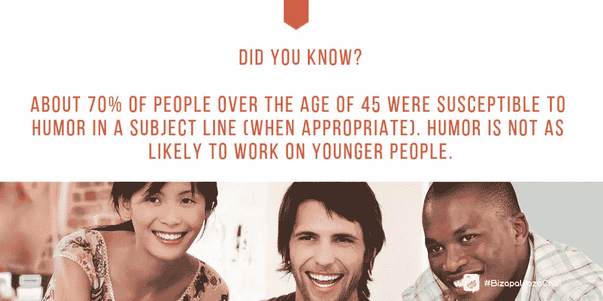
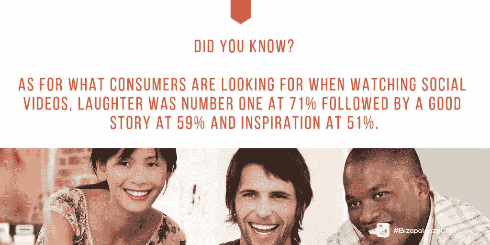
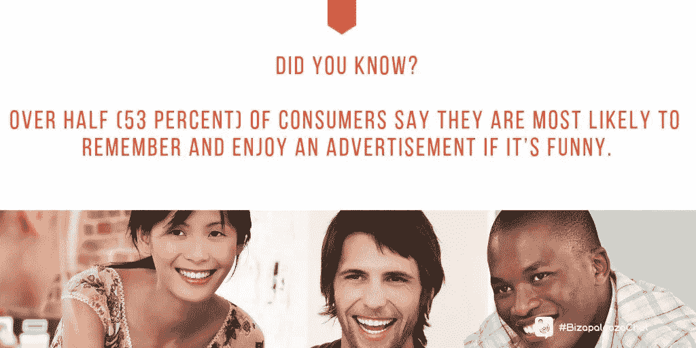
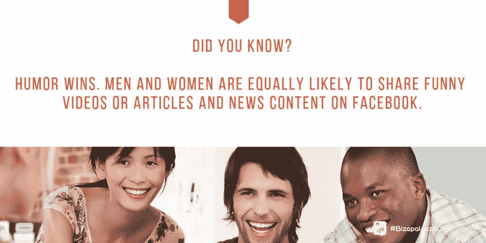

# 不开玩笑:营销是为了搞笑

> 原文：<https://medium.datadriveninvestor.com/no-fooling-marketing-goes-for-laughs-597b9ba84f18?source=collection_archive---------25----------------------->

## 漫画家描绘了商业生活中轻松的一面

当你把幽默和营销结合在一起时，这是一件有趣的事情。当然，[马克·安德森](https://twitter.com/andertoons)希望如此。

不要叫他雪莉。相反，称他为职业漫画家，安德森称之为世界上最好的工作。

他与 Ivana Taylor 和 Iva Ignjatovic 讨论了如何在营销的不同领域增加幽默。

Ignjatovic 是一名营销、战略、领导力和商业顾问。她与泰勒密切合作，泰勒拥有 DIYMarketers，这是一家“致力于帮助小企业主摆脱困境”的公司

“我的幽默感主要来自善意的观察，”安德森说。“我喜欢拿事情开涮，但我并不是真的别有用心。看日子了。不过，有时候[会出现一些奇怪的东西](https://andertoons.com/location/cartoon/8303/where-are-they-now)

# 孩子们做了最该死的…

泰勒称她的幽默感“介于观察和自嘲之间”

“孩子们的确是有趣的东西的最佳来源——除非它不有趣，而且你浑身都是面粉或垃圾，”她说。“那你就笑吧。”

Ignjatovic 反对宣称自己有幽默感，尽管她给别人的印象不同。

 [## 动荡迫使暴风雨中的平静|数据驱动的投资者

### 自然界中很少有东西是直线行进的，尤其是经济。当投资者和消费者希望平静时…

www.datadriveninvestor.com](https://www.datadriveninvestor.com/2019/03/25/volatility-compels-calm-amid-the-storm/) 

“当我表达我的观点时，我是讽刺和愤世嫉俗的，”她说。然而，人们通常觉得这很有趣。

“我很少笑，从来没有，这不是我的风格，”Ignjatovic 说。“这并不意味着我不快乐，或者是个怪杰。笑出声来的不是我。”

时间的流逝影响了什么使人发笑。泰勒发现她今天嘲笑不同的事情，通常是关于生活的荒谬。

“自从把幽默作为我的职业，就很难让我感到惊讶了，”安德森说。“如果你从我这里得到一个真诚的大笑，你会感觉很好。

“如果你能让某人发笑，你就打破了一个障碍，”他说。“我听过有人提到用一幅漫画作为图案中断。还有，特洛伊木马。长话短说，人们喜欢和喜欢的人做生意。而且人喜欢笑。”

# 太近，不好笑

安德森认为，仔细观察幽默变得过于临床化，或者像 EB White 说的那样“幽默可以被解剖，就像青蛙一样，但这个东西在这个过程中会死去，其内部结构会让除了纯科学头脑以外的任何人感到沮丧。”

安德森说:“奇怪的是，我对卡通之类的东西笑不出来。”。“我更欣赏他们的平静。我很少发出真正的笑声。你必须努力争取。”

说真的，笑能建立社区。

“幽默就是观察和提问，让人们思考和自嘲，”泰勒说。“当人们一起笑的时候，他们就联系在一起了。”

Ignjatovic 补充说，幽默驱散了神话。

“幽默是嘲笑刻板印象和我们弱点的安全方式，”她说。“它还能在困难或有压力的情况下保持我们的心理健康。

“我们都可以以自己的方式变得有趣，但以幽默的方式讲述一个故事是另一回事，”Ignjatovic 说。“那是可以学的，但是不需要学的时候就好多了。”

安德森认为，人们可以很有趣，让他们自己的喜剧装置。

“人们当然有不同的幽默感，但如果你现在不幽默，你很可能不会在明天的 PowerPoint 上变得幽默，”他说。“你可以用一部卡通片来代替《T3》。

“能够自嘲是成熟的标志。或者你只是疯了。两者都很好，”安德森说。“大多数人都有一套有趣的把戏。有些人只是把它保存得更好。”

# 幽默教育

泰勒补充说，她已经上了一堂喜剧课。

她说:“我了解到，虽然‘有趣’对一些人来说是天生的，但你可以学习一些技巧和思考方式来提高或增加你变得有趣的能力。”

 [## 那是她的故事，而且她坚持这样做

### 创意遇上内容营销讲故事

blog.markgrowth.com](https://blog.markgrowth.com/thats-her-story-and-she-s-shticking-to-it-47924f608fc6) 

良好的幽默感不会把事情看得太严重，而是和别人开善意的玩笑。

“它来自敏锐的观察和建立直觉和不寻常的联系，”泰勒说。“比看起来难。”

Ignjatovic 说良好的幽默感的核心来自于让他人快乐的愿望。

“你必须愿意合作，”安德森说。“让我笑得最厉害的人是那些不担心别人怎么想的人。”

幽默做得好会给商业带来个人风格。

“这是一个绕过防御的好方法，”安德森说。“有太多的信息和广告在争夺我们的注意力。开怀大笑是[一个受欢迎的变化](https://andertoons.com/chicken/cartoon/8161/laid-eggs-for-you-for-seven-years-and-you-dont-remember-me)

泰勒认为幽默是一座桥梁。

“当你观察到一个共同的经历，让每个人脸上都带着微笑时，你就联系上了，”她说。

正如 Ignjatovic 指出的，当“文化差异很大”时，这一点尤其有用。一个关于个人开销的有趣故事可以让交流变得更容易。”

不是每个人都能讲——或者理解——笑话。企业应该小心，不要认为自己觉得好笑的事情会适用于其他人。“谁认为这是个好主意？”的例子太多了

“显然，你想远离宗教、种族、性别等等，”安德森说。“保持简洁明了。自嘲永远不会错[。](https://andertoons.com/privacy/cartoon/8266/im-updating-my-privacy-policy)

“取笑自己总是安全的，”他说。"拿别人开玩笑，尤其是你手下的人，从来都不是好事。"

# 越线

泰勒知道这可能会走得太远。

她说:“领导们经常使用妙语或恶霸式幽默来取笑他人。”。“这真的会损害你的业务。”

没有交流和意识，轻佻是无关紧要的。

“幽默不是问题，”Ignjatovic 说。“这是与人联系的水平，我们必须注意的背景——以及文化差异。”

 [## 找点乐子——并从中获利

### 如何在不倾家荡产的情况下融入幽默

medium.com](https://medium.com/datadriveninvestor/have-a-little-fun-and-profit-4dd7b69d6a90) 

精明的商业领袖用幽默来管理和激励人们，尤其是当他们不幽默的时候。

“商业领袖的关键是要真实，”泰勒说。“有时候，简单地分享你的不安全感或你想知道或担心的事情会让你和员工联系起来，并激励他们。”

安德森认为，幽默可以让你更容易承认事情没有你想象的那么顺利。

他说:“分享笑声就像谚语所说的那样，把每个人都放在同一条船上。”“如果你不好笑，就不要冒险。[使用专业的](https://andertoons.com/surprise/cartoon/8311/so-to-paraphrase-damn)。”

过度很容易适得其反。

“如果你不是一个有趣的人，就不要尝试，”Ignjatovic 说。“那会显得怪异和笨拙。它会破坏人际关系。找到一些其他的方法来激励人们。”

当你不好笑的时候，认为自己很好笑——并且坚持——会让你被别人嘲笑，而不是和你在一起，你的可信度会下降。

泰勒说:“一些商业领袖不会在商业或公共场合过滤他们个人类型的幽默。”“老实说，幽默是一种智慧。如果你没有它，它会损害你的业务。”

# 寻求第二种意见

即使没有疑问，检查一下也无妨。

安德森说:“一个好的、诚实的幽默感从来都不是负面的。”“但是，如果你认为某件事有问题，先去问别人。

“你想要开心，而不是冒犯，”他说。"例如，某个[卡通可能很有趣](https://andertoons.com/help/cartoon/8254/ok-never-mind-so-is-there-a-mortician-in-the-house)，但可能不适合工作."

 [## 创新为商业基础注入乐趣

### 思想开放和灵活会带来成功

medium.com](https://medium.com/datadriveninvestor/innovation-injects-fun-into-business-fundamentals-408a620713aa) 

Ignjatovic 补充说，所有的幽默都是个人的。

“对我来说有趣的事，对其他人来说可能并不有趣，”她说。“幽默不一定是冒犯性的。在这种情况下，它可能会影响和降低生产率，或者给人留下不成熟的印象。”

如果你很幽默——只有你最好的、诚实的朋友会这么告诉你——在商业中尝试幽默。除此之外，把有趣的事情留给专业人士吧。

“关键是找到真实的观察和倾听。泰勒说:“幽默会找到你。

如同任何交流一样，了解你的受众。

Ignjatovic 说:“在你开始全面幽默之前，先去了解人们、生意和客户。”“如果你想让人们开心，就为员工组织单口相声活动。”

不管有多好笑，安德森敦促领导人保持礼仪。

“保持干净，”他说。“取笑自己——或者至少打一拳。随时咨询你的[当地专业漫画家](https://andertoons.com/custom-cartoons)

安德森和泰勒在一个 [DIY 营销视频](https://diymarketers.com/how-to-use-humor-business/)中继续他们有趣的对话。

**关于作者**

吉姆·卡扎曼是拉戈金融服务公司的经理，曾在空军和联邦政府的公共事务部门工作。你可以在[推特](https://twitter.com/JKatzaman)、[脸书](https://www.facebook.com/jim.katzaman)和[领英](https://www.linkedin.com/in/jim-katzaman-33641b21/)上和他联系。

*原载于 2019 年 2 月 25 日*[*www.datadriveninvestor.com*](http://bit.ly/2GKmrXF)*。*