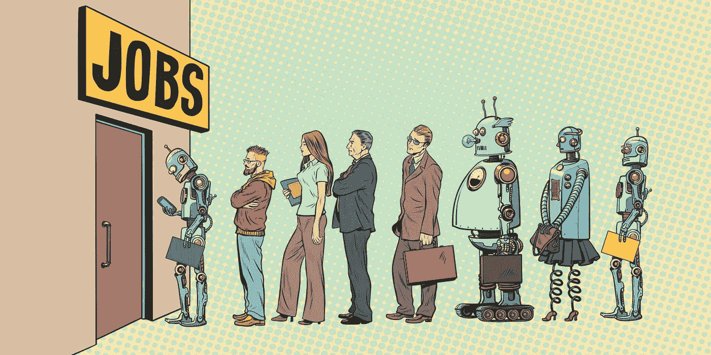

# 没有一项工作可以免于自动化

> 原文：<https://medium.datadriveninvestor.com/no-job-is-safe-from-automation-b72e4a56830b?source=collection_archive---------5----------------------->

人工智能时代正在到来的一个明确迹象是，声称明确知道哪些工作不受自动化影响，哪些最容易受到影响的文章大量涌现。这些文章是令人愉快的，很可能是因为看到一个你觉得过去要价过高的职业已经时日无多而产生的一点点幸灾乐祸。有些人甚至给自动化的机会分配一个精确到小数点的概率百分比，给整个活动一种庄严感。当然，如果你读了足够多的这些文章，你会很快注意到非常不一致的预测。一个人将把金融顾问扔进历史的垃圾箱，而另一个人宣称，100 年后剩下的唯一工作将是为共同基金决策提供建议的机器人。

深入挖掘一下这些研究的“方法”,研究者的绰号开始显得相当慷慨。一篇 NPR 的文章使用了这个问题“你需要想出聪明的解决方案吗？”作为建立一个职业自动化程度的八个标准之一。从学术严谨的角度来看，这个问题与简历无关紧要，而与科学方法更为相似。问题是“研究人员”忍不住让自己的偏见成为障碍。当谈到机器人和人类之间的比赛时，人们很难不含蓄地支持主队。

 [## 不管准备好了没有，革命就在我们面前|数据驱动的投资者

### “对于技术如何影响我们的生活和重塑经济，我们必须形成全面的全球共识……

www.datadriveninvestor.com](https://www.datadriveninvestor.com/2019/02/12/ready-or-not-the-revolution-is-upon-us/) 

以至于证明自动化系统优于人类的举证责任往往落在了自动化系统身上。更好的问题是为什么一项工作不能自动化，而不是它是否能自动化。

所有这些研究选择回避的令人不安的现实是，没有一种职业可以免受自动化的影响。

事实是，如果你能训练一个人做一项工作，你就能训练一个人工智能做同样的工作——更便宜、更好、更快。

此外，即使整个工作不能自动化，最有可能的是至少部分工作可以。毕竟，工作不就是一系列小任务吗？一名医疗助理可能会执行几十项不同的任务，每项任务都代表着自动化的不同难度，但他们一半以上的时间通常都花在从病人那里收集信息上，这是一项更适合人工智能而不是人的工作。它不仅更具成本效益，而且研究表明，人们对机器的回答比人更准确，因为他们天生害怕别人的判断。相比之下，如果我们在浏览器上处于匿名模式，我们会毫不犹豫地用谷歌搜索最尴尬的问题。

任何人可能会对他们工作的某些方面自动化所涉及的困难感到沾沾自喜，他们最好考虑一下房地产市场崩溃是如何发生的。2008 年，即使在像内华达州这样受灾最严重的州，也只有大约 7%的房屋被止赎。然而，这一小部分房屋仍然设法将所有房屋的价格拉低了 40%以上。关键是，即使只有 7%的职业是自动化的，它也有可能让该行业的就业市场陷入自由落体状态。

仍然不相信自动化会给你的工作带来任何风险？你会觉得它是如此的抽象和艺术，以至于你的电子表格更像是在博物馆里，而不是在收件箱里。对你来说不幸的是，你的职业并不存在于泡沫中，所以即使你的傲慢被证明是真的，并且在你的工作中加入人工智能并不能提高百分之一的效率，它仍然会影响你技能范围之外的工作。

坏消息是，被自动淘汰出其他工作岗位的员工不会明白一个暗示就从地球上消失。相反，他们将开始在自动化程度较低的职业中寻找新的机会，这与你的工作没有什么不同。

最好的情况也不过如此。

最终，我们需要停止欺骗自己，人工智能的扩散将创造与自动化一样多的就业机会。我们需要更多像杨安泽这样的人，敲响自动化将对消除就业产生影响的警钟，并开始为全职工作大幅减少的未来制定计划。最后，我们需要认识到大规模自动化不是绝望的时刻，而是值得庆祝的时刻。毕竟，大多数工作都很糟糕，这就是为什么人们拿工资去做这些工作。如果长途卡车驾驶和亚马逊仓库的订单履行是如此有趣，那它们应该被称为爱好，而不是工作。我们需要专注于救人，而不是工作。