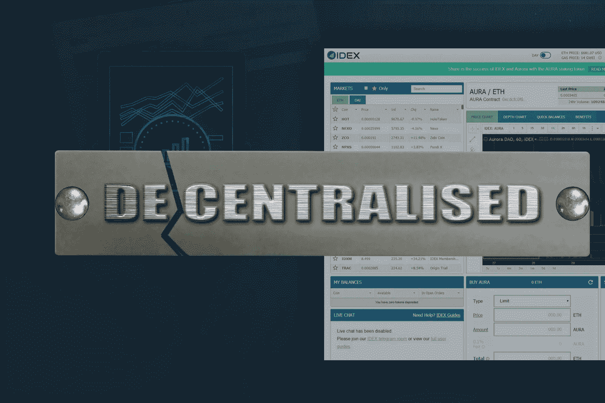

# IDEX 保证不再进行加密货币匿名交易

> 原文：<https://medium.datadriveninvestor.com/no-more-anonymous-trading-on-cryptocurrency-idex-ensures-a95af041d517?source=collection_archive---------15----------------------->

安全性，以及用户的隐私，一直是 [*密码市场*](https://www.thecoinrepublic.com/tag/crypto-market/page/4/?source=post_page---------------------------) 的主要关注点。不可否认的事实是，市场不仅见证了残酷的骗局，也见证了对整个加密市场的反对意见。

加密平台上的匿名就是这样一个问题，需要引起大众的极大关注。说到这个比尔·盖茨去年说过:

 [## 科罗拉多州正在成为亲加密法规|数据驱动投资者的领导者

### 科罗拉多州已经成为区块链公司的滋生地和避风港。新任命的…

www.datadriveninvestor.com](https://www.datadriveninvestor.com/2019/03/22/colorado-is-emerging-as-a-leader-in-pro-crypto-regulations/) 

> *cryptos 的匿名性根本不是一件好事。政府能够追踪洗钱者和恐怖分子的资金来源是一个很好的因素。然而，这种平台上的匿名交易可能会破坏这种能力。*

**与 IDEX 的希望之光**

虽然需要检查加密平台上的匿名性，但公司迫切需要解决这个问题。8 月 23 日之后，在 IDEX 的交易和资金提取将只对那些已经通过账户验证的人开放。考虑到这一点，国际分布式 [*以太坊*](https://www.thecoinrepublic.com/tag/ethereum/?source=post_page---------------------------) 交易所(IDEX)最近宣布，将不再容忍在其平台上匿名。

根据该公司的公告，整个强制性用户验证过程将于 7 月 24 日开始。

由于 IDEX 已经宣布了反对匿名的斗争，现在它确保他们赢得这场斗争。

战胜这样一个问题似乎是一个非常艰巨的挑战，而 IDEX 似乎也做好了准备。

*   首先，将从 7 月 24 日开始为期 30 天的过渡期。在此期间，所有与 IDEX 关联的钱包将可以进行无限制的交易，并且每天可以提取不超过 5000 美元的资金。
*   现在，只有在这个阶段，用户才会被说服不仅要创建他们的帐户，还要验证他们的帐户。这将确保正确的 [*KYC*](https://www.thecoinrepublic.com/hitbtc-resorting-to-outlandish-methods-of-kyc/?source=post_page---------------------------) 流程的实施。
*   这可能是一个必要的时期，因为在 8 月 23 日之后不久，在 IDEX 的交易和资金提取将只对那些已经核实了账户的人开放。

**两级验证**

为了确保击败匿名的整个议程按预期进行，该公司提出了两个层次的验证过程。

*   第一个阶段包括创建一个拥有有效电子邮件地址的账户。它确保所有必要的信息，包括姓名，出生日期，以及位置都妥善保存。经过这些步骤后，用户将能够进行无限的交易和提取资金，但每天最多只有 5000 美元。
*   第二个级别是专为那些希望扩大提款限额，使其每天超过 5000 美元的人设计的。为了实现这一点，用户必须上传适当的身份文件，如护照等。
*   他们还需要用自拍来认证自己的身份。

此外，IDEX 还宣布，美国用户对某些资产的访问将受到限制。然而，属于这一类别的具体*加密货币仍然未知。*