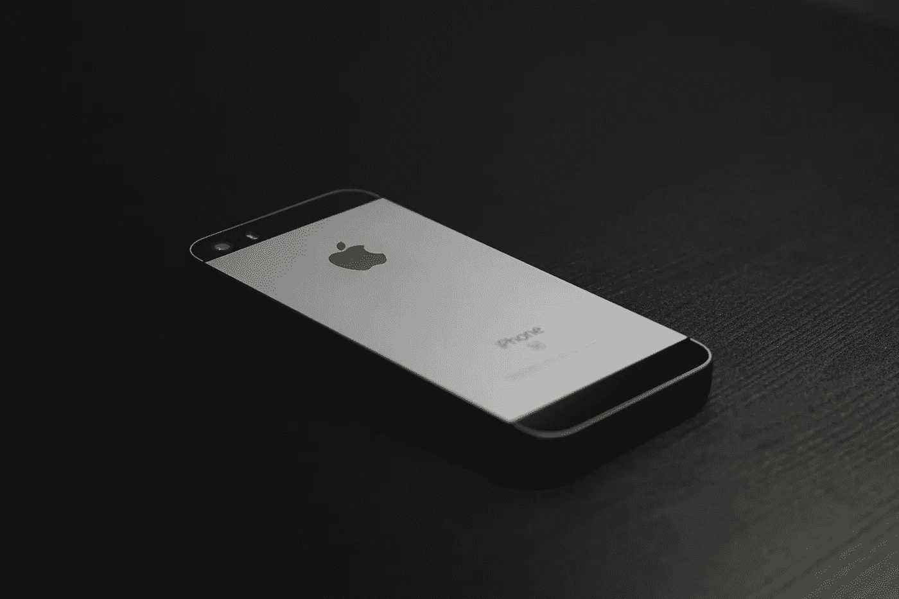
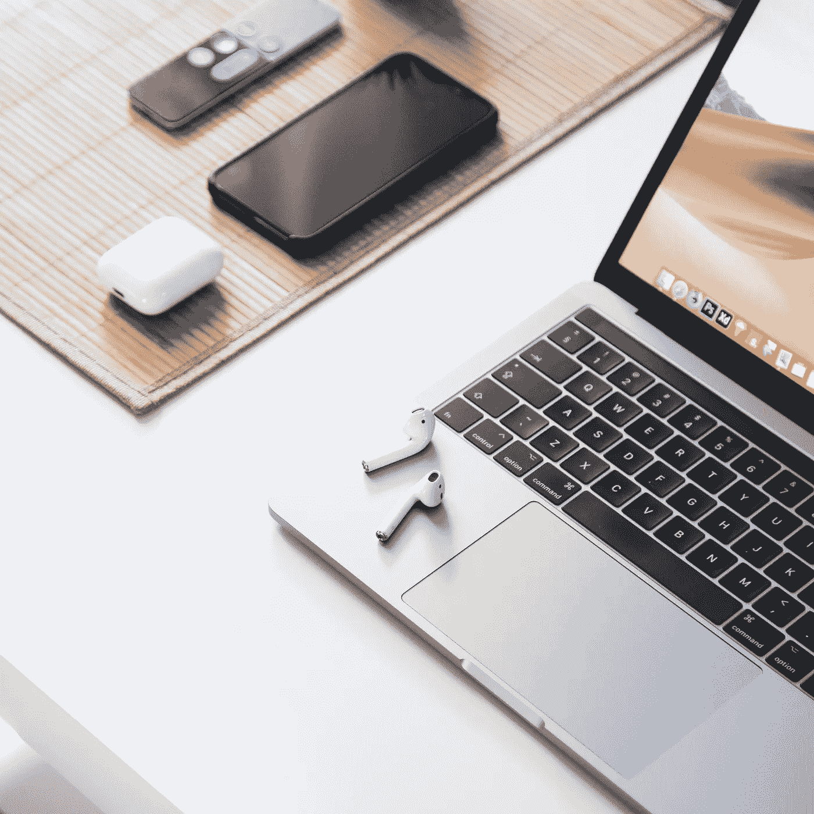
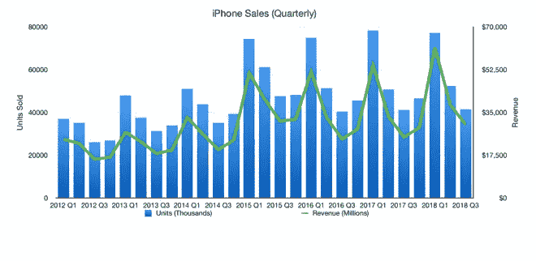
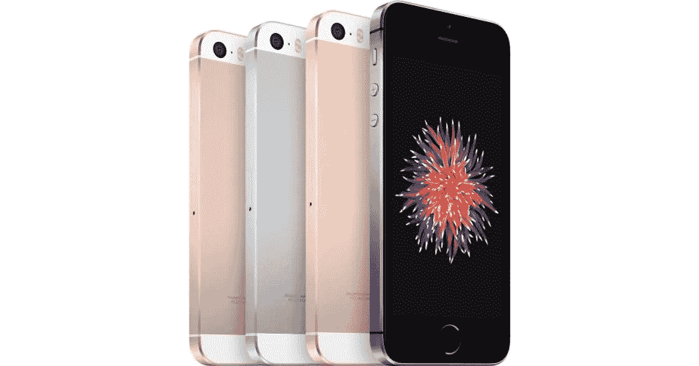
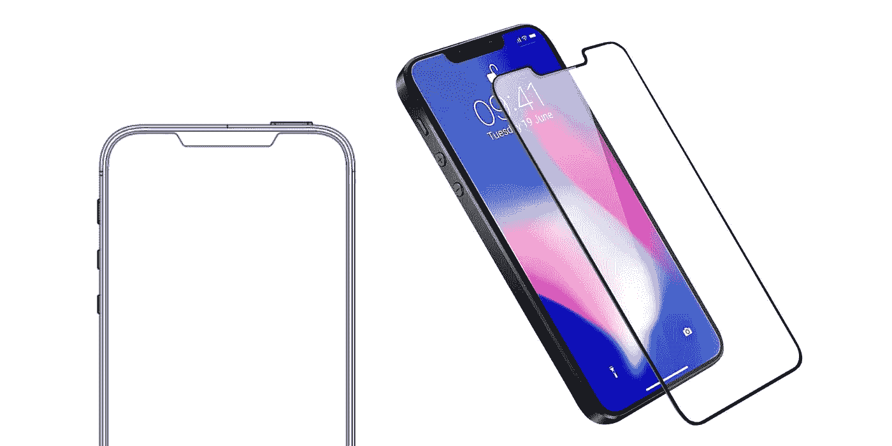
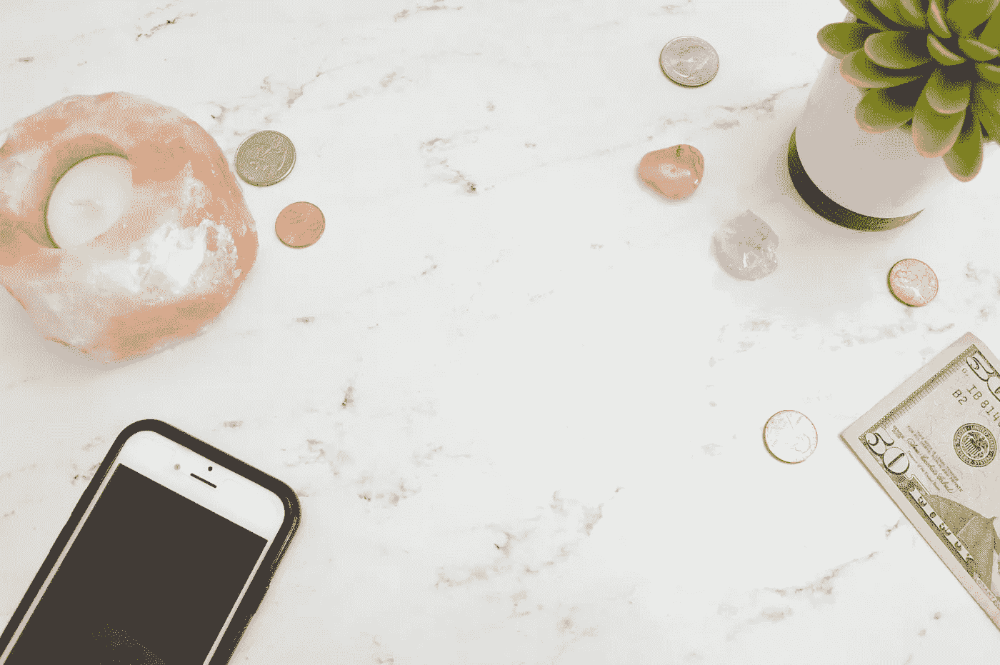
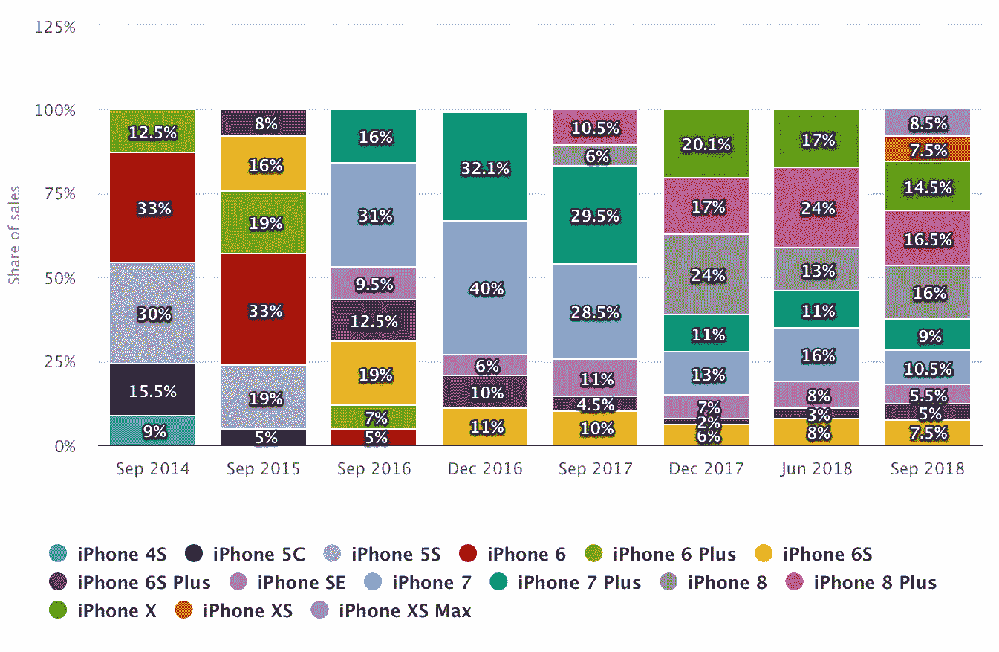
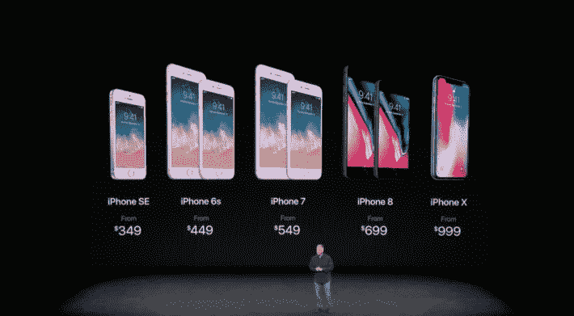
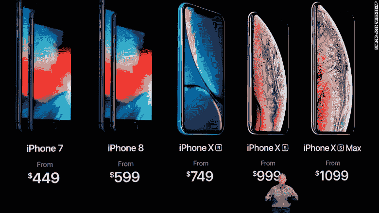
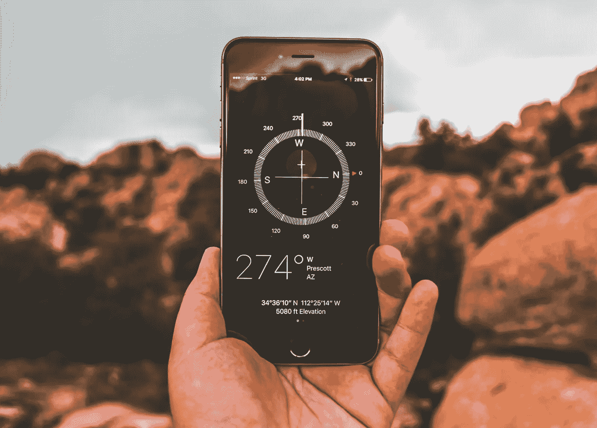

# 苹果不会再发布廉价 iPhones 了，原因如下

> 原文：<https://medium.datadriveninvestor.com/no-more-budget-iphones-fba97ff5c902?source=collection_archive---------1----------------------->

Photo courtesy of [Christian Allard](https://unsplash.com/photos/aT2Y0VLovDQ?utm_source=unsplash&utm_medium=referral&utm_content=creditCopyText)

苹果是消费科技的奔驰。或者可能是宝马。或者其他德国高端汽车制造商。

几乎所有其他人都向这家公司寻求方向。当苹果揭示一种创新的新设计语言或推出一种新产品时，它会在整个市场上产生涟漪。突然间，整个行业都在按照苹果的形象创造产品。

但是，说苹果仅仅是一个潮流引领者，低估了该公司作为消费技术创新的象征性领袖的地位。苹果不仅仅是引领技术潮流；苹果的愿景开创了先例，并启动了让这些趋势首先存在的运动。

在这种情况下，成为苹果公司的感觉一定很棒，成为处处模仿苹果的众多公司中的一员的感觉一定很谦卑，但这并不都是阳光和彩虹。你可以爬上山顶，但那里没有很多稳定的地面。走错一步，你就会跌回山下，多年的努力就会付之东流。

我不想低估苹果在 2018 年取得的成功: [Apple Pencil](https://amzn.to/2S1s09w) [对 iPad](https://medium.com/@daneoleary/apple-2018-retrospective-21a06d1f82db#aa42) 的支持是一个受欢迎的补充；iOS 12 给与 5S 一样古老的 iPhones 赋予了[新的生命](https://medium.com/@daneoleary/apple-2018-retrospective-21a06d1f82db#e155)； [Apple Watch 系列 4](https://amzn.to/2Dryqqv) 就是[字面上的救命](https://www.digitaltrends.com/mobile/apple-watch-series-4-saving-lives/)；这只是几个亮点。然而，回过头来看，2018 年对苹果来说是相当艰难的一年，因为某些失误最终影响了公司的底线。

在苹果 2018 年最具争议的举措中，有一个我想强调的重要原因:由于看不到第二代 iPhone SE，苹果似乎已经退出了“廉价旗舰”市场。

事实上，我会更进一步:我确信苹果不会再发布任何廉价 iPhones，原因如下。

# 降低期望值

Photo courtesy of [Tomasz Zagórski](https://unsplash.com/photos/btO5eN4G7aI?utm_source=unsplash&utm_medium=referral&utm_content=creditCopyText)

苹果的产品组合多种多样。该公司从 iTunes 和 Apple Music 等服务到 AirPods 和 T2 魔法键盘等配件，从 4K 苹果电视等家庭娱乐设备到 T4 MacBook Pro 等个人计算设备，创造收入。但是大多数这些[的销量并没有那么令人印象深刻](https://www.statista.com/statistics/263444/sales-of-apple-mac-computers-since-first-quarter-2006/)(尽管苹果的[利润率](https://9to5mac.com/2018/08/01/mac-sales-q3-2018/)肯定是令人印象深刻的)。

事实上，iPhone 占据了苹果收入的大部分。自 2007 年首次亮相以来，iPhone 将苹果的收益推至如此不可思议的高度，以至于该公司成为历史上第一家万亿美元的公司。苹果的收入有这么多依赖于这款改变游戏规则的设备，你可以打赌，如果人们开始减少购买 iPhones，苹果的收入将会大幅下降。

这正是我们所看到的。

在第四季度[温和的](https://www.wsj.com/articles/apple-reports-record-revenue-and-profit-1541104284)之后，2019 年第一季度的收入——需要说明的是，该季度由 10 月、11 月和 12 月组成，包括假日购物季——远低于苹果最初的预测。随着新 iPhone 成本的上升，即使单位销量保持稳定，收入也会增加，但同期 iPhone 销量减少了。这意味着需求已经减弱，或者有可能首先对苹果昂贵的新 iPhones 没有太多需求。

麻烦的第一个迹象出现在 2017 年，这一年 [iPhone X](https://amzn.to/2DpNAMI) 发布。据报道，iPhone X 的起价比前一年的基准机型高出 50%，单位销售持平，尽管苹果在 T2 的收入增加了。怎么会？因为尽管苹果公司售出的数量与前一年大致相同，但 iPhone 的平均成本却增加了。当你卖出同样数量的产品，但提高价格时，你仍然会看到收入的增加。

Screenshot via [Statista](https://www.statista.com/statistics/263402/apples-iphone-revenue-since-3rd-quarter-2007/)

当然，不仅仅是 iPhone 变得更贵了。苹果已经提高了公司几乎所有产品的价格。但随着 iPhone 推动利润增长，这意味着:如果 iPhone 销量持平或开始下降，苹果将不得不每年提高 iPhone 的价格，以维持逐年的收入增长。正如你所看到的，苹果决定停止公开报告 iPhone 销量并不是巧合。

> 如果 iPhone 销量持平或下降，苹果将不得不每年提高 iPhone 的价格，以保持年同比收入增长。

即使 2017 年是一个异数，秋季新 iPhones 的发布也应该会在最后一段时间给苹果带来收入肾上腺素，让该公司在跨过财政终点线时有一个强劲的结局。但这已经是连续第二年没有发生了。新 iPhones 价格的上涨导致了需求的下降，这看起来是不是很合理，如果不是很可能的话？

大约一周前，苹果首席执行官蒂姆·库克(Tim Cook)致信投资者。你可以在苹果网站上亲自阅读这封信[，但它警告投资者，苹果 2019 年第一季度的收入将比最初预计的低*9*8*亿*。](https://www.apple.com/newsroom/2019/01/letter-from-tim-cook-to-apple-investors/)

这封信主要将“iPhone 收入同比下降的绝大部分原因”归咎于中国经济，同时也暗示，买家仍在适应运营商补贴的取消。

在最近接受美国消费者新闻与商业频道的乔希·利普顿采访时，库克重申了许多解释 iPhone 销量低于预期的相同因素。

除了发展中市场增长放缓和运营商缺乏补贴定价之外，库克指出，iOS 12 和 29 美元的电池更换计划鼓励用户保留旧 iPhones，而不是购买新 iPhones。

你可能还记得，苹果在 2017 年底启动了电池更换计划，希望掩盖“[电池门](https://www.businessinsider.com/apple-batterygate-how-older-iphones-slowed-down-and-why-its-a-big-deal-2017-12)”争议的恶臭，该争议引发了对[计划淘汰](https://www.forbes.com/sites/adamsarhan/2017/12/22/planned-obsolescence-apple-is-not-the-only-culprit/)的指控。根据库克的说法，许多旧 iPhones 决定不升级，因为他们可以便宜地获得新电池。这将取消苹果强加给他们的性能上限，让他们的 iPhones 恢复往日的辉煌，尤其是在搭配 iOS 12 的时候。事实上，苹果竭尽全力确保 iOS 12 将[让老款 iphone 更快](https://techcrunch.com/2018/09/17/ios-12-makes-your-phone-faster-than-ever/)，所以库克认为电池更换计划和 iOS 12 是 2018 年 iphone 销量疲软的因素之一，这可能是正确的。

然而，库克断言，中美之间复杂的贸易关系最终是最大的因素。对苹果来说，中国代表着大量未开发的销售潜力，所以这可能也有一定的道理。如果你想听更多库克对此的看法，你可以在下面的视频中看到完整的采访。

与此同时，批评家和分析家认为 iPhone 销量不佳是市场饱和的标志。在这一点上，大多数想要 iPhone 的人已经有一部了，这是一个很难克服的障碍，尤其是那些不经常升级的人。

苹果也很有可能将 2018 年的 iPhones 定价在该公司声称瞄准的发展中市场之外。毕竟，如果你住在中国，想买一部新的智能手机，你是会花 1000 美元(6800 英镑)或更多买一部 [iPhone XS](https://amzn.to/2T2WC80) ，还是会买一部最新的 Vivo 或小米 Android 智能手机，这款手机在当地生产，能做 iPhone XS 能做的基本上所有事情，而价格只是它的零头？

毫不奇怪，库克在很大程度上回避了 iPhone 价格飙升的话题——我们在苹果的大部分产品线中都看到了这个问题——这是最近 iPhone 的主要批评之一。

# 价格攀升

Photo courtesy of [Sharon McCutcheon](https://unsplash.com/photos/-8a5eJ1-mmQ?utm_source=unsplash&utm_medium=referral&utm_content=creditCopyText)

iPhone 的价格上涨曾经非常罕见。事实上，在运营商停止对智能手机提供补贴定价，迫使我们开始支付全额 MSRP(建议零售价)后，如果我们想购买新的 iPhones，我们至少可以指望每年都有一个一致的起价。

起拍价曾经是 649 美元。随着 2017 年 iPhone 8 的发布，它跃升至 699 美元，这是一个令人失望的涨幅，但也不算太惊人。在几代人的一致价格后，它只增加了 50 美元，所以许多人给了苹果一张通行证。此外，即使价格更高，iPhone 8 与新的 iPhone X 的 999 美元的价格相比似乎还是非常便宜的。

但显然，iPhone 7 的涨价开创了一个先例，因为在 2018 年，价格再次跃升。

与 iPhone 7 到 iPhone 8 的增长相匹配，2018 年 iPhone 阵容的 iPhone XR 起价为 749 美元。你可能会认为 iPhone XR 比 iPhone 7 更好，值得多花 100 美元，但价值是主观的。虽然有些人可能会说 iPhone XR 值 749 美元的起价，特别是与苹果更高端的机型相比，但许多人会关注每一代 iPhone 都比上一代更贵。在这一点上，你能责怪他们吗？

> 随着 2018 年 iPhones 在舞台上亮相，苹果公司取消了产品线中唯一的预算选项。

更糟糕的是，当 iPhone XS、iPhone XS Max 和 iPhone XR 在苹果 2018 年秋季活动期间登台亮相时，iPhone SE 正在停产。因此，不仅 iPhones 变得越来越贵，苹果现在还取消了我们唯一的预算选项。

因此，如果你想在 2019 年买一部新的 iPhone，就没有那么多选择了。在没有真正预算的 iPhone 的情况下，买家基本上被迫接受苹果更高的起价。自然，消费者和批评家们都越来越强烈地呼吁 iPhone SE 的继任者[。](https://www.forbes.com/sites/ewanspence/2019/01/04/apple-news-headlines-warning-iphone-xr-iphone-xs-iphone-se-china-disaster-problems-mistake/#5825b2105dbe)

# 意想不到的价值:iPhone SE

Photo courtesy of Apple

2016 年 3 月，苹果[在一场特别的春季活动中发布了代表特别版的 iPhone SE](https://youtu.be/0wIiDnjz4X4?t=1798) 。

对于消费者和整个行业来说，苹果发布 iPhone SE 都不是一款苹果产品。iPhone 6 的尺寸刚刚增加，并接受了上一代产品的全新设计。随后，iPhone SE 发布了，其特点是更小、更紧凑的外形，其设计与上一代 iPhone 5 几乎没有区别。

更令人惊讶的是，尽管起价很低，但 iPhone SE 明显采用了苹果公司的大多数最新旗舰级技术；只需 399 美元，你就可以获得与 iPhone 6S 相同的定制 A9 处理器，以及带有 4K 视频录制功能的 12 MP 摄像头和更大的电池。

事实上，唯一的重大妥协是缺乏 3D Touch 和使用第一代 TouchID 而不是更快的第二代。但是，再一次考虑到它的低起价(最终定为 349 美元)，iPhone SE 为苹果制造的产品提供了异乎寻常的巨大价值。

> iPhone SE 从未成为最畅销的手机，尽管它最终获得了狂热的追随者。

问题是 iPhone SE 没有成为最畅销的 iPhone。在其整个生命周期中，它的定义性特征是它为 iOS 生态系统提供了一个负担得起的入口，尽管它最终在某些苹果粉丝中获得了某种程度的狂热追随者。

自然，在 iPhone SE 成为 iPhone 产品线的基线几年后，消费者已经准备好进行强制性更新。尽管 iPhone SE 在 2016 年提供了很高的性价比，但随着 iPhone SE 的 A9 处理器被成功取代，先是被 iPhone 7 中的 A10 Fusion 芯片取代，然后又被 iPhone 8、iPhone 8 Plus 和 iPhone X 中的 A11 Bionic 取代，更新可能会弥合性能差距。

# 预期建立

Photo courtesy of [Ben White](https://unsplash.com/photos/4Bs9kSDJsdc?utm_source=unsplash&utm_medium=referral&utm_content=creditCopyText)

果不其然，我们通过小道消息得知苹果正在开发新版廉价 iPhone。

细节各不相同，但 iPhone SE 的继任者——据称要么被称为 iPhone SE 2，要么被称为 iPhone X SE(后缀和修饰语都经过精心安排)——似乎与最初的目的相同，即成为一款紧凑、低成本的 iPhone，提供出色的性能和大多数最新功能。

围绕 iPhone SE 2 命名方案的大部分分歧是由于关于该设备是否会保留 iPhone 5 时代的设计或是否会采用新的 iPhone X 美学的矛盾报告。

有些人坚持(或者希望？)iPhone SE 2 从正面看起来像 iPhone X，几乎没有边框，是边到边的显示屏。这些报告主要参考了屏幕保护器和外壳的[假定设计](https://9to5mac.com/2018/05/10/iphone-se-2-notch-slim-bezels-rumor/)；如果合法的话，这意味着 iPhone SE 2 将有一个类似于 [iPhone X](https://amzn.to/2DpNAMI) 、 [iPhone XS](https://amzn.to/2T2WC80) 、iPhone XS Max 和 iPhone XR 的无边框、有凹槽的显示屏。

当然，notch 将成为 2018 年智能手机的整体定义特征之一，因为在 2017 年底 iPhone X 首次亮相后，几乎所有智能手机制造商都在模仿它；然而，出于苹果的目的，这个缺口只是为了容纳苹果专有的 FaceID 的生物传感器而存在。因此，这意味着 iPhone SE 2 将采用 FaceID，尽管 FaceID 组件的[高成本使得它不太可能包含在任何预算的 iPhone 中。](http://time.com/money/5014941/iphone-x-cost-price/)

根据这些报告，渲染是为了展示如果这个设备是真的，它会是什么样子。

Photo courtesy of [9to5Mac](https://9to5mac.com/2018/05/10/iphone-se-2-notch-slim-bezels-rumor/)

假设外壳设计和结果渲染是准确的，iPhone SE 2 将会是一款真正迷人的设备，是过去的 iPhone 5 和更具未来感的 iPhone X 的宠儿。如果苹果能够保持生产成本，并推而广之，降低 MSRP，iPhone SE 2 的销量可能会轻松超过第一代 iPhone SE，可能会成为第一代 iPhone SE 永远不可能成为的最畅销产品。

> 随着苹果自己的供应商证实了 iPhone SE 2 的计划，这些并不只是白日梦。

这些不仅仅是 iPhone SE 粉丝和任何想要更便宜 iPhone 的人的白日梦；来自苹果自己的供应商的报告几乎证实了 iPhone SE 2 的计划，提供了对可能的生产时间表和发货日期的估计。

2017 年 8 月初，[苹果公司在 iPhone 需求高时招聘](https://www.cnbc.com/2018/11/05/reuters-america-apples-asia-suppliers-fall-on-report-it-canceled-production-boost-for-iphone-xr.html)的台湾小批量制造商纬创资通公司(Wistron Corp .)正在[努力扩大其生产基地](http://focustaiwan.tw/news/aeco/201708040018.aspx)，以容纳一款新的紧凑型苹果智能手机，许多人认为这是一款更新的 iPhone SE。

然后是暂定的发货日期:2017 年 11 月下旬，台湾的*经济日报*报道称，苹果一直在关注 iPhone SE 2 的发布日期[2018 年上半年](https://translate.google.com/translate?sl=auto&tl=en&js=y&prev=_t&hl=en&ie=UTF-8&u=http%3A%2F%2Fcens.com%2Fcens%2Fhtml%2Fen%2Fnews%2Fnews_inner_50883.html&edit-text=&act=url)，这将与第一代 iPhone SE 的春季发布保持一致。

2018 年 1 月带来了另一份关于 iPhone SE 2 将于 2018 年发布的报告。此后不久，有传言称 iPhone SE 2 将采用[玻璃后面板](https://www.tekz24.com/iphone-se-2-new-details/)，这表明增加了 iPhone 自 2017 年以来就有的无线充电功能。

# 怀疑的种子

Photo courtesy of [Andre Hunter](https://unsplash.com/photos/5otlbgWJlLs?utm_source=unsplash&utm_medium=referral&utm_content=creditCopyText)

就在谣言指向苹果正在为下一代 iPhone SE 的发布做准备的时候，KGI 证券的分析师郭明志(Ming-Chi Kuo)播下了第一颗怀疑的种子，他以不可思议的准确性预测苹果的产品而闻名。

> iPhone SE 发布的可能性非常小，因为苹果已经耗尽了开发 iPhone XS、iPhone XS Max 和 iPhone XR 的资源。

2018 年 1 月下旬， [Kuo 报道](https://www.macrumors.com/2018/01/29/kuo-casts-doubt-on-iphone-se-2/) iPhone SE 2 发布的机会微乎其微，因为苹果已经在 2018 年即将发布的三款旗舰机型上耗尽了资源。当然，这三个型号最终是 iPhone XS，iPhone XS 和 iPhone XR。

然而，尽管郭泓志有所怀疑，谣言还是继续流传——尽管速度有所放缓。

例如，2018 年 4 月报道了 iPhone SE 2 的[规格和其他细节](http://www.macotakara.jp/blog/rumor/entry-34838.html)。根据这些泄露的消息，苹果打算通过省略 3.5 毫米耳机插孔和使用 iPhone 7 的 A10 融合芯片而不是 iPhone 8 和 iPhone X 中使用的 A11 仿生芯片来降低生产成本(进而降低最终零售价格)

出于各种意图和目的，2018 年 7 月，当 BlueFin Research [告诉 MacRumors](https://www.macrumors.com/2018/07/10/iphone-se-predicted-to-be-discontinued/) 苹果已经取消了所有继续进行 iPhone SE 2 的计划时，斧头被果断地放下了。

我们可能永远无法确定 iPhone SE 2 是否真的在研发中；然而，即使这是最初的计划，我们也不太可能得到 iPhone SE 2。

自 2018 年 iPhone 发布以来已经过去了四个月，这一事件恰逢 iPhone SE 从苹果的阵容中移除，这本身据称是因为苹果[退役了 A9 处理器](https://www.imore.com/iphone-se-2-what-happened-it-and-why)。因此，除了苹果迅速以 249 美元的折扣价[卸载最后一批 iPhone SE 手机](https://appleinsider.com/articles/19/01/19/apple-again-starts-selling-iphone-se-this-time-on-clearance-for-249)(T4 只用了 24 小时)之外，iPhone SE 已经从苹果的目录中消失了，任何等待下一代 iPhone SE 的人都没有什么希望。

如果你问我，答案就在墙上:苹果不会再生产廉价 iPhone 了。

# 没有更多的预算 iPhone？

Photo courtesy of [Katie Harp](https://unsplash.com/photos/vZT-K-Yyvpw?utm_source=unsplash&utm_medium=referral&utm_content=creditCopyText)

廉价智能手机，或者价格大约在 300 美元或更低的智能手机，如今相当普遍。在某些情况下，这些预算设备提供了很大的帮助。最近一些著名的例子包括售价 240 美元的 [Moto G6](https://amzn.to/2B0K3Tz) 、售价 250 美元的 [LG Stylo 4](https://amzn.to/2MqlVOS) 、售价 290 美元的[华为 Mate 20 Lite](https://amzn.to/2WdxUDA) ，当然还有售价 299 美元的 [Pocophone F1](https://amzn.to/2Wcvjd5) 。

如果你还有一点钱可以花，你可以找到一部刚刚超过 300 美元的二手或翻新的三星 Galaxy S8。或者你可以买到新的[诺基亚 7.1](https://amzn.to/2W7n0zz) ，这是一款 Android One 设备，拥有顶级 Android 旗舰机的设计和几乎所有功能，价格仅为 350 美元。

我不确定这句话的出处，但我完全同意:“好手机越来越便宜，便宜手机越来越好。”

当然，你可能已经注意到，上面提到的智能手机是 Android 智能手机。iPhones 呢？

当运营商取消对智能手机的补贴时，我们不得不开始支付新智能手机的全零售价。因此，苹果推出 iPhone SE 的决定非常及时:你不用支付 649 美元或更高的价格，就能以不到 400 美元的价格买到 iPhone，而无需做出大量妥协。突然间，那些更喜欢 iOS 而不是 Android 的人有了自己的 Pocophone。

当然，iPhone SE 会是一个很好的卖家，对吗？

## iPhone SE 销量低

Screen capture via [Statista](https://www.statista.com/statistics/804398/us-iphone-sales-by-model/)

> 在其巅峰时期，iPhone SE 仅是第三大畅销机型，占 iPhone 总销量的 11%。

从 2016 年 9 月到 2018 年 9 月停产，iPhone SE 从来都不是最畅销的 iPhone。即使在巅峰时期，iPhone SE 作为第三大最畅销的 iPhone，在 iPhone 销量中所占的份额也从未超过 11 %,而且差距很小。与此同时，iPhone 7 和 iPhone 7 Plus 在此期间的销量几乎是 iPhone SE 的三倍，分别占 iPhone 销量的 28.5%和 29.5%。

2017 年 9 月后，iPhone SE 的销量大幅下降，保持在 5.5%至 8%之间，直到 2018 年秋季该设备被撤出。

想象你是蒂姆·库克正在看这些数字。每个人都在要求第二代廉价 iPhone，但销售数据显示，当有更低成本的选择时，大多数客户会继续购买更贵的 iPhone。如果消费者愿意花更多的钱购买高端 iPhones，生产一款更便宜的设备，充其量只有十分之一的消费者有兴趣购买，这有意义吗？

在某种背景下，将 iPhone 更多地定位为奢侈品开始变得有意义。就像投票一样，苹果的消费者一直在为更高端的 iPhones 投票，所以我们真的不能责怪苹果放弃销售不好的廉价智能手机。

如果你对 iPhone SE 2 的死亡感到恼火，事实上，有更便宜的 iPhone 可供预算有限的人使用。但是你不会在零售店看到它们。

## 灰色市场

Photo courtesy of [Tom Sodoge](https://unsplash.com/photos/Qeqg7F9pfuU?utm_source=unsplash&utm_medium=referral&utm_content=creditCopyText)

苹果给顾客提供了他们渴望已久的低价 iPhone，但他们中的许多人决定不买。所以，如果你是苹果，你会在知道第一代卖得不好的情况下生产第二代吗？还是会彻底放弃廉价 iPhone 的想法？

苹果似乎选择了后者。然而，这并不能抹杀廉价 iPhones 已经上市的事实，更不用说大量的廉价 iPhones 了。具体来说，我指的是“灰色市场”上的二手 iPhones。

灰色市场是指二手市场上二手 iPhones 的买卖。它由许多人在升级后出售他们的二手设备组成，这实质上创造了一个非官方的廉价 iPhones 市场。因此，易贝、亚马逊市场、Swappa 等服务以及 LetGo 等庭院销售应用上的所有 iPhone 6S、iPhone 7 和 iPhone 8 列表都是 iPhone 的灰色市场。

> 苹果不会投资资源来创造新的廉价 iphone，因为二手市场提供了持续的打折 iphone 供应。

苹果不需要在 R&D 投资，为廉价 iPhone 采购零部件、制造和分销，因为我们已经可以在二手市场上买到所有我们需要的打折 iPhone。每年新 iphone 发布时，随着升级到新 iphone 的用户出售旧 iphone，数百万部新 iphone 将重振二手市场。

此外，灰色市场上任何 2016 年后的 iPhone 型号都将比 iPhone SE 的规格更好，其中一些二手 iPhone 将比从苹果公司购买新的 iPhone SE 便宜 349 美元。

换句话说，苹果不需要出售廉价 iPhone，因为如今以全零售价购买的当前一代 iPhone 在消费者使用时会成为廉价 iPhone，并最终在升级时在灰色市场上出售。每天都有更多的设备在灰色市场上市，所以只要苹果在销售智能手机，灰色市场就是廉价 iPhones 的可再生资源。

## 去年的旗舰产品

当然，灰色市场并不是买到廉价 iPhone 的唯一途径。取决于你如何看待它，苹果实际上每年都提供新的预算 iPhone 选项。

Photo courtesy of [New York Magazine](http://nymag.com/intelligencer/2017/09/iphone-x-price-and-photos-announced-at-apple-event.html)

随着每年新 iPhones 的正式发布，仍在生产的每一代产品的建议零售价都在下降。例如，当 iPhone 8、iPhone 8 Plus 和 [iPhone X](https://amzn.to/2DpNAMI) 在 2017 年秋季发布时，iPhone 7 和 iPhone 7 Plus 成为了上一代设备，这保证了降价。

iPhone 7 降价时，iPhone SE 仍在生产，所以如果你想要一部新 iPhone，但不想花 699 美元或更多购买 iPhone 8 或 iPhone X，你可以选择 349 美元起的 iPhone SE、449 美元起的 iPhone 6S 或 549 美元起的 iPhone 7。虽然 349 美元并不是一笔小数目，但这肯定比 iPhone X 的 1000 美元起价更让人接受。

Photo courtesy of [European Journal](http://europeanjournal.net/2018/09/14/how-apple-got-us-to-pay-so-much-for-the-iphone/)

随着 iPhone SE 的停产，最便宜的 iPhone 是 449 美元的 iPhone 7，这意味着今天最便宜的 iPhone 比去年贵了 100 美元。

公平地说，iPhone 7 在推出时是一款很棒的设备，今天它仍然是一个令人信服的选择，尤其是就价格而言。虽然它是苹果第一款没有看起来必不可少的 3.5 毫米耳机插孔的 iPhone，但 iPhone 7 在其他方面是一款功能齐全的旗舰产品。但如果你在预算内购买新 iPhone，你更愿意买哪个:449 美元的 2016 款 iPhone，还是便宜 100 美元、采用最新 A12 仿生处理器的 iPhone SE 2？

关于 iPhone SE 2 没有实现，也许知道会发生什么是让一些人如此失望的原因。尽管数据表明廉价 iPhone 的受众有限，但总会有这样的情况，即具有当代性能的低价 iPhone 达到了最佳效果。

# 苹果该何去何从？

Photo by [Robert Penaloza](https://unsplash.com/photos/P6Kx-RVpDe0?utm_source=unsplash&utm_medium=referral&utm_content=creditCopyText)

这是一个热爱技术的好时机，尤其是移动技术，因为廉价和中端旗舰产品正在 Android 智能手机市场上厮杀。虽然定价高于 349 美元的 iPhone，但一加 6T 是如何以更低的成本提供旗舰级规格、设计和性能的最佳例子。

> 苹果从未真正迎合过精打细算的消费者，但价格低于 1000 美元的产品数量正在迅速减少。

不管是好是坏，苹果似乎在一次尝试后就撤出了廉价智能手机领域。诚然，苹果从未真正迎合过精打细算的消费者，该公司绝大多数硬件的起价都在 1000 美元或以上，越来越多的设备，如 iPods 和 iPads，价格低于这一价格。这就是为什么苹果公司一开始就生产廉价 iPhone 是如此不同寻常。

问题是，苹果现在似乎正试图关闭一扇或许该公司一开始就不该打开的门。毕竟，当你在产品线中提供如此廉价的 iPhone 时，相比之下，所有的旗舰 iPhone 似乎都要贵得多。

不管未来有没有新的 iPhone SE，苹果产品的价格都在攀升。在许多市场，苹果正在危险地接近定价，iPhone 以及苹果的大多数其他产品都遥不可及。对于不能(或不想)支付如此高昂价格的消费者来说，苹果过去提供廉价选项但现在不再提供这些选项的事实无疑会在人们的嘴里留下不好的味道，几乎就像咬进一个腐烂的苹果。

老实说，我希望我在这一点上是错的，但如果苹果公司想遏制 iPhone 需求的下降，让销售恢复上升轨迹，两件事中的一件必须发生，而且宜早不宜迟。

苹果需要降低 iPhones 的利润率，让它们更实惠(甚至更便宜)，或者需要一个新的预算选项，让消费者至少有选择的错觉。因为正如数字显示的那样，大多数买家无论如何都会选择高端 iPhones，但如果苹果将一款预算机型放在桌面上，至少他们不会觉得自己被迫支付不断增长的“[苹果税](https://www.usatoday.com/story/tech/columnist/2018/11/28/new-macbook-air-and-mac-mini-show-apple-tax-storage-lives/2056256002/)”

苹果目前的定价结构只给了消费者高价和更高价的机型可供选择。但似乎买家开始意识到还有一个选择，那就是根本不买新 iPhones，这样可以省去麻烦，也可能会让买家后悔。